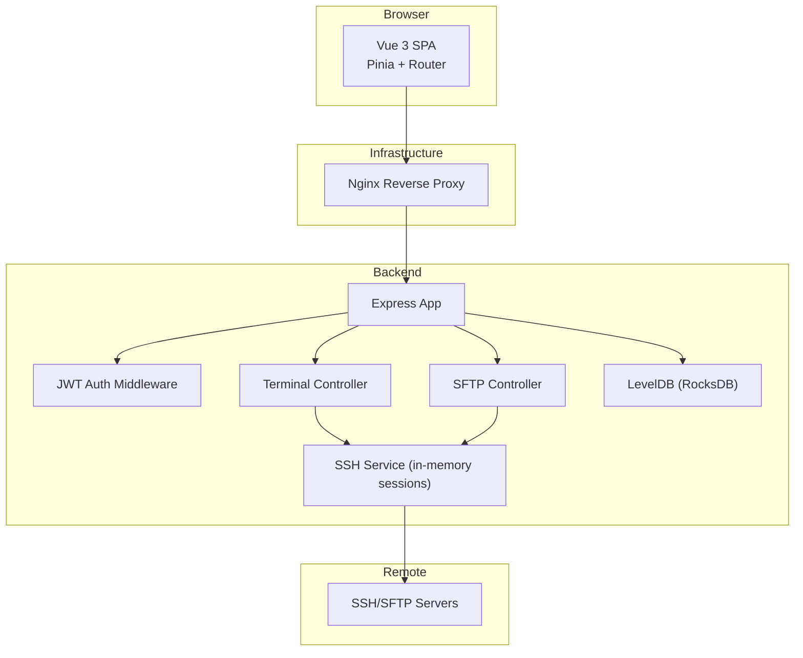
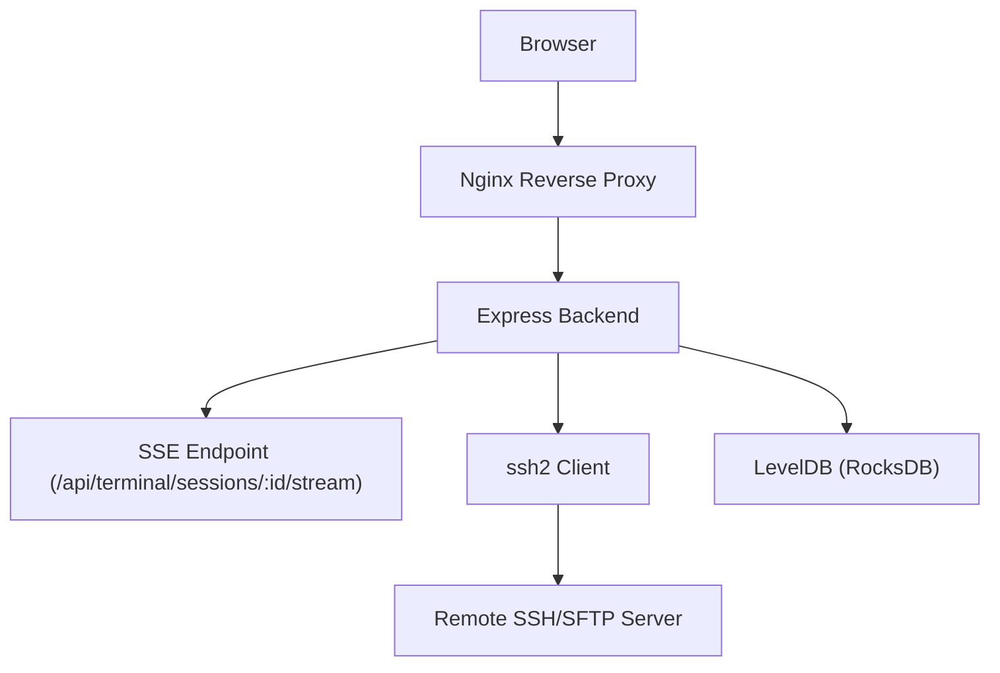
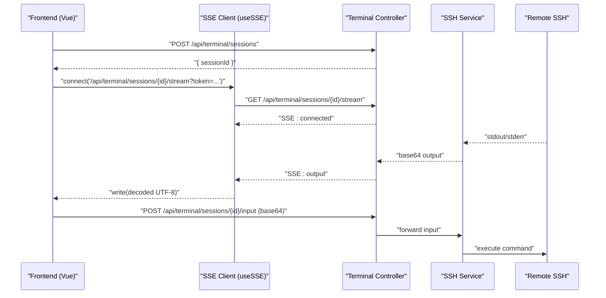
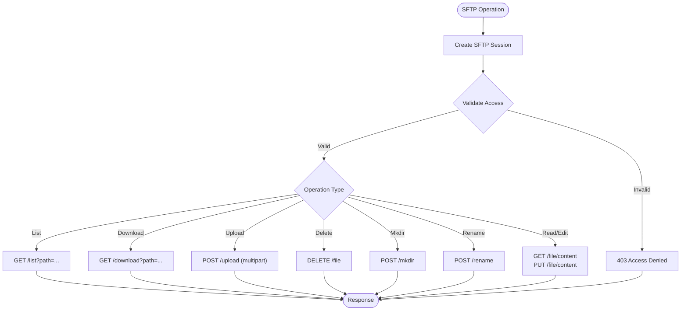
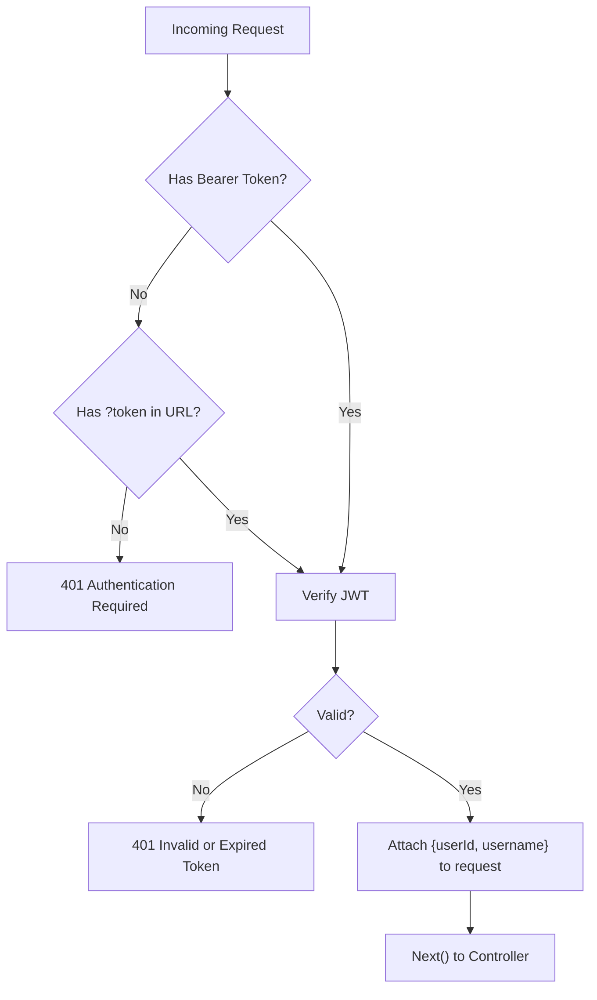
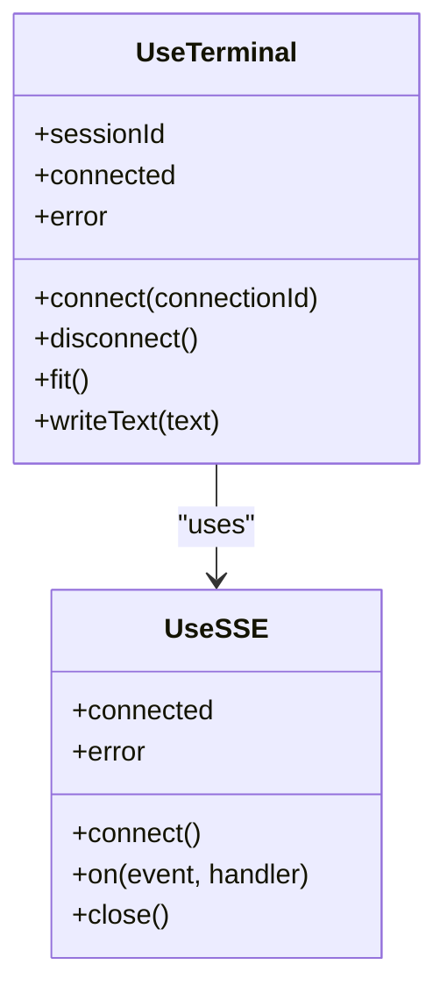
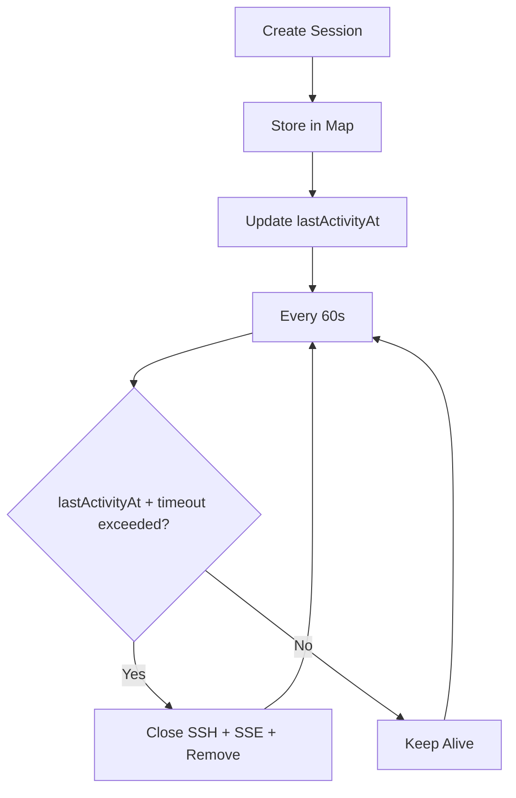
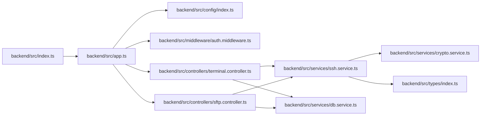
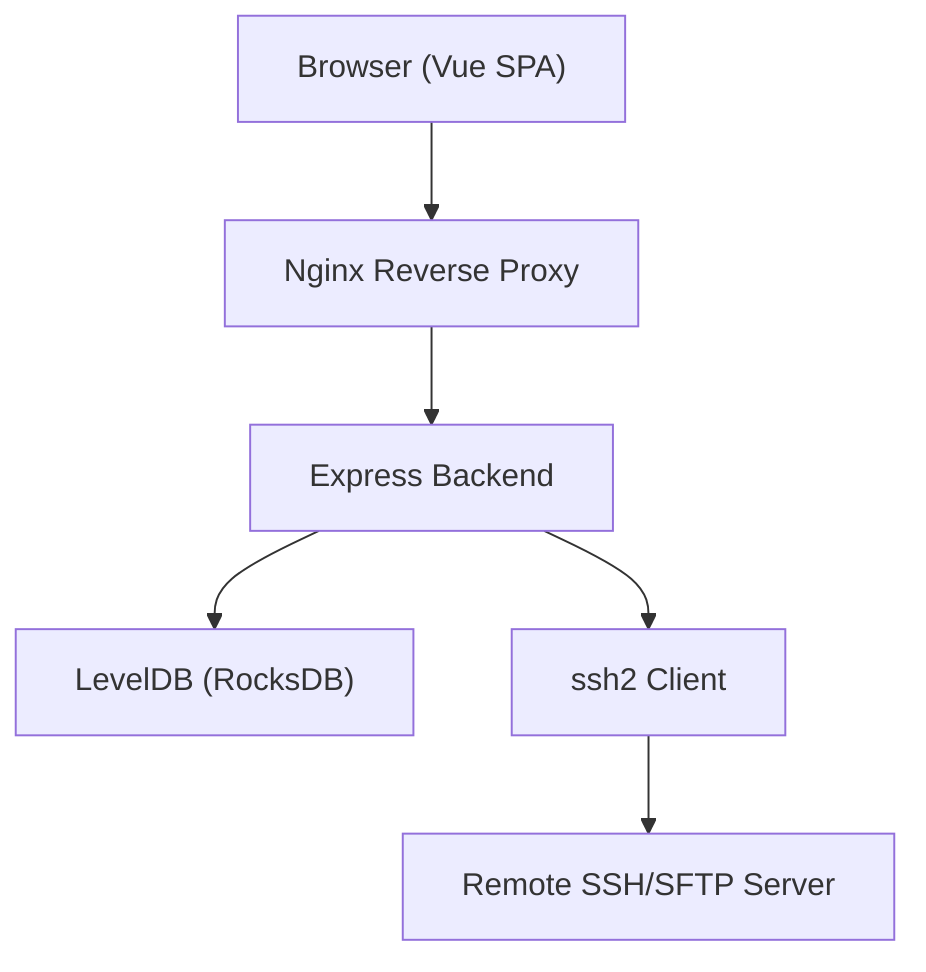

# Architecture Overview

<cite>
**Referenced Files in This Document**
- [README.md](file://README.md)
- [backend/src/index.ts](file://backend/src/index.ts)
- [backend/src/app.ts](file://backend/src/app.ts)
- [backend/src/config/index.ts](file://backend/src/config/index.ts)
- [backend/src/middleware/auth.middleware.ts](file://backend/src/middleware/auth.middleware.ts)
- [backend/src/services/crypto.service.ts](file://backend/src/services/crypto.service.ts)
- [backend/src/services/db.service.ts](file://backend/src/services/db.service.ts)
- [backend/src/types/index.ts](file://backend/src/types/index.ts)
- [backend/src/services/ssh.service.ts](file://backend/src/services/ssh.service.ts)
- [backend/src/controllers/terminal.controller.ts](file://backend/src/controllers/terminal.controller.ts)
- [backend/src/controllers/sftp.controller.ts](file://backend/src/controllers/sftp.controller.ts)
- [frontend/src/main.ts](file://frontend/src/main.ts)
- [frontend/src/composables/useTerminal.ts](file://frontend/src/composables/useTerminal.ts)
- [frontend/src/composables/useSSE.ts](file://frontend/src/composables/useSSE.ts)
</cite>

## Table of Contents
1. [Introduction](#introduction)
2. [Project Structure](#project-structure)
3. [Core Components](#core-components)
4. [Architecture Overview](#architecture-overview)
5. [Detailed Component Analysis](#detailed-component-analysis)
6. [Dependency Analysis](#dependency-analysis)
7. [Performance Considerations](#performance-considerations)
8. [Troubleshooting Guide](#troubleshooting-guide)
9. [Conclusion](#conclusion)
10. [Appendices](#appendices)

## Introduction
This document presents the WebTerm system architecture, focusing on the browser-based Vue.js frontend and Express.js backend, their communication over REST APIs, and the backend’s management of SSH connections and LevelDB storage. It explains the terminal streaming architecture using Server-Sent Events (SSE), the SFTP file operation flow, and the authentication middleware pattern. Cross-cutting concerns such as JWT-based security, encryption, and Helmet.js headers are documented alongside infrastructure requirements for Docker containerization, Nginx reverse proxy, and database storage.

## Project Structure
WebTerm follows a split monorepo layout with a backend service and a frontend application:
- Backend: Express.js application with TypeScript, routing, middleware, controllers, services, and configuration.
- Frontend: Vue 3 SPA with TypeScript, Pinia stores, Vue Router, and composables for terminal, SSE, SFTP, and editor.
- Infrastructure: Docker Compose orchestration and Nginx reverse proxy configuration.

**Diagram sources**
- [backend/src/app.ts:12-51](file://backend/src/app.ts#L12-L51)
- [backend/src/controllers/terminal.controller.ts:22-157](file://backend/src/controllers/terminal.controller.ts#L22-L157)
- [backend/src/controllers/sftp.controller.ts:45-296](file://backend/src/controllers/sftp.controller.ts#L45-L296)
- [backend/src/services/ssh.service.ts:33-248](file://backend/src/services/ssh.service.ts#L33-L248)
- [backend/src/services/db.service.ts:7-49](file://backend/src/services/db.service.ts#L7-L49)

**Section sources**
- [README.md:91-137](file://README.md#L91-L137)
- [backend/src/app.ts:12-51](file://backend/src/app.ts#L12-L51)
- [frontend/src/main.ts:1-11](file://frontend/src/main.ts#L1-L11)

## Core Components
- Backend entrypoint initializes the database and starts the Express server with graceful shutdown hooks.
- Express app configures Helmet.js security headers (with SSE exceptions), CORS, body parsing, health checks, routes, and error middleware.
- Configuration module centralizes environment-driven settings including secrets, limits, and database paths.
- Authentication middleware validates JWT tokens from Authorization headers or SSE query parameters.
- Crypto service implements AES-256-GCM encryption/decryption with HKDF-derived keys per user.
- Database service wraps LevelDB/RocksDB for key-value persistence.
- Types define domain models for users, connections, terminal sessions, SFTP sessions, and JWT payloads.
- SSH service manages in-memory terminal sessions, SSE broadcasting, input forwarding, resizing, and timeouts.
- Terminal controller exposes REST endpoints for session lifecycle and SSE streaming.
- SFTP controller exposes REST endpoints for directory listing, uploads/downloads, renames, deletes, and file content read/write.

**Section sources**
- [backend/src/index.ts:6-41](file://backend/src/index.ts#L6-L41)
- [backend/src/app.ts:14-48](file://backend/src/app.ts#L14-L48)
- [backend/src/config/index.ts:3-24](file://backend/src/config/index.ts#L3-L24)
- [backend/src/middleware/auth.middleware.ts:10-33](file://backend/src/middleware/auth.middleware.ts#L10-L33)
- [backend/src/services/crypto.service.ts:8-42](file://backend/src/services/crypto.service.ts#L8-L42)
- [backend/src/services/db.service.ts:7-49](file://backend/src/services/db.service.ts#L7-L49)
- [backend/src/types/index.ts:4-83](file://backend/src/types/index.ts#L4-L83)
- [backend/src/services/ssh.service.ts:9-248](file://backend/src/services/ssh.service.ts#L9-L248)
- [backend/src/controllers/terminal.controller.ts:22-157](file://backend/src/controllers/terminal.controller.ts#L22-L157)
- [backend/src/controllers/sftp.controller.ts:45-296](file://backend/src/controllers/sftp.controller.ts#L45-L296)

## Architecture Overview
The system uses a browser-first design:
- The Vue 3 frontend renders the UI, manages state, and communicates with the backend via REST APIs.
- Nginx acts as a reverse proxy, serving static assets and proxying API requests to the backend while exposing SSE endpoints.
- The backend enforces JWT-based authentication, validates requests, and orchestrates SSH/SFTP sessions.
- SSH sessions are maintained in memory with periodic cleanup and activity-based timeouts.
- LevelDB (via RocksDB) persists user and connection metadata.

**Diagram sources**
- [README.md:200-224](file://README.md#L200-L224)
- [backend/src/app.ts:14-48](file://backend/src/app.ts#L14-L48)
- [backend/src/controllers/terminal.controller.ts:45-81](file://backend/src/controllers/terminal.controller.ts#L45-L81)
- [backend/src/services/ssh.service.ts:33-166](file://backend/src/services/ssh.service.ts#L33-L166)
- [backend/src/services/db.service.ts:7-18](file://backend/src/services/db.service.ts#L7-L18)

## Detailed Component Analysis

### Terminal Streaming Architecture (SSE)
The terminal streaming architecture leverages Server-Sent Events for real-time output delivery:
- The frontend creates a terminal session and establishes an SSE connection to the backend.
- The backend streams base64-encoded terminal output events to the client, with heartbeat pings and padding to prevent proxy buffering.
- Input is batched and sent base64-encoded to the backend, which forwards it to the SSH stream.

**Diagram sources**
- [frontend/src/composables/useTerminal.ts:132-179](file://frontend/src/composables/useTerminal.ts#L132-L179)
- [frontend/src/composables/useSSE.ts:11-50](file://frontend/src/composables/useSSE.ts#L11-L50)
- [backend/src/controllers/terminal.controller.ts:45-81](file://backend/src/controllers/terminal.controller.ts#L45-L81)
- [backend/src/services/ssh.service.ts:76-111](file://backend/src/services/ssh.service.ts#L76-L111)

**Section sources**
- [frontend/src/composables/useTerminal.ts:132-179](file://frontend/src/composables/useTerminal.ts#L132-L179)
- [frontend/src/composables/useSSE.ts:11-50](file://frontend/src/composables/useSSE.ts#L11-L50)
- [backend/src/controllers/terminal.controller.ts:45-81](file://backend/src/controllers/terminal.controller.ts#L45-L81)
- [backend/src/services/ssh.service.ts:76-111](file://backend/src/services/ssh.service.ts#L76-L111)

### SFTP File Operation Flow
The SFTP flow supports directory listing, upload, download, creation, deletion, renaming, and content read/write:
- Sessions are created per connection and validated against the user context.
- Directory listing and file stats are exposed via REST endpoints.
- Uploads use multipart/form-data with a buffer-backed stream to the remote SFTP write stream.
- Downloads pipe a remote read stream to the HTTP response.
- Content read/write enforces a 1 MB limit and rejects binary files for editing.

**Diagram sources**
- [backend/src/controllers/sftp.controller.ts:45-296](file://backend/src/controllers/sftp.controller.ts#L45-L296)
- [backend/src/services/ssh.service.ts:33-166](file://backend/src/services/ssh.service.ts#L33-L166)

**Section sources**
- [backend/src/controllers/sftp.controller.ts:68-296](file://backend/src/controllers/sftp.controller.ts#L68-L296)

### Authentication Middleware Pattern
Authentication is enforced via a JWT middleware that:
- Accepts tokens from Authorization headers or SSE query parameters.
- Verifies JWT signatures using the configured secret.
- Attaches user identity to the request for downstream controllers.
- Returns 401 for missing or invalid tokens.

**Diagram sources**
- [backend/src/middleware/auth.middleware.ts:10-33](file://backend/src/middleware/auth.middleware.ts#L10-L33)

**Section sources**
- [backend/src/middleware/auth.middleware.ts:10-33](file://backend/src/middleware/auth.middleware.ts#L10-L33)

### Terminal Emulation and Editor Integration
- Terminal emulation uses XTerm.js with addons for fitting and web links, integrated via a Vue composable that handles input batching, Unicode encoding, and SSE event handling.
- CodeMirror 6 is integrated for file editing with syntax highlighting, formatting, and size limits.

**Diagram sources**
- [frontend/src/composables/useTerminal.ts:12-237](file://frontend/src/composables/useTerminal.ts#L12-L237)
- [frontend/src/composables/useSSE.ts:3-84](file://frontend/src/composables/useSSE.ts#L3-L84)

**Section sources**
- [frontend/src/composables/useTerminal.ts:12-237](file://frontend/src/composables/useTerminal.ts#L12-L237)
- [frontend/src/composables/useSSE.ts:3-84](file://frontend/src/composables/useSSE.ts#L3-L84)

### Session Management Strategy
- In-memory sessions store SSH clients, channels, and SSE client sets.
- Automatic cleanup occurs periodically based on inactivity timeout.
- Concurrency limits enforce per-user session caps.
- Heartbeat pings maintain SSE liveness and detect disconnections.

**Diagram sources**
- [backend/src/services/ssh.service.ts:13-23](file://backend/src/services/ssh.service.ts#L13-L23)
- [backend/src/services/ssh.service.ts:172-194](file://backend/src/services/ssh.service.ts#L172-L194)

**Section sources**
- [backend/src/services/ssh.service.ts:13-23](file://backend/src/services/ssh.service.ts#L13-L23)
- [backend/src/services/ssh.service.ts:172-194](file://backend/src/services/ssh.service.ts#L172-L194)

## Dependency Analysis
The backend exhibits clear layering:
- Entry point depends on app initialization and database lifecycle.
- App configures middleware, routes, and error handling.
- Controllers depend on services and database access.
- Services encapsulate SSH, crypto, and persistence logic.
- Types define shared contracts across layers.

**Diagram sources**
- [backend/src/index.ts:1-41](file://backend/src/index.ts#L1-L41)
- [backend/src/app.ts:1-51](file://backend/src/app.ts#L1-L51)
- [backend/src/controllers/terminal.controller.ts:1-8](file://backend/src/controllers/terminal.controller.ts#L1-L8)
- [backend/src/controllers/sftp.controller.ts:1-9](file://backend/src/controllers/sftp.controller.ts#L1-L9)
- [backend/src/services/ssh.service.ts:1-8](file://backend/src/services/ssh.service.ts#L1-L8)
- [backend/src/services/db.service.ts:1-49](file://backend/src/services/db.service.ts#L1-L49)
- [backend/src/services/crypto.service.ts:1-42](file://backend/src/services/crypto.service.ts#L1-L42)
- [backend/src/types/index.ts:1-83](file://backend/src/types/index.ts#L1-L83)

**Section sources**
- [backend/src/index.ts:1-41](file://backend/src/index.ts#L1-L41)
- [backend/src/app.ts:1-51](file://backend/src/app.ts#L1-L51)
- [backend/src/controllers/terminal.controller.ts:1-8](file://backend/src/controllers/terminal.controller.ts#L1-L8)
- [backend/src/controllers/sftp.controller.ts:1-9](file://backend/src/controllers/sftp.controller.ts#L1-L9)
- [backend/src/services/ssh.service.ts:1-8](file://backend/src/services/ssh.service.ts#L1-L8)
- [backend/src/services/db.service.ts:1-49](file://backend/src/services/db.service.ts#L1-L49)
- [backend/src/services/crypto.service.ts:1-42](file://backend/src/services/crypto.service.ts#L1-L42)
- [backend/src/types/index.ts:1-83](file://backend/src/types/index.ts#L1-L83)

## Performance Considerations
- SSE streaming uses padding and heartbeat to minimize latency and avoid proxy buffering.
- Input batching reduces network overhead for rapid keystrokes.
- Session cleanup prevents memory leaks and resource exhaustion.
- File upload/download leverage streaming to avoid loading entire files into memory.
- Database operations use efficient iterators for prefix scans.

[No sources needed since this section provides general guidance]

## Troubleshooting Guide
Common issues and mitigations:
- Authentication failures: Verify JWT secret configuration and token presence in headers or SSE URL parameters.
- SSE connection drops: Confirm Nginx configuration allows long-lived connections and that the token is appended to the URL.
- Session timeouts: Adjust inactivity timeout and concurrency limits in environment variables.
- SSH errors: Inspect backend logs for SSH client errors and verify remote server connectivity and credentials.
- File operation errors: Check file size limits, MIME types, and permission constraints.

**Section sources**
- [backend/src/middleware/auth.middleware.ts:10-33](file://backend/src/middleware/auth.middleware.ts#L10-L33)
- [backend/src/controllers/terminal.controller.ts:45-81](file://backend/src/controllers/terminal.controller.ts#L45-L81)
- [backend/src/services/ssh.service.ts:172-194](file://backend/src/services/ssh.service.ts#L172-L194)
- [backend/src/controllers/sftp.controller.ts:112-148](file://backend/src/controllers/sftp.controller.ts#L112-L148)

## Conclusion
WebTerm integrates a Vue 3 frontend with an Express backend to deliver a secure, real-time SSH terminal and SFTP experience. SSE enables low-latency terminal streaming, while robust authentication, encryption, and in-memory session management ensure reliability and safety. Infrastructure components like Docker and Nginx provide production-ready deployment foundations.

[No sources needed since this section summarizes without analyzing specific files]

## Appendices

### System Context Diagrams

**Diagram sources**
- [README.md:200-224](file://README.md#L200-L224)
- [backend/src/app.ts:14-48](file://backend/src/app.ts#L14-L48)
- [backend/src/services/db.service.ts:7-18](file://backend/src/services/db.service.ts#L7-L18)
- [backend/src/services/ssh.service.ts:33-166](file://backend/src/services/ssh.service.ts#L33-L166)

### Security Implementation Highlights
- JWT-based authentication with configurable expiration and middleware enforcement.
- AES-256-GCM encryption for SSH credentials with HKDF-derived keys per user.
- Helmet.js security headers applied globally except for SSE endpoints.
- File size limits and binary detection for safe editing.
- Strict resource isolation ensuring users access only their own sessions.

**Section sources**
- [backend/src/middleware/auth.middleware.ts:10-33](file://backend/src/middleware/auth.middleware.ts#L10-L33)
- [backend/src/services/crypto.service.ts:8-42](file://backend/src/services/crypto.service.ts#L8-L42)
- [backend/src/app.ts:14-21](file://backend/src/app.ts#L14-L21)
- [backend/src/controllers/sftp.controller.ts:242-268](file://backend/src/controllers/sftp.controller.ts#L242-L268)

### Infrastructure Requirements
- Docker Compose for container orchestration.
- Nginx reverse proxy for static assets, API proxying, and SSE endpoint exposure.
- Environment variables for secrets, limits, and database path.
- Ports: frontend development server (default), backend API (default), and Nginx (default).

**Section sources**
- [README.md:139-184](file://README.md#L139-L184)
- [backend/src/config/index.ts:3-24](file://backend/src/config/index.ts#L3-L24)