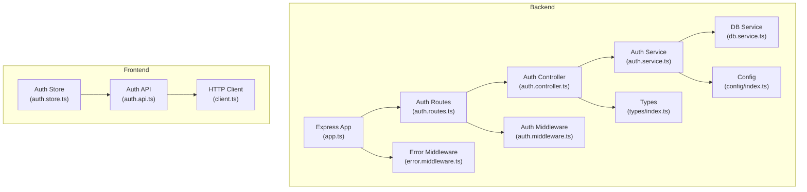
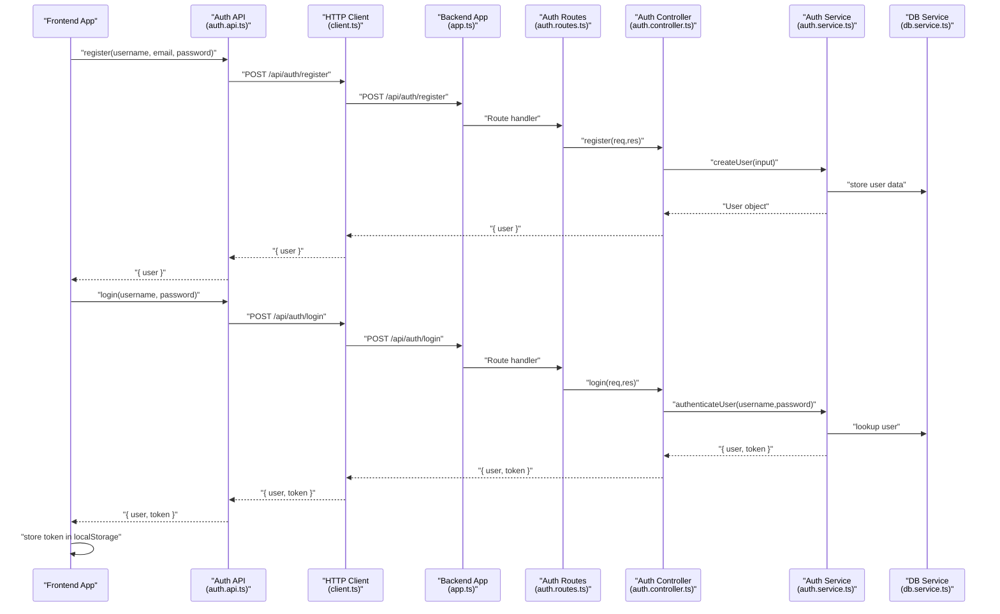
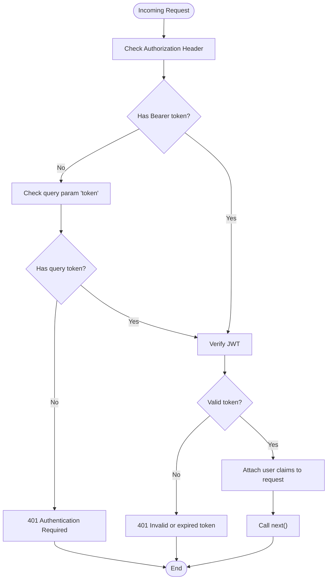
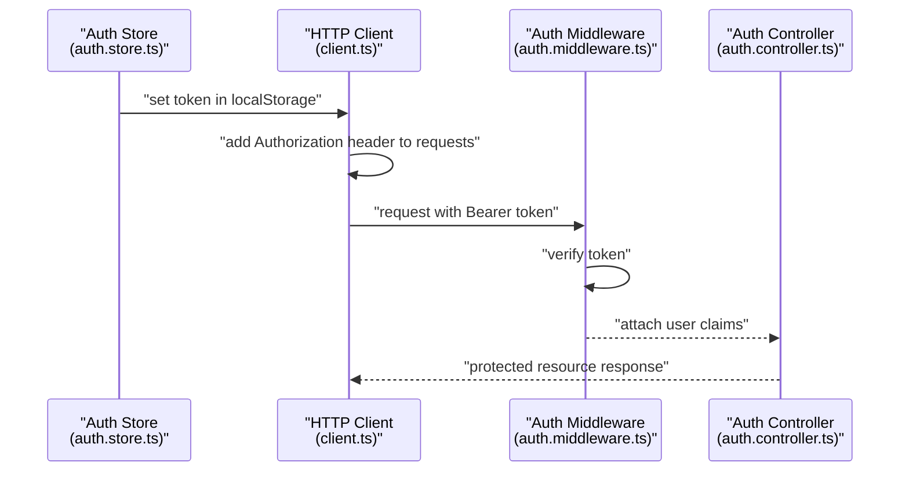
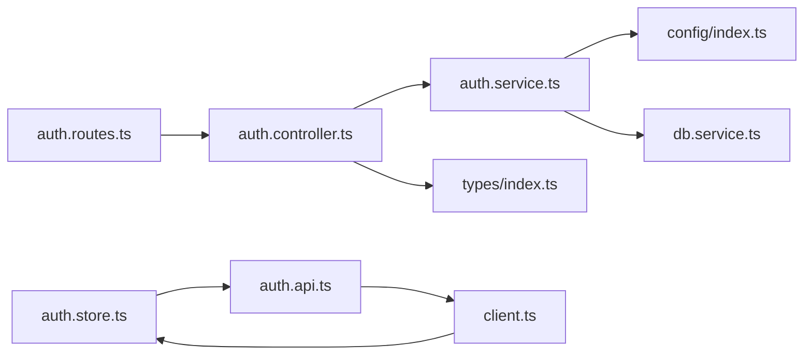

# Authentication API

<cite>
**Referenced Files in This Document**
- [auth.routes.ts](file://backend/src/routes/auth.routes.ts)
- [auth.controller.ts](file://backend/src/controllers/auth.controller.ts)
- [auth.middleware.ts](file://backend/src/middleware/auth.middleware.ts)
- [auth.service.ts](file://backend/src/services/auth.service.ts)
- [config/index.ts](file://backend/src/config/index.ts)
- [types/index.ts](file://backend/src/types/index.ts)
- [app.ts](file://backend/src/app.ts)
- [error.middleware.ts](file://backend/src/middleware/error.middleware.ts)
- [db.service.ts](file://backend/src/services/db.service.ts)
- [auth.store.ts](file://frontend/src/stores/auth.store.ts)
- [auth.api.ts](file://frontend/src/api/auth.api.ts)
- [client.ts](file://frontend/src/api/client.ts)
</cite>

## Table of Contents
1. [Introduction](#introduction)
2. [Project Structure](#project-structure)
3. [Core Components](#core-components)
4. [Architecture Overview](#architecture-overview)
5. [Detailed Component Analysis](#detailed-component-analysis)
6. [Dependency Analysis](#dependency-analysis)
7. [Performance Considerations](#performance-considerations)
8. [Troubleshooting Guide](#troubleshooting-guide)
9. [Conclusion](#conclusion)
10. [Appendices](#appendices)

## Introduction
This document provides comprehensive API documentation for the authentication system endpoints. It covers HTTP methods, URL patterns, request/response schemas, JWT token authentication, token generation and validation, token expiration handling, error handling, protected route access patterns, authentication middleware, token extraction, user session management, and security considerations including password hashing with bcrypt and token storage in browsers. It also includes client implementation guidelines for frontend applications and common use cases such as automatic token refresh and error handling strategies.

## Project Structure
The authentication system spans both backend and frontend layers:
- Backend: Express routes, controllers, middleware, services, configuration, and data persistence
- Frontend: API client, authentication store, and API modules

**Diagram sources**
- [app.ts:1-51](file://backend/src/app.ts#L1-L51)
- [auth.routes.ts:1-12](file://backend/src/routes/auth.routes.ts#L1-L12)
- [auth.controller.ts:1-76](file://backend/src/controllers/auth.controller.ts#L1-L76)
- [auth.middleware.ts:1-33](file://backend/src/middleware/auth.middleware.ts#L1-L33)
- [auth.service.ts:1-93](file://backend/src/services/auth.service.ts#L1-L93)
- [config/index.ts:1-24](file://backend/src/config/index.ts#L1-L24)
- [types/index.ts:1-83](file://backend/src/types/index.ts#L1-L83)
- [error.middleware.ts:1-8](file://backend/src/middleware/error.middleware.ts#L1-L8)
- [db.service.ts:1-49](file://backend/src/services/db.service.ts#L1-L49)
- [auth.store.ts:1-54](file://frontend/src/stores/auth.store.ts#L1-L54)
- [auth.api.ts:1-25](file://frontend/src/api/auth.api.ts#L1-L25)
- [client.ts:1-33](file://frontend/src/api/client.ts#L1-L33)

**Section sources**
- [app.ts:1-51](file://backend/src/app.ts#L1-L51)
- [auth.routes.ts:1-12](file://backend/src/routes/auth.routes.ts#L1-L12)

## Core Components
- Authentication routes: POST /api/auth/register, POST /api/auth/login, GET /api/auth/me
- Authentication controller: Validates input, orchestrates service calls, and returns structured responses
- Authentication middleware: Extracts and validates JWT tokens from Authorization headers or query parameters
- Authentication service: Handles user creation, credential verification, token generation/verification, and user lookup
- Frontend authentication store: Manages user state, token lifecycle, and integrates with the HTTP client
- HTTP client: Adds Authorization headers automatically and handles 401 responses

**Section sources**
- [auth.routes.ts:7-9](file://backend/src/routes/auth.routes.ts#L7-L9)
- [auth.controller.ts:18-75](file://backend/src/controllers/auth.controller.ts#L18-L75)
- [auth.middleware.ts:10-32](file://backend/src/middleware/auth.middleware.ts#L10-L32)
- [auth.service.ts:11-92](file://backend/src/services/auth.service.ts#L11-L92)
- [auth.store.ts:7-53](file://frontend/src/stores/auth.store.ts#L7-L53)
- [client.ts:11-30](file://frontend/src/api/client.ts#L11-L30)

## Architecture Overview
The authentication flow connects frontend and backend components seamlessly:
- Frontend sends credentials to backend
- Backend validates credentials and issues JWT
- Frontend stores token and attaches it to subsequent requests
- Backend middleware verifies tokens for protected routes

**Diagram sources**
- [auth.api.ts:4-19](file://frontend/src/api/auth.api.ts#L4-L19)
- [client.ts:3-18](file://frontend/src/api/client.ts#L3-L18)
- [app.ts:40-45](file://backend/src/app.ts#L40-L45)
- [auth.routes.ts:7-9](file://backend/src/routes/auth.routes.ts#L7-L9)
- [auth.controller.ts:18-59](file://backend/src/controllers/auth.controller.ts#L18-L59)
- [auth.service.ts:11-71](file://backend/src/services/auth.service.ts#L11-L71)
- [db.service.ts:20-33](file://backend/src/services/db.service.ts#L20-L33)

## Detailed Component Analysis

### Authentication Endpoints

#### POST /api/auth/register
- Purpose: Register a new user account
- Request body schema:
  - username: string (min length 3, max length 32, allowed characters: alphanumeric, underscore, hyphen)
  - email: string (valid email format)
  - password: string (min length 6, max length 128)
- Success response (201 Created):
  - user: object containing id, username, email
- Error responses:
  - 400 Bad Request: Validation errors (Zod schema)
  - 409 Conflict: Username or email already exists
  - 500 Internal Server Error: Registration failure

Example successful response:
{
  "user": {
    "id": "generated-user-id",
    "username": "john_doe",
    "email": "john@example.com"
  }
}

Example error response (validation):
{
  "error": "Validation error",
  "details": [
    {
      "path": ["username"],
      "message": "String must contain at least 3 character(s)"
    }
  ]
}

Example error response (conflict):
{
  "error": "Username already exists"
}

**Section sources**
- [auth.controller.ts:7-37](file://backend/src/controllers/auth.controller.ts#L7-L37)
- [auth.routes.ts:7](file://backend/src/routes/auth.routes.ts#L7)

#### POST /api/auth/login
- Purpose: Authenticate an existing user and issue JWT
- Request body schema:
  - username: string
  - password: string
- Success response (200 OK):
  - user: object containing id, username, email
  - token: string (JWT)
- Error responses:
  - 400 Bad Request: Validation errors (Zod schema)
  - 401 Unauthorized: Invalid credentials
  - 500 Internal Server Error: Login failure

Example successful response:
{
  "user": {
    "id": "user-id",
    "username": "john_doe",
    "email": "john@example.com"
  },
  "token": "eyJhbGciOiJIUzI1NiIsInR5cCI6IkpXVCJ9..."
}

Example error response (invalid credentials):
{
  "error": "Invalid username or password"
}

**Section sources**
- [auth.controller.ts:13-59](file://backend/src/controllers/auth.controller.ts#L13-L59)
- [auth.routes.ts:8](file://backend/src/routes/auth.routes.ts#L8)

#### GET /api/auth/me
- Purpose: Retrieve currently authenticated user profile
- Authentication: Required (Bearer token in Authorization header or query parameter)
- Success response (200 OK):
  - user: object containing id, username, email
- Error responses:
  - 401 Unauthorized: Missing or invalid/expired token
  - 404 Not Found: User not found
  - 500 Internal Server Error: Failed to get user info

Example successful response:
{
  "user": {
    "id": "user-id",
    "username": "john_doe",
    "email": "john@example.com"
  }
}

**Section sources**
- [auth.controller.ts:61-75](file://backend/src/controllers/auth.controller.ts#L61-L75)
- [auth.routes.ts:9](file://backend/src/routes/auth.routes.ts#L9)

### JWT Token Authentication

#### Token Generation and Validation
- Token payload includes subject (user id) and username
- Secret key and expiration configured via environment variables
- Token is signed using HS256 algorithm

Key configuration:
- jwtSecret: Environment variable JWT_SECRET (default development value)
- jwtExpiresIn: Environment variable JWT_EXPIRES_IN (default "24h")

Token verification occurs in middleware using the same secret.

**Section sources**
- [auth.service.ts:79-92](file://backend/src/services/auth.service.ts#L79-L92)
- [config/index.ts:8-10](file://backend/src/config/index.ts#L8-L10)
- [auth.middleware.ts:23-31](file://backend/src/middleware/auth.middleware.ts#L23-L31)

#### Token Extraction from Authorization Headers
- Supports "Bearer <token>" format in Authorization header
- Also supports token passed as query parameter "token" (useful for SSE)
- If token missing, responds with 401 Unauthorized

**Section sources**
- [auth.middleware.ts:10-21](file://backend/src/middleware/auth.middleware.ts#L10-L21)

#### Protected Route Access Patterns
- Apply authMiddleware to GET /api/auth/me
- Frontend automatically attaches Authorization header to all requests via interceptors
- On receiving 401, frontend clears token and redirects to login

**Section sources**
- [auth.routes.ts:9](file://backend/src/routes/auth.routes.ts#L9)
- [client.ts:11-30](file://frontend/src/api/client.ts#L11-L30)

### Authentication Middleware Implementation
The middleware performs:
- Extracts token from Authorization header or query parameter
- Verifies token signature and expiration
- Attaches decoded user claims (sub, username) to request object
- Continues to next handler on success; returns 401 on failure

**Diagram sources**
- [auth.middleware.ts:10-32](file://backend/src/middleware/auth.middleware.ts#L10-L32)

**Section sources**
- [auth.middleware.ts:10-32](file://backend/src/middleware/auth.middleware.ts#L10-L32)

### User Session Management
Frontend session management:
- Stores JWT in localStorage upon successful login
- Automatically adds Authorization header to all requests
- Clears token and redirects to login on 401 responses
- Fetches user profile on app initialization if token exists

Backend session management:
- No server-side session storage; stateless JWT-based authentication
- User data stored in local database keyed by user id and indexed by username/email
- Token expiration handled by JWT library

**Section sources**
- [auth.store.ts:7-53](file://frontend/src/stores/auth.store.ts#L7-L53)
- [client.ts:11-30](file://frontend/src/api/client.ts#L11-L30)
- [auth.service.ts:11-77](file://backend/src/services/auth.service.ts#L11-L77)
- [db.service.ts:20-33](file://backend/src/services/db.service.ts#L20-L33)

### Password Hashing with bcrypt
- Passwords are hashed using bcrypt with 12 rounds
- During login, plaintext password is compared against stored hash
- No plaintext passwords are stored or transmitted

Security implications:
- Strong protection against rainbow table attacks
- Slows down brute force attempts through computational cost

**Section sources**
- [auth.service.ts:9](file://backend/src/services/auth.service.ts#L9)
- [auth.service.ts:25](file://backend/src/services/auth.service.ts#L25)
- [auth.service.ts:63](file://backend/src/services/auth.service.ts#L63)

### Logout Mechanisms
- Frontend logout removes token from localStorage and clears user state
- No backend endpoint for explicit logout; token expiration is enforced by JWT
- For immediate invalidation, consider blacklisting tokens or shortening expiration

**Section sources**
- [auth.store.ts:45-50](file://frontend/src/stores/auth.store.ts#L45-L50)

### Relationship Between Frontend Authentication Store and Backend JWT Validation
- Frontend store manages token lifecycle and user state
- HTTP client automatically attaches Authorization header
- Backend middleware validates token and populates request context
- Protected routes rely on middleware for access control

**Diagram sources**
- [auth.store.ts:9](file://frontend/src/stores/auth.store.ts#L9)
- [client.ts:12-18](file://frontend/src/api/client.ts#L12-L18)
- [auth.middleware.ts:23-27](file://backend/src/middleware/auth.middleware.ts#L23-L27)
- [auth.controller.ts:61](file://backend/src/controllers/auth.controller.ts#L61)

## Dependency Analysis
The authentication system exhibits clean separation of concerns:
- Routes depend on controllers
- Controllers depend on services
- Services depend on configuration and database
- Frontend depends on API modules and HTTP client
- HTTP client depends on localStorage for token persistence

**Diagram sources**
- [auth.routes.ts:1-12](file://backend/src/routes/auth.routes.ts#L1-L12)
- [auth.controller.ts:1-76](file://backend/src/controllers/auth.controller.ts#L1-L76)
- [auth.service.ts:1-93](file://backend/src/services/auth.service.ts#L1-L93)
- [config/index.ts:1-24](file://backend/src/config/index.ts#L1-L24)
- [db.service.ts:1-49](file://backend/src/services/db.service.ts#L1-L49)
- [types/index.ts:1-83](file://backend/src/types/index.ts#L1-L83)
- [auth.store.ts:1-54](file://frontend/src/stores/auth.store.ts#L1-L54)
- [auth.api.ts:1-25](file://frontend/src/api/auth.api.ts#L1-L25)
- [client.ts:1-33](file://frontend/src/api/client.ts#L1-L33)

**Section sources**
- [auth.routes.ts:1-12](file://backend/src/routes/auth.routes.ts#L1-L12)
- [auth.controller.ts:1-76](file://backend/src/controllers/auth.controller.ts#L1-L76)
- [auth.service.ts:1-93](file://backend/src/services/auth.service.ts#L1-L93)
- [auth.store.ts:1-54](file://frontend/src/stores/auth.store.ts#L1-L54)
- [auth.api.ts:1-25](file://frontend/src/api/auth.api.ts#L1-L25)
- [client.ts:1-33](file://frontend/src/api/client.ts#L1-L33)

## Performance Considerations
- Token verification is lightweight; negligible overhead
- Database operations for user lookup are minimal and indexed
- Consider rate limiting for login attempts to prevent brute force
- Shorten token expiration for highly sensitive environments
- Use HTTPS in production to protect tokens in transit

## Troubleshooting Guide
Common issues and resolutions:
- 401 Authentication Required: Ensure Authorization header is present and formatted correctly ("Bearer <token>")
- 401 Invalid or expired token: Re-authenticate to obtain a new token
- 400 Validation error: Check request payload against schema requirements
- 409 Conflict (username/email exists): Choose unique credentials
- 401 Login failures: Verify username/password combination
- 404 User not found: User record missing despite valid token; investigate data consistency

Error handling patterns:
- Backend logs unhandled errors and returns generic 500 responses
- Frontend automatically clears token and redirects on 401

**Section sources**
- [auth.middleware.ts:18-31](file://backend/src/middleware/auth.middleware.ts#L18-L31)
- [auth.controller.ts:25-36](file://backend/src/controllers/auth.controller.ts#L25-L36)
- [auth.controller.ts:47-58](file://backend/src/controllers/auth.controller.ts#L47-L58)
- [error.middleware.ts:4-7](file://backend/src/middleware/error.middleware.ts#L4-L7)
- [client.ts:20-30](file://frontend/src/api/client.ts#L20-L30)

## Conclusion
The authentication system provides a secure, stateless JWT-based solution with clear separation of concerns. It offers robust validation, secure password handling, and seamless integration between frontend and backend components. The design supports protected routes, automatic token attachment, and graceful error handling, making it suitable for modern web applications.

## Appendices

### API Definitions

#### Base URL
- Backend: /api
- Frontend: /api (proxied by development server)

#### Authentication Header
- Authorization: Bearer <token>

#### Request/Response Schemas

User registration payload:
{
  "username": "string (3-32 chars, alphanumeric, underscore, hyphen)",
  "email": "string (valid email)",
  "password": "string (6-128 chars)"
}

Login credentials:
{
  "username": "string",
  "password": "string"
}

User information structure:
{
  "user": {
    "id": "string",
    "username": "string",
    "email": "string"
  }
}

JWT token:
- String (standard JWT format)

#### HTTP Status Codes
- 200 OK: Successful operation
- 201 Created: Resource created
- 400 Bad Request: Validation error
- 401 Unauthorized: Authentication required or invalid token
- 404 Not Found: Resource not found
- 409 Conflict: Resource conflict (duplicate)
- 500 Internal Server Error: Unexpected error

### Client Implementation Guidelines

#### Frontend Integration
- Use the provided auth store for centralized state management
- Import and use the auth API functions for login/register/getMe
- The HTTP client automatically attaches Authorization headers
- Handle 401 responses by clearing token and redirecting to login

#### Token Storage
- Store JWT in localStorage for persistence across sessions
- Never store sensitive data in cookies unless absolutely necessary
- Consider using HttpOnly cookies for server-rendered apps if applicable

#### Automatic Token Refresh
- Current implementation relies on token expiration
- Recommended approaches:
  - Implement a refresh endpoint returning new JWT
  - Use short-lived access tokens with long-lived refresh tokens
  - Add pre-request hook to detect expiration and refresh automatically

#### Error Handling Strategies
- Centralized error handling via HTTP interceptors
- Graceful degradation when network errors occur
- User-friendly error messages while preserving technical details for logging

#### Security Best Practices
- Always use HTTPS in production
- Configure appropriate CORS policies
- Limit token expiration based on risk assessment
- Implement rate limiting for authentication endpoints
- Regularly rotate JWT secrets
- Sanitize and validate all inputs on the server

**Section sources**
- [auth.store.ts:7-53](file://frontend/src/stores/auth.store.ts#L7-L53)
- [auth.api.ts:1-25](file://frontend/src/api/auth.api.ts#L1-L25)
- [client.ts:11-30](file://frontend/src/api/client.ts#L11-L30)
- [config/index.ts:8-10](file://backend/src/config/index.ts#L8-L10)