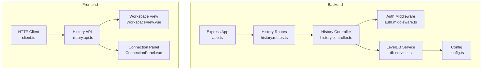
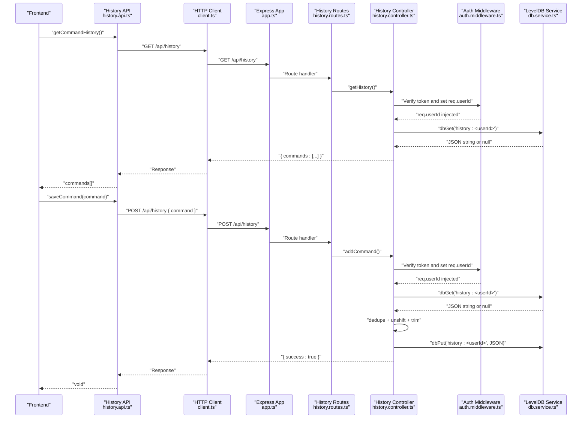
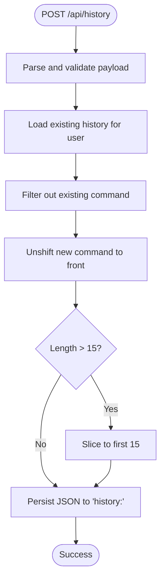
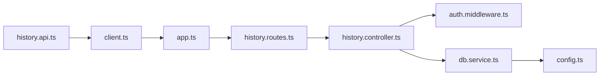

# Command History API

<cite>
**Referenced Files in This Document**
- [history.controller.ts](file://backend/src/controllers/history.controller.ts)
- [history.routes.ts](file://backend/src/routes/history.routes.ts)
- [db.service.ts](file://backend/src/services/db.service.ts)
- [auth.middleware.ts](file://backend/src/middleware/auth.middleware.ts)
- [client.ts](file://frontend/src/api/client.ts)
- [history.api.ts](file://frontend/src/api/history.api.ts)
- [WorkspaceView.vue](file://frontend/src/views/WorkspaceView.vue)
- [ConnectionPanel.vue](file://frontend/src/views/ConnectionPanel.vue)
- [app.ts](file://backend/src/app.ts)
- [index.ts](file://backend/src/index.ts)
- [config.ts](file://backend/src/config/index.ts)
- [error.middleware.ts](file://backend/src/middleware/error.middleware.ts)
</cite>

## Table of Contents
1. [Introduction](#introduction)
2. [Project Structure](#project-structure)
3. [Core Components](#core-components)
4. [Architecture Overview](#architecture-overview)
5. [Detailed Component Analysis](#detailed-component-analysis)
6. [Dependency Analysis](#dependency-analysis)
7. [Performance Considerations](#performance-considerations)
8. [Troubleshooting Guide](#troubleshooting-guide)
9. [Conclusion](#conclusion)
10. [Appendices](#appendices)

## Introduction
This document describes the Command History API that powers persistent command recall in the WebTerm application. It covers:
- Three main endpoints: GET /api/history, POST /api/history, and DELETE /api/history
- Backend persistence using LevelDB (via RocksDB) with user isolation
- Smart deduplication and trimming to maintain up to 15 most recent commands per user
- Cross-session persistence and privacy guarantees
- Frontend integration for displaying history and selecting commands
- Implementation details for filtering, sorting, and user-specific data isolation

## Project Structure
The Command History feature spans backend controllers, routes, and database service, and frontend API clients and views.

**Diagram sources**
- [app.ts:40-45](file://backend/src/app.ts#L40-L45)
- [history.routes.ts:1-14](file://backend/src/routes/history.routes.ts#L1-L14)
- [history.controller.ts:13-62](file://backend/src/controllers/history.controller.ts#L13-L62)
- [db.service.ts:1-49](file://backend/src/services/db.service.ts#L1-L49)
- [auth.middleware.ts:10-32](file://backend/src/middleware/auth.middleware.ts#L10-L32)
- [config.ts:12-13](file://backend/src/config/index.ts#L12-L13)
- [client.ts:1-33](file://frontend/src/api/client.ts#L1-L33)
- [history.api.ts:1-15](file://frontend/src/api/history.api.ts#L1-L15)
- [WorkspaceView.vue:74-128](file://frontend/src/views/WorkspaceView.vue#L74-L128)
- [ConnectionPanel.vue:191-193](file://frontend/src/views/ConnectionPanel.vue#L191-L193)

**Section sources**
- [app.ts:40-45](file://backend/src/app.ts#L40-L45)
- [history.routes.ts:1-14](file://backend/src/routes/history.routes.ts#L1-L14)
- [history.controller.ts:13-62](file://backend/src/controllers/history.controller.ts#L13-L62)
- [db.service.ts:1-49](file://backend/src/services/db.service.ts#L1-L49)
- [auth.middleware.ts:10-32](file://backend/src/middleware/auth.middleware.ts#L10-L32)
- [config.ts:12-13](file://backend/src/config/index.ts#L12-L13)
- [client.ts:1-33](file://frontend/src/api/client.ts#L1-L33)
- [history.api.ts:1-15](file://frontend/src/api/history.api.ts#L1-L15)
- [WorkspaceView.vue:74-128](file://frontend/src/views/WorkspaceView.vue#L74-L128)
- [ConnectionPanel.vue:191-193](file://frontend/src/views/ConnectionPanel.vue#L191-L193)

## Core Components
- Backend controller functions implement the three endpoints:
  - GET /api/history retrieves a user’s command history list
  - POST /api/history adds a new command to history with smart deduplication and trimming
  - DELETE /api/history clears a user’s history
- Authentication middleware injects the user identifier into requests, enabling user isolation
- Database service persists data using LevelDB with UTF-8 string encoding
- Frontend API module wraps HTTP calls to the backend endpoints
- Frontend views integrate history retrieval, selection, and clearing

Key behaviors:
- Storage format: JSON-encoded array of strings per user key
- Deduplication: removes prior occurrences of the same command
- Sorting: most recent command appears first
- Size limit: maximum 15 commands per user
- Persistence: cross-session via LevelDB

**Section sources**
- [history.controller.ts:7-11](file://backend/src/controllers/history.controller.ts#L7-L11)
- [history.controller.ts:13-62](file://backend/src/controllers/history.controller.ts#L13-L62)
- [auth.middleware.ts:23-27](file://backend/src/middleware/auth.middleware.ts#L23-L27)
- [db.service.ts:20-37](file://backend/src/services/db.service.ts#L20-L37)
- [history.api.ts:3-14](file://frontend/src/api/history.api.ts#L3-L14)
- [WorkspaceView.vue:97-128](file://frontend/src/views/WorkspaceView.vue#L97-L128)
- [ConnectionPanel.vue:191-193](file://frontend/src/views/ConnectionPanel.vue#L191-L193)

## Architecture Overview
The backend exposes three endpoints under /api/history. Requests are authenticated and user-scoped. The controller reads/writes user-specific keys in LevelDB. The frontend consumes these endpoints to populate and update the history UI.

**Diagram sources**
- [history.controller.ts:13-62](file://backend/src/controllers/history.controller.ts#L13-L62)
- [history.routes.ts:9-11](file://backend/src/routes/history.routes.ts#L9-L11)
- [auth.middleware.ts:10-32](file://backend/src/middleware/auth.middleware.ts#L10-L32)
- [db.service.ts:20-37](file://backend/src/services/db.service.ts#L20-L37)
- [history.api.ts:3-14](file://frontend/src/api/history.api.ts#L3-L14)
- [client.ts:12-18](file://frontend/src/api/client.ts#L12-L18)
- [app.ts:44-45](file://backend/src/app.ts#L44-L45)

## Detailed Component Analysis

### Backend Endpoints and Controller Logic
- GET /api/history
  - Retrieves user-specific history using key pattern "history:<userId>"
  - Returns JSON with a "commands" array
  - Handles missing keys by returning an empty array
- POST /api/history
  - Validates payload with a command string length constraint
  - Deduplicates by removing existing entries of the same command
  - Prepends the new command to the front (most recent first)
  - Trims to maximum 15 commands
  - Persists JSON-encoded array back to LevelDB
- DELETE /api/history
  - Removes the user’s history key from LevelDB
  - Returns success indicator

Smart deduplication and trimming:
- Deduplication uses filter to exclude prior occurrences
- Unshift ensures newest command is first
- Slice trims to maximum length

User isolation:
- Authentication middleware extracts user identity from JWT and attaches to request
- Controller uses req.userId to construct the user-specific key

**Section sources**
- [history.controller.ts:7-11](file://backend/src/controllers/history.controller.ts#L7-L11)
- [history.controller.ts:13-22](file://backend/src/controllers/history.controller.ts#L13-L22)
- [history.controller.ts:24-52](file://backend/src/controllers/history.controller.ts#L24-L52)
- [history.controller.ts:54-62](file://backend/src/controllers/history.controller.ts#L54-L62)
- [auth.middleware.ts:23-27](file://backend/src/middleware/auth.middleware.ts#L23-L27)

### Database Service and Storage Model
- LevelDB initialization with UTF-8 encoding
- Keys are strings; values are JSON-encoded arrays of strings
- User-specific keys follow the pattern "history:<userId>"
- Operations:
  - Get: returns value or null if not found
  - Put: writes JSON string
  - Del: deletes user history key

Cross-session persistence:
- Data survives server restarts because LevelDB is file-based
- No TTL or expiration logic; data persists until explicitly cleared

**Section sources**
- [db.service.ts:7-11](file://backend/src/services/db.service.ts#L7-L11)
- [db.service.ts:20-37](file://backend/src/services/db.service.ts#L20-L37)
- [config.ts:12-13](file://backend/src/config/index.ts#L12-L13)

### Frontend Integration
- HTTP client:
  - Base URL set to "/api"
  - Authorization header automatically attached from local storage
  - 401 responses redirect to login
- History API:
  - getCommandHistory returns string[]
  - saveCommand posts { command }
  - clearCommandHistory deletes the endpoint
- Views:
  - WorkspaceView: toggles history popup, loads commands, clears history
  - ConnectionPanel: saves commands when terminal emits onCommand

Command selection flow:
- User selects a history item
- WorkspaceView writes the selected command to the active terminal panel

**Section sources**
- [client.ts:3-9](file://frontend/src/api/client.ts#L3-L9)
- [client.ts:12-18](file://frontend/src/api/client.ts#L12-L18)
- [client.ts:21-29](file://frontend/src/api/client.ts#L21-L29)
- [history.api.ts:3-14](file://frontend/src/api/history.api.ts#L3-L14)
- [WorkspaceView.vue:97-128](file://frontend/src/views/WorkspaceView.vue#L97-L128)
- [ConnectionPanel.vue:191-193](file://frontend/src/views/ConnectionPanel.vue#L191-L193)

### Endpoint Definitions and Payloads

- GET /api/history
  - Description: Retrieve the list of previously executed commands for the authenticated user
  - Authentication: Required (Bearer token)
  - Response: { commands: string[] }
  - Example response:
    - { "commands": ["ls -la", "cd /home", "pwd"] }

- POST /api/history
  - Description: Add a command to the user’s history
  - Authentication: Required (Bearer token)
  - Request body: { command: string }
  - Validation:
    - command must be a non-empty string
    - maximum length enforced by schema
  - Behavior:
    - Deduplicate existing occurrence
    - Prepend to front (most recent)
    - Trim to 15 items
  - Response: { success: true }

- DELETE /api/history
  - Description: Clear the user’s command history
  - Authentication: Required (Bearer token)
  - Response: { success: true }

Notes:
- User isolation is implicit via the authenticated request context
- History order is most recent first

**Section sources**
- [history.routes.ts:9-11](file://backend/src/routes/history.routes.ts#L9-L11)
- [history.controller.ts:9-11](file://backend/src/controllers/history.controller.ts#L9-L11)
- [history.controller.ts:13-22](file://backend/src/controllers/history.controller.ts#L13-L22)
- [history.controller.ts:24-52](file://backend/src/controllers/history.controller.ts#L24-L52)
- [history.controller.ts:54-62](file://backend/src/controllers/history.controller.ts#L54-L62)

### Workflow Examples

#### Retrieving History
- Frontend calls getCommandHistory()
- Backend responds with commands ordered newest-first
- Frontend displays commands in a dropdown/popup

#### Adding a Command
- Frontend calls saveCommand(command) when a terminal command completes
- Backend deduplicates, prepends, trims, and persists
- Subsequent GET requests reflect the updated order

#### Clearing History
- Frontend calls clearCommandHistory()
- Backend deletes the user’s history key
- Frontend clears the UI list

**Section sources**
- [history.api.ts:3-14](file://frontend/src/api/history.api.ts#L3-L14)
- [WorkspaceView.vue:97-128](file://frontend/src/views/WorkspaceView.vue#L97-L128)
- [ConnectionPanel.vue:191-193](file://frontend/src/views/ConnectionPanel.vue#L191-L193)
- [history.controller.ts:24-52](file://backend/src/controllers/history.controller.ts#L24-L52)

### Implementation Details: Filtering, Sorting, and Isolation

**Diagram sources**
- [history.controller.ts:24-52](file://backend/src/controllers/history.controller.ts#L24-L52)

User isolation:
- Authentication middleware verifies token and sets req.userId
- Controller constructs key "history:<userId>" ensuring separation between users

**Section sources**
- [auth.middleware.ts:23-27](file://backend/src/middleware/auth.middleware.ts#L23-L27)
- [history.controller.ts:15](file://backend/src/controllers/history.controller.ts#L15)
- [history.controller.ts:28](file://backend/src/controllers/history.controller.ts#L28)
- [history.controller.ts:42](file://backend/src/controllers/history.controller.ts#L42)

## Dependency Analysis

**Diagram sources**
- [history.api.ts:1-15](file://frontend/src/api/history.api.ts#L1-L15)
- [client.ts:1-33](file://frontend/src/api/client.ts#L1-L33)
- [app.ts:40-45](file://backend/src/app.ts#L40-L45)
- [history.routes.ts:1-14](file://backend/src/routes/history.routes.ts#L1-L14)
- [history.controller.ts:13-62](file://backend/src/controllers/history.controller.ts#L13-L62)
- [auth.middleware.ts:10-32](file://backend/src/middleware/auth.middleware.ts#L10-L32)
- [db.service.ts:1-49](file://backend/src/services/db.service.ts#L1-L49)
- [config.ts:12-13](file://backend/src/config/index.ts#L12-L13)

**Section sources**
- [history.api.ts:1-15](file://frontend/src/api/history.api.ts#L1-L15)
- [client.ts:1-33](file://frontend/src/api/client.ts#L1-L33)
- [app.ts:40-45](file://backend/src/app.ts#L40-L45)
- [history.routes.ts:1-14](file://backend/src/routes/history.routes.ts#L1-L14)
- [history.controller.ts:13-62](file://backend/src/controllers/history.controller.ts#L13-L62)
- [auth.middleware.ts:10-32](file://backend/src/middleware/auth.middleware.ts#L10-L32)
- [db.service.ts:1-49](file://backend/src/services/db.service.ts#L1-L49)
- [config.ts:12-13](file://backend/src/config/index.ts#L12-L13)

## Performance Considerations
- LevelDB operations are efficient for small to moderate-sized arrays
- Deduplication and trimming are O(n) per insertion; acceptable given n ≤ 15
- JSON serialization overhead minimal for short arrays
- Network latency dominates compared to CPU work in typical usage
- Consider batching or debouncing frequent command submissions if needed

## Troubleshooting Guide
- 401 Unauthorized
  - Cause: Missing or invalid Bearer token
  - Resolution: Ensure token is present in Authorization header and valid
- 400 Bad Request on POST
  - Cause: Validation error (command missing or too long)
  - Resolution: Verify payload shape and length constraints
- 500 Internal Server Error
  - Causes: Database errors, unhandled exceptions
  - Resolution: Check backend logs; verify database path and permissions
- History not persisting across sessions
  - Cause: Database path misconfiguration or permission issues
  - Resolution: Confirm ROCKSDB_PATH environment variable and filesystem permissions

**Section sources**
- [client.ts:21-29](file://frontend/src/api/client.ts#L21-L29)
- [history.controller.ts:44-51](file://backend/src/controllers/history.controller.ts#L44-L51)
- [error.middleware.ts:4-7](file://backend/src/middleware/error.middleware.ts#L4-L7)
- [config.ts:12-13](file://backend/src/config/index.ts#L12-L13)

## Conclusion
The Command History API provides a compact, user-isolated, and cross-session-capable mechanism for storing and retrieving recently used commands. Its design emphasizes simplicity and reliability: LevelDB-backed persistence, smart deduplication, strict ordering, and a fixed upper bound. The frontend integrates seamlessly with these endpoints to deliver a responsive history experience.

## Appendices

### API Reference Summary
- GET /api/history
  - Purpose: List commands for the authenticated user
  - Response: { commands: string[] }
- POST /api/history
  - Purpose: Add a command to history
  - Request: { command: string }
  - Constraints: Non-empty, length within configured bounds
  - Behavior: Deduplicate, prepend, trim to 15
- DELETE /api/history
  - Purpose: Clear user history
  - Response: { success: true }

### Client Integration Guidelines
- Authentication
  - Attach Authorization: Bearer <token> header for all history endpoints
- Retrieval
  - Call getCommandHistory() to populate the history UI
- Selection
  - On item click, write the selected command to the active terminal panel
- Submission
  - Save commands when terminal emits completion events
- Clearing
  - Call clearCommandHistory() to reset the list

**Section sources**
- [client.ts:12-18](file://frontend/src/api/client.ts#L12-L18)
- [history.api.ts:3-14](file://frontend/src/api/history.api.ts#L3-L14)
- [WorkspaceView.vue:97-128](file://frontend/src/views/WorkspaceView.vue#L97-L128)
- [ConnectionPanel.vue:191-193](file://frontend/src/views/ConnectionPanel.vue#L191-L193)