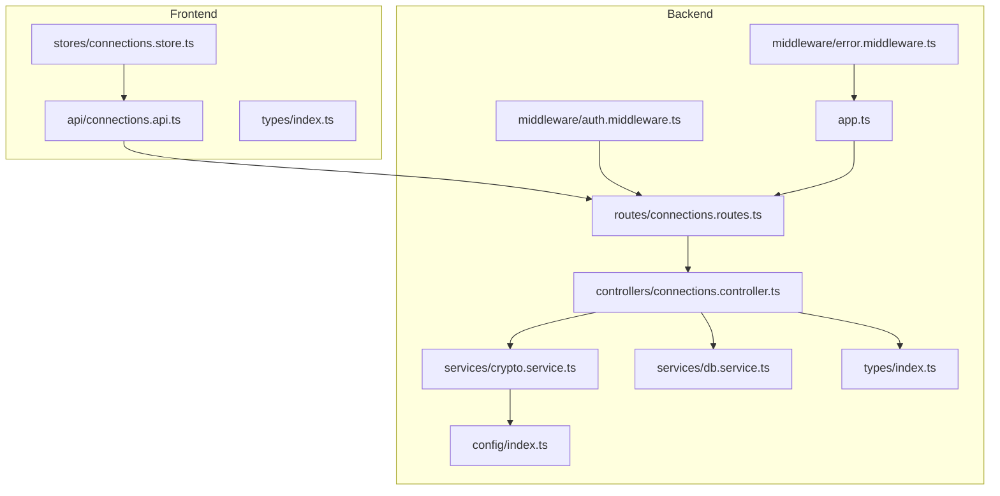
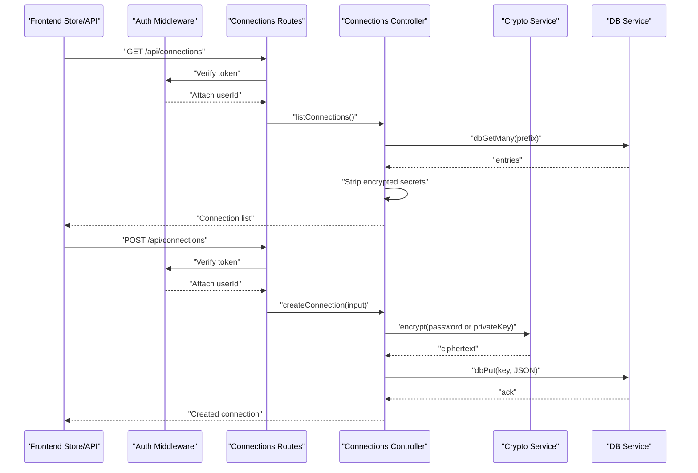
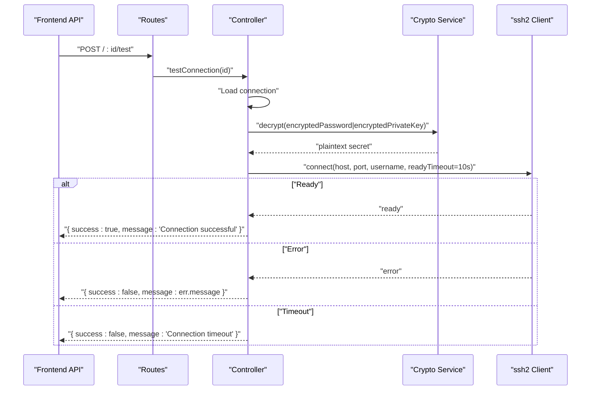
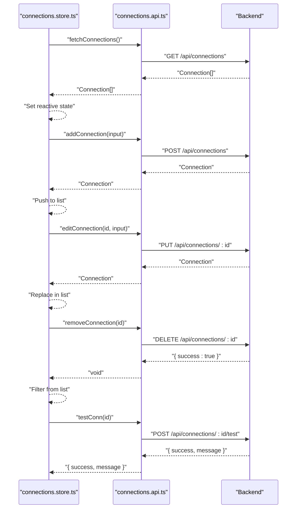
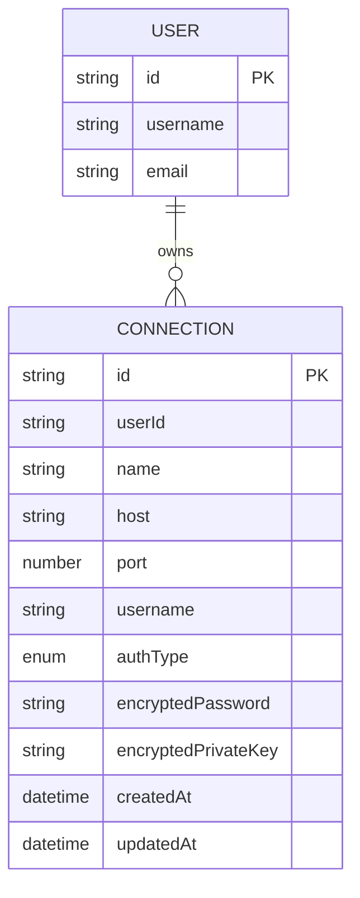
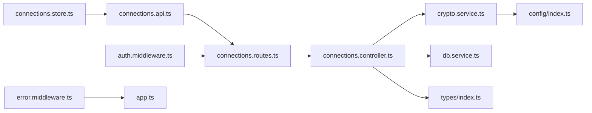

# Connection Management API

<cite>
**Referenced Files in This Document**
- [connections.controller.ts](file://backend/src/controllers/connections.controller.ts)
- [connections.routes.ts](file://backend/src/routes/connections.routes.ts)
- [crypto.service.ts](file://backend/src/services/crypto.service.ts)
- [db.service.ts](file://backend/src/services/db.service.ts)
- [index.ts](file://backend/src/types/index.ts)
- [index.ts](file://backend/src/config/index.ts)
- [auth.middleware.ts](file://backend/src/middleware/auth.middleware.ts)
- [error.middleware.ts](file://backend/src/middleware/error.middleware.ts)
- [app.ts](file://backend/src/app.ts)
- [connections.store.ts](file://frontend/src/stores/connections.store.ts)
- [connections.api.ts](file://frontend/src/api/connections.api.ts)
- [index.ts](file://frontend/src/types/index.ts)
</cite>

## Table of Contents
1. [Introduction](#introduction)
2. [Project Structure](#project-structure)
3. [Core Components](#core-components)
4. [Architecture Overview](#architecture-overview)
5. [Detailed Component Analysis](#detailed-component-analysis)
6. [Dependency Analysis](#dependency-analysis)
7. [Performance Considerations](#performance-considerations)
8. [Troubleshooting Guide](#troubleshooting-guide)
9. [Conclusion](#conclusion)
10. [Appendices](#appendices)

## Introduction
This document describes the Connection Management API that powers SSH connection profiles, including creation, retrieval, updates, deletion, and testing. It also documents the encryption model for credentials, the relationship between the frontend connection store and backend persistence, and operational guidance for validation, testing, and error handling.

## Project Structure
The Connection Management API spans backend controllers, routes, services, and types, and integrates with the frontend via a dedicated store and API module.

**Diagram sources**
- [connections.routes.ts:1-24](file://backend/src/routes/connections.routes.ts#L1-L24)
- [connections.controller.ts:1-215](file://backend/src/controllers/connections.controller.ts#L1-L215)
- [crypto.service.ts:1-42](file://backend/src/services/crypto.service.ts#L1-L42)
- [db.service.ts:1-49](file://backend/src/services/db.service.ts#L1-L49)
- [index.ts:1-83](file://backend/src/types/index.ts#L1-L83)
- [index.ts:1-24](file://backend/src/config/index.ts#L1-L24)
- [auth.middleware.ts:1-33](file://backend/src/middleware/auth.middleware.ts#L1-L33)
- [error.middleware.ts:1-8](file://backend/src/middleware/error.middleware.ts#L1-L8)
- [app.ts:1-51](file://backend/src/app.ts#L1-L51)
- [connections.store.ts:1-43](file://frontend/src/stores/connections.store.ts#L1-L43)
- [connections.api.ts:1-34](file://frontend/src/api/connections.api.ts#L1-L34)
- [index.ts:1-56](file://frontend/src/types/index.ts#L1-L56)

**Section sources**
- [connections.routes.ts:1-24](file://backend/src/routes/connections.routes.ts#L1-L24)
- [connections.controller.ts:1-215](file://backend/src/controllers/connections.controller.ts#L1-L215)
- [connections.store.ts:1-43](file://frontend/src/stores/connections.store.ts#L1-L43)
- [connections.api.ts:1-34](file://frontend/src/api/connections.api.ts#L1-L34)

## Core Components
- Backend routes expose the Connection Management API under /api/connections.
- Controllers implement CRUD operations and connection testing.
- Services handle encryption/decryption and persistent storage.
- Types define the connection profile schema and frontend-to-backend compatibility.
- Middleware enforces authentication and global error handling.
- Frontend store and API module synchronize local state with backend persistence.

**Section sources**
- [connections.routes.ts:14-21](file://backend/src/routes/connections.routes.ts#L14-L21)
- [connections.controller.ts:21-215](file://backend/src/controllers/connections.controller.ts#L21-L215)
- [crypto.service.ts:12-41](file://backend/src/services/crypto.service.ts#L12-L41)
- [db.service.ts:20-48](file://backend/src/services/db.service.ts#L20-L48)
- [index.ts:19-41](file://backend/src/types/index.ts#L19-L41)
- [auth.middleware.ts:10-32](file://backend/src/middleware/auth.middleware.ts#L10-L32)
- [error.middleware.ts:4-7](file://backend/src/middleware/error.middleware.ts#L4-L7)
- [connections.store.ts:6-42](file://frontend/src/stores/connections.store.ts#L6-L42)
- [connections.api.ts:4-33](file://frontend/src/api/connections.api.ts#L4-L33)

## Architecture Overview
The Connection Management API follows a layered architecture:
- HTTP entrypoint via Express routes.
- Authentication enforced by middleware.
- Business logic in controllers using typed models.
- Persistence via embedded database service.
- Encryption handled by cryptographic service using HKDF-derived keys.

**Diagram sources**
- [connections.routes.ts:14-21](file://backend/src/routes/connections.routes.ts#L14-L21)
- [connections.controller.ts:21-90](file://backend/src/controllers/connections.controller.ts#L21-L90)
- [crypto.service.ts:12-22](file://backend/src/services/crypto.service.ts#L12-L22)
- [db.service.ts:20-33](file://backend/src/services/db.service.ts#L20-L33)
- [auth.middleware.ts:10-27](file://backend/src/middleware/auth.middleware.ts#L10-L27)

## Detailed Component Analysis

### API Endpoints and Schemas

- Base path: /api/connections
- Authentication: Required via Authorization header or token query param.

Endpoints:
- GET /api/connections
  - Purpose: List all connections for the authenticated user.
  - Response: Array of connection profiles with encrypted secrets stripped; safe indicators for presence of credentials included.
  - Notes: Encrypted secrets are excluded from response payloads.

- GET /api/connections/:id
  - Purpose: Retrieve a single connection by ID.
  - Response: Single connection profile with encrypted secrets stripped; safe indicators for presence of credentials included.
  - Status Codes: 200 OK, 404 Not Found.

- POST /api/connections
  - Purpose: Create a new connection profile.
  - Request body: ConnectionCreateInput (name, host, port, username, authType, optional password/privateKey).
  - Response: Created connection profile with encrypted secrets stored; response excludes raw secrets.
  - Validation: Zod schema enforces field constraints; invalid input yields 400 with details.

- PUT /api/connections/:id
  - Purpose: Update an existing connection profile.
  - Request body: Same as create; authType may switch between password and private key.
  - Response: Updated connection profile with encrypted secrets re-encrypted per authType; response excludes raw secrets.
  - Behavior: Existing encrypted secrets are removed/updated depending on selected authType.

- DELETE /api/connections/:id
  - Purpose: Remove a connection profile.
  - Response: { success: true } on deletion.
  - Status Codes: 200 OK, 404 Not Found.

- POST /api/connections/:id/test
  - Purpose: Test connectivity using stored credentials.
  - Response: { success: boolean, message: string }.
  - Behavior: Decrypts stored credentials, attempts SSH connection with 10-second timeout; returns success or error message.

Request/Response Schemas:
- Connection (response-safe):
  - Fields: id, userId, name, host, port, username, authType, hasPassword?, hasPrivateKey?, createdAt, updatedAt.
  - Notes: Encrypted secrets are not returned; presence flags indicate whether encrypted credentials exist.

- ConnectionCreateInput (request):
  - Required: name, host, port, username, authType.
  - Optional: password or privateKey (mutually dependent on authType).
  - Constraints: name and host length limits; port range; authType enum.

- Test result (response):
  - { success: boolean, message: string }.

Security considerations:
- Encrypted secrets are stored server-side; responses exclude raw secrets.
- Encryption uses AES-256-GCM with HKDF-SHA256 derived keys keyed by user ID.

**Section sources**
- [connections.routes.ts:16-21](file://backend/src/routes/connections.routes.ts#L16-L21)
- [connections.controller.ts:11-19](file://backend/src/controllers/connections.controller.ts#L11-L19)
- [connections.controller.ts:21-157](file://backend/src/controllers/connections.controller.ts#L21-L157)
- [connections.controller.ts:159-214](file://backend/src/controllers/connections.controller.ts#L159-L214)
- [index.ts:19-41](file://backend/src/types/index.ts#L19-L41)
- [index.ts:7-29](file://frontend/src/types/index.ts#L7-L29)

### Encryption and Credential Storage
- Algorithm: AES-256-GCM with 12-byte IV and 16-byte auth tag.
- Key derivation: HKDF-SHA256 from MASTER_SECRET using user ID as salt/context to produce a 32-byte key.
- Storage format: "base64(iv):base64(authTag):base64(encrypted)".
- Decryption requires the same key derivation and exact format.

Implementation notes:
- Encrypt on create/update when authType is password or privateKey.
- Decrypt only during runtime for testing or session creation.
- Responses never include plaintext secrets.

**Section sources**
- [crypto.service.ts:4-10](file://backend/src/services/crypto.service.ts#L4-L10)
- [crypto.service.ts:12-22](file://backend/src/services/crypto.service.ts#L12-L22)
- [crypto.service.ts:24-41](file://backend/src/services/crypto.service.ts#L24-L41)
- [index.ts](file://backend/src/config/index.ts#L8)

### Connection Testing Workflow
Testing performs a live SSH connection with a 10-second timeout:
- Retrieve connection by ID and user scope.
- Decrypt credentials based on authType.
- Connect using ssh2 with readyTimeout set to 10 seconds.
- Resolve with success message upon readiness; otherwise resolve with error or timeout.

**Diagram sources**
- [connections.routes.ts:21](file://backend/src/routes/connections.routes.ts#L21)
- [connections.controller.ts:159-214](file://backend/src/controllers/connections.controller.ts#L159-L214)
- [crypto.service.ts:24-41](file://backend/src/services/crypto.service.ts#L24-L41)

**Section sources**
- [connections.controller.ts:159-214](file://backend/src/controllers/connections.controller.ts#L159-L214)

### Frontend Integration: Store and API
- Frontend store exposes methods to list, create, update, delete, and test connections.
- API module wraps HTTP calls to backend endpoints.
- Types in frontend mirror backend schemas for compatibility.

**Diagram sources**
- [connections.store.ts:10-39](file://frontend/src/stores/connections.store.ts#L10-L39)
- [connections.api.ts:4-33](file://frontend/src/api/connections.api.ts#L4-L33)
- [connections.routes.ts:16-21](file://backend/src/routes/connections.routes.ts#L16-L21)

**Section sources**
- [connections.store.ts:6-42](file://frontend/src/stores/connections.store.ts#L6-L42)
- [connections.api.ts:1-34](file://frontend/src/api/connections.api.ts#L1-L34)

### Data Model and Relationships

Notes:
- Connections are scoped by userId.
- Encrypted secrets are stored per connection; responses exclude plaintext.

**Diagram sources**
- [index.ts:19-41](file://backend/src/types/index.ts#L19-L41)

**Section sources**
- [index.ts:19-41](file://backend/src/types/index.ts#L19-L41)

## Dependency Analysis
- Routes depend on controllers and authentication middleware.
- Controllers depend on crypto service for encryption/decryption and db service for persistence.
- Crypto service depends on configuration for master secret and uses Node crypto primitives.
- Frontend store depends on API module; API module depends on backend routes.

**Diagram sources**
- [connections.routes.ts:1-24](file://backend/src/routes/connections.routes.ts#L1-L24)
- [connections.controller.ts:1-10](file://backend/src/controllers/connections.controller.ts#L1-L10)
- [crypto.service.ts:1-2](file://backend/src/services/crypto.service.ts#L1-L2)
- [db.service.ts:1-3](file://backend/src/services/db.service.ts#L1-L3)
- [index.ts:1-83](file://backend/src/types/index.ts#L1-L83)
- [index.ts:1-24](file://backend/src/config/index.ts#L1-L24)
- [connections.store.ts:1-5](file://frontend/src/stores/connections.store.ts#L1-L5)
- [connections.api.ts:1](file://frontend/src/api/connections.api.ts#L1)
- [auth.middleware.ts:1-33](file://backend/src/middleware/auth.middleware.ts#L1-L33)
- [error.middleware.ts:1-8](file://backend/src/middleware/error.middleware.ts#L1-L8)
- [app.ts:1-51](file://backend/src/app.ts#L1-L51)

**Section sources**
- [connections.routes.ts:1-24](file://backend/src/routes/connections.routes.ts#L1-L24)
- [connections.controller.ts:1-10](file://backend/src/controllers/connections.controller.ts#L1-L10)
- [crypto.service.ts:1-2](file://backend/src/services/crypto.service.ts#L1-L2)
- [db.service.ts:1-3](file://backend/src/services/db.service.ts#L1-L3)
- [index.ts:1-83](file://backend/src/types/index.ts#L1-L83)
- [index.ts:1-24](file://backend/src/config/index.ts#L1-L24)
- [connections.store.ts:1-5](file://frontend/src/stores/connections.store.ts#L1-L5)
- [connections.api.ts:1](file://frontend/src/api/connections.api.ts#L1)
- [auth.middleware.ts:1-33](file://backend/src/middleware/auth.middleware.ts#L1-L33)
- [error.middleware.ts:1-8](file://backend/src/middleware/error.middleware.ts#L1-L8)
- [app.ts:1-51](file://backend/src/app.ts#L1-L51)

## Performance Considerations
- Encryption/decryption overhead is minimal and occurs only on create/update and test/session creation.
- Database operations use prefix scans for listing; ensure appropriate indexing and prefix usage.
- SSH connection tests enforce a 10-second timeout to prevent blocking operations.
- Frontend store updates are synchronous after API responses; batch UI updates where possible.

[No sources needed since this section provides general guidance]

## Troubleshooting Guide
Common issues and resolutions:
- Authentication failures:
  - Symptom: 401 responses on protected endpoints.
  - Cause: Missing or invalid token.
  - Resolution: Ensure Authorization header is present and valid; verify token query param support for streaming contexts.

- Validation errors on create/update:
  - Symptom: 400 with validation details.
  - Causes: Missing required fields, invalid types, or constraints violated.
  - Resolution: Match ConnectionCreateInput schema; ensure authType matches presence of password/privateKey.

- Connection not found:
  - Symptom: 404 on GET/PUT/DELETE/:id or test/:id.
  - Causes: Non-existent ID or wrong user scope.
  - Resolution: Verify ID correctness and user ownership.

- Test timeouts or SSH errors:
  - Symptom: Test returns success=false with timeout or error message.
  - Causes: Network issues, incorrect credentials, or server misconfiguration.
  - Resolution: Confirm host/port reachability, correct username/password or private key, and firewall/NAT settings.

- Internal server errors:
  - Symptom: 500 responses.
  - Causes: Unhandled exceptions in controllers or services.
  - Resolution: Check server logs for stack traces; ensure proper error middleware is active.

**Section sources**
- [auth.middleware.ts:18-31](file://backend/src/middleware/auth.middleware.ts#L18-L31)
- [connections.controller.ts:83-86](file://backend/src/controllers/connections.controller.ts#L83-L86)
- [connections.controller.ts:97-99](file://backend/src/controllers/connections.controller.ts#L97-L99)
- [connections.controller.ts:162-164](file://backend/src/controllers/connections.controller.ts#L162-L164)
- [connections.controller.ts:180-194](file://backend/src/controllers/connections.controller.ts#L180-L194)
- [error.middleware.ts:4-7](file://backend/src/middleware/error.middleware.ts#L4-L7)

## Conclusion
The Connection Management API provides secure, user-scoped SSH connection profiles with robust encryption for credentials, strict validation, and practical testing capabilities. The frontend store and API maintain a clean separation of concerns while ensuring seamless synchronization with backend persistence.

[No sources needed since this section summarizes without analyzing specific files]

## Appendices

### Implementation Guidelines
- Validation:
  - Enforce Zod schema on create/update requests.
  - Validate presence of password or privateKey according to authType.

- Testing:
  - Use 10-second readyTimeout for SSH connections.
  - Return user-friendly messages; avoid exposing internal SSH errors to clients.

- Error Handling:
  - Catch and log errors centrally; return standardized JSON error responses.
  - Distinguish between validation errors (400) and server errors (500).

- Security:
  - Never expose encrypted secrets in responses.
  - Use HKDF-SHA256 with a strong master secret; rotate secrets periodically.
  - Scope all operations by authenticated user ID.

**Section sources**
- [connections.controller.ts:11-19](file://backend/src/controllers/connections.controller.ts#L11-L19)
- [connections.controller.ts:159-214](file://backend/src/controllers/connections.controller.ts#L159-L214)
- [crypto.service.ts:8-10](file://backend/src/services/crypto.service.ts#L8-L10)
- [error.middleware.ts:4-7](file://backend/src/middleware/error.middleware.ts#L4-L7)