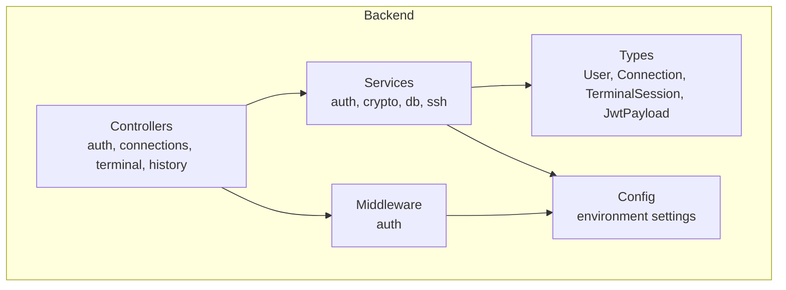
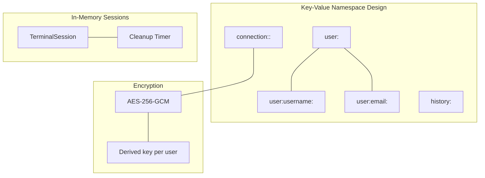
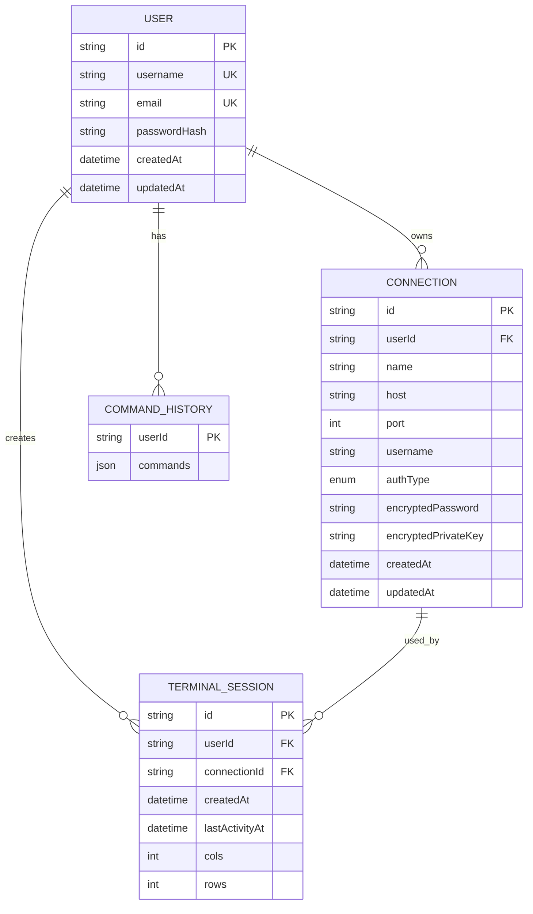
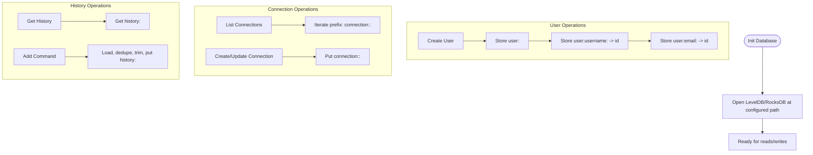
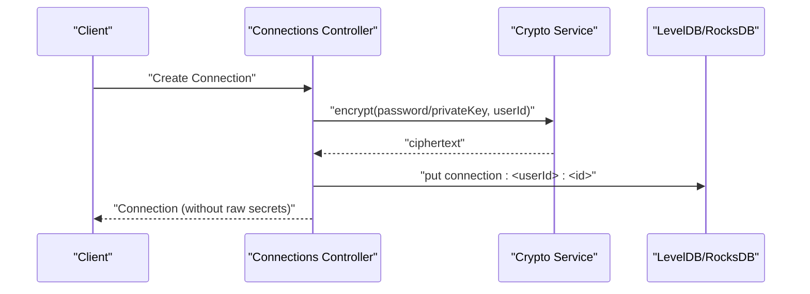
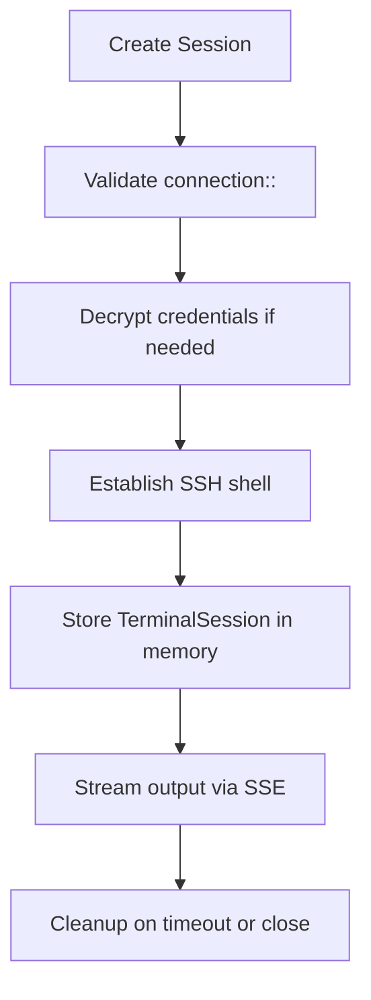
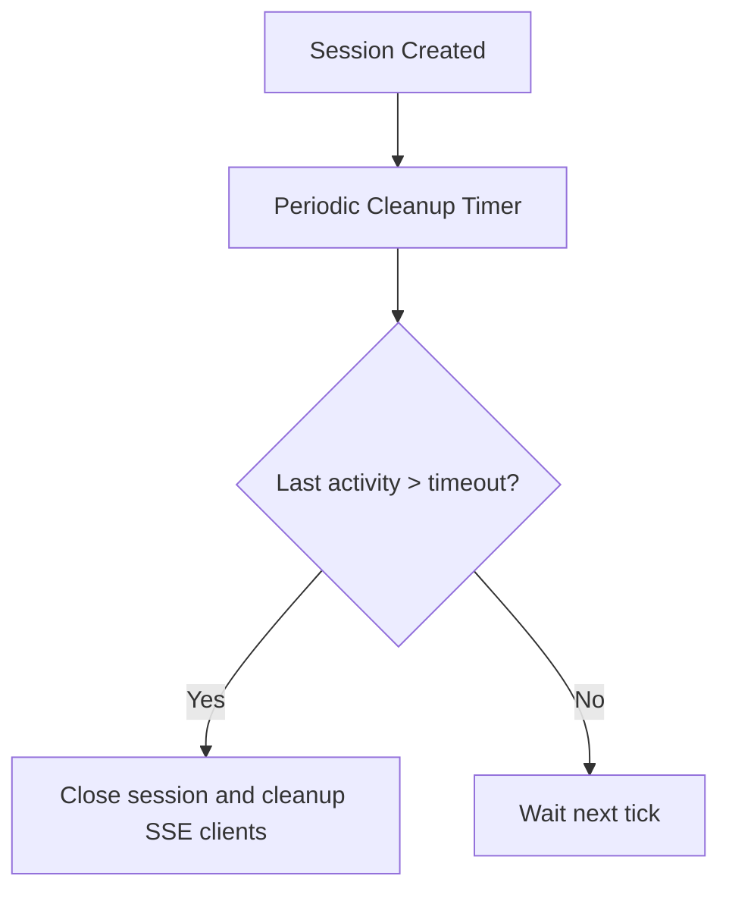
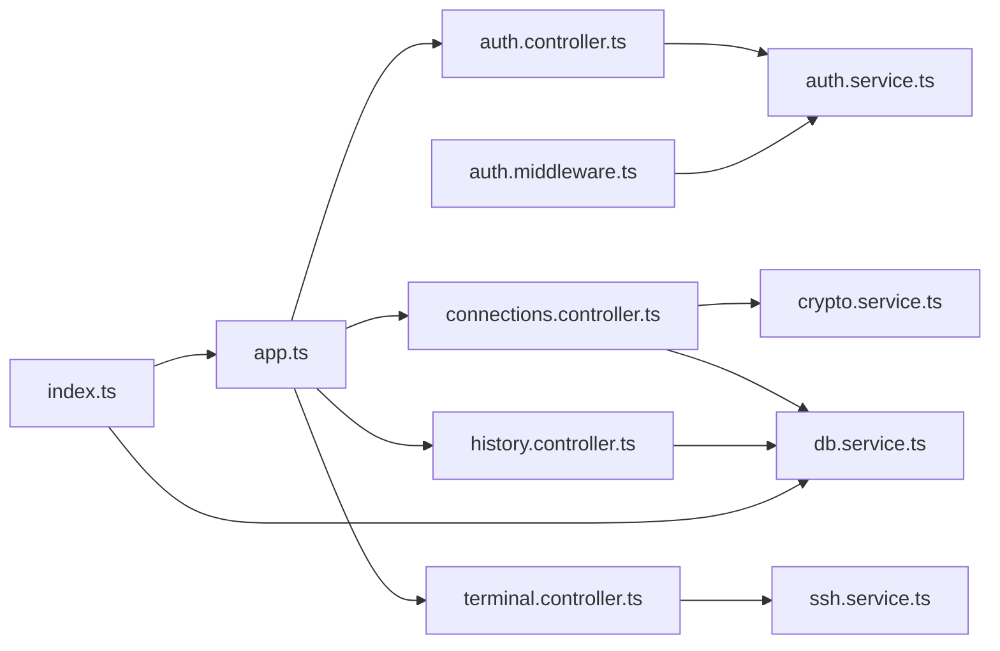

# Database Design

<cite>
**Referenced Files in This Document**
- [db.service.ts](file://backend/src/services/db.service.ts)
- [auth.service.ts](file://backend/src/services/auth.service.ts)
- [crypto.service.ts](file://backend/src/services/crypto.service.ts)
- [ssh.service.ts](file://backend/src/services/ssh.service.ts)
- [index.ts](file://backend/src/index.ts)
- [app.ts](file://backend/src/app.ts)
- [config/index.ts](file://backend/src/config/index.ts)
- [types/index.ts](file://backend/src/types/index.ts)
- [auth.controller.ts](file://backend/src/controllers/auth.controller.ts)
- [connections.controller.ts](file://backend/src/controllers/connections.controller.ts)
- [terminal.controller.ts](file://backend/src/controllers/terminal.controller.ts)
- [history.controller.ts](file://backend/src/controllers/history.controller.ts)
- [auth.middleware.ts](file://backend/src/middleware/auth.middleware.ts)
</cite>

## Table of Contents
1. [Introduction](#introduction)
2. [Project Structure](#project-structure)
3. [Core Components](#core-components)
4. [Architecture Overview](#architecture-overview)
5. [Detailed Component Analysis](#detailed-component-analysis)
6. [Dependency Analysis](#dependency-analysis)
7. [Performance Considerations](#performance-considerations)
8. [Troubleshooting Guide](#troubleshooting-guide)
9. [Conclusion](#conclusion)
10. [Appendices](#appendices)

## Introduction
This document describes the WebTerm database design built on LevelDB (configured to use RocksDB) as the persistent key-value store. It documents the entity relationships among Users, Connections, TerminalSessions, and CommandHistory, along with field definitions, encryption requirements, indexing strategies, access control, and operational patterns. It also covers data lifecycle management, security controls, and migration considerations.

## Project Structure
The backend uses a layered architecture:
- Controllers handle HTTP requests and delegate to services.
- Services encapsulate business logic and data access.
- Types define the data contracts for entities.
- Middleware enforces authentication and authorization.
- Configuration centralizes environment-dependent settings.

**Diagram sources**
- [app.ts:1-51](file://backend/src/app.ts#L1-L51)
- [auth.controller.ts:1-76](file://backend/src/controllers/auth.controller.ts#L1-L76)
- [connections.controller.ts:1-215](file://backend/src/controllers/connections.controller.ts#L1-L215)
- [terminal.controller.ts:1-157](file://backend/src/controllers/terminal.controller.ts#L1-L157)
- [history.controller.ts:1-62](file://backend/src/controllers/history.controller.ts#L1-L62)
- [auth.middleware.ts:1-33](file://backend/src/middleware/auth.middleware.ts#L1-L33)
- [types/index.ts:1-83](file://backend/src/types/index.ts#L1-L83)
- [config/index.ts:1-24](file://backend/src/config/index.ts#L1-L24)

**Section sources**
- [app.ts:1-51](file://backend/src/app.ts#L1-L51)
- [index.ts:1-41](file://backend/src/index.ts#L1-L41)
- [config/index.ts:1-24](file://backend/src/config/index.ts#L1-L24)

## Core Components
- LevelDB/RocksDB persistence layer with UTF-8 string encoding.
- User entity with indexed username/email for fast lookup.
- Connection entity with encrypted credentials per-user.
- TerminalSession entity stored in-memory with SSE streaming.
- CommandHistory entity persisted as a per-user list with deduplication and trimming.

**Section sources**
- [db.service.ts:1-49](file://backend/src/services/db.service.ts#L1-L49)
- [auth.service.ts:11-46](file://backend/src/services/auth.service.ts#L11-L46)
- [types/index.ts:4-82](file://backend/src/types/index.ts#L4-L82)
- [connections.controller.ts:53-90](file://backend/src/controllers/connections.controller.ts#L53-L90)
- [history.controller.ts:24-52](file://backend/src/controllers/history.controller.ts#L24-L52)
- [ssh.service.ts:9-248](file://backend/src/services/ssh.service.ts#L9-L248)

## Architecture Overview
The database design centers on a key-value store with explicit key namespaces to organize data by user and entity type. Encryption is applied to sensitive connection credentials. Sessions are managed in-memory with periodic cleanup, while persistent data is stored in LevelDB/RocksDB.

**Diagram sources**
- [auth.service.ts:37-42](file://backend/src/services/auth.service.ts#L37-L42)
- [connections.controller.ts:71-75](file://backend/src/controllers/connections.controller.ts#L71-L75)
- [crypto.service.ts:8-41](file://backend/src/services/crypto.service.ts#L8-L41)
- [ssh.service.ts:13-23](file://backend/src/services/ssh.service.ts#L13-L23)
- [types/index.ts:43-54](file://backend/src/types/index.ts#L43-L54)

## Detailed Component Analysis

### Entity Model and Relationships
The following entities are defined and persisted:

- User
  - Fields: id, username, email, passwordHash, createdAt, updatedAt
  - Indexes: user:username:<username> -> id, user:email:<email> -> id
- Connection
  - Fields: id, userId, name, host, port, username, authType, encryptedPassword?, encryptedPrivateKey?, createdAt, updatedAt
  - Encrypted fields: encryptedPassword, encryptedPrivateKey
- TerminalSession (in-memory)
  - Fields: id, userId, connectionId, sshClient, stream, sseClients, createdAt, lastActivityAt, cols, rows
- CommandHistory (per-user list)
  - Key: history:<userId>
  - Value: JSON-encoded array of strings (commands)

**Diagram sources**
- [types/index.ts:4-82](file://backend/src/types/index.ts#L4-L82)
- [auth.service.ts:37-42](file://backend/src/services/auth.service.ts#L37-L42)
- [connections.controller.ts:59-75](file://backend/src/controllers/connections.controller.ts#L59-L75)
- [ssh.service.ts:63-74](file://backend/src/services/ssh.service.ts#L63-L74)
- [history.controller.ts:15-42](file://backend/src/controllers/history.controller.ts#L15-L42)

**Section sources**
- [types/index.ts:4-82](file://backend/src/types/index.ts#L4-L82)
- [auth.service.ts:11-46](file://backend/src/services/auth.service.ts#L11-L46)
- [connections.controller.ts:53-139](file://backend/src/controllers/connections.controller.ts#L53-L139)
- [ssh.service.ts:33-166](file://backend/src/services/ssh.service.ts#L33-L166)
- [history.controller.ts:13-62](file://backend/src/controllers/history.controller.ts#L13-L62)

### Key-Value Storage Design and Indexing
- Users are stored under user:<id>, with secondary indexes user:username:<username> and user:email:<email>.
- Connections are stored under connection:<userId>:<id>, enabling efficient per-user enumeration via prefix scans.
- CommandHistory is stored under history:<userId> as a JSON-encoded array.
- The database uses UTF-8 string encoding and supports prefix-based iteration for connection listing.

**Diagram sources**
- [db.service.ts:7-49](file://backend/src/services/db.service.ts#L7-L49)
- [auth.service.ts:37-42](file://backend/src/services/auth.service.ts#L37-L42)
- [connections.controller.ts:21-35](file://backend/src/controllers/connections.controller.ts#L21-L35)
- [connections.controller.ts:77-77](file://backend/src/controllers/connections.controller.ts#L77-L77)
- [history.controller.ts:13-42](file://backend/src/controllers/history.controller.ts#L13-L42)

**Section sources**
- [db.service.ts:1-49](file://backend/src/services/db.service.ts#L1-L49)
- [auth.service.ts:11-46](file://backend/src/services/auth.service.ts#L11-L46)
- [connections.controller.ts:21-35](file://backend/src/controllers/connections.controller.ts#L21-L35)
- [history.controller.ts:13-42](file://backend/src/controllers/history.controller.ts#L13-L42)

### Encryption and Access Control
- Encryption: AES-256-GCM with random IV and auth tag. Keys are derived per user using HKDF-SHA256 with a master secret and user ID.
- Decryption: Used during SSH connection testing and session creation to obtain plaintext credentials.
- Access control: JWT bearer tokens validated by middleware; SSE endpoints accept tokens via query param; all endpoints enforce per-user isolation via keys.

**Diagram sources**
- [connections.controller.ts:53-90](file://backend/src/controllers/connections.controller.ts#L53-L90)
- [crypto.service.ts:12-22](file://backend/src/services/crypto.service.ts#L12-L22)
- [db.service.ts:31-33](file://backend/src/services/db.service.ts#L31-L33)

**Section sources**
- [crypto.service.ts:8-41](file://backend/src/services/crypto.service.ts#L8-L41)
- [connections.controller.ts:71-75](file://backend/src/controllers/connections.controller.ts#L71-L75)
- [auth.middleware.ts:10-32](file://backend/src/middleware/auth.middleware.ts#L10-L32)
- [terminal.controller.ts:45-81](file://backend/src/controllers/terminal.controller.ts#L45-L81)

### Data Access Patterns and Caching Strategies
- Persistent cache: None for LevelDB; rely on key prefixes and iterators for listing.
- In-memory cache: TerminalSession objects are held in memory with periodic cleanup based on inactivity.
- SSE streaming: Clients receive real-time updates; heartbeat pings maintain connection health.

**Diagram sources**
- [connections.controller.ts:22-34](file://backend/src/controllers/connections.controller.ts#L22-L34)
- [ssh.service.ts:33-166](file://backend/src/services/ssh.service.ts#L33-L166)
- [ssh.service.ts:13-23](file://backend/src/services/ssh.service.ts#L13-L23)

**Section sources**
- [ssh.service.ts:9-248](file://backend/src/services/ssh.service.ts#L9-L248)
- [terminal.controller.ts:45-81](file://backend/src/controllers/terminal.controller.ts#L45-L81)

### Data Lifecycle Management
- User data retention: No automatic deletion; users can delete connections and history via API.
- Session lifecycle: Automatic cleanup after inactivity timeout; enforced by a recurring timer.
- History pruning: Commands are deduplicated and trimmed to a fixed maximum length.

**Diagram sources**
- [ssh.service.ts:13-23](file://backend/src/services/ssh.service.ts#L13-L23)
- [ssh.service.ts:214-227](file://backend/src/services/ssh.service.ts#L214-L227)

**Section sources**
- [config/index.ts:15-17](file://backend/src/config/index.ts#L15-L17)
- [ssh.service.ts:13-23](file://backend/src/services/ssh.service.ts#L13-L23)
- [history.controller.ts:34-41](file://backend/src/controllers/history.controller.ts#L34-L41)

### Validation Rules and Field Definitions
- User registration: Username length and character set, email format, password length.
- Connection creation/update: Host/port validation, auth type selection, optional password/privateKey.
- Terminal session: ConnectionId UUID, input data base64, resize bounds.
- History: Command length limits, deduplication, trimming.

**Section sources**
- [auth.controller.ts:7-16](file://backend/src/controllers/auth.controller.ts#L7-L16)
- [connections.controller.ts:11-19](file://backend/src/controllers/connections.controller.ts#L11-L19)
- [terminal.controller.ts:9-20](file://backend/src/controllers/terminal.controller.ts#L9-L20)
- [history.controller.ts:9-11](file://backend/src/controllers/history.controller.ts#L9-L11)

## Dependency Analysis
The following diagram shows how components depend on each other and interact with the database.

**Diagram sources**
- [auth.controller.ts:1-76](file://backend/src/controllers/auth.controller.ts#L1-L76)
- [auth.service.ts:1-93](file://backend/src/services/auth.service.ts#L1-L93)
- [connections.controller.ts:1-215](file://backend/src/controllers/connections.controller.ts#L1-L215)
- [crypto.service.ts:1-42](file://backend/src/services/crypto.service.ts#L1-L42)
- [db.service.ts:1-49](file://backend/src/services/db.service.ts#L1-L49)
- [terminal.controller.ts:1-157](file://backend/src/controllers/terminal.controller.ts#L1-L157)
- [ssh.service.ts:1-248](file://backend/src/services/ssh.service.ts#L1-L248)
- [history.controller.ts:1-62](file://backend/src/controllers/history.controller.ts#L1-L62)
- [auth.middleware.ts:1-33](file://backend/src/middleware/auth.middleware.ts#L1-L33)
- [app.ts:1-51](file://backend/src/app.ts#L1-L51)
- [index.ts:1-41](file://backend/src/index.ts#L1-L41)

**Section sources**
- [app.ts:1-51](file://backend/src/app.ts#L1-L51)
- [index.ts:1-41](file://backend/src/index.ts#L1-L41)

## Performance Considerations
- Key design: Prefix-based keys enable efficient listing and scoping by user.
- Iteration: dbGetMany uses lexicographic range scanning to enumerate connections.
- Memory usage: TerminalSession objects are in-memory; ensure reasonable session limits and timeouts.
- Throughput: LevelDB/RocksDB provides good write performance for small values; keep values compact (JSON arrays for history).
- Network: SSE streaming bypasses compression and buffering pitfalls with padding and headers.

[No sources needed since this section provides general guidance]

## Troubleshooting Guide
- Authentication failures: Verify JWT secret and expiration; ensure token presence and validity.
- Connection not found: Confirm the connection key format and user ownership.
- Encryption errors: Validate ciphertext format and master secret correctness.
- Session cleanup: Check inactivity timeout and max sessions per user configuration.
- History issues: Validate command length and deduplication behavior.

**Section sources**
- [auth.controller.ts:39-59](file://backend/src/controllers/auth.controller.ts#L39-L59)
- [connections.controller.ts:37-51](file://backend/src/controllers/connections.controller.ts#L37-L51)
- [crypto.service.ts:24-41](file://backend/src/services/crypto.service.ts#L24-L41)
- [config/index.ts:15-17](file://backend/src/config/index.ts#L15-L17)
- [history.controller.ts:24-52](file://backend/src/controllers/history.controller.ts#L24-L52)

## Conclusion
WebTerm’s database design leverages a simple, robust key-value model with explicit namespaces and strong encryption for sensitive data. User-centric indexing and prefix-based iteration support efficient lookups. In-memory sessions with automated cleanup balance responsiveness with resource control. The design is straightforward to migrate and secure by construction.

[No sources needed since this section summarizes without analyzing specific files]

## Appendices

### Database Schema Summary
- Users: user:<id>, user:username:<username>, user:email:<email>
- Connections: connection:<userId>:<id>
- CommandHistory: history:<userId>

**Section sources**
- [auth.service.ts:37-42](file://backend/src/services/auth.service.ts#L37-L42)
- [connections.controller.ts:21-35](file://backend/src/controllers/connections.controller.ts#L21-L35)
- [history.controller.ts:15-42](file://backend/src/controllers/history.controller.ts#L15-L42)

### Migration and Versioning Strategy
- Current state: Single-table key-value schema with clear namespaces.
- Recommended approach: Introduce a version field in JSON values; on startup, scan and upgrade affected records; maintain backward compatibility during transitions.
- Rollback: Keep previous versions accessible until migration completes; monitor logs and metrics.

[No sources needed since this section provides general guidance]