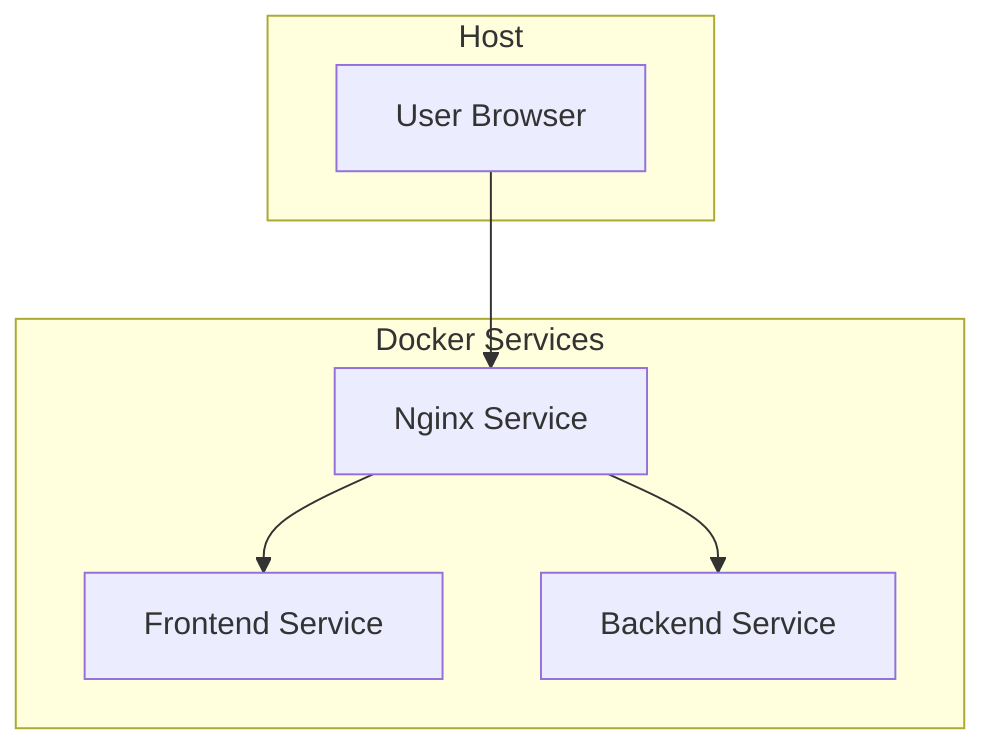
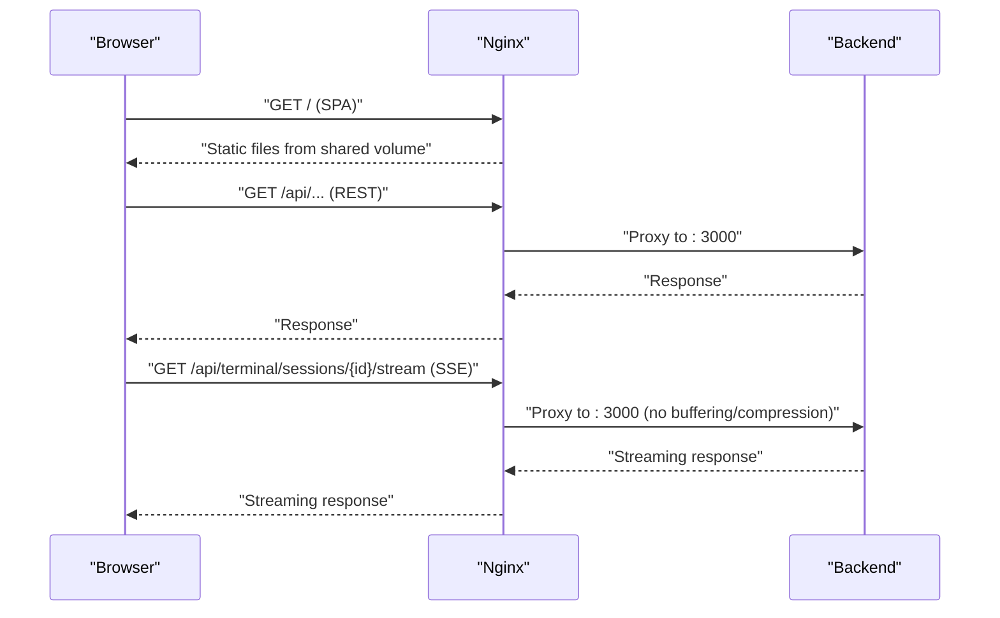
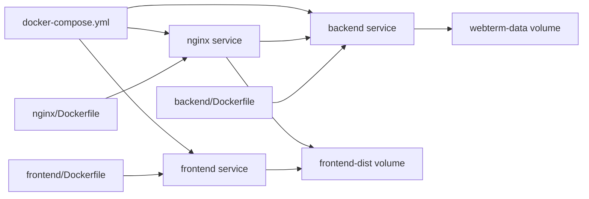

# Deployment and Infrastructure

<cite>
**Referenced Files in This Document**
- [docker-compose.yml](file://docker-compose.yml)
- [backend/Dockerfile](file://backend/Dockerfile)
- [frontend/Dockerfile](file://frontend/Dockerfile)
- [nginx/Dockerfile](file://nginx/Dockerfile)
- [nginx/nginx.conf](file://nginx/nginx.conf)
- [backend/src/config/index.ts](file://backend/src/config/index.ts)
- [backend/src/app.ts](file://backend/src/app.ts)
- [backend/src/index.ts](file://backend/src/index.ts)
- [backend/package.json](file://backend/package.json)
- [frontend/package.json](file://frontend/package.json)
- [frontend/vite.config.ts](file://frontend/vite.config.ts)
- [README.md](file://README.md)
</cite>

## Table of Contents
1. [Introduction](#introduction)
2. [Project Structure](#project-structure)
3. [Core Components](#core-components)
4. [Architecture Overview](#architecture-overview)
5. [Detailed Component Analysis](#detailed-component-analysis)
6. [Dependency Analysis](#dependency-analysis)
7. [Performance Considerations](#performance-considerations)
8. [Troubleshooting Guide](#troubleshooting-guide)
9. [Conclusion](#conclusion)
10. [Appendices](#appendices)

## Introduction
This document explains WebTerm’s containerized deployment architecture and operational practices. It covers the Docker Compose orchestration of frontend, backend, and Nginx services, multi-stage Docker builds for optimized images, Nginx reverse proxy configuration for static assets, API proxying, and SSE handling, environment variable management, health checks, and service dependencies. Practical deployment scenarios (development, staging, production), scaling and high availability considerations, monitoring and logging, backups and disaster recovery, troubleshooting, and maintenance procedures are included.

## Project Structure
WebTerm is organized into three primary services:
- Frontend: a Vue 3 application built with Vite and served statically by Nginx.
- Backend: an Express.js service exposing REST APIs and SSE endpoints for terminal streaming.
- Nginx: a reverse proxy and static file server that routes traffic to the backend and serves the frontend bundle.

**Diagram sources**
- [docker-compose.yml:1-49](file://docker-compose.yml#L1-L49)
- [nginx/nginx.conf:1-54](file://nginx/nginx.conf#L1-L54)

**Section sources**
- [README.md:139-184](file://README.md#L139-L184)
- [docker-compose.yml:1-49](file://docker-compose.yml#L1-L49)

## Core Components
- Docker Compose orchestrates three services: nginx, frontend, and backend. Volumes are used to decouple the frontend build output from the runtime containers.
- Frontend service performs a one-shot build and copies artifacts to a shared volume for Nginx to serve.
- Backend service exposes a health check endpoint and persists data to a named volume.
- Nginx service proxies static assets and API requests to the backend, with special handling for SSE streams.

Key orchestration elements:
- Shared volumes: frontend-dist for static assets, webterm-data for backend persistence.
- Health checks: backend service health probe configured to call the internal health endpoint.
- Dependencies: nginx depends on both frontend and backend; backend health is required before nginx starts.

**Section sources**
- [docker-compose.yml:1-49](file://docker-compose.yml#L1-L49)
- [backend/src/app.ts:35-38](file://backend/src/app.ts#L35-L38)

## Architecture Overview
The runtime flow:
- Nginx listens on port 80 inside the container and binds to host port 11112.
- Static assets are served from the shared frontend-dist volume.
- API requests under /api are proxied to the backend service.
- SSE endpoints for terminal streaming bypass standard compression and buffering for long-lived connections.

**Diagram sources**
- [nginx/nginx.conf:9-52](file://nginx/nginx.conf#L9-L52)
- [backend/src/app.ts:40-45](file://backend/src/app.ts#L40-L45)

**Section sources**
- [nginx/nginx.conf:1-54](file://nginx/nginx.conf#L1-L54)
- [backend/src/app.ts:14-48](file://backend/src/app.ts#L14-L48)

## Detailed Component Analysis

### Docker Compose Orchestration
- Services:
  - nginx: builds from ./nginx, publishes port 11112:80, mounts frontend-dist read-only, depends on frontend completion and backend health.
  - frontend: builds from ./frontend, writes built files to frontend-dist via entrypoint copy, exits after copying.
  - backend: builds from ./backend, sets environment variables, mounts webterm-data, defines health check against /api/health.
- Volumes:
  - webterm-data: local driver for RocksDB/LevelDB data persistence.
  - frontend-dist: local driver for static asset distribution.

Operational notes:
- The frontend service acts as a build-and-exit job to populate the shared volume for Nginx.
- Nginx waits for both frontend build success and backend health before becoming available.

**Section sources**
- [docker-compose.yml:1-49](file://docker-compose.yml#L1-L49)

### Frontend Multi-Stage Build
- Stage 1 (builder): installs dependencies and builds the application.
- Stage 2 (runtime): copies the production build into an Nginx base image and exposes port 80.
- The frontend service copies the built output into the shared volume for Nginx to serve.

Optimization highlights:
- Uses Alpine-based Node and Nginx images to reduce footprint.
- Installs only production dependencies in the backend stage.
- Copies only the built artifact into the Nginx runtime image.

**Section sources**
- [frontend/Dockerfile:1-13](file://frontend/Dockerfile#L1-L13)

### Backend Multi-Stage Build
- Stage 1 (builder): installs dependencies and compiles TypeScript to dist.
- Stage 2 (runtime): installs only production dependencies, copies dist, creates data directory, exposes port 3000, and starts the server.

Optimization highlights:
- Separates build and runtime layers to minimize final image size.
- Omits dev dependencies in the runtime stage.

**Section sources**
- [backend/Dockerfile:1-22](file://backend/Dockerfile#L1-L22)

### Nginx Reverse Proxy Configuration
- Static files: served from /usr/share/nginx/html with index fallback and selective gzip for CSS/JS/JSON.
- API proxy: forwards /api to backend:3000 with standard proxy headers and increased client body size for uploads.
- SSE handling: dedicated location block for /api/terminal/sessions/*/stream disables buffering, compression, caching, and sets long timeouts to support 24-hour streaming.

Security and compatibility:
- Global gzip disabled to prevent interference with SSE.
- Special-case handling avoids standard security headers for SSE endpoints to prevent header conflicts.

**Section sources**
- [nginx/nginx.conf:1-54](file://nginx/nginx.conf#L1-L54)

### Environment Variable Management
Backend reads configuration from environment variables:
- Security: MASTER_SECRET, JWT_SECRET, JWT_EXPIRES_IN.
- Operation: PORT, NODE_ENV.
- Persistence: ROCKSDB_PATH.
- Limits: MAX_SESSIONS_PER_USER, SESSION_TIMEOUT_MINUTES.
- CORS: CORS_ORIGIN.

Compose injects defaults and allows overrides via environment variables or a .env file. The application enforces sensible defaults for development while requiring secure values in production.

**Section sources**
- [backend/src/config/index.ts:3-21](file://backend/src/config/index.ts#L3-L21)
- [docker-compose.yml:24-33](file://docker-compose.yml#L24-L33)
- [README.md:186-199](file://README.md#L186-L199)

### Health Checks and Service Dependencies
- Backend exposes a health endpoint at /api/health.
- Compose healthcheck probes this endpoint with short intervals and retries.
- Nginx depends on:
  - frontend: condition service_completed_successfully (ensures static assets are present).
  - backend: condition service_healthy (waits for readiness).

Graceful shutdown:
- Backend listens for SIGTERM/SIGINT and closes the server and database cleanly before exiting.

**Section sources**
- [backend/src/app.ts:35-38](file://backend/src/app.ts#L35-L38)
- [docker-compose.yml:36-42](file://docker-compose.yml#L36-L42)
- [backend/src/index.ts:16-30](file://backend/src/index.ts#L16-L30)

### Development, Staging, and Production Scenarios
- Development:
  - Run docker compose up -d to start services.
  - Access the app at http://localhost:11112.
  - Frontend dev server proxy targets localhost:3000; use dockerized backend for SPA proxying.
- Staging:
  - Set production-safe environment variables (MASTER_SECRET, JWT_SECRET).
  - Persist backend data via webterm-data volume.
  - Configure CORS_ORIGIN appropriately for the staging domain.
- Production:
  - Bind Nginx to a public IP and expose port 80/443 externally.
  - Use external secrets management for sensitive environment variables.
  - Enable SSL/TLS termination in Nginx or place a TLS-capable load balancer in front of Nginx.

Note: The provided configuration does not include SSL/TLS termination. Add TLS certificates and configure Nginx to listen on 443 for production deployments.

**Section sources**
- [README.md:139-164](file://README.md#L139-L164)
- [docker-compose.yml:4-6](file://docker-compose.yml#L4-L6)
- [backend/src/config/index.ts:7-21](file://backend/src/config/index.ts#L7-L21)

### Scaling, Load Balancing, and High Availability
- Stateless backend:
  - The backend is designed to be stateless except for persisted data in webterm-data. Additional instances can be scaled horizontally behind a load balancer.
- SSE considerations:
  - SSE endpoints require sticky sessions to maintain long-lived connections. Use a load balancer that supports sticky sessions or route SSE traffic to a single instance until the client reconnects.
- Volume considerations:
  - webterm-data is a local driver volume. For multi-host deployments, replace with a network-backed storage solution (e.g., NFS, cloud block storage) or a clustered database to avoid single points of failure.
- Horizontal scaling steps:
  - Scale backend replicas behind Nginx.
  - Ensure sticky sessions for SSE endpoints.
  - Use a shared persistent storage or a database cluster for multi-instance deployments.

[No sources needed since this section provides general guidance]

### Monitoring and Logging
- Backend logging:
  - The backend uses Pino for structured logging. Ensure logs are captured by Docker’s logging driver or forwarded to a centralized logging system.
- Health monitoring:
  - Use the /api/health endpoint for liveness/readiness checks.
- Frontend monitoring:
  - Monitor Nginx access/error logs for static asset delivery and proxy errors.
- Recommendations:
  - Configure log aggregation (e.g., ELK stack or similar).
  - Set up alerting on backend error rates and Nginx 5xx responses.
  - Track SSE connection counts and timeouts.

**Section sources**
- [backend/package.json:20-22](file://backend/package.json#L20-L22)
- [backend/src/app.ts:35-38](file://backend/src/app.ts#L35-L38)

### Backup and Disaster Recovery
- Data backup:
  - Back up the webterm-data volume regularly. For production, use snapshots or replication of the underlying storage.
- Configuration backup:
  - Preserve environment variables and compose files.
- Recovery procedure:
  - Restore volume data to the same path.
  - Recreate containers with the same compose configuration.
  - Verify health and connectivity post-recovery.

[No sources needed since this section provides general guidance]

### Maintenance Procedures
- Updates:
  - Rebuild images after code changes and redeploy with docker compose up -d.
  - For zero-downtime updates, scale out new instances, drain old ones, and swap traffic.
- Security patches:
  - Regularly update base images (Alpine Linux, Node, Nginx) and dependencies.
  - Rotate MASTER_SECRET and JWT_SECRET periodically.
- Performance optimization:
  - Tune Nginx worker/processes and keepalive timeouts.
  - Optimize backend concurrency and database connection pooling.
  - Monitor memory and CPU usage; adjust resource limits accordingly.

[No sources needed since this section provides general guidance]

## Dependency Analysis
The following diagram shows the relationships among services and configuration:

**Diagram sources**
- [docker-compose.yml:1-49](file://docker-compose.yml#L1-L49)
- [frontend/Dockerfile:1-13](file://frontend/Dockerfile#L1-L13)
- [backend/Dockerfile:1-22](file://backend/Dockerfile#L1-L22)
- [nginx/Dockerfile:1-3](file://nginx/Dockerfile#L1-L3)

**Section sources**
- [docker-compose.yml:1-49](file://docker-compose.yml#L1-L49)

## Performance Considerations
- Image size and startup time:
  - Multi-stage builds reduce final image sizes and speed up cold starts.
- Static asset delivery:
  - Nginx serves frontend assets efficiently; enable appropriate caching headers if desired.
- API throughput:
  - Keep backend instances stateless and scale horizontally; ensure sticky sessions for SSE.
- SSE streaming:
  - Nginx disables buffering and compression for SSE endpoints to maintain low latency and reliability.

[No sources needed since this section provides general guidance]

## Troubleshooting Guide
Common issues and resolutions:
- Frontend not loading:
  - Verify frontend service completed successfully and populated frontend-dist.
  - Confirm Nginx is mounting frontend-dist read-only and serving from /usr/share/nginx/html.
- API errors:
  - Check backend health endpoint and logs; ensure backend is healthy before nginx becomes reachable.
  - Validate CORS_ORIGIN setting for cross-origin requests.
- SSE not working:
  - Ensure requests go to /api/terminal/sessions/*/stream and that Nginx is configured for the dedicated SSE location block.
  - Confirm long timeouts and disabled buffering/compression for SSE.
- Port conflicts:
  - Change host port binding in docker-compose if 11112 is unavailable.
- Environment variables:
  - Ensure MASTER_SECRET and JWT_SECRET are set to strong values; otherwise, defaults may cause security warnings.

**Section sources**
- [docker-compose.yml:8-12](file://docker-compose.yml#L8-L12)
- [nginx/nginx.conf:18-39](file://nginx/nginx.conf#L18-L39)
- [backend/src/app.ts:24-29](file://backend/src/app.ts#L24-L29)

## Conclusion
WebTerm’s deployment model leverages Docker Compose and multi-stage builds to deliver a compact, efficient stack. Nginx centralizes static file serving and API proxying, with specialized handling for SSE streaming. Robust environment management, health checks, and service dependencies ensure reliable operation. Apply the recommended scaling, monitoring, backup, and maintenance practices to achieve resilient and high-performing deployments across development, staging, and production environments.

[No sources needed since this section summarizes without analyzing specific files]

## Appendices

### Environment Variables Reference
- MASTER_SECRET: Encryption master key for sensitive data.
- JWT_SECRET: Signing key for JWT tokens.
- JWT_EXPIRES_IN: Token validity period.
- MAX_SESSIONS_PER_USER: Concurrency limit per user.
- SESSION_TIMEOUT_MINUTES: Inactivity timeout for sessions.
- CORS_ORIGIN: Allowed origins for cross-origin requests.
- PORT: Backend listening port.
- NODE_ENV: Runtime environment.
- ROCKSDB_PATH: Database storage path.

**Section sources**
- [backend/src/config/index.ts:3-21](file://backend/src/config/index.ts#L3-L21)
- [docker-compose.yml:24-33](file://docker-compose.yml#L24-L33)
- [README.md:186-199](file://README.md#L186-L199)

### Development Workflow Notes
- Frontend development server runs at http://localhost:5173 and proxies /api to backend at http://localhost:3000.
- Use docker compose for production-like testing.

**Section sources**
- [README.md:166-184](file://README.md#L166-L184)
- [frontend/vite.config.ts:12-20](file://frontend/vite.config.ts#L12-L20)