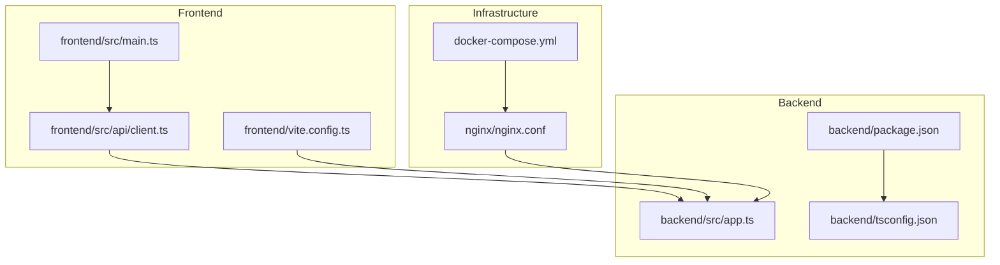
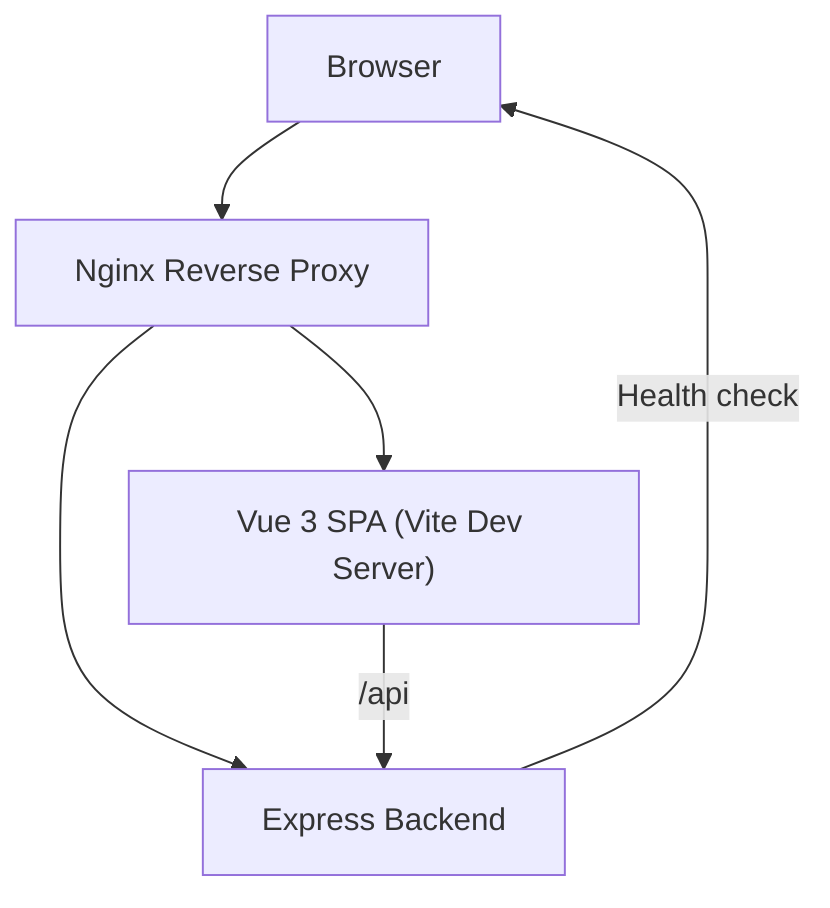
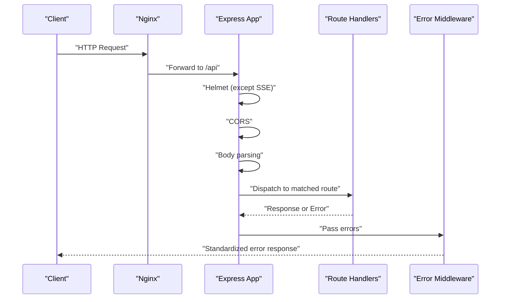
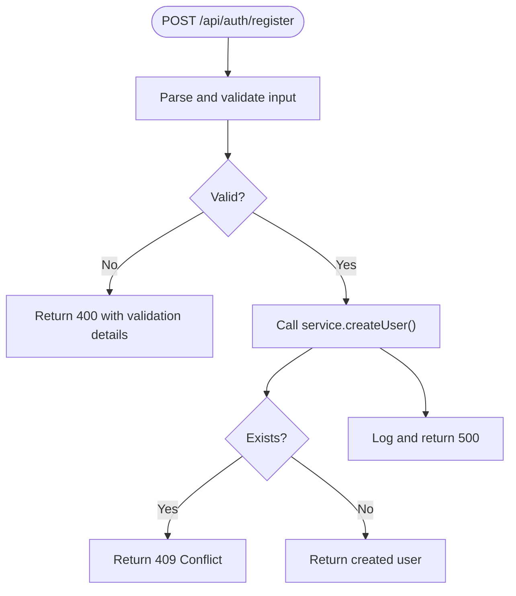
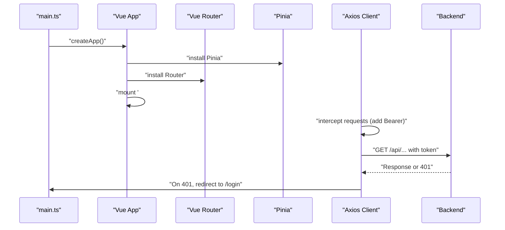

# Development Guidelines

<cite>
**Referenced Files in This Document**
- [README.md](file://README.md)
- [backend/package.json](file://backend/package.json)
- [backend/tsconfig.json](file://backend/tsconfig.json)
- [backend/src/app.ts](file://backend/src/app.ts)
- [backend/src/controllers/auth.controller.ts](file://backend/src/controllers/auth.controller.ts)
- [frontend/package.json](file://frontend/package.json)
- [frontend/tsconfig.json](file://frontend/tsconfig.json)
- [frontend/tsconfig.node.json](file://frontend/tsconfig.node.json)
- [frontend/vite.config.ts](file://frontend/vite.config.ts)
- [frontend/src/main.ts](file://frontend/src/main.ts)
- [frontend/src/api/client.ts](file://frontend/src/api/client.ts)
</cite>

## Table of Contents
1. [Introduction](#introduction)
2. [Project Structure](#project-structure)
3. [Core Components](#core-components)
4. [Architecture Overview](#architecture-overview)
5. [Detailed Component Analysis](#detailed-component-analysis)
6. [Dependency Analysis](#dependency-analysis)
7. [Performance Considerations](#performance-considerations)
8. [Troubleshooting Guide](#troubleshooting-guide)
9. [Contribution Guidelines](#contribution-guidelines)
10. [Testing Strategy](#testing-strategy)
11. [Development Workflow](#development-workflow)
12. [Debugging Procedures](#debugging-procedures)
13. [Extensibility and Backward Compatibility](#extensibility-and-backward-compatibility)
14. [Security and Continuous Integration](#security-and-continuous-integration)
15. [Conclusion](#conclusion)

## Introduction
This document defines development guidelines for the WebTerm project to ensure consistent code quality, predictable builds, and reliable collaboration across the backend and frontend. It consolidates TypeScript configurations, linting and formatting expectations, testing strategies, debugging procedures, contribution practices, and operational guidance grounded in the repository’s current setup.

## Project Structure
The project is organized into three primary areas:
- Backend: Express-based service with TypeScript, routing, middleware, and domain services.
- Frontend: Vue 3 single-page application with TypeScript, Pinia stores, Vue Router, and Vite-based build pipeline.
- Infrastructure: Nginx reverse proxy and Docker Compose orchestration.

**Diagram sources**
- [frontend/src/main.ts:1-11](file://frontend/src/main.ts#L1-L11)
- [frontend/src/api/client.ts:1-33](file://frontend/src/api/client.ts#L1-L33)
- [frontend/vite.config.ts:1-22](file://frontend/vite.config.ts#L1-L22)
- [backend/src/app.ts:1-51](file://backend/src/app.ts#L1-L51)
- [backend/package.json:1-39](file://backend/package.json#L1-L39)
- [backend/tsconfig.json:1-20](file://backend/tsconfig.json#L1-L20)

**Section sources**
- [README.md:91-137](file://README.md#L91-L137)

## Core Components
- Backend
  - Express application bootstrapped with security headers, CORS, body parsing, health endpoint, routes, and centralized error handling.
  - TypeScript strictness enabled with ES2022 target and CommonJS module output.
- Frontend
  - Vue 3 application initialized with Pinia and Router, configured with Vite, TypeScript strictness, bundler module resolution, and path aliases.
  - Axios client configured with base URL, interceptors for auth token injection and 401 handling, and a 30s timeout.

Key configuration highlights:
- Backend TypeScript compiler options emphasize strictness, declaration maps, and source maps.
- Frontend TypeScript compiler options enforce strictness, bundler module resolution, DOM libraries, and path aliases.
- Vite dev server proxies API requests to the backend for seamless local development.

**Section sources**
- [backend/src/app.ts:1-51](file://backend/src/app.ts#L1-L51)
- [backend/tsconfig.json:1-20](file://backend/tsconfig.json#L1-L20)
- [frontend/tsconfig.json:1-25](file://frontend/tsconfig.json#L1-L25)
- [frontend/tsconfig.node.json:1-24](file://frontend/tsconfig.node.json#L1-L24)
- [frontend/vite.config.ts:1-22](file://frontend/vite.config.ts#L1-L22)
- [frontend/src/api/client.ts:1-33](file://frontend/src/api/client.ts#L1-L33)

## Architecture Overview
The runtime architecture integrates a Vue 3 SPA served by Nginx, which proxies static assets and API requests to the backend. SSE endpoints are handled directly by the backend to avoid header conflicts with Helmet.

**Diagram sources**
- [README.md:200-223](file://README.md#L200-L223)
- [frontend/vite.config.ts:12-20](file://frontend/vite.config.ts#L12-L20)
- [backend/src/app.ts:35-38](file://backend/src/app.ts#L35-L38)

## Detailed Component Analysis

### Backend Application Bootstrapping
The backend initializes middleware and routes, applies Helmet except for SSE endpoints, configures CORS, parses JSON bodies, exposes a health endpoint, mounts route groups, and registers a centralized error handler.

**Diagram sources**
- [backend/src/app.ts:14-48](file://backend/src/app.ts#L14-L48)

**Section sources**
- [backend/src/app.ts:1-51](file://backend/src/app.ts#L1-L51)

### Authentication Controller and Validation
The authentication controller enforces Zod-based input validation, delegates to services for user creation and authentication, and returns structured responses with appropriate HTTP status codes. Errors are categorized into validation, conflict, unauthorized, and internal server errors.

**Diagram sources**
- [backend/src/controllers/auth.controller.ts:18-37](file://backend/src/controllers/auth.controller.ts#L18-L37)

**Section sources**
- [backend/src/controllers/auth.controller.ts:1-76](file://backend/src/controllers/auth.controller.ts#L1-L76)

### Frontend Initialization and API Client
The frontend creates the Vue app, installs Pinia and Router, and mounts the root component. The Axios client sets a base URL, injects Authorization headers from localStorage, and redirects to the login page on 401 responses.

**Diagram sources**
- [frontend/src/main.ts:1-11](file://frontend/src/main.ts#L1-L11)
- [frontend/src/api/client.ts:11-30](file://frontend/src/api/client.ts#L11-L30)

**Section sources**
- [frontend/src/main.ts:1-11](file://frontend/src/main.ts#L1-L11)
- [frontend/src/api/client.ts:1-33](file://frontend/src/api/client.ts#L1-L33)

## Dependency Analysis
- Backend
  - Dependencies include Express, Helmet, CORS, bcrypt, JWT, ssh2, LevelDB, UUID, Multer, Pino, and Zod.
  - Dev dependencies include TypeScript, TSX, and @types packages.
- Frontend
  - Dependencies include Vue 3, Vue Router, Pinia, XTerm, CodeMirror 6, Axios, and Prettier.
  - Dev dependencies include Vite, TypeScript, Vue TS compiler, and @vitejs/plugin-vue.

Build and tooling scripts:
- Backend: dev, build, start, lint.
- Frontend: dev, build, preview.

**Section sources**
- [backend/package.json:12-37](file://backend/package.json#L12-L37)
- [frontend/package.json:10-43](file://frontend/package.json#L10-L43)

## Performance Considerations
- Backend
  - Strict TypeScript configuration improves type safety and reduces runtime errors.
  - Helmet and CORS middleware help secure and optimize cross-origin behavior.
  - SSE endpoints bypass Helmet to prevent header conflicts and maintain streaming reliability.
- Frontend
  - Vite provides fast development builds and optimized production bundles.
  - Bundler module resolution and path aliases improve build performance and developer ergonomics.

[No sources needed since this section provides general guidance]

## Troubleshooting Guide
- Backend
  - Verify health endpoint availability at the configured port.
  - Confirm CORS origin settings align with the frontend origin during development.
  - Review logs emitted by the logging service for error traces.
- Frontend
  - Check Vite dev server logs for build errors and proxy misconfiguration.
  - Inspect browser network panel for failed API requests and missing Authorization headers.
  - Validate that the Axios interceptor is attaching tokens and handling 401 responses.

**Section sources**
- [backend/src/app.ts:35-38](file://backend/src/app.ts#L35-L38)
- [frontend/vite.config.ts:12-20](file://frontend/vite.config.ts#L12-L20)
- [frontend/src/api/client.ts:20-30](file://frontend/src/api/client.ts#L20-L30)

## Contribution Guidelines
- Issue Reporting
  - Provide clear steps to reproduce, expected vs. actual behavior, and environment details.
- Feature Requests
  - Describe the problem being solved, proposed solution, and acceptance criteria.
- Community Collaboration
  - Keep discussions respectful and focused on technical outcomes.
- Branching and Pull Requests
  - Use descriptive branch names and reference related issues in PR descriptions.
  - Include screenshots or short videos for UI-related changes.
- Code Review
  - Focus on correctness, readability, test coverage, and adherence to style and architecture.

[No sources needed since this section doesn't analyze specific files]

## Testing Strategy
- Backend
  - Unit tests: Validate controllers, services, and middleware in isolation using mocks for external dependencies (e.g., database, SSH).
  - Integration tests: Exercise route handlers against a test database and mocked SSH/SFTP backends.
  - Mock strategies: Use library-level mocking for ssh2 and LevelDB to simulate connection failures, timeouts, and permission errors.
- Frontend
  - Unit tests: Test composables, stores, and utility functions with in-memory mocks.
  - Integration tests: E2E tests using a headless browser to validate user flows (login, terminal session, SFTP operations).
  - Mock strategies: Stub Axios adapter for API endpoints and simulate SSE streams for terminal output.

[No sources needed since this section provides general guidance]

## Development Workflow
- Local Setup
  - Backend: Install dependencies and run the dev script; API listens on the configured port.
  - Frontend: Install dependencies and run the dev script; dev server listens on the configured port and proxies API requests to the backend.
- Branch Management
  - Create feature branches prefixed with feature/, fix/, or chore/.
  - Rebase or merge main before opening PRs to reduce conflicts.
- Pull Requests
  - Include a summary, links to related issues, and testing notes.
  - Ensure CI passes and address reviewer feedback promptly.

**Section sources**
- [README.md:166-184](file://README.md#L166-L184)
- [frontend/vite.config.ts:12-20](file://frontend/vite.config.ts#L12-L20)

## Debugging Procedures
- Backend
  - Use Node.js built-in inspector or TSX watch mode for iterative development.
  - Enable verbose logging and inspect error middleware outputs.
- Frontend
  - Use browser developer tools to inspect network requests, console logs, and Vuex/Pinia state.
  - Temporarily disable interceptors to isolate request/response issues.

[No sources needed since this section provides general guidance]

## Extensibility and Backward Compatibility
- Extending Functionality
  - Add new routes under the existing routes directory and mount them in the Express app.
  - Introduce new services and keep controllers thin; delegate business logic to services.
  - For frontend, add new views/components, update router, and integrate with Pinia stores.
- Maintaining Backward Compatibility
  - Avoid breaking changes to public APIs; introduce new endpoints or deprecate old ones with migration guidance.
  - Version APIs and document changes in release notes.

[No sources needed since this section provides general guidance]

## Security and Continuous Integration
- Security Scanning
  - Regularly audit dependencies for vulnerabilities using your package manager’s audit tool.
  - Enforce secrets management (e.g., MASTER_SECRET, JWT_SECRET) via environment variables.
- Continuous Integration
  - Configure CI to run linters, type checks, unit tests, and integration tests on pull requests.
  - Gate deployments behind successful CI jobs and security scans.

[No sources needed since this section provides general guidance]

## Conclusion
These guidelines consolidate the current project setup and recommended practices to maintain high-quality, secure, and maintainable code across the WebTerm backend and frontend. By adhering to the TypeScript configurations, linting and formatting standards, testing strategies, and development workflows outlined here, contributors can collaborate effectively and deliver reliable features.