# API Integration Layer and Composables

<cite>
**Referenced Files in This Document**
- [client.ts](file://frontend/src/api/client.ts)
- [auth.api.ts](file://frontend/src/api/auth.api.ts)
- [connections.api.ts](file://frontend/src/api/connections.api.ts)
- [terminal.api.ts](file://frontend/src/api/terminal.api.ts)
- [sftp.api.ts](file://frontend/src/api/sftp.api.ts)
- [history.api.ts](file://frontend/src/api/history.api.ts)
- [useTerminal.ts](file://frontend/src/composables/useTerminal.ts)
- [useSftp.ts](file://frontend/src/composables/useSftp.ts)
- [useSSE.ts](file://frontend/src/composables/useSSE.ts)
- [useFileEditor.ts](file://frontend/src/composables/useFileEditor.ts)
- [auth.store.ts](file://frontend/src/stores/auth.store.ts)
- [connections.store.ts](file://frontend/src/stores/connections.store.ts)
- [workspace.store.ts](file://frontend/src/stores/workspace.store.ts)
- [index.ts](file://frontend/src/types/index.ts)
- [main.ts](file://frontend/src/main.ts)
- [index.ts](file://frontend/src/router/index.ts)
</cite>

## Table of Contents
1. [Introduction](#introduction)
2. [Project Structure](#project-structure)
3. [Core Components](#core-components)
4. [Architecture Overview](#architecture-overview)
5. [Detailed Component Analysis](#detailed-component-analysis)
6. [Dependency Analysis](#dependency-analysis)
7. [Performance Considerations](#performance-considerations)
8. [Troubleshooting Guide](#troubleshooting-guide)
9. [Conclusion](#conclusion)
10. [Appendices](#appendices)

## Introduction
This document describes the API integration layer and composables that power frontend-backend communication in the application. It focuses on the centralized HTTP client configuration, request/response interceptors, and error handling strategies. It explains each API module (authentication, connections, terminal, SFTP, and history), the composable patterns used for loading/error states and data transformation, and how these integrate with Pinia stores for state synchronization. It also covers authentication token management, automatic retry mechanisms via Server-Sent Events, offline handling strategies, CORS coordination through a reverse proxy, and concurrent request management. Finally, it outlines the relationship between composables and underlying API modules, including dependency injection patterns and the benefits of a modular architecture.

## Project Structure
The frontend API integration layer is organized around a small set of cohesive modules:
- Centralized HTTP client with interceptors
- Feature-specific API modules for each domain
- Composables that orchestrate UI logic, loading states, and error propagation
- Pinia stores for cross-cutting state and persistence
- Router guards for navigation and authentication

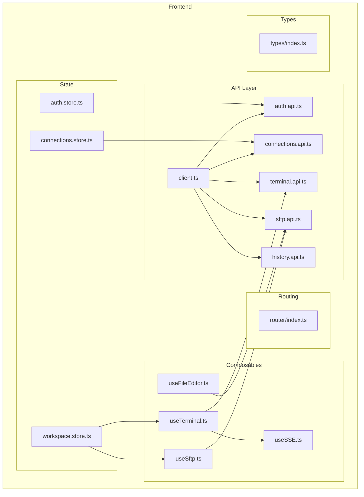

**Diagram sources**
- [client.ts:1-33](file://frontend/src/api/client.ts#L1-L33)
- [auth.api.ts:1-25](file://frontend/src/api/auth.api.ts#L1-L25)
- [connections.api.ts:1-34](file://frontend/src/api/connections.api.ts#L1-L34)
- [terminal.api.ts:1-26](file://frontend/src/api/terminal.api.ts#L1-L26)
- [sftp.api.ts:1-66](file://frontend/src/api/sftp.api.ts#L1-L66)
- [history.api.ts:1-15](file://frontend/src/api/history.api.ts#L1-L15)
- [useTerminal.ts:1-237](file://frontend/src/composables/useTerminal.ts#L1-L237)
- [useSftp.ts:1-154](file://frontend/src/composables/useSftp.ts#L1-L154)
- [useSSE.ts:1-84](file://frontend/src/composables/useSSE.ts#L1-L84)
- [useFileEditor.ts:1-187](file://frontend/src/composables/useFileEditor.ts#L1-L187)
- [auth.store.ts:1-54](file://frontend/src/stores/auth.store.ts#L1-L54)
- [connections.store.ts:1-43](file://frontend/src/stores/connections.store.ts#L1-L43)
- [workspace.store.ts:1-83](file://frontend/src/stores/workspace.store.ts#L1-L83)
- [index.ts:1-44](file://frontend/src/router/index.ts#L1-L44)
- [index.ts:1-56](file://frontend/src/types/index.ts#L1-L56)

**Section sources**
- [main.ts:1-11](file://frontend/src/main.ts#L1-L11)
- [index.ts:1-44](file://frontend/src/router/index.ts#L1-L44)

## Core Components
- Centralized HTTP client: Provides baseURL, timeouts, shared headers, and global interceptors for authentication and unauthorized handling.
- Domain API modules: Encapsulate endpoint-specific logic for authentication, connections, terminal sessions, SFTP operations, and history.
- Composables: Orchestrate UI behavior, manage loading/error states, transform data, and coordinate with SSE and API modules.
- Pinia stores: Manage cross-cutting concerns like authentication state, connection lists, and workspace tabs.
- Router guards: Enforce authentication and navigation policies.

**Section sources**
- [client.ts:1-33](file://frontend/src/api/client.ts#L1-L33)
- [auth.api.ts:1-25](file://frontend/src/api/auth.api.ts#L1-L25)
- [connections.api.ts:1-34](file://frontend/src/api/connections.api.ts#L1-L34)
- [terminal.api.ts:1-26](file://frontend/src/api/terminal.api.ts#L1-L26)
- [sftp.api.ts:1-66](file://frontend/src/api/sftp.api.ts#L1-L66)
- [history.api.ts:1-15](file://frontend/src/api/history.api.ts#L1-L15)
- [useTerminal.ts:1-237](file://frontend/src/composables/useTerminal.ts#L1-L237)
- [useSftp.ts:1-154](file://frontend/src/composables/useSftp.ts#L1-L154)
- [useSSE.ts:1-84](file://frontend/src/composables/useSSE.ts#L1-L84)
- [useFileEditor.ts:1-187](file://frontend/src/composables/useFileEditor.ts#L1-L187)
- [auth.store.ts:1-54](file://frontend/src/stores/auth.store.ts#L1-L54)
- [connections.store.ts:1-43](file://frontend/src/stores/connections.store.ts#L1-L43)
- [workspace.store.ts:1-83](file://frontend/src/stores/workspace.store.ts#L1-L83)

## Architecture Overview
The integration layer follows a clean separation of concerns:
- HTTP client centralizes transport configuration and auth.
- API modules encapsulate domain endpoints and return typed data.
- Composables coordinate UI logic, SSE streams, and loading states.
- Stores manage persistent state and cross-component sharing.
- Router enforces auth policies and redirects.

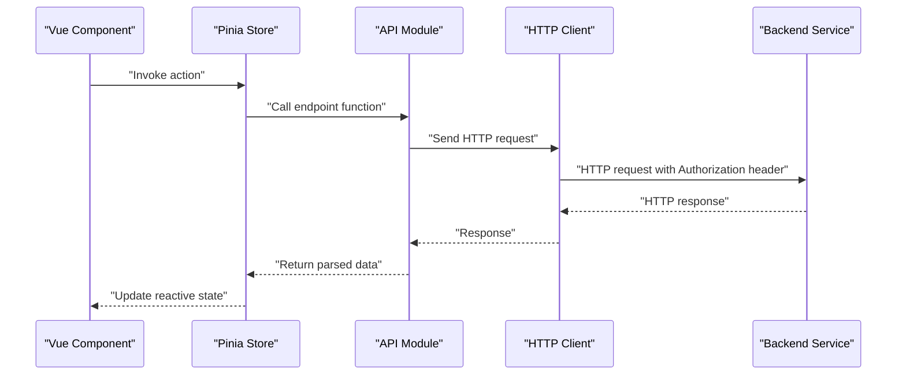

**Diagram sources**
- [client.ts:1-33](file://frontend/src/api/client.ts#L1-L33)
- [auth.api.ts:1-25](file://frontend/src/api/auth.api.ts#L1-L25)
- [connections.api.ts:1-34](file://frontend/src/api/connections.api.ts#L1-L34)
- [terminal.api.ts:1-26](file://frontend/src/api/terminal.api.ts#L1-L26)
- [sftp.api.ts:1-66](file://frontend/src/api/sftp.api.ts#L1-L66)
- [history.api.ts:1-15](file://frontend/src/api/history.api.ts#L1-L15)
- [auth.store.ts:1-54](file://frontend/src/stores/auth.store.ts#L1-L54)
- [connections.store.ts:1-43](file://frontend/src/stores/connections.store.ts#L1-L43)
- [workspace.store.ts:1-83](file://frontend/src/stores/workspace.store.ts#L1-L83)

## Detailed Component Analysis

### Centralized HTTP Client
- Base URL: "/api" proxies to backend via Nginx.
- Timeout: 30 seconds for long-running operations.
- Headers: JSON content type by default.
- Request interceptor: Adds Authorization header from localStorage when present.
- Response interceptor: On 401, clears token and navigates to login.

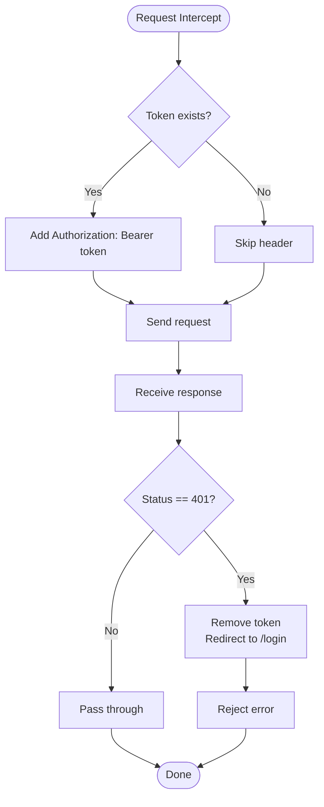

**Diagram sources**
- [client.ts:11-30](file://frontend/src/api/client.ts#L11-L30)

**Section sources**
- [client.ts:1-33](file://frontend/src/api/client.ts#L1-L33)

### Authentication API Module (auth.api)
- Endpoints: register, login, getMe.
- Returns typed payloads for user and token.
- Integrates with Pinia store for token persistence and user hydration.

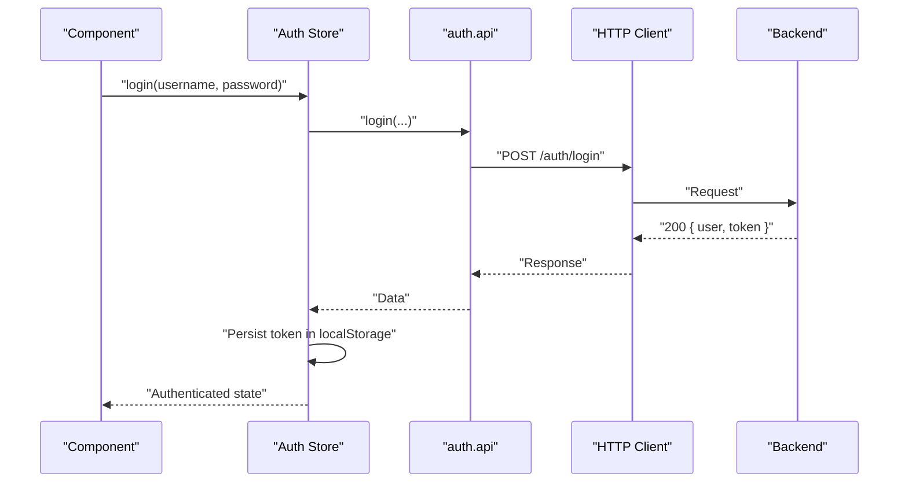

**Diagram sources**
- [auth.api.ts:13-18](file://frontend/src/api/auth.api.ts#L13-L18)
- [client.ts:11-18](file://frontend/src/api/client.ts#L11-L18)
- [auth.store.ts:14-24](file://frontend/src/stores/auth.store.ts#L14-L24)

**Section sources**
- [auth.api.ts:1-25](file://frontend/src/api/auth.api.ts#L1-L25)
- [auth.store.ts:1-54](file://frontend/src/stores/auth.store.ts#L1-L54)

### Connections API Module (connections.api)
- Endpoints: list, get, create, update, delete, test.
- Returns typed connection objects and test results.

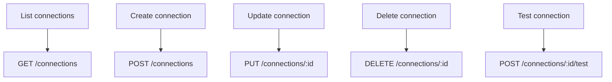

**Diagram sources**
- [connections.api.ts:4-33](file://frontend/src/api/connections.api.ts#L4-L33)

**Section sources**
- [connections.api.ts:1-34](file://frontend/src/api/connections.api.ts#L1-L34)
- [connections.store.ts:1-43](file://frontend/src/stores/connections.store.ts#L1-L43)

### Terminal API Module (terminal.api)
- Endpoints: create session, send input, resize, close, list sessions.
- Used by terminal composable to drive interactive shells.

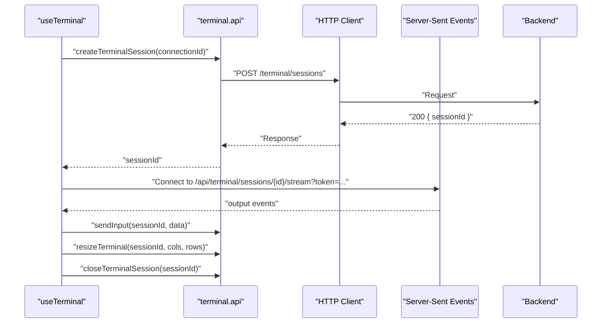

**Diagram sources**
- [terminal.api.ts:3-20](file://frontend/src/api/terminal.api.ts#L3-L20)
- [useTerminal.ts:142-174](file://frontend/src/composables/useTerminal.ts#L142-L174)
- [useSSE.ts:11-50](file://frontend/src/composables/useSSE.ts#L11-L50)

**Section sources**
- [terminal.api.ts:1-26](file://frontend/src/api/terminal.api.ts#L1-L26)
- [useTerminal.ts:1-237](file://frontend/src/composables/useTerminal.ts#L1-L237)
- [useSSE.ts:1-84](file://frontend/src/composables/useSSE.ts#L1-L84)

### SFTP API Module (sftp.api)
- Endpoints: create session, list directory, download, upload, delete, mkdir, rename, close, read/write content.
- Handles binary downloads and multipart uploads.

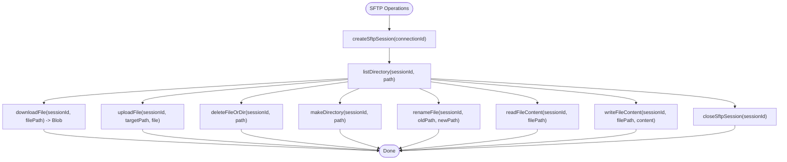

**Diagram sources**
- [sftp.api.ts:4-65](file://frontend/src/api/sftp.api.ts#L4-L65)

**Section sources**
- [sftp.api.ts:1-66](file://frontend/src/api/sftp.api.ts#L1-L66)
- [useSftp.ts:1-154](file://frontend/src/composables/useSftp.ts#L1-L154)
- [useFileEditor.ts:29-84](file://frontend/src/composables/useFileEditor.ts#L29-L84)

### History API Module (history.api)
- Endpoints: get command history, save command, clear history.

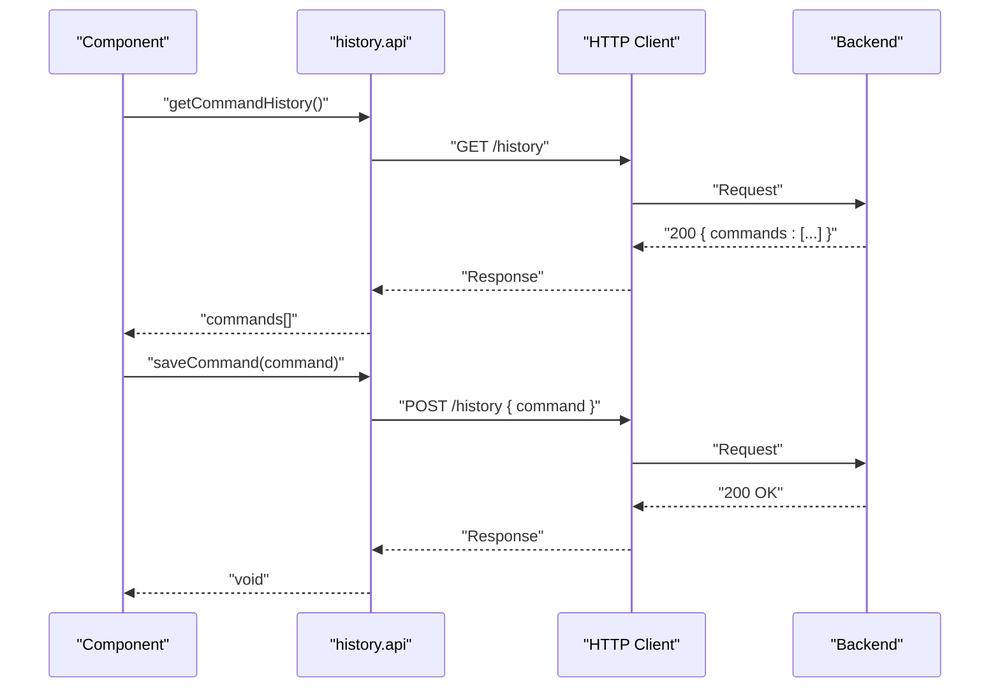

**Diagram sources**
- [history.api.ts:3-14](file://frontend/src/api/history.api.ts#L3-L14)

**Section sources**
- [history.api.ts:1-15](file://frontend/src/api/history.api.ts#L1-L15)

### Composables: Loading States, Error Propagation, and Data Transformation
- useTerminal: Manages terminal lifecycle, SSE streaming, input batching, resize handling, and error propagation. Uses helpers to encode/decode Unicode safely.
- useSftp: Manages SFTP session lifecycle, directory navigation, file operations, and loading/error states.
- useSSE: Implements robust SSE connection with exponential backoff and token injection.
- useFileEditor: Wraps SFTP read/write with formatting capabilities and large-file safeguards.

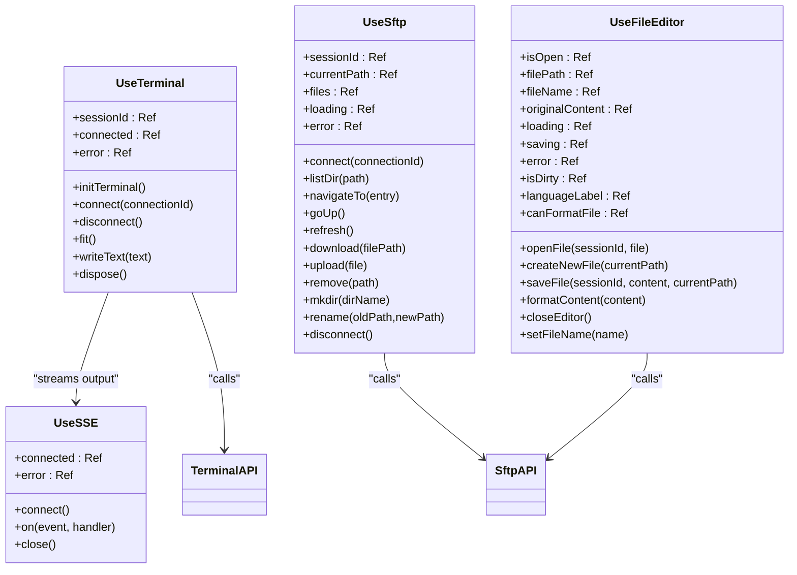

**Diagram sources**
- [useTerminal.ts:12-236](file://frontend/src/composables/useTerminal.ts#L12-L236)
- [useSftp.ts:5-153](file://frontend/src/composables/useSftp.ts#L5-L153)
- [useSSE.ts:3-83](file://frontend/src/composables/useSSE.ts#L3-L83)
- [useFileEditor.ts:12-181](file://frontend/src/composables/useFileEditor.ts#L12-L181)
- [terminal.api.ts:1-26](file://frontend/src/api/terminal.api.ts#L1-L26)
- [sftp.api.ts:1-66](file://frontend/src/api/sftp.api.ts#L1-L66)

**Section sources**
- [useTerminal.ts:1-237](file://frontend/src/composables/useTerminal.ts#L1-L237)
- [useSftp.ts:1-154](file://frontend/src/composables/useSftp.ts#L1-L154)
- [useSSE.ts:1-84](file://frontend/src/composables/useSSE.ts#L1-L84)
- [useFileEditor.ts:1-187](file://frontend/src/composables/useFileEditor.ts#L1-L187)

### Integration with Pinia Stores
- Authentication store: Persists token in localStorage, hydrates user, and clears state on logout.
- Connections store: CRUD operations for connections and testing.
- Workspace store: Manages open tabs and active sub-tabs for terminal/SFTP.

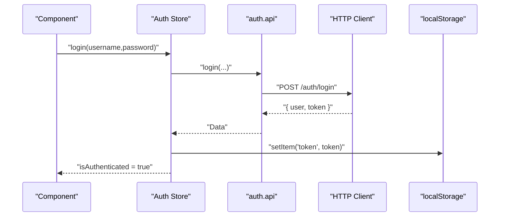

**Diagram sources**
- [auth.store.ts:14-24](file://frontend/src/stores/auth.store.ts#L14-L24)
- [auth.api.ts:13-18](file://frontend/src/api/auth.api.ts#L13-L18)
- [client.ts:11-18](file://frontend/src/api/client.ts#L11-L18)

**Section sources**
- [auth.store.ts:1-54](file://frontend/src/stores/auth.store.ts#L1-L54)
- [connections.store.ts:1-43](file://frontend/src/stores/connections.store.ts#L1-L43)
- [workspace.store.ts:1-83](file://frontend/src/stores/workspace.store.ts#L1-L83)

### Authentication Token Management and Offline Handling
- Token storage: localStorage persisted token for seamless re-authentication.
- Automatic logout: 401 interceptor clears token and redirects to login.
- SSE offline handling: useSSE implements exponential backoff with max retries and user-visible errors.
- Retry strategies: useSSE auto-reconnects while the browser’s EventSource handles transient failures; manual retries are capped.

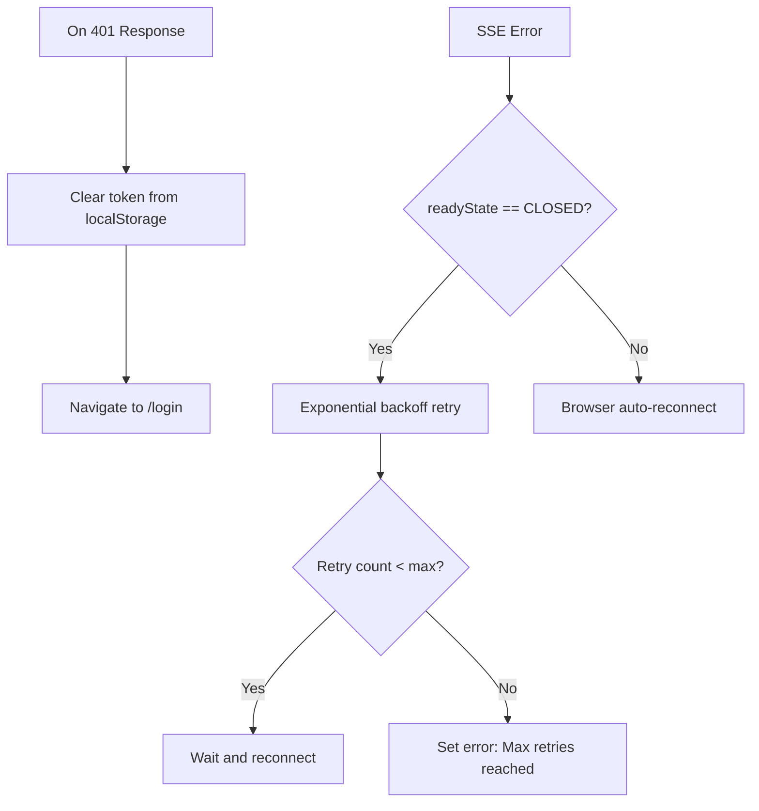

**Diagram sources**
- [client.ts:20-30](file://frontend/src/api/client.ts#L20-L30)
- [useSSE.ts:30-44](file://frontend/src/composables/useSSE.ts#L30-L44)

**Section sources**
- [client.ts:1-33](file://frontend/src/api/client.ts#L1-L33)
- [useSSE.ts:1-84](file://frontend/src/composables/useSSE.ts#L1-L84)

### CORS and Reverse Proxy Coordination
- The HTTP client targets "/api", which is proxied by Nginx to the backend service, avoiding CORS complexities in development and production.
- The SSE URL includes the token as a query parameter to propagate auth to the backend.

**Section sources**
- [client.ts:4](file://frontend/src/api/client.ts#L4)
- [useSSE.ts:18-20](file://frontend/src/composables/useSSE.ts#L18-L20)
- [index.ts:1-44](file://frontend/src/router/index.ts#L1-L44)

### Managing Concurrent Requests
- Each composable manages its own loading flags to prevent overlapping UI actions.
- SSE connections are managed independently and closed on unmount or explicit disconnect.
- API modules return promises; composables chain calls and surface errors without blocking unrelated operations.

**Section sources**
- [useTerminal.ts:120-130](file://frontend/src/composables/useTerminal.ts#L120-L130)
- [useSftp.ts:12-24](file://frontend/src/composables/useSftp.ts#L12-L24)
- [useFileEditor.ts:64-84](file://frontend/src/composables/useFileEditor.ts#L64-L84)

## Dependency Analysis
The integration layer exhibits low coupling and high cohesion:
- API modules depend only on the centralized client.
- Composables depend on API modules and optionally SSE.
- Stores depend on API modules and persist tokens.
- Router depends on stores for guards.

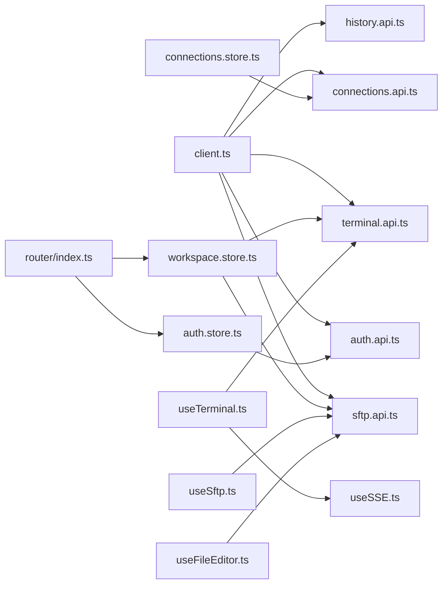

**Diagram sources**
- [client.ts:1-33](file://frontend/src/api/client.ts#L1-L33)
- [auth.api.ts:1-25](file://frontend/src/api/auth.api.ts#L1-L25)
- [connections.api.ts:1-34](file://frontend/src/api/connections.api.ts#L1-L34)
- [terminal.api.ts:1-26](file://frontend/src/api/terminal.api.ts#L1-L26)
- [sftp.api.ts:1-66](file://frontend/src/api/sftp.api.ts#L1-L66)
- [history.api.ts:1-15](file://frontend/src/api/history.api.ts#L1-L15)
- [auth.store.ts:1-54](file://frontend/src/stores/auth.store.ts#L1-L54)
- [connections.store.ts:1-43](file://frontend/src/stores/connections.store.ts#L1-L43)
- [workspace.store.ts:1-83](file://frontend/src/stores/workspace.store.ts#L1-L83)
- [useTerminal.ts:1-237](file://frontend/src/composables/useTerminal.ts#L1-L237)
- [useSftp.ts:1-154](file://frontend/src/composables/useSftp.ts#L1-L154)
- [useSSE.ts:1-84](file://frontend/src/composables/useSSE.ts#L1-L84)
- [useFileEditor.ts:1-187](file://frontend/src/composables/useFileEditor.ts#L1-L187)
- [index.ts:1-44](file://frontend/src/router/index.ts#L1-L44)

**Section sources**
- [index.ts:1-56](file://frontend/src/types/index.ts#L1-L56)

## Performance Considerations
- Use SSE for real-time terminal output to avoid polling overhead.
- Batch terminal input to reduce network calls; the terminal composable already implements a small input buffer and flush timer.
- Prefer incremental updates in SFTP operations (refresh after mutations) to minimize redundant list calls.
- Leverage browser caching for static assets and avoid unnecessary re-renders by using refs and computed values in stores.

## Troubleshooting Guide
- 401 Unauthorized: Verify token presence and validity; the interceptor automatically clears invalid tokens and redirects to login.
- SSE connection failures: Check network connectivity, token query parameter injection, and exponential backoff limits.
- Large file edits: Editor enforces a maximum file size; consider streaming or external editors for larger content.
- Navigation guards: Ensure authentication state is initialized before route transitions; otherwise, guard logic may redirect unexpectedly.

**Section sources**
- [client.ts:20-30](file://frontend/src/api/client.ts#L20-L30)
- [useSSE.ts:30-44](file://frontend/src/composables/useSSE.ts#L30-L44)
- [useFileEditor.ts:30-33](file://frontend/src/composables/useFileEditor.ts#L30-L33)
- [index.ts:29-41](file://frontend/src/router/index.ts#L29-L41)

## Conclusion
The API integration layer cleanly separates transport, domain logic, UI orchestration, and state management. The centralized HTTP client ensures consistent auth and error handling, while domain API modules and composables provide predictable, composable patterns for loading states, error propagation, and data transformation. Pinia stores synchronize state across components, and router guards enforce authentication policies. The SSE-based terminal streaming and robust retry logic deliver a responsive, resilient user experience.

## Appendices
- Types: Define User, Connection, ConnectionInput, FileEntry, TerminalSessionInfo, and WorkspaceTab structures used across the integration layer.

**Section sources**
- [index.ts:1-56](file://frontend/src/types/index.ts#L1-L56)