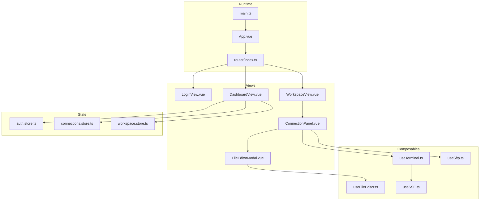
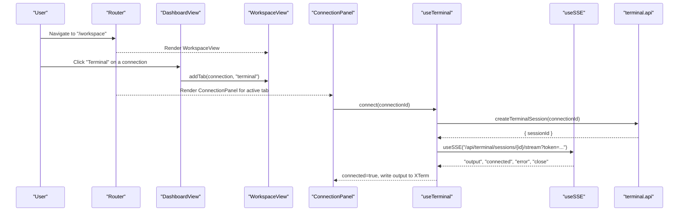
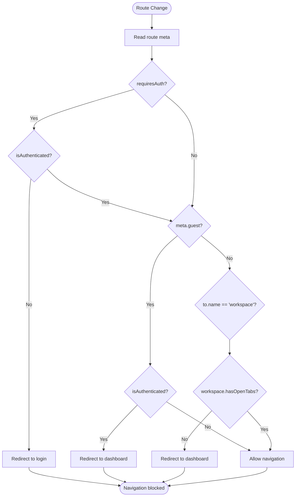
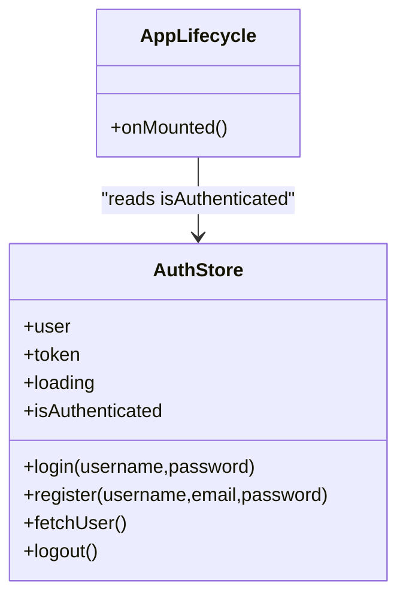
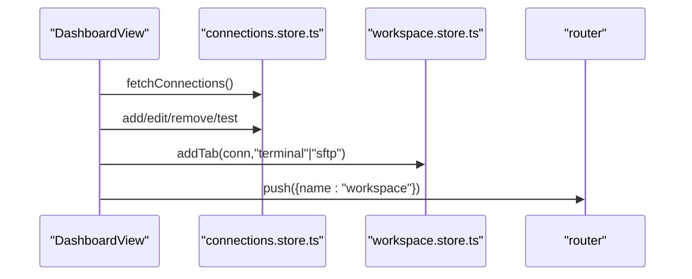
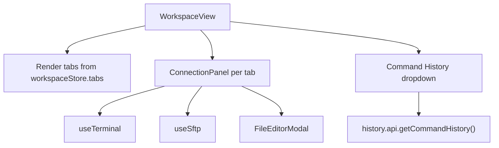
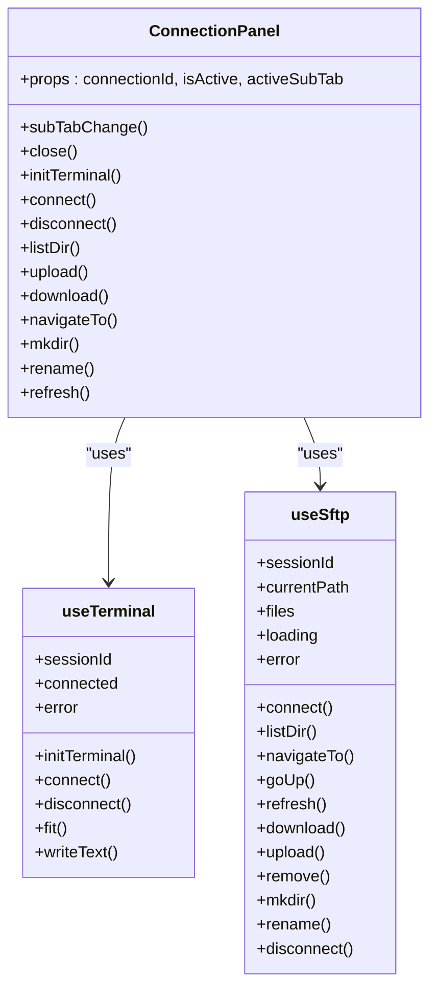
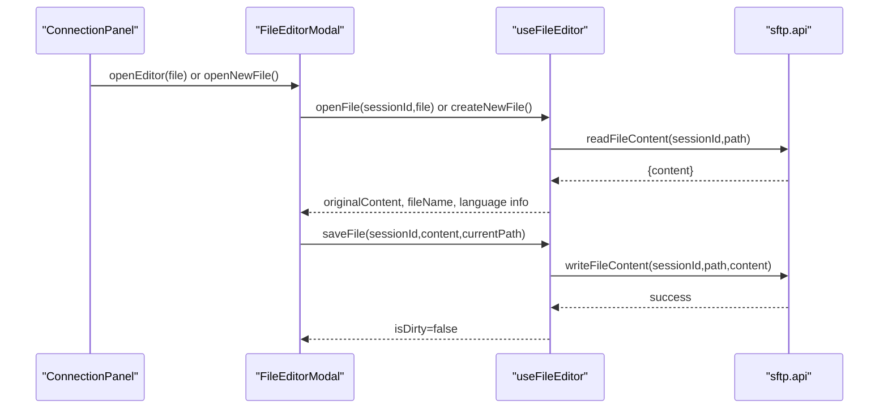
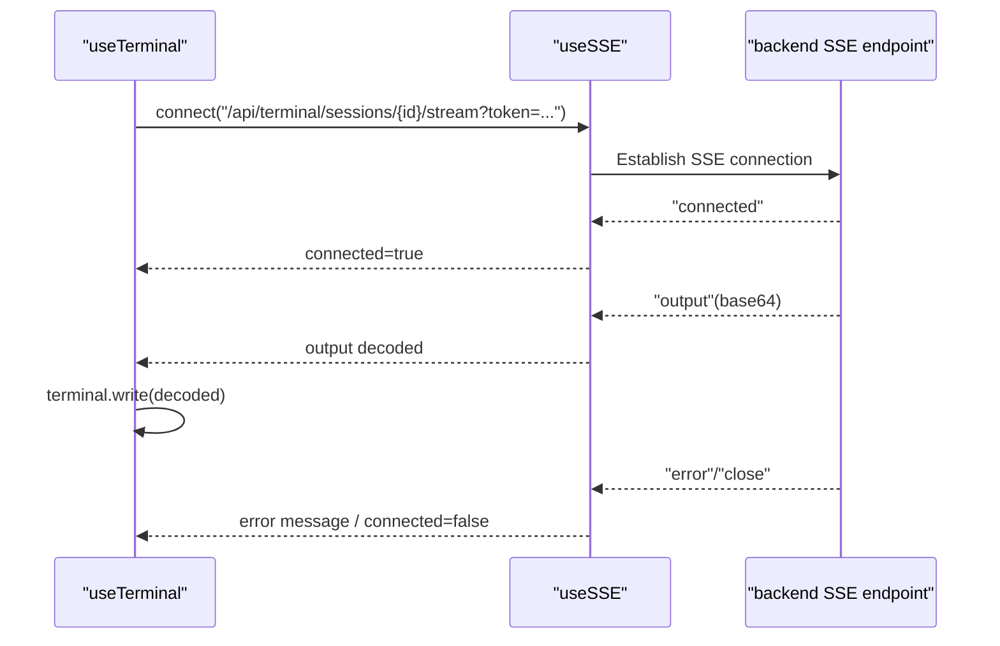
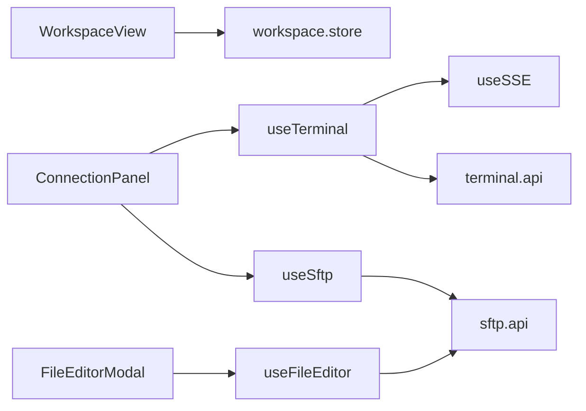

# Frontend Application Architecture

<cite>
**Referenced Files in This Document**
- [App.vue](file://frontend/src/App.vue)
- [main.ts](file://frontend/src/main.ts)
- [router/index.ts](file://frontend/src/router/index.ts)
- [views/LoginView.vue](file://frontend/src/views/LoginView.vue)
- [views/DashboardView.vue](file://frontend/src/views/DashboardView.vue)
- [views/WorkspaceView.vue](file://frontend/src/views/WorkspaceView.vue)
- [views/ConnectionPanel.vue](file://frontend/src/views/ConnectionPanel.vue)
- [views/FileEditorModal.vue](file://frontend/src/views/FileEditorModal.vue)
- [stores/auth.store.ts](file://frontend/src/stores/auth.store.ts)
- [stores/connections.store.ts](file://frontend/src/stores/connections.store.ts)
- [stores/workspace.store.ts](file://frontend/src/stores/workspace.store.ts)
- [composables/useTerminal.ts](file://frontend/src/composables/useTerminal.ts)
- [composables/useSftp.ts](file://frontend/src/composables/useSftp.ts)
- [composables/useFileEditor.ts](file://frontend/src/composables/useFileEditor.ts)
- [composables/useSSE.ts](file://frontend/src/composables/useSSE.ts)
</cite>

## Table of Contents
1. [Introduction](#introduction)
2. [Project Structure](#project-structure)
3. [Core Components](#core-components)
4. [Architecture Overview](#architecture-overview)
5. [Detailed Component Analysis](#detailed-component-analysis)
6. [Dependency Analysis](#dependency-analysis)
7. [Performance Considerations](#performance-considerations)
8. [Troubleshooting Guide](#troubleshooting-guide)
9. [Conclusion](#conclusion)
10. [Appendices](#appendices)

## Introduction
This document describes the frontend architecture of a Vue.js 3 Single Page Application that provides SSH terminal and SFTP capabilities in the browser. It focuses on component hierarchy, routing, state management, and the API integration layer built around composables for real-time terminal sessions, SFTP operations, and file editing. It also covers integration patterns with XTerm.js for terminal emulation and CodeMirror 6 for file editing, along with a tabbed interface for multi-host management.

## Project Structure
The frontend is organized by feature and technology:
- Views: Route-level components for Login, Dashboard, Workspace, ConnectionPanel, and FileEditorModal
- Router: Vue Router 4 configuration with guards and lazy-loaded route components
- Stores: Pinia stores for authentication, connections, and workspace state
- Composables: Reusable logic for terminal, SFTP, file editor, and SSE
- API: Typed API modules for auth, connections, SFTP, terminal, and history
- Utilities: Editor language and theme helpers

**Diagram sources**
- [main.ts:1-11](file://frontend/src/main.ts#L1-L11)
- [App.vue:1-21](file://frontend/src/App.vue#L1-L21)
- [router/index.ts:1-44](file://frontend/src/router/index.ts#L1-L44)
- [views/LoginView.vue:1-170](file://frontend/src/views/LoginView.vue#L1-L170)
- [views/DashboardView.vue:1-404](file://frontend/src/views/DashboardView.vue#L1-L404)
- [views/WorkspaceView.vue:1-348](file://frontend/src/views/WorkspaceView.vue#L1-L348)
- [views/ConnectionPanel.vue:1-665](file://frontend/src/views/ConnectionPanel.vue#L1-L665)
- [views/FileEditorModal.vue:1-427](file://frontend/src/views/FileEditorModal.vue#L1-L427)
- [stores/auth.store.ts:1-54](file://frontend/src/stores/auth.store.ts#L1-L54)
- [stores/connections.store.ts:1-43](file://frontend/src/stores/connections.store.ts#L1-L43)
- [stores/workspace.store.ts:1-83](file://frontend/src/stores/workspace.store.ts#L1-L83)
- [composables/useTerminal.ts:1-237](file://frontend/src/composables/useTerminal.ts#L1-L237)
- [composables/useSftp.ts:1-154](file://frontend/src/composables/useSftp.ts#L1-L154)
- [composables/useFileEditor.ts:1-187](file://frontend/src/composables/useFileEditor.ts#L1-L187)
- [composables/useSSE.ts:1-84](file://frontend/src/composables/useSSE.ts#L1-L84)

**Section sources**
- [main.ts:1-11](file://frontend/src/main.ts#L1-L11)
- [router/index.ts:1-44](file://frontend/src/router/index.ts#L1-L44)

## Core Components
- LoginView: Handles authentication forms, registration, and redirects after login/logout.
- DashboardView: Manages user connections, tests connectivity, and opens terminal/SFTP tabs.
- WorkspaceView: Hosts the tabbed interface for multiple hosts and command history.
- ConnectionPanel: Hosts Terminal and SFTP sub-tabs, integrates XTerm.js and SFTP operations.
- FileEditorModal: Provides a CodeMirror 6-based editor with language-aware formatting.

**Section sources**
- [views/LoginView.vue:1-170](file://frontend/src/views/LoginView.vue#L1-L170)
- [views/DashboardView.vue:1-404](file://frontend/src/views/DashboardView.vue#L1-L404)
- [views/WorkspaceView.vue:1-348](file://frontend/src/views/WorkspaceView.vue#L1-L348)
- [views/ConnectionPanel.vue:1-665](file://frontend/src/views/ConnectionPanel.vue#L1-L665)
- [views/FileEditorModal.vue:1-427](file://frontend/src/views/FileEditorModal.vue#L1-L427)

## Architecture Overview
The SPA initializes Pinia and Vue Router, then renders route components. Authentication state drives navigation guards. The WorkspaceView manages multiple ConnectionPanel instances via Pinia workspace state. Real-time terminal streams use Server-Sent Events (SSE) with XTerm.js. SFTP operations are performed through a session-backed API with CodeMirror 6 for editing.

**Diagram sources**
- [router/index.ts:1-44](file://frontend/src/router/index.ts#L1-L44)
- [views/DashboardView.vue:139-149](file://frontend/src/views/DashboardView.vue#L139-L149)
- [views/WorkspaceView.vue:55-65](file://frontend/src/views/WorkspaceView.vue#L55-L65)
- [views/ConnectionPanel.vue:238-247](file://frontend/src/views/ConnectionPanel.vue#L238-L247)
- [composables/useTerminal.ts:132-179](file://frontend/src/composables/useTerminal.ts#L132-L179)
- [composables/useSSE.ts:11-50](file://frontend/src/composables/useSSE.ts#L11-L50)

## Detailed Component Analysis

### Routing and Navigation Guards
- Routes: login, dashboard, workspace
- Guards:
  - requiresAuth: blocks unauthenticated users from dashboard/workspace
  - guest: blocks authenticated users from login
  - workspace guard prevents navigation to workspace without open tabs

**Diagram sources**
- [router/index.ts:29-41](file://frontend/src/router/index.ts#L29-L41)

**Section sources**
- [router/index.ts:1-44](file://frontend/src/router/index.ts#L1-L44)

### Authentication Store and App Lifecycle
- Persists token in localStorage
- Exposes login/register/fetchUser/logout
- Clears workspace tabs on logout

**Diagram sources**
- [stores/auth.store.ts:7-53](file://frontend/src/stores/auth.store.ts#L7-L53)
- [App.vue:15-19](file://frontend/src/App.vue#L15-L19)

**Section sources**
- [stores/auth.store.ts:1-54](file://frontend/src/stores/auth.store.ts#L1-L54)
- [App.vue:1-21](file://frontend/src/App.vue#L1-L21)

### Connections Store and Dashboard Interactions
- CRUD for connections
- Test connection and update UI state
- Open terminal/SFTP tabs via workspace store

**Diagram sources**
- [views/DashboardView.vue:135-137](file://frontend/src/views/DashboardView.vue#L135-L137)
- [views/DashboardView.vue:139-149](file://frontend/src/views/DashboardView.vue#L139-L149)
- [stores/connections.store.ts:10-39](file://frontend/src/stores/connections.store.ts#L10-L39)
- [stores/workspace.store.ts:15-33](file://frontend/src/stores/workspace.store.ts#L15-L33)

**Section sources**
- [views/DashboardView.vue:1-404](file://frontend/src/views/DashboardView.vue#L1-L404)
- [stores/connections.store.ts:1-43](file://frontend/src/stores/connections.store.ts#L1-L43)
- [stores/workspace.store.ts:1-83](file://frontend/src/stores/workspace.store.ts#L1-L83)

### Workspace Tabs and Command History
- Hosts multiple ConnectionPanel instances
- Tab management via workspace store
- Command history dropdown with API integration

**Diagram sources**
- [views/WorkspaceView.vue:55-65](file://frontend/src/views/WorkspaceView.vue#L55-L65)
- [views/WorkspaceView.vue:97-128](file://frontend/src/views/WorkspaceView.vue#L97-L128)
- [stores/workspace.store.ts:15-64](file://frontend/src/stores/workspace.store.ts#L15-L64)

**Section sources**
- [views/WorkspaceView.vue:1-348](file://frontend/src/views/WorkspaceView.vue#L1-L348)
- [stores/workspace.store.ts:1-83](file://frontend/src/stores/workspace.store.ts#L1-L83)

### ConnectionPanel: Terminal and SFTP
- Sub-tabs: Terminal and SFTP
- Terminal:
  - Initializes XTerm.js, FitAddon, WebLinksAddon
  - Batches input and sends UTF-8 via base64 encoding
  - SSE for real-time output, resize events, and lifecycle
- SFTP:
  - Session-based file listing, navigation, uploads, downloads, renames, deletes
  - Path input normalization and refresh behavior

**Diagram sources**
- [views/ConnectionPanel.vue:170-179](file://frontend/src/views/ConnectionPanel.vue#L170-L179)
- [composables/useTerminal.ts:12-236](file://frontend/src/composables/useTerminal.ts#L12-L236)
- [composables/useSftp.ts:5-153](file://frontend/src/composables/useSftp.ts#L5-L153)

**Section sources**
- [views/ConnectionPanel.vue:1-665](file://frontend/src/views/ConnectionPanel.vue#L1-L665)
- [composables/useTerminal.ts:1-237](file://frontend/src/composables/useTerminal.ts#L1-L237)
- [composables/useSftp.ts:1-154](file://frontend/src/composables/useSftp.ts#L1-L154)

### FileEditorModal: CodeMirror 6 Integration
- Dynamically loads language and lint extensions
- Tracks dirty state and cursor position
- Saves via SFTP API and formats with Prettier when supported

**Diagram sources**
- [views/ConnectionPanel.vue:336-353](file://frontend/src/views/ConnectionPanel.vue#L336-L353)
- [views/FileEditorModal.vue:64-278](file://frontend/src/views/FileEditorModal.vue#L64-L278)
- [composables/useFileEditor.ts:29-84](file://frontend/src/composables/useFileEditor.ts#L29-L84)

**Section sources**
- [views/FileEditorModal.vue:1-427](file://frontend/src/views/FileEditorModal.vue#L1-L427)
- [composables/useFileEditor.ts:1-187](file://frontend/src/composables/useFileEditor.ts#L1-L187)

### Real-Time Streaming with SSE
- useSSE wraps EventSource with exponential backoff
- useTerminal subscribes to "output", "connected", "error", "close" events
- Token appended to URL for authentication

**Diagram sources**
- [composables/useTerminal.ts:146-174](file://frontend/src/composables/useTerminal.ts#L146-L174)
- [composables/useSSE.ts:11-50](file://frontend/src/composables/useSSE.ts#L11-L50)

**Section sources**
- [composables/useTerminal.ts:1-237](file://frontend/src/composables/useTerminal.ts#L1-L237)
- [composables/useSSE.ts:1-84](file://frontend/src/composables/useSSE.ts#L1-L84)

## Dependency Analysis
- Component coupling:
  - WorkspaceView depends on workspace.store for tabs and active tab
  - ConnectionPanel depends on useTerminal/useSftp and emits events to WorkspaceView
  - FileEditorModal depends on useFileEditor and SFTP API
- State management:
  - Pinia stores encapsulate data fetching and mutations
  - Stores are reactive and consumed by views/composables
- External integrations:
  - XTerm.js for terminal emulation
  - CodeMirror 6 for editor
  - Server-Sent Events for real-time terminal updates

**Diagram sources**
- [views/WorkspaceView.vue:76-140](file://frontend/src/views/WorkspaceView.vue#L76-L140)
- [views/ConnectionPanel.vue:161-200](file://frontend/src/views/ConnectionPanel.vue#L161-L200)
- [views/FileEditorModal.vue:75-89](file://frontend/src/views/FileEditorModal.vue#L75-L89)
- [composables/useTerminal.ts:5-6](file://frontend/src/composables/useTerminal.ts#L5-L6)
- [composables/useSSE.ts:3-20](file://frontend/src/composables/useSSE.ts#L3-L20)

**Section sources**
- [views/WorkspaceView.vue:1-348](file://frontend/src/views/WorkspaceView.vue#L1-L348)
- [views/ConnectionPanel.vue:1-665](file://frontend/src/views/ConnectionPanel.vue#L1-L665)
- [views/FileEditorModal.vue:1-427](file://frontend/src/views/FileEditorModal.vue#L1-L427)
- [composables/useTerminal.ts:1-237](file://frontend/src/composables/useTerminal.ts#L1-L237)
- [composables/useSftp.ts:1-154](file://frontend/src/composables/useSftp.ts#L1-L154)
- [composables/useFileEditor.ts:1-187](file://frontend/src/composables/useFileEditor.ts#L1-L187)
- [composables/useSSE.ts:1-84](file://frontend/src/composables/useSSE.ts#L1-L84)

## Performance Considerations
- Lazy loading:
  - Routes use dynamic imports to split bundles
- Memory management:
  - useTerminal disposes XTerm and SSE on unmount
  - useSftp resets state on disconnect
  - FileEditorModal destroys EditorView on unmount
- Real-time update optimization:
  - Terminal input is batched with a short timer to reduce network calls
  - Fit addon recalculates dimensions on container resize
- Rendering:
  - keep-alive caches WorkspaceView to avoid reinitializing panels on navigation

**Section sources**
- [router/index.ts:11, 17, 23](file://frontend/src/router/index.ts#L11,L17,L23)
- [App.vue:3](file://frontend/src/App.vue#L3)
- [composables/useTerminal.ts:234-236](file://frontend/src/composables/useTerminal.ts#L234-L236)
- [composables/useSftp.ts:124-133](file://frontend/src/composables/useSftp.ts#L124-L133)
- [views/FileEditorModal.vue:271-277](file://frontend/src/views/FileEditorModal.vue#L271-L277)

## Troubleshooting Guide
- Authentication
  - If login fails, error messages are shown and stored in the form; ensure token persistence and API availability
- Terminal
  - If terminal does not connect, verify session creation and SSE URL with token; check for escape sequence handling and input batching
  - If output is garbled, ensure base64-to-UTF-8 decoding is applied
- SFTP
  - If file operations fail, confirm session ID exists and path normalization is correct
  - Large file uploads/downloads may fail; consider chunking or server-side limits
- Editor
  - If formatting fails, verify language-specific Prettier plugin availability and configuration
- General
  - Use browser devtools to inspect SSE connection state and network requests

**Section sources**
- [views/LoginView.vue:70-90](file://frontend/src/views/LoginView.vue#L70-L90)
- [composables/useTerminal.ts:146-174](file://frontend/src/composables/useTerminal.ts#L146-L174)
- [composables/useSftp.ts:12-24](file://frontend/src/composables/useSftp.ts#L12-L24)
- [composables/useFileEditor.ts:86-141](file://frontend/src/composables/useFileEditor.ts#L86-L141)

## Conclusion
The frontend employs a clean separation of concerns: route-driven views, Pinia stores for state, and composable modules for real-time terminal and SFTP operations. The architecture supports multi-host workspaces, real-time streaming, and a capable file editor, while maintaining performance and maintainability through lazy loading, lifecycle cleanup, and modular design.

## Appendices
- Extending with new features:
  - Add a new Pinia store for domain state
  - Create a new route component and add it to router/index.ts
  - Implement a composable for new backend integration if needed
  - Integrate with existing SSE or API patterns
- Maintaining code organization:
  - Keep composables focused and reusable
  - Encapsulate side effects and resource cleanup
  - Use typed APIs and store interfaces consistently