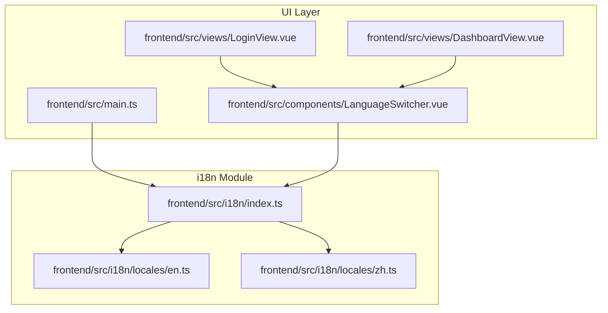
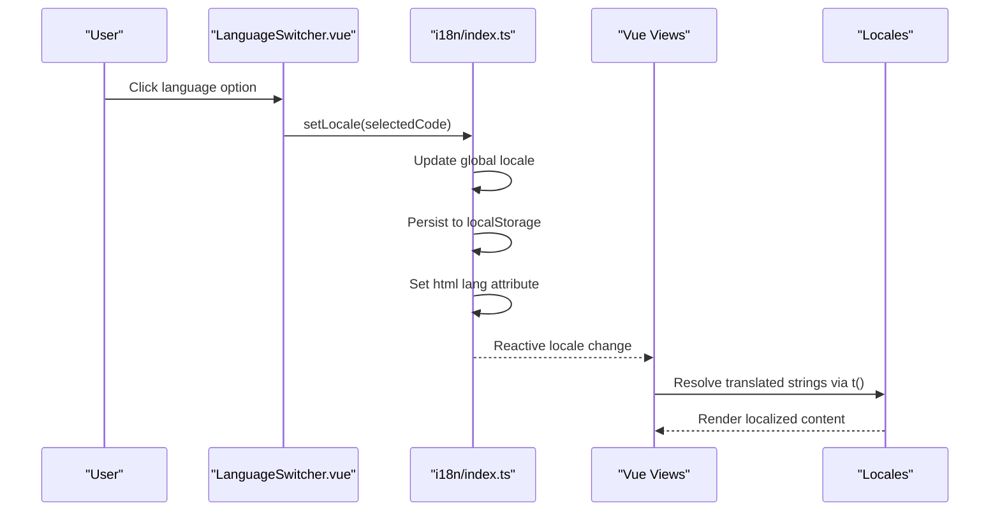
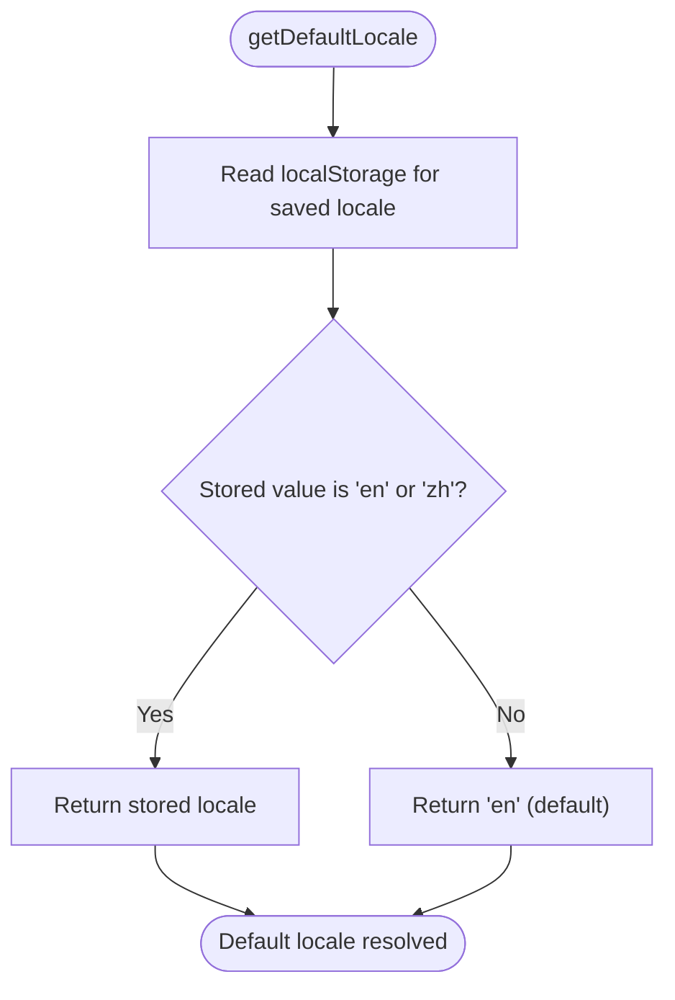
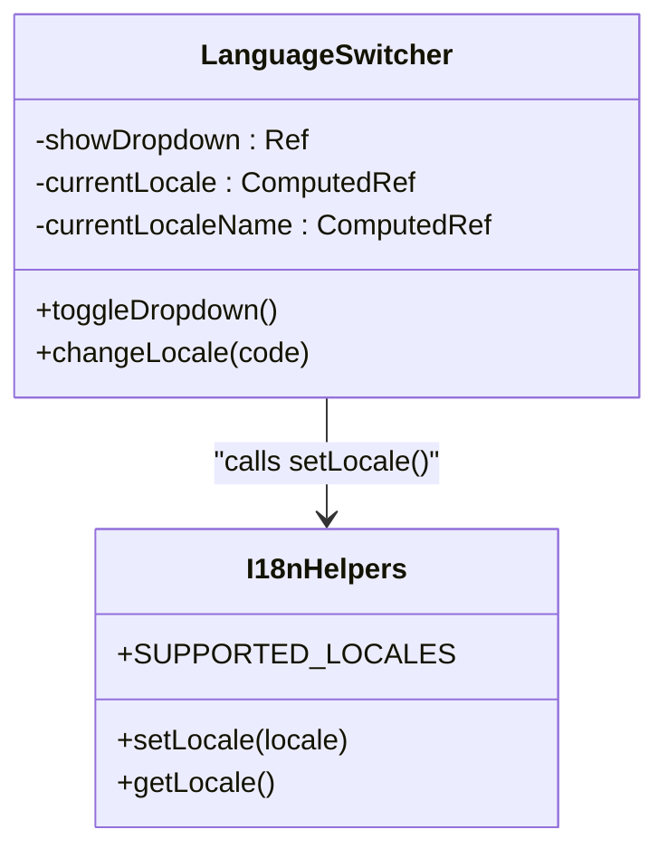
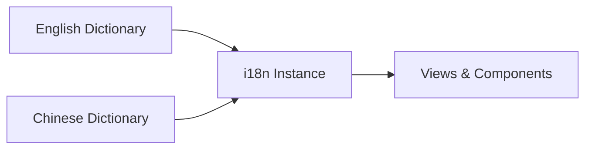
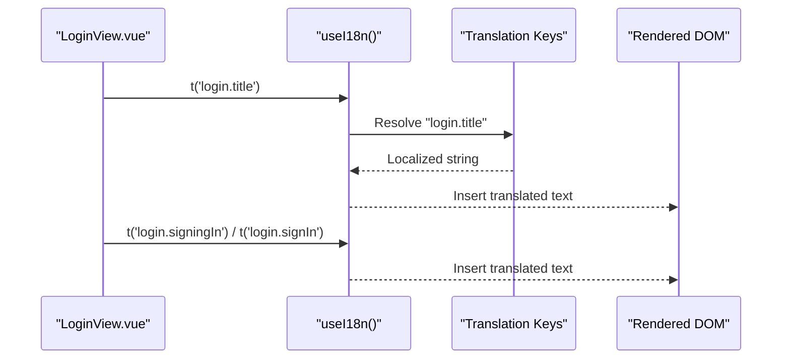
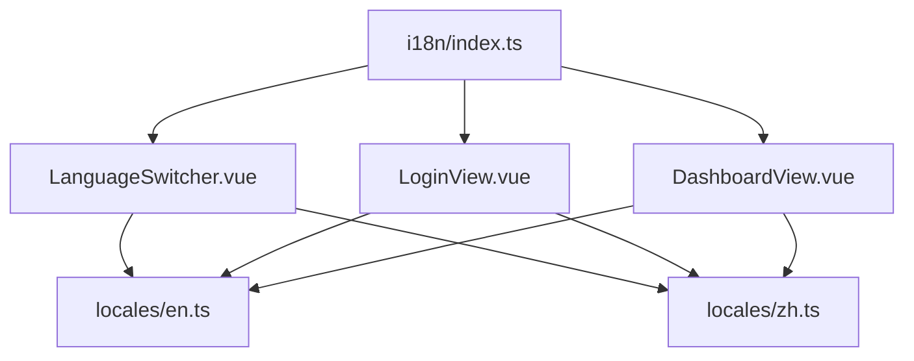

# Internationalization (i18n) Support

<cite>
**Referenced Files in This Document**
- [frontend/src/i18n/index.ts](file://frontend/src/i18n/index.ts)
- [frontend/src/i18n/locales/en.ts](file://frontend/src/i18n/locales/en.ts)
- [frontend/src/i18n/locales/zh.ts](file://frontend/src/i18n/locales/zh.ts)
- [frontend/src/components/LanguageSwitcher.vue](file://frontend/src/components/LanguageSwitcher.vue)
- [frontend/src/main.ts](file://frontend/src/main.ts)
- [frontend/src/views/LoginView.vue](file://frontend/src/views/LoginView.vue)
- [frontend/src/views/DashboardView.vue](file://frontend/src/views/DashboardView.vue)
</cite>

## Table of Contents
1. [Introduction](#introduction)
2. [Project Structure](#project-structure)
3. [Core Components](#core-components)
4. [Architecture Overview](#architecture-overview)
5. [Detailed Component Analysis](#detailed-component-analysis)
6. [Dependency Analysis](#dependency-analysis)
7. [Performance Considerations](#performance-considerations)
8. [Troubleshooting Guide](#troubleshooting-guide)
9. [Conclusion](#conclusion)

## Introduction
This document explains the internationalization (i18n) support implemented in the WebTerm application. The system provides multilingual capabilities using Vue I18n with a Composition API-first approach. It supports English and Chinese languages, persists user language preferences, and integrates seamlessly with the Vue application lifecycle and UI components.

## Project Structure
The i18n implementation is organized under the frontend/src/i18n directory with the following key elements:
- i18n configuration and runtime helpers
- Locale message dictionaries for supported languages
- A reusable LanguageSwitcher component for toggling languages
- Application-wide integration in the main entry point
- Usage across key views for rendering localized content

**Diagram sources**
- [frontend/src/i18n/index.ts:1-43](file://frontend/src/i18n/index.ts#L1-L43)
- [frontend/src/i18n/locales/en.ts:1-114](file://frontend/src/i18n/locales/en.ts#L1-L114)
- [frontend/src/i18n/locales/zh.ts:1-114](file://frontend/src/i18n/locales/zh.ts#L1-L114)
- [frontend/src/main.ts:1-13](file://frontend/src/main.ts#L1-L13)
- [frontend/src/components/LanguageSwitcher.vue:1-126](file://frontend/src/components/LanguageSwitcher.vue#L1-L126)
- [frontend/src/views/LoginView.vue:1-183](file://frontend/src/views/LoginView.vue#L1-L183)
- [frontend/src/views/DashboardView.vue:1-408](file://frontend/src/views/DashboardView.vue#L1-L408)

**Section sources**
- [frontend/src/i18n/index.ts:1-43](file://frontend/src/i18n/index.ts#L1-L43)
- [frontend/src/i18n/locales/en.ts:1-114](file://frontend/src/i18n/locales/en.ts#L1-L114)
- [frontend/src/i18n/locales/zh.ts:1-114](file://frontend/src/i18n/locales/zh.ts#L1-L114)
- [frontend/src/main.ts:1-13](file://frontend/src/main.ts#L1-L13)
- [frontend/src/components/LanguageSwitcher.vue:1-126](file://frontend/src/components/LanguageSwitcher.vue#L1-L126)
- [frontend/src/views/LoginView.vue:1-183](file://frontend/src/views/LoginView.vue#L1-L183)
- [frontend/src/views/DashboardView.vue:1-408](file://frontend/src/views/DashboardView.vue#L1-L408)

## Core Components
- i18n configuration and helpers:
  - Creates the i18n instance with Composition API mode, default locale resolution, and fallback locale.
  - Exposes functions to set/get the current locale and persist selection to localStorage.
  - Defines supported locales with human-readable names.
- Locale message dictionaries:
  - English and Chinese dictionaries covering common UI terms, login, dashboard, workspace, terminal, SFTP, editor, and language switching labels.
- LanguageSwitcher component:
  - Provides a dropdown UI to select language, updates the active locale via the i18n helper, and reflects the current selection.
- Application integration:
  - Registers the i18n plugin during app bootstrap.
  - Uses the i18n Composition API (`useI18n`) in views to render localized strings.

**Section sources**
- [frontend/src/i18n/index.ts:1-43](file://frontend/src/i18n/index.ts#L1-L43)
- [frontend/src/i18n/locales/en.ts:1-114](file://frontend/src/i18n/locales/en.ts#L1-L114)
- [frontend/src/i18n/locales/zh.ts:1-114](file://frontend/src/i18n/locales/zh.ts#L1-L114)
- [frontend/src/components/LanguageSwitcher.vue:1-126](file://frontend/src/components/LanguageSwitcher.vue#L1-L126)
- [frontend/src/main.ts:1-13](file://frontend/src/main.ts#L1-L13)

## Architecture Overview
The i18n architecture follows a straightforward pattern:
- The i18n instance is created with default/fallback locales and loaded message dictionaries.
- The LanguageSwitcher component triggers locale changes by calling the setLocale helper.
- Views consume translations using the Composition API translation function (`t`).
- The selected locale is persisted in localStorage and reflected on the HTML element for accessibility.

**Diagram sources**
- [frontend/src/components/LanguageSwitcher.vue:27-50](file://frontend/src/components/LanguageSwitcher.vue#L27-L50)
- [frontend/src/i18n/index.ts:19-37](file://frontend/src/i18n/index.ts#L19-L37)
- [frontend/src/i18n/locales/en.ts:1-114](file://frontend/src/i18n/locales/en.ts#L1-L114)
- [frontend/src/i18n/locales/zh.ts:1-114](file://frontend/src/i18n/locales/zh.ts#L1-L114)

## Detailed Component Analysis

### i18n Configuration and Helpers
- Purpose:
  - Initialize i18n with Composition API mode.
  - Determine default locale from localStorage or fall back to English.
  - Provide setLocale/getLocale helpers for programmatic locale switching.
  - Define SUPPORTED_LOCALES for UI dropdown population.
- Key behaviors:
  - Persists the chosen locale to localStorage under a dedicated key.
  - Updates the HTML element's lang attribute to improve accessibility and screen reader support.
  - Uses English as the fallback locale for missing keys.

**Diagram sources**
- [frontend/src/i18n/index.ts:9-17](file://frontend/src/i18n/index.ts#L9-L17)

**Section sources**
- [frontend/src/i18n/index.ts:1-43](file://frontend/src/i18n/index.ts#L1-L43)

### LanguageSwitcher Component
- Purpose:
  - Present a language selector UI with a dropdown menu.
  - Reflect the current locale and highlight the active option.
  - Trigger locale changes and close the dropdown after selection.
- Implementation highlights:
  - Uses the Composition API to access the current locale.
  - Integrates with the i18n helper to apply locale changes.
  - Renders localized names for supported locales.

**Diagram sources**
- [frontend/src/components/LanguageSwitcher.vue:27-50](file://frontend/src/components/LanguageSwitcher.vue#L27-L50)
- [frontend/src/i18n/index.ts:29-42](file://frontend/src/i18n/index.ts#L29-L42)

**Section sources**
- [frontend/src/components/LanguageSwitcher.vue:1-126](file://frontend/src/components/LanguageSwitcher.vue#L1-L126)
- [frontend/src/i18n/index.ts:29-42](file://frontend/src/i18n/index.ts#L29-L42)

### Locale Message Dictionaries
- Structure:
  - Each locale exports a dictionary grouped by functional areas (common, login, dashboard, workspace, terminal, sftp, editor, language).
- Coverage:
  - UI labels, placeholders, buttons, notifications, and confirmation messages.
  - Consistent keys across locales to ensure fallback behavior.
- Extensibility:
  - Adding a new locale requires a new dictionary file and updating the i18n configuration and supported locales list.

**Diagram sources**
- [frontend/src/i18n/locales/en.ts:1-114](file://frontend/src/i18n/locales/en.ts#L1-L114)
- [frontend/src/i18n/locales/zh.ts:1-114](file://frontend/src/i18n/locales/zh.ts#L1-L114)
- [frontend/src/i18n/index.ts:19-27](file://frontend/src/i18n/index.ts#L19-L27)

**Section sources**
- [frontend/src/i18n/locales/en.ts:1-114](file://frontend/src/i18n/locales/en.ts#L1-L114)
- [frontend/src/i18n/locales/zh.ts:1-114](file://frontend/src/i18n/locales/zh.ts#L1-L114)

### View Integration Examples
- LoginView:
  - Uses the translation function to render page title, subtitles, labels, placeholders, and action texts.
  - Displays localized error and success messages.
- DashboardView:
  - Renders header labels, connection cards, modals, and button texts in the active locale.
  - Uses localized confirmations and dynamic placeholders.

**Diagram sources**
- [frontend/src/views/LoginView.vue:65-96](file://frontend/src/views/LoginView.vue#L65-L96)
- [frontend/src/i18n/locales/en.ts:18-40](file://frontend/src/i18n/locales/en.ts#L18-L40)
- [frontend/src/i18n/locales/zh.ts:18-40](file://frontend/src/i18n/locales/zh.ts#L18-L40)

**Section sources**
- [frontend/src/views/LoginView.vue:1-183](file://frontend/src/views/LoginView.vue#L1-L183)
- [frontend/src/views/DashboardView.vue:1-408](file://frontend/src/views/DashboardView.vue#L1-L408)

## Dependency Analysis
- Internal dependencies:
  - LanguageSwitcher depends on i18n helpers for locale changes and SUPPORTED_LOCALES for rendering options.
  - Views depend on the Composition API translation function to resolve localized strings.
- External dependencies:
  - Vue I18n provides the core i18n functionality and reactive locale management.
- Persistence and accessibility:
  - Locale preference is persisted in localStorage and applied to the HTML lang attribute.

**Diagram sources**
- [frontend/src/i18n/index.ts:1-43](file://frontend/src/i18n/index.ts#L1-L43)
- [frontend/src/components/LanguageSwitcher.vue:27-50](file://frontend/src/components/LanguageSwitcher.vue#L27-L50)
- [frontend/src/views/LoginView.vue:58-96](file://frontend/src/views/LoginView.vue#L58-L96)
- [frontend/src/views/DashboardView.vue:106-222](file://frontend/src/views/DashboardView.vue#L106-L222)
- [frontend/src/i18n/locales/en.ts:1-114](file://frontend/src/i18n/locales/en.ts#L1-L114)
- [frontend/src/i18n/locales/zh.ts:1-114](file://frontend/src/i18n/locales/zh.ts#L1-L114)

**Section sources**
- [frontend/src/i18n/index.ts:1-43](file://frontend/src/i18n/index.ts#L1-L43)
- [frontend/src/components/LanguageSwitcher.vue:27-50](file://frontend/src/components/LanguageSwitcher.vue#L27-L50)
- [frontend/src/views/LoginView.vue:58-96](file://frontend/src/views/LoginView.vue#L58-L96)
- [frontend/src/views/DashboardView.vue:106-222](file://frontend/src/views/DashboardView.vue#L106-L222)

## Performance Considerations
- Composition API mode avoids legacy overhead and enables tree-shaking-friendly usage.
- Locale switching is lightweight and reactive; translations are resolved synchronously from in-memory dictionaries.
- Persisting locale in localStorage prevents repeated detection logic on subsequent visits.

## Troubleshooting Guide
- Locale does not persist:
  - Verify the storage key exists in localStorage and contains a valid locale value.
  - Confirm the setLocale helper writes to localStorage and updates the HTML lang attribute.
- Missing translations:
  - Ensure the requested key exists in the active locale dictionary.
  - Fallback to the configured fallback locale if a key is missing.
- Dropdown not reflecting current locale:
  - Confirm the component reads the current locale from the i18n instance and maps it to a display name.
- HTML lang attribute not updating:
  - Check that the setLocale helper updates the HTML lang attribute after changing the global locale.

**Section sources**
- [frontend/src/i18n/index.ts:9-37](file://frontend/src/i18n/index.ts#L9-L37)
- [frontend/src/components/LanguageSwitcher.vue:32-49](file://frontend/src/components/LanguageSwitcher.vue#L32-L49)

## Conclusion
The WebTerm application implements a clean and maintainable i18n system using Vue I18n with Composition API. It supports English and Chinese, persists user preferences, and integrates seamlessly across the UI. The modular design allows easy extension to additional locales and ensures consistent localization across views and components.