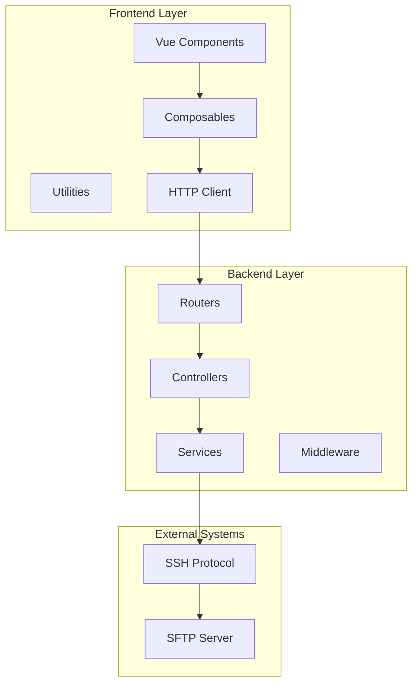
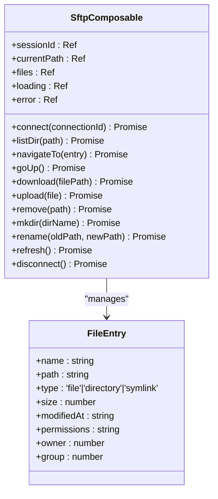
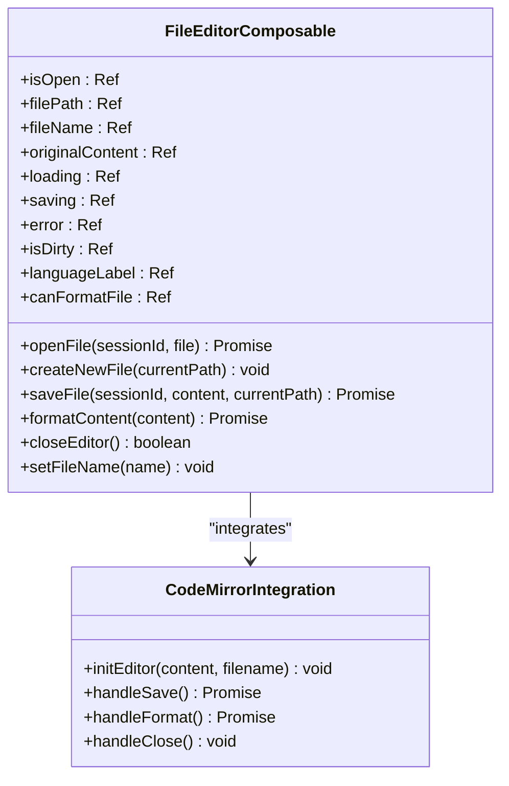
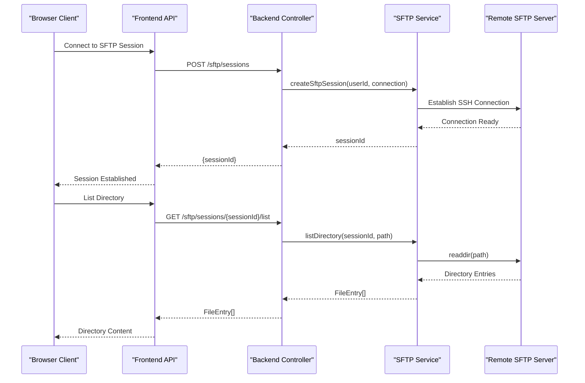
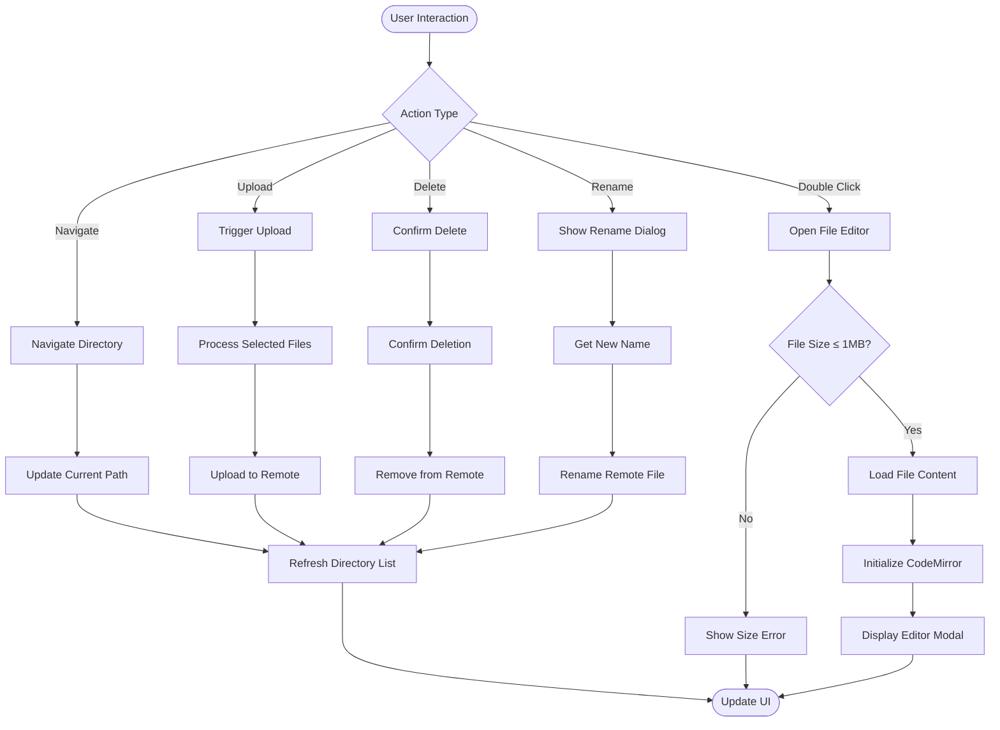
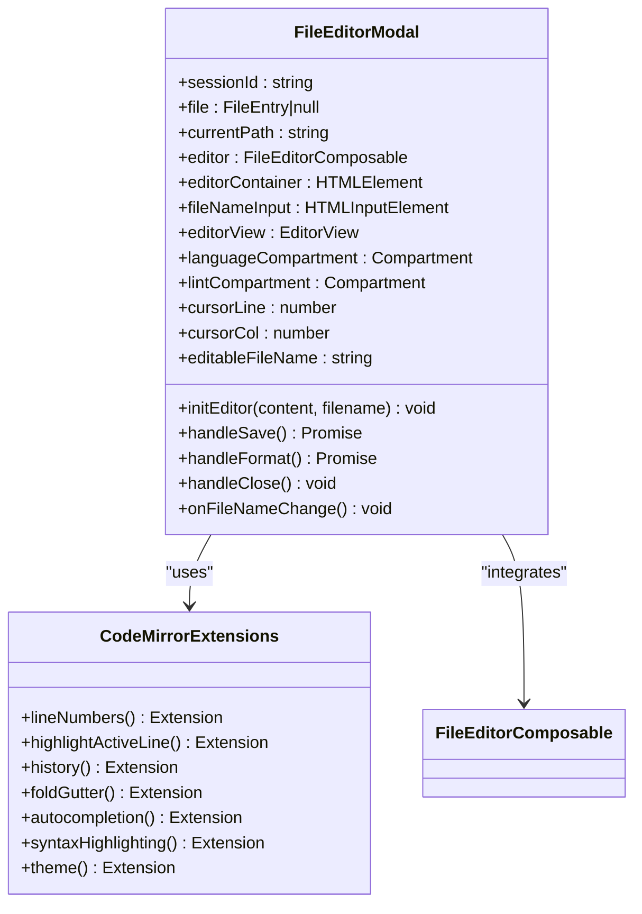
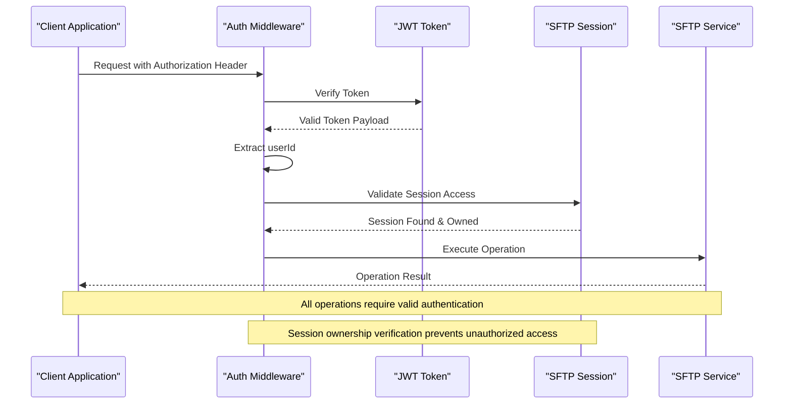
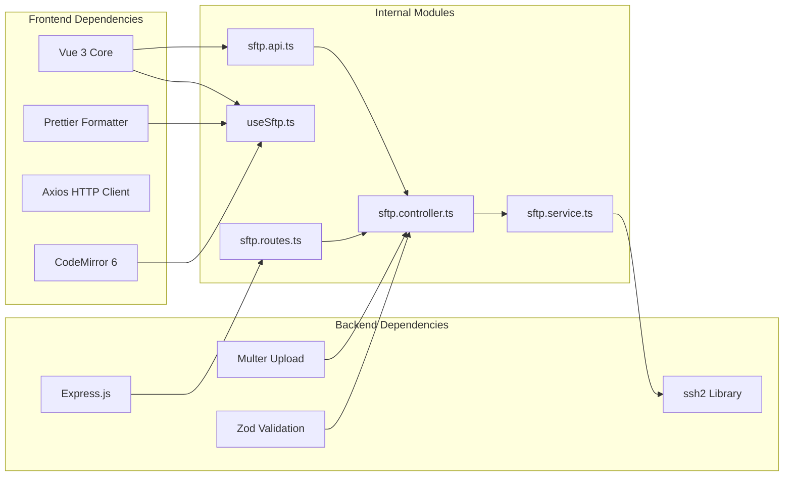
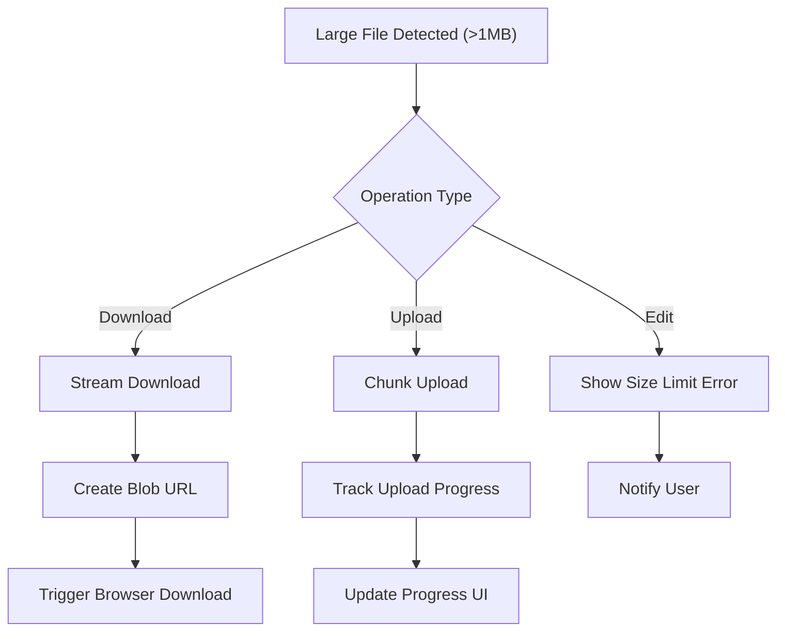
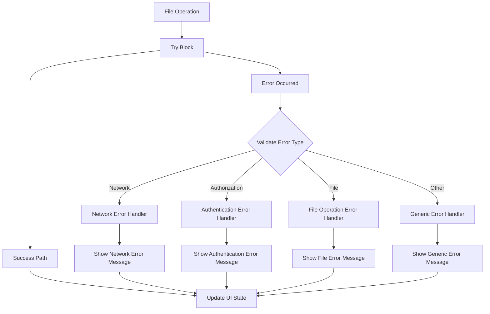

# SFTP File Management Interface

<cite>
**Referenced Files in This Document**
- [useSftp.ts](file://frontend/src/composables/useSftp.ts)
- [useFileEditor.ts](file://frontend/src/composables/useFileEditor.ts)
- [FileEditorModal.vue](file://frontend/src/views/FileEditorModal.vue)
- [ConnectionPanel.vue](file://frontend/src/views/ConnectionPanel.vue)
- [sftp.api.ts](file://frontend/src/api/sftp.api.ts)
- [sftp.controller.ts](file://backend/src/controllers/sftp.controller.ts)
- [sftp.service.ts](file://backend/src/services/sftp.service.ts)
- [sftp.routes.ts](file://backend/src/routes/sftp.routes.ts)
- [auth.middleware.ts](file://backend/src/middleware/auth.middleware.ts)
- [editor-languages.ts](file://frontend/src/utils/editor-languages.ts)
- [editor-theme.ts](file://frontend/src/utils/editor-theme.ts)
- [index.ts](file://frontend/src/types/index.ts)
</cite>

## Table of Contents
1. [Introduction](#introduction)
2. [Project Structure](#project-structure)
3. [Core Components](#core-components)
4. [Architecture Overview](#architecture-overview)
5. [Detailed Component Analysis](#detailed-component-analysis)
6. [Dependency Analysis](#dependency-analysis)
7. [Performance Considerations](#performance-considerations)
8. [Troubleshooting Guide](#troubleshooting-guide)
9. [Conclusion](#conclusion)

## Introduction

The SFTP File Management Interface provides a comprehensive solution for remote file system operations through a web-based interface. Built with Vue.js and integrated with CodeMirror 6, it offers secure file browsing, editing, and transfer capabilities with support for multiple file formats and real-time operations.

The system consists of two primary layers: a frontend interface that handles user interactions and a backend service that manages secure SFTP connections to remote servers. The interface supports drag-and-drop uploads, real-time file system updates, and advanced editing features with syntax highlighting and formatting capabilities.

## Project Structure

The SFTP file management interface follows a modular architecture with clear separation between frontend and backend concerns:

**Diagram sources**
- [useSftp.ts:1-154](file://frontend/src/composables/useSftp.ts#L1-L154)
- [sftp.controller.ts:1-296](file://backend/src/controllers/sftp.controller.ts#L1-L296)

The frontend utilizes a reactive architecture with Vue 3 Composition API, while the backend implements Express.js with TypeScript for robust server-side operations.

**Section sources**
- [useSftp.ts:1-154](file://frontend/src/composables/useSftp.ts#L1-L154)
- [ConnectionPanel.vue:1-665](file://frontend/src/views/ConnectionPanel.vue#L1-L665)
- [sftp.controller.ts:1-296](file://backend/src/controllers/sftp.controller.ts#L1-L296)

## Core Components

### useSftp Composable

The `useSftp` composable serves as the central orchestrator for all SFTP operations, providing a clean interface for file system interactions:

**Diagram sources**
- [useSftp.ts:5-153](file://frontend/src/composables/useSftp.ts#L5-L153)
- [index.ts:31-40](file://frontend/src/types/index.ts#L31-L40)

The composable implements comprehensive error handling with centralized error state management and loading indicators for all operations.

**Section sources**
- [useSftp.ts:1-154](file://frontend/src/composables/useSftp.ts#L1-L154)
- [index.ts:31-40](file://frontend/src/types/index.ts#L31-L40)

### useFileEditor Composable

The `useFileEditor` composable provides advanced file editing capabilities with CodeMirror 6 integration:

**Diagram sources**
- [useFileEditor.ts:12-181](file://frontend/src/composables/useFileEditor.ts#L12-L181)
- [FileEditorModal.vue:64-278](file://frontend/src/views/FileEditorModal.vue#L64-L278)

The editor supports syntax highlighting, language detection, and automatic formatting with Prettier integration.

**Section sources**
- [useFileEditor.ts:1-187](file://frontend/src/composables/useFileEditor.ts#L1-L187)
- [FileEditorModal.vue:1-427](file://frontend/src/views/FileEditorModal.vue#L1-L427)

## Architecture Overview

The SFTP interface implements a client-server architecture with secure authentication and encrypted data transmission:

**Diagram sources**
- [sftp.api.ts:4-14](file://frontend/src/api/sftp.api.ts#L4-L14)
- [sftp.controller.ts:45-80](file://backend/src/controllers/sftp.controller.ts#L45-L80)
- [sftp.service.ts:10-72](file://backend/src/services/sftp.service.ts#L10-L72)

The architecture ensures secure authentication through JWT tokens and encrypted credential storage, with all file operations performed through the established SFTP sessions.

**Section sources**
- [sftp.routes.ts:1-36](file://backend/src/routes/sftp.routes.ts#L1-L36)
- [auth.middleware.ts:10-32](file://backend/src/middleware/auth.middleware.ts#L10-L32)

## Detailed Component Analysis

### File Browser Component

The file browser component provides a comprehensive interface for navigating and managing remote file systems:

**Diagram sources**
- [ConnectionPanel.vue:286-383](file://frontend/src/views/ConnectionPanel.vue#L286-L383)
- [useSftp.ts:26-122](file://frontend/src/composables/useSftp.ts#L26-L122)

The file browser implements drag-and-drop upload functionality, real-time path navigation, and comprehensive file operation controls.

**Section sources**
- [ConnectionPanel.vue:1-665](file://frontend/src/views/ConnectionPanel.vue#L1-L665)
- [useSftp.ts:1-154](file://frontend/src/composables/useSftp.ts#L1-L154)

### File Editor Modal Implementation

The file editor modal provides a sophisticated editing environment with advanced features:

**Diagram sources**
- [FileEditorModal.vue:64-278](file://frontend/src/views/FileEditorModal.vue#L64-L278)
- [editor-languages.ts:22-235](file://frontend/src/utils/editor-languages.ts#L22-L235)

The editor supports over 30 file formats with syntax highlighting, intelligent language detection, and automatic formatting capabilities.

**Section sources**
- [FileEditorModal.vue:1-427](file://frontend/src/views/FileEditorModal.vue#L1-L427)
- [editor-languages.ts:1-235](file://frontend/src/utils/editor-languages.ts#L1-L235)

### Authentication and Security

The system implements robust authentication and security measures:

**Diagram sources**
- [auth.middleware.ts:10-32](file://backend/src/middleware/auth.middleware.ts#L10-L32)
- [sftp.controller.ts:31-43](file://backend/src/controllers/sftp.controller.ts#L31-L43)

**Section sources**
- [auth.middleware.ts:1-33](file://backend/src/middleware/auth.middleware.ts#L1-L33)
- [sftp.controller.ts:31-43](file://backend/src/controllers/sftp.controller.ts#L31-L43)

## Dependency Analysis

The SFTP interface maintains clean dependency boundaries with clear separation of concerns:

**Diagram sources**
- [sftp.api.ts:1-66](file://frontend/src/api/sftp.api.ts#L1-L66)
- [useSftp.ts:1-4](file://frontend/src/composables/useSftp.ts#L1-L4)
- [sftp.controller.ts:1-10](file://backend/src/controllers/sftp.controller.ts#L1-L10)
- [sftp.service.ts:1-6](file://backend/src/services/sftp.service.ts#L1-L6)

**Section sources**
- [sftp.api.ts:1-66](file://frontend/src/api/sftp.api.ts#L1-L66)
- [sftp.controller.ts:1-296](file://backend/src/controllers/sftp.controller.ts#L1-L296)
- [sftp.service.ts:1-277](file://backend/src/services/sftp.service.ts#L1-L277)

## Performance Considerations

### Memory Management

The system implements several strategies to manage memory efficiently during file operations:

- **File Size Limits**: Maximum 1MB file editing limit to prevent memory exhaustion
- **Streaming Transfers**: Large file downloads use streaming to avoid loading entire files into memory
- **Lazy Loading**: File content is loaded only when requested for editing
- **Resource Cleanup**: Proper cleanup of CodeMirror instances and event listeners

### Large File Operations

For files exceeding the editing limit, the system provides alternative handling:

**Diagram sources**
- [useSftp.ts:52-67](file://frontend/src/composables/useSftp.ts#L52-L67)
- [useFileEditor.ts:29-52](file://frontend/src/composables/useFileEditor.ts#L29-L52)

### Real-time Updates

The interface provides real-time feedback during operations:

- **Loading States**: Centralized loading indicators for all asynchronous operations
- **Progress Tracking**: Upload progress monitoring for large file transfers
- **Error Handling**: Comprehensive error reporting with user-friendly messages
- **Session Management**: Automatic session cleanup and reconnection handling

**Section sources**
- [useSftp.ts:12-133](file://frontend/src/composables/useSftp.ts#L12-L133)
- [useFileEditor.ts:29-84](file://frontend/src/composables/useFileEditor.ts#L29-L84)

## Troubleshooting Guide

### Common Issues and Solutions

#### Authentication Problems
- **Issue**: "Authentication required" errors
- **Solution**: Verify JWT token validity and ensure proper authorization header format
- **Prevention**: Implement automatic token refresh and proper error handling

#### Session Management
- **Issue**: "Session not found" errors
- **Solution**: Ensure session creation before file operations and proper cleanup on component unmount
- **Prevention**: Implement session lifecycle management and timeout handling

#### File Operation Failures
- **Issue**: "Failed to list directory" or "Failed to upload file"
- **Solution**: Check network connectivity and verify remote server accessibility
- **Prevention**: Implement retry mechanisms and graceful degradation

#### Binary File Detection
- **Issue**: "Binary file cannot be edited" errors
- **Solution**: Use download functionality for binary files or convert to text format
- **Prevention**: Automatic binary file detection and user notification

**Section sources**
- [sftp.controller.ts:31-43](file://backend/src/controllers/sftp.controller.ts#L31-L43)
- [sftp.service.ts:218-244](file://backend/src/services/sftp.service.ts#L218-L244)
- [useFileEditor.ts:29-52](file://frontend/src/composables/useFileEditor.ts#L29-L52)

### Error Handling Patterns

The system implements comprehensive error handling across all layers:

**Diagram sources**
- [useSftp.ts:19-20](file://frontend/src/composables/useSftp.ts#L19-L20)
- [useFileEditor.ts:46-48](file://frontend/src/composables/useFileEditor.ts#L46-L48)

**Section sources**
- [useSftp.ts:19-20](file://frontend/src/composables/useSftp.ts#L19-L20)
- [useFileEditor.ts:46-48](file://frontend/src/composables/useFileEditor.ts#L46-L48)

## Conclusion

The SFTP File Management Interface provides a robust, secure, and user-friendly solution for remote file system operations. Its modular architecture, comprehensive error handling, and advanced editing capabilities make it suitable for production environments requiring secure file management.

Key strengths include:
- **Security**: JWT-based authentication with session ownership verification
- **Performance**: Streaming transfers, memory-efficient operations, and lazy loading
- **Usability**: Intuitive file browser, real-time updates, and comprehensive editing features
- **Maintainability**: Clean separation of concerns with clear dependency boundaries

The interface successfully bridges the gap between traditional SFTP clients and modern web applications, providing enterprise-grade file management capabilities through a browser-based interface.