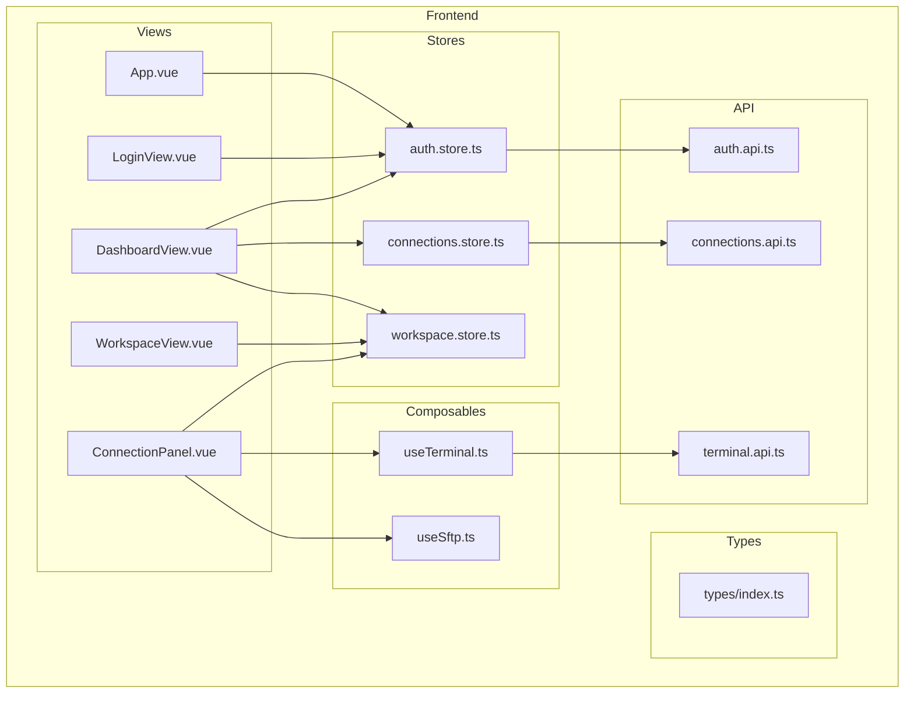
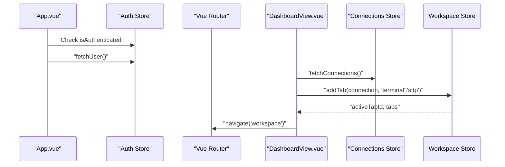
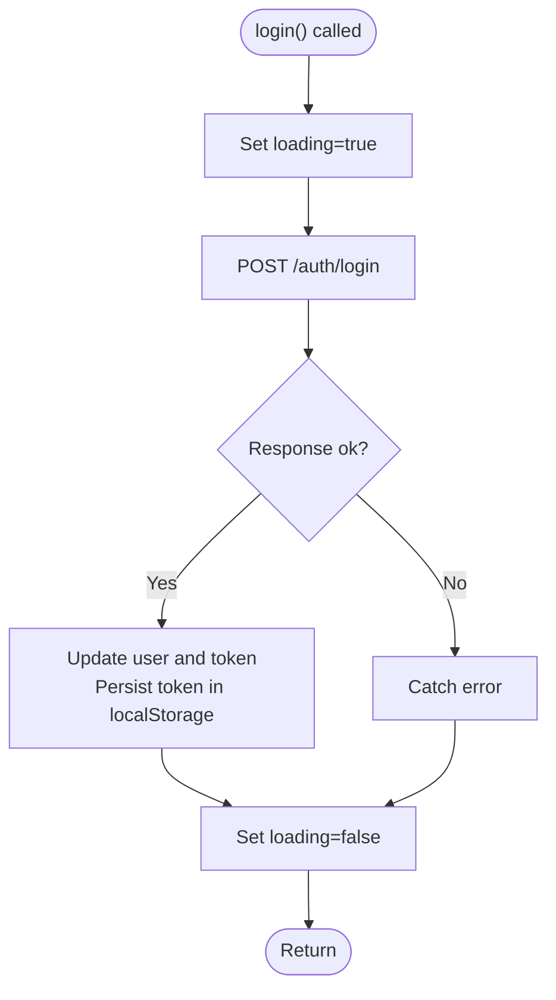
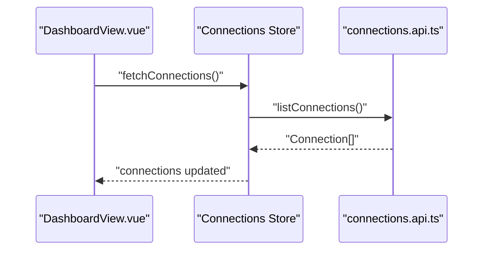
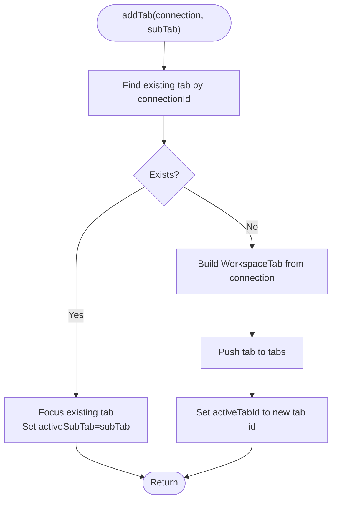
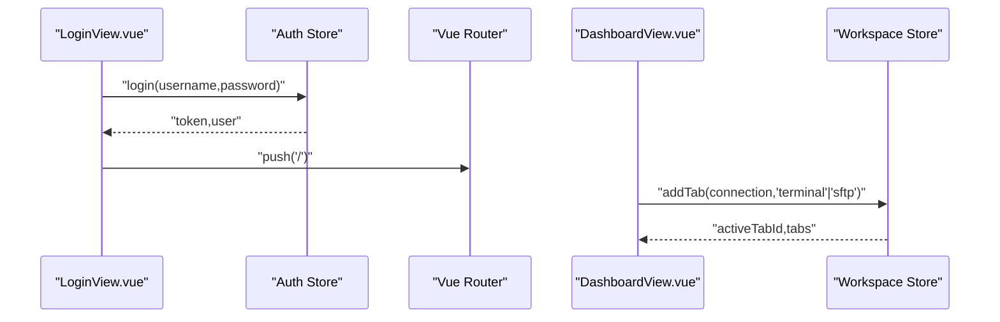
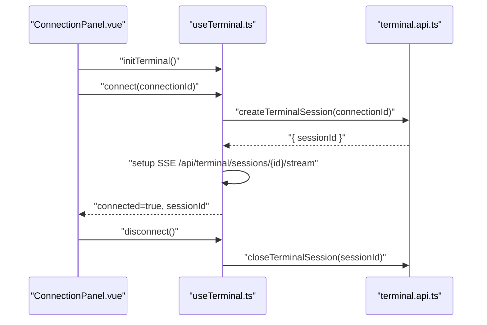
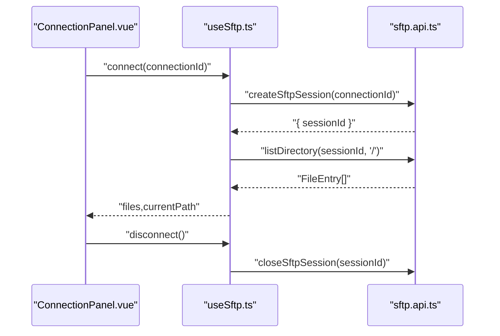
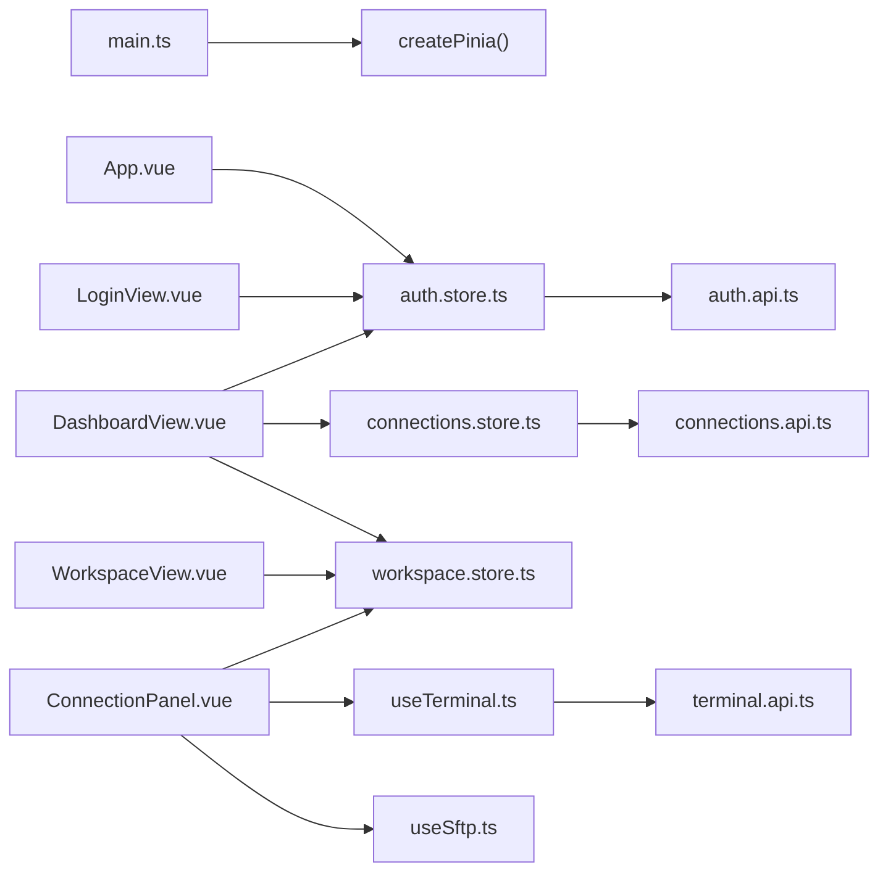

# State Management with Pinia

<cite>
**Referenced Files in This Document**
- [auth.store.ts](file://frontend/src/stores/auth.store.ts)
- [connections.store.ts](file://frontend/src/stores/connections.store.ts)
- [workspace.store.ts](file://frontend/src/stores/workspace.store.ts)
- [index.ts](file://frontend/src/types/index.ts)
- [auth.api.ts](file://frontend/src/api/auth.api.ts)
- [connections.api.ts](file://frontend/src/api/connections.api.ts)
- [terminal.api.ts](file://frontend/src/api/terminal.api.ts)
- [main.ts](file://frontend/src/main.ts)
- [App.vue](file://frontend/src/App.vue)
- [LoginView.vue](file://frontend/src/views/LoginView.vue)
- [DashboardView.vue](file://frontend/src/views/DashboardView.vue)
- [WorkspaceView.vue](file://frontend/src/views/WorkspaceView.vue)
- [ConnectionPanel.vue](file://frontend/src/views/ConnectionPanel.vue)
- [useTerminal.ts](file://frontend/src/composables/useTerminal.ts)
- [useSftp.ts](file://frontend/src/composables/useSftp.ts)
</cite>

## Table of Contents
1. [Introduction](#introduction)
2. [Project Structure](#project-structure)
3. [Core Components](#core-components)
4. [Architecture Overview](#architecture-overview)
5. [Detailed Component Analysis](#detailed-component-analysis)
6. [Dependency Analysis](#dependency-analysis)
7. [Performance Considerations](#performance-considerations)
8. [Troubleshooting Guide](#troubleshooting-guide)
9. [Conclusion](#conclusion)
10. [Appendices](#appendices)

## Introduction
This document explains the Pinia-based state management implementation for the WebTerm application. It focuses on three primary stores:
- Authentication store for user identity and JWT token lifecycle
- Connections store for SSH connection records and CRUD operations
- Workspace store for terminal/SFTP sessions and active connection tracking

It covers store composition patterns, state mutations, computed properties, and asynchronous actions. It also documents integration with Vue components via composable usage, and outlines best practices for naming, organization, and synchronization across components. Finally, it clarifies how frontend state relates to backend API responses.

## Project Structure
The state management layer is organized under the frontend/src directory:
- Stores: frontend/src/stores
- Types: frontend/src/types
- API clients: frontend/src/api
- Composables: frontend/src/composables
- Views/components: frontend/src/views
- Application bootstrap: frontend/src/main.ts

**Diagram sources**
- [main.ts:1-11](file://frontend/src/main.ts#L1-L11)
- [App.vue:1-21](file://frontend/src/App.vue#L1-L21)
- [LoginView.vue:1-170](file://frontend/src/views/LoginView.vue#L1-L170)
- [DashboardView.vue:1-404](file://frontend/src/views/DashboardView.vue#L1-L404)
- [WorkspaceView.vue:1-348](file://frontend/src/views/WorkspaceView.vue#L1-L348)
- [ConnectionPanel.vue:1-665](file://frontend/src/views/ConnectionPanel.vue#L1-L665)
- [auth.store.ts:1-54](file://frontend/src/stores/auth.store.ts#L1-L54)
- [connections.store.ts:1-43](file://frontend/src/stores/connections.store.ts#L1-L43)
- [workspace.store.ts:1-83](file://frontend/src/stores/workspace.store.ts#L1-L83)
- [auth.api.ts:1-25](file://frontend/src/api/auth.api.ts#L1-L25)
- [connections.api.ts:1-34](file://frontend/src/api/connections.api.ts#L1-L34)
- [terminal.api.ts:1-26](file://frontend/src/api/terminal.api.ts#L1-L26)
- [useTerminal.ts:1-237](file://frontend/src/composables/useTerminal.ts#L1-L237)
- [useSftp.ts:1-154](file://frontend/src/composables/useSftp.ts#L1-L154)

**Section sources**
- [main.ts:1-11](file://frontend/src/main.ts#L1-L11)
- [App.vue:1-21](file://frontend/src/App.vue#L1-L21)

## Core Components
This section introduces the three stores and their roles.

- Authentication Store (auth.store.ts)
  - Manages user identity, JWT token, and loading state
  - Provides login, register, fetch user, and logout actions
  - Persists token in local storage and clears workspace on logout

- Connections Store (connections.store.ts)
  - Maintains a list of SSH connections and loading state
  - Implements CRUD operations and connection testing
  - Delegates to connections API module

- Workspace Store (workspace.store.ts)
  - Tracks open tabs and active tab ID
  - Computes active tab and whether tabs exist
  - Adds/removes tabs, sets active tab, toggles sub-tabs, and clears all

**Section sources**
- [auth.store.ts:1-54](file://frontend/src/stores/auth.store.ts#L1-L54)
- [connections.store.ts:1-43](file://frontend/src/stores/connections.store.ts#L1-L43)
- [workspace.store.ts:1-83](file://frontend/src/stores/workspace.store.ts#L1-L83)

## Architecture Overview
The stores are initialized at the application root and consumed by views and composables. The authentication store persists tokens and coordinates cleanup with the workspace store. The workspace store orchestrates terminal/SFTP panels and their active states. The composables encapsulate terminal and SFTP session lifecycles and communicate with backend APIs.

**Diagram sources**
- [App.vue:15-19](file://frontend/src/App.vue#L15-L19)
- [auth.store.ts:35-43](file://frontend/src/stores/auth.store.ts#L35-L43)
- [DashboardView.vue:135-149](file://frontend/src/views/DashboardView.vue#L135-L149)
- [connections.store.ts:10-17](file://frontend/src/stores/connections.store.ts#L10-L17)
- [workspace.store.ts:15-33](file://frontend/src/stores/workspace.store.ts#L15-L33)

## Detailed Component Analysis

### Authentication Store
- Composition pattern: Uses the functional store definition with ref and computed for state and derived values
- State
  - user: User | null
  - token: string | null (initialized from localStorage)
  - loading: boolean
- Computed
  - isAuthenticated: boolean derived from token presence
- Actions
  - login(username, password): posts credentials, updates user and token, persists token
  - register(username, email, password): posts registration
  - fetchUser(): retrieves current user if token exists; logs out on failure
  - logout(): clears workspace, user, token, and removes token from localStorage

**Diagram sources**
- [auth.store.ts:14-24](file://frontend/src/stores/auth.store.ts#L14-L24)
- [auth.api.ts:13-18](file://frontend/src/api/auth.api.ts#L13-L18)

**Section sources**
- [auth.store.ts:1-54](file://frontend/src/stores/auth.store.ts#L1-L54)
- [auth.api.ts:1-25](file://frontend/src/api/auth.api.ts#L1-L25)

### Connections Store
- Composition pattern: Functional store returning reactive refs and async actions
- State
  - connections: Connection[]
  - loading: boolean
- Actions
  - fetchConnections(): lists connections from backend
  - addConnection(input): creates a new connection and pushes to list
  - editConnection(id, input): updates and replaces item in list
  - removeConnection(id): deletes and filters from list
  - testConn(id): tests connection and returns result

**Diagram sources**
- [connections.store.ts:10-17](file://frontend/src/stores/connections.store.ts#L10-L17)
- [connections.api.ts:4-6](file://frontend/src/api/connections.api.ts#L4-L6)

**Section sources**
- [connections.store.ts:1-43](file://frontend/src/stores/connections.store.ts#L1-L43)
- [connections.api.ts:1-34](file://frontend/src/api/connections.api.ts#L1-L34)
- [index.ts:7-19](file://frontend/src/types/index.ts#L7-L19)

### Workspace Store
- Composition pattern: Functional store with reactive state and computed getters
- State
  - tabs: WorkspaceTab[]
  - activeTabId: string | null
- Computed
  - activeTab: WorkspaceTab | null
  - hasOpenTabs: boolean
- Actions
  - addTab(connection, subTab?): adds or focuses existing tab
  - removeTab(tabId): removes tab and selects adjacent or none
  - setActiveTab(tabId): activates a tab if present
  - setSubTab(tabId, subTab): toggles active sub-tab
  - clearAll(): resets tabs and active tab

**Diagram sources**
- [workspace.store.ts:15-33](file://frontend/src/stores/workspace.store.ts#L15-L33)
- [index.ts:49-55](file://frontend/src/types/index.ts#L49-L55)

**Section sources**
- [workspace.store.ts:1-83](file://frontend/src/stores/workspace.store.ts#L1-L83)
- [index.ts:49-55](file://frontend/src/types/index.ts#L49-L55)

### Integration Between Stores and Components
- App.vue initializes authentication state on mount and fetches the current user if authenticated
- LoginView.vue consumes the auth store to log in/register and navigates on success
- DashboardView.vue integrates auth, connections, and workspace stores to manage connections and open tabs
- WorkspaceView.vue renders ConnectionPanel instances bound to the workspace store’s tabs and active tab
- ConnectionPanel.vue drives terminal/SFTP sessions via composables and emits events to update the workspace store

**Diagram sources**
- [LoginView.vue:70-90](file://frontend/src/views/LoginView.vue#L70-L90)
- [auth.store.ts:14-24](file://frontend/src/stores/auth.store.ts#L14-L24)
- [DashboardView.vue:139-149](file://frontend/src/views/DashboardView.vue#L139-L149)
- [workspace.store.ts:15-33](file://frontend/src/stores/workspace.store.ts#L15-L33)

**Section sources**
- [App.vue:15-19](file://frontend/src/App.vue#L15-L19)
- [LoginView.vue:1-170](file://frontend/src/views/LoginView.vue#L1-L170)
- [DashboardView.vue:1-404](file://frontend/src/views/DashboardView.vue#L1-L404)
- [WorkspaceView.vue:1-348](file://frontend/src/views/WorkspaceView.vue#L1-L348)
- [ConnectionPanel.vue:1-665](file://frontend/src/views/ConnectionPanel.vue#L1-L665)

### Terminal Session Management with Composables
- useTerminal composable manages terminal lifecycle, input batching, resizing, and SSE streaming
- It interacts with terminal API to create sessions, send input, resize, and close sessions
- ConnectionPanel uses this composable to render and control terminal sessions

**Diagram sources**
- [ConnectionPanel.vue:238-251](file://frontend/src/views/ConnectionPanel.vue#L238-L251)
- [useTerminal.ts:26-118](file://frontend/src/composables/useTerminal.ts#L26-L118)
- [useTerminal.ts:132-193](file://frontend/src/composables/useTerminal.ts#L132-L193)
- [terminal.api.ts:3-8](file://frontend/src/api/terminal.api.ts#L3-L8)

**Section sources**
- [useTerminal.ts:1-237](file://frontend/src/composables/useTerminal.ts#L1-L237)
- [terminal.api.ts:1-26](file://frontend/src/api/terminal.api.ts#L1-L26)
- [ConnectionPanel.vue:1-665](file://frontend/src/views/ConnectionPanel.vue#L1-L665)

### SFTP Session Management with Composables
- useSftp composable manages SFTP sessions, directory listings, uploads/downloads, and navigation
- It communicates with SFTP API to create/close sessions and perform file operations
- ConnectionPanel uses this composable for SFTP operations

**Diagram sources**
- [ConnectionPanel.vue:243-246](file://frontend/src/views/ConnectionPanel.vue#L243-L246)
- [useSftp.ts:12-24](file://frontend/src/composables/useSftp.ts#L12-L24)
- [useSftp.ts:26-38](file://frontend/src/composables/useSftp.ts#L26-L38)

**Section sources**
- [useSftp.ts:1-154](file://frontend/src/composables/useSftp.ts#L1-L154)
- [ConnectionPanel.vue:1-665](file://frontend/src/views/ConnectionPanel.vue#L1-L665)

## Dependency Analysis
- Initialization: Pinia is installed in main.ts and used globally
- Runtime dependencies:
  - auth.store depends on auth.api and workspace.store for logout cleanup
  - connections.store depends on connections.api
  - workspace.store depends on types for tab model
  - composables depend on terminal.api and sftp.api
  - views depend on stores and composables

**Diagram sources**
- [main.ts:8](file://frontend/src/main.ts#L8)
- [auth.store.ts:5](file://frontend/src/stores/auth.store.ts#L5)
- [connections.store.ts:4](file://frontend/src/stores/connections.store.ts#L4)
- [workspace.store.ts:3](file://frontend/src/stores/workspace.store.ts#L3)
- [useTerminal.ts:6](file://frontend/src/composables/useTerminal.ts#L6)
- [useSftp.ts:3](file://frontend/src/composables/useSftp.ts#L3)

**Section sources**
- [main.ts:1-11](file://frontend/src/main.ts#L1-L11)
- [auth.store.ts:1-54](file://frontend/src/stores/auth.store.ts#L1-L54)
- [connections.store.ts:1-43](file://frontend/src/stores/connections.store.ts#L1-L43)
- [workspace.store.ts:1-83](file://frontend/src/stores/workspace.store.ts#L1-L83)
- [useTerminal.ts:1-237](file://frontend/src/composables/useTerminal.ts#L1-L237)
- [useSftp.ts:1-154](file://frontend/src/composables/useSftp.ts#L1-L154)

## Performance Considerations
- Prefer lightweight functional stores with minimal reactive dependencies
- Batch UI updates by deferring DOM writes until after async operations settle
- Avoid unnecessary reactivity by updating arrays via immutable operations when appropriate
- Debounce or throttle frequent UI-driven actions (e.g., terminal input) as implemented in composables
- Keep token and session IDs in memory while persisting only essential identifiers (as implemented)

## Troubleshooting Guide
- Authentication failures
  - Symptom: login/register errors surfaced in views
  - Action: inspect auth.store actions and auth.api responses
  - Related code paths:
    - [auth.store.ts:14-24](file://frontend/src/stores/auth.store.ts#L14-L24)
    - [auth.store.ts:26-33](file://frontend/src/stores/auth.store.ts#L26-L33)
    - [auth.api.ts:13-24](file://frontend/src/api/auth.api.ts#L13-L24)
- Token persistence and logout
  - Symptom: session not restored after reload
  - Action: verify localStorage token and auth.store initialization
  - Related code paths:
    - [auth.store.ts:9](file://frontend/src/stores/auth.store.ts#L9)
    - [auth.store.ts:45-50](file://frontend/src/stores/auth.store.ts#L45-L50)
    - [App.vue:15-19](file://frontend/src/App.vue#L15-L19)
- Connection CRUD issues
  - Symptom: list not updating after add/edit/delete
  - Action: confirm store mutations and API responses
  - Related code paths:
    - [connections.store.ts:19-35](file://frontend/src/stores/connections.store.ts#L19-L35)
    - [connections.api.ts:14-33](file://frontend/src/api/connections.api.ts#L14-L33)
- Terminal/SFTP session problems
  - Symptom: terminal not connecting or SFTP not listing
  - Action: check composables’ SSE and API calls
  - Related code paths:
    - [useTerminal.ts:132-193](file://frontend/src/composables/useTerminal.ts#L132-L193)
    - [useSftp.ts:12-133](file://frontend/src/composables/useSftp.ts#L12-L133)
    - [terminal.api.ts:3-25](file://frontend/src/api/terminal.api.ts#L3-L25)

**Section sources**
- [auth.store.ts:14-50](file://frontend/src/stores/auth.store.ts#L14-L50)
- [auth.api.ts:13-24](file://frontend/src/api/auth.api.ts#L13-L24)
- [connections.store.ts:19-35](file://frontend/src/stores/connections.store.ts#L19-L35)
- [connections.api.ts:14-33](file://frontend/src/api/connections.api.ts#L14-L33)
- [useTerminal.ts:132-193](file://frontend/src/composables/useTerminal.ts#L132-L193)
- [useSftp.ts:12-133](file://frontend/src/composables/useSftp.ts#L12-L133)
- [terminal.api.ts:3-25](file://frontend/src/api/terminal.api.ts#L3-L25)

## Conclusion
The application employs a clean, functional Pinia architecture:
- auth.store centralizes authentication and token lifecycle
- connections.store manages SSH connection records and CRUD
- workspace.store orchestrates terminal/SFTP sessions and tab state
- composables encapsulate session lifecycles and integrate with backend APIs
- views consume stores and composables to deliver responsive UX

Best practices observed include separation of concerns, minimal reactive overhead, and explicit error handling. The stores and composables are designed to keep frontend state synchronized with backend responses and to provide predictable user experiences.

## Appendices

### Best Practices for Store Organization and Naming
- Use singular, descriptive names for stores (e.g., auth.store, connections.store, workspace.store)
- Group related state and actions within a single store
- Keep stores small and focused; avoid cross-store mutations
- Persist only essential identifiers (e.g., token) and hydrate other state on mount
- Encapsulate session lifecycles in composables for reuse and testability

### Examples of State Persistence and Initialization
- Token persistence: auth.store reads/writes token to localStorage and clears on logout
  - [auth.store.ts:9](file://frontend/src/stores/auth.store.ts#L9)
  - [auth.store.ts:45-50](file://frontend/src/stores/auth.store.ts#L45-L50)
- App bootstrapping: Pinia installed globally and authentication hydrated on mount
  - [main.ts:8](file://frontend/src/main.ts#L8)
  - [App.vue:15-19](file://frontend/src/App.vue#L15-L19)

### Relationship Between Frontend State and Backend Responses
- Authentication: login/register returns user and token; fetchUser validates token
  - [auth.api.ts:13-24](file://frontend/src/api/auth.api.ts#L13-L24)
  - [auth.store.ts:14-43](file://frontend/src/stores/auth.store.ts#L14-L43)
- Connections: CRUD actions map directly to API endpoints
  - [connections.api.ts:4-33](file://frontend/src/api/connections.api.ts#L4-L33)
  - [connections.store.ts:10-39](file://frontend/src/stores/connections.store.ts#L10-L39)
- Sessions: terminal and SFTP composables create/close sessions and stream data
  - [terminal.api.ts:3-25](file://frontend/src/api/terminal.api.ts#L3-L25)
  - [useTerminal.ts:132-193](file://frontend/src/composables/useTerminal.ts#L132-L193)
  - [useSftp.ts:12-133](file://frontend/src/composables/useSftp.ts#L12-L133)