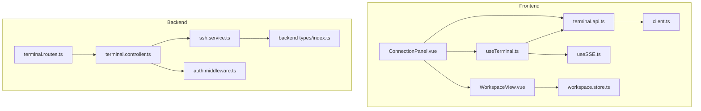
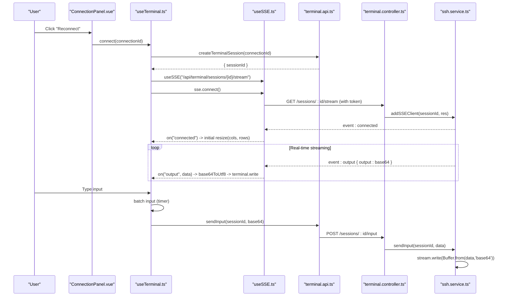
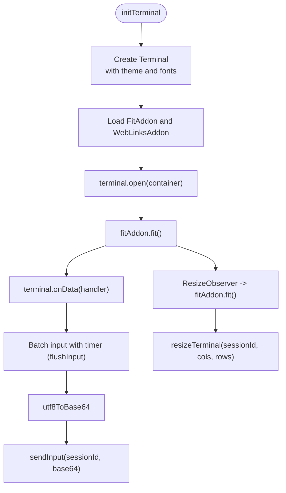
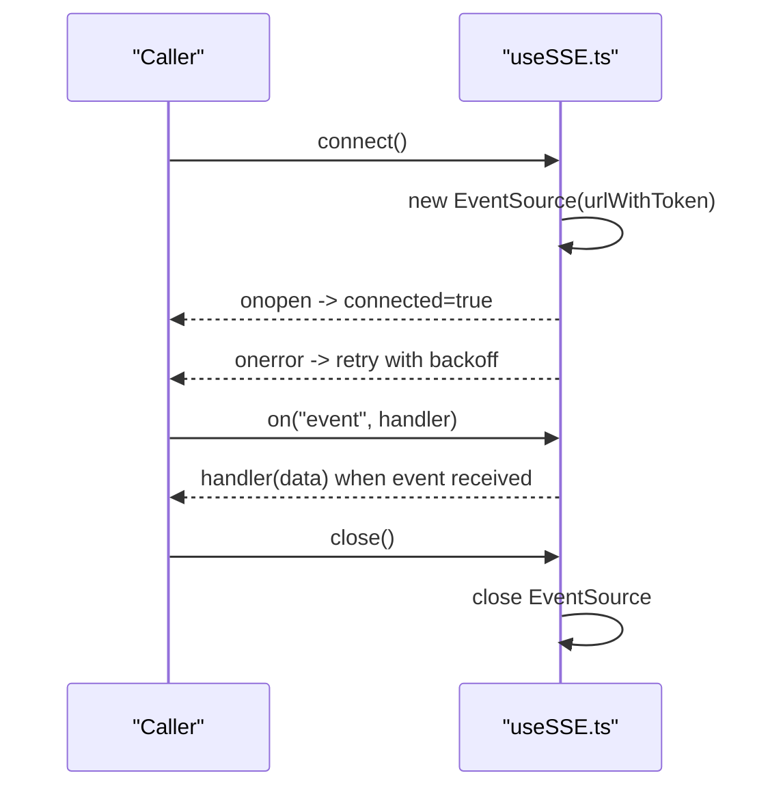
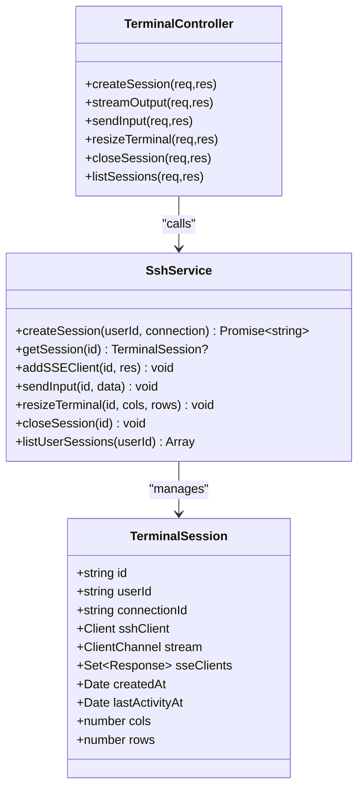
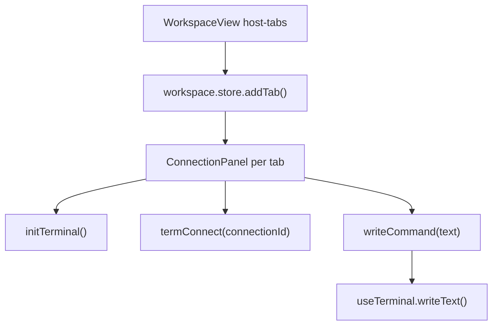
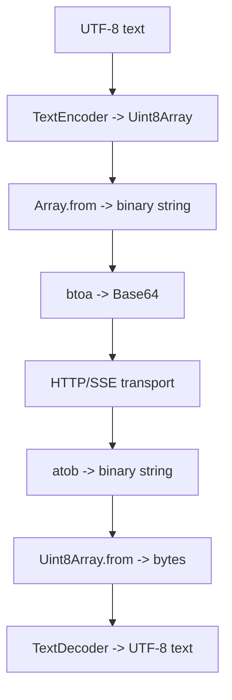
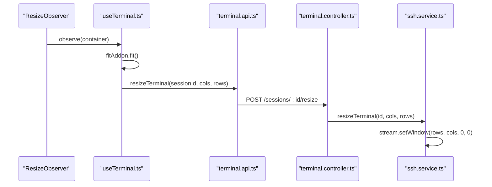
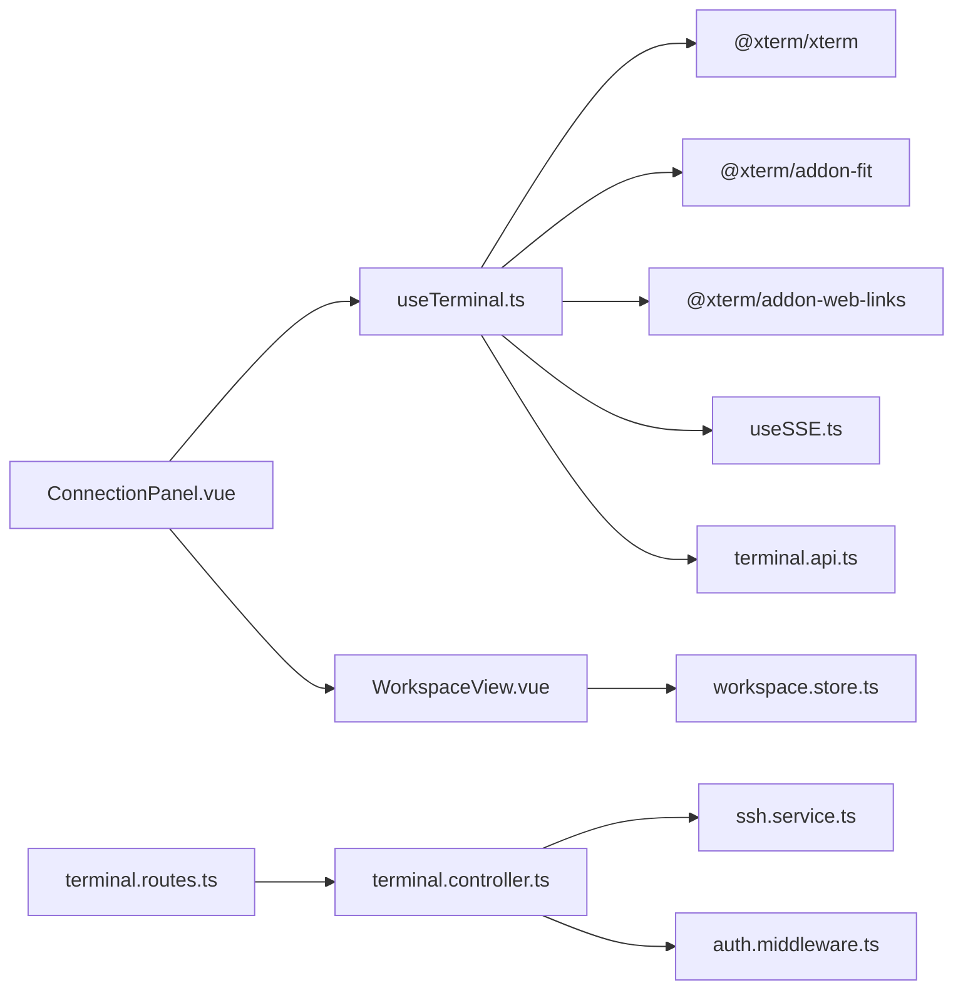

# Terminal Interface and XTerm.js Integration

<cite>
**Referenced Files in This Document**
- [useTerminal.ts](file://frontend/src/composables/useTerminal.ts)
- [useSSE.ts](file://frontend/src/composables/useSSE.ts)
- [terminal.api.ts](file://frontend/src/api/terminal.api.ts)
- [ConnectionPanel.vue](file://frontend/src/views/ConnectionPanel.vue)
- [WorkspaceView.vue](file://frontend/src/views/WorkspaceView.vue)
- [workspace.store.ts](file://frontend/src/stores/workspace.store.ts)
- [client.ts](file://frontend/src/api/client.ts)
- [terminal.controller.ts](file://backend/src/controllers/terminal.controller.ts)
- [terminal.routes.ts](file://backend/src/routes/terminal.routes.ts)
- [ssh.service.ts](file://backend/src/services/ssh.service.ts)
- [auth.middleware.ts](file://backend/src/middleware/auth.middleware.ts)
- [index.ts](file://backend/src/types/index.ts)
- [index.ts](file://frontend/src/types/index.ts)
</cite>

## Table of Contents
1. [Introduction](#introduction)
2. [Project Structure](#project-structure)
3. [Core Components](#core-components)
4. [Architecture Overview](#architecture-overview)
5. [Detailed Component Analysis](#detailed-component-analysis)
6. [Dependency Analysis](#dependency-analysis)
7. [Performance Considerations](#performance-considerations)
8. [Troubleshooting Guide](#troubleshooting-guide)
9. [Conclusion](#conclusion)

## Introduction
This document explains the terminal interface implementation with XTerm.js integration and real-time streaming. It focuses on the useTerminal composable that manages terminal instance creation, session lifecycle, and real-time data streaming via Server-Sent Events (SSE). It also documents initialization, addons for search, selection, and Unicode support, the tabbed interface for multiple sessions, Base64 encoding/decoding for data transport, terminal resizing, scrollback buffer considerations, event handling, keyboard input processing, output formatting, performance optimizations, backend SSH integration, error handling, and user experience enhancements.

## Project Structure
The terminal feature spans the frontend and backend:
- Frontend composables and views orchestrate terminal lifecycle, SSE, and UI.
- Backend routes, controllers, and services manage SSH sessions and SSE delivery.

**Diagram sources**
- [ConnectionPanel.vue:159-251](file://frontend/src/views/ConnectionPanel.vue#L159-L251)
- [useTerminal.ts:12-236](file://frontend/src/composables/useTerminal.ts#L12-L236)
- [useSSE.ts:3-83](file://frontend/src/composables/useSSE.ts#L3-L83)
- [terminal.api.ts:3-25](file://frontend/src/api/terminal.api.ts#L3-L25)
- [WorkspaceView.vue:69-141](file://frontend/src/views/WorkspaceView.vue#L69-L141)
- [workspace.store.ts:5-82](file://frontend/src/stores/workspace.store.ts#L5-L82)
- [client.ts:3-33](file://frontend/src/api/client.ts#L3-L33)
- [terminal.routes.ts:12-23](file://backend/src/routes/terminal.routes.ts#L12-L23)
- [terminal.controller.ts:22-157](file://backend/src/controllers/terminal.controller.ts#L22-L157)
- [ssh.service.ts:33-248](file://backend/src/services/ssh.service.ts#L33-L248)
- [auth.middleware.ts:10-32](file://backend/src/middleware/auth.middleware.ts#L10-L32)
- [index.ts:43-54](file://backend/src/types/index.ts#L43-L54)

**Section sources**
- [ConnectionPanel.vue:159-251](file://frontend/src/views/ConnectionPanel.vue#L159-L251)
- [useTerminal.ts:12-236](file://frontend/src/composables/useTerminal.ts#L12-L236)
- [terminal.routes.ts:12-23](file://backend/src/routes/terminal.routes.ts#L12-L23)
- [terminal.controller.ts:22-157](file://backend/src/controllers/terminal.controller.ts#L22-L157)
- [ssh.service.ts:33-248](file://backend/src/services/ssh.service.ts#L33-L248)

## Core Components
- useTerminal composable: Creates and configures XTerm, loads addons, handles input batching, Base64 encoding, SSE streaming, resizing, and lifecycle.
- useSSE composable: Manages EventSource lifecycle, reconnection, and event dispatch.
- terminal.api: Frontend HTTP client wrappers for session management and terminal operations.
- ConnectionPanel: Hosts the terminal container, wires up useTerminal, and exposes writeCommand for external input.
- WorkspaceView and workspace.store: Provide tabbed interface for multiple terminal sessions.

**Section sources**
- [useTerminal.ts:12-236](file://frontend/src/composables/useTerminal.ts#L12-L236)
- [useSSE.ts:3-83](file://frontend/src/composables/useSSE.ts#L3-L83)
- [terminal.api.ts:3-25](file://frontend/src/api/terminal.api.ts#L3-L25)
- [ConnectionPanel.vue:181-197](file://frontend/src/views/ConnectionPanel.vue#L181-L197)
- [WorkspaceView.vue:9-26](file://frontend/src/views/WorkspaceView.vue#L9-L26)
- [workspace.store.ts:15-33](file://frontend/src/stores/workspace.store.ts#L15-L33)

## Architecture Overview
The terminal architecture integrates XTerm.js with a backend SSH service over SSE:
- Frontend initializes XTerm, loads addons, and opens the terminal in a container.
- Input events are batched and sent to the backend as Base64-encoded UTF-8.
- Backend creates an SSH shell session, relays output to SSE clients, and handles input/resizing.
- SSE delivers Base64-encoded output chunks to the frontend, which decodes and writes to the terminal.

**Diagram sources**
- [ConnectionPanel.vue:258-265](file://frontend/src/views/ConnectionPanel.vue#L258-L265)
- [useTerminal.ts:132-179](file://frontend/src/composables/useTerminal.ts#L132-L179)
- [useSSE.ts:11-50](file://frontend/src/composables/useSSE.ts#L11-L50)
- [terminal.api.ts:3-20](file://frontend/src/api/terminal.api.ts#L3-L20)
- [terminal.controller.ts:45-81](file://backend/src/controllers/terminal.controller.ts#L45-L81)
- [ssh.service.ts:172-202](file://backend/src/services/ssh.service.ts#L172-L202)

## Detailed Component Analysis

### useTerminal Composable
Responsibilities:
- Initialize XTerm with theme and font settings.
- Load FitAddon and WebLinksAddon.
- Open terminal in a DOM container and fit to container size.
- Batch user input and send Base64-encoded UTF-8 to backend.
- Manage SSE connection for real-time output, errors, and close events.
- Handle terminal resizing and propagate to backend.
- Dispose resources on unmount.

Key behaviors:
- Input tracking: Maintains a command line buffer and escape sequence detection to capture commands on Enter while preserving Unicode.
- Base64 helpers: Encodes/decodes UTF-8 strings to support international characters and emojis.
- Lifecycle: connect/disconnect/create/close with proper error propagation.

**Diagram sources**
- [useTerminal.ts:26-118](file://frontend/src/composables/useTerminal.ts#L26-L118)
- [useTerminal.ts:120-130](file://frontend/src/composables/useTerminal.ts#L120-L130)
- [useTerminal.ts:210-222](file://frontend/src/composables/useTerminal.ts#L210-L222)

**Section sources**
- [useTerminal.ts:12-236](file://frontend/src/composables/useTerminal.ts#L12-L236)

### useSSE Composable
Responsibilities:
- Manage EventSource lifecycle with token injection.
- Auto-retry on connection loss with exponential backoff.
- Dispatch events to registered handlers.
- Close connection cleanly.

**Diagram sources**
- [useSSE.ts:11-50](file://frontend/src/composables/useSSE.ts#L11-L50)
- [useSSE.ts:63-68](file://frontend/src/composables/useSSE.ts#L63-L68)

**Section sources**
- [useSSE.ts:3-83](file://frontend/src/composables/useSSE.ts#L3-L83)

### Frontend API Layer
- createTerminalSession: POST /terminal/sessions with connectionId.
- sendInput: POST /terminal/sessions/:sessionId/input with base64 data.
- resizeTerminal: POST /terminal/sessions/:sessionId/resize with cols/rows.
- closeTerminalSession: DELETE /terminal/sessions/:sessionId.
- listSessions: GET /terminal/sessions.

**Section sources**
- [terminal.api.ts:3-25](file://frontend/src/api/terminal.api.ts#L3-L25)

### Backend Terminal Controller and Services
- Routes: Enforce auth middleware and expose session endpoints.
- Controller: Validates requests, streams output via SSE, sends input, resizes, closes sessions.
- Service: Manages SSH sessions, SSE clients, input forwarding, resizing, and timeouts.

**Diagram sources**
- [terminal.controller.ts:22-157](file://backend/src/controllers/terminal.controller.ts#L22-L157)
- [ssh.service.ts:33-248](file://backend/src/services/ssh.service.ts#L33-L248)
- [index.ts:43-54](file://backend/src/types/index.ts#L43-L54)

**Section sources**
- [terminal.routes.ts:12-23](file://backend/src/routes/terminal.routes.ts#L12-L23)
- [terminal.controller.ts:22-157](file://backend/src/controllers/terminal.controller.ts#L22-L157)
- [ssh.service.ts:33-248](file://backend/src/services/ssh.service.ts#L33-L248)

### Tabbed Interface for Multiple Sessions
- WorkspaceView renders host tabs and hosts ConnectionPanel instances per tab.
- workspace.store manages tabs, active tab, and sub-tabs.
- ConnectionPanel wires useTerminal to the terminal container and exposes writeCommand for command history integration.

**Diagram sources**
- [WorkspaceView.vue:9-26](file://frontend/src/views/WorkspaceView.vue#L9-L26)
- [WorkspaceView.vue:134-140](file://frontend/src/views/WorkspaceView.vue#L134-L140)
- [workspace.store.ts:15-33](file://frontend/src/stores/workspace.store.ts#L15-L33)
- [ConnectionPanel.vue:181-197](file://frontend/src/views/ConnectionPanel.vue#L181-L197)

**Section sources**
- [WorkspaceView.vue:9-26](file://frontend/src/views/WorkspaceView.vue#L9-L26)
- [workspace.store.ts:15-33](file://frontend/src/stores/workspace.store.ts#L15-L33)
- [ConnectionPanel.vue:181-197](file://frontend/src/views/ConnectionPanel.vue#L181-L197)

### Base64 Encoding/Decoding for Terminal Data Transmission
- Frontend: utf8ToBase64 encodes typed input; base64ToUtf8 decodes streamed output.
- Backend: SSH stream data is base64-encoded before sending via SSE; input is base64-decoded before writing to the stream.

**Diagram sources**
- [useTerminal.ts:210-222](file://frontend/src/composables/useTerminal.ts#L210-L222)
- [ssh.service.ts:77-88](file://backend/src/services/ssh.service.ts#L77-L88)
- [ssh.service.ts:196-202](file://backend/src/services/ssh.service.ts#L196-L202)

**Section sources**
- [useTerminal.ts:210-222](file://frontend/src/composables/useTerminal.ts#L210-L222)
- [ssh.service.ts:77-88](file://backend/src/services/ssh.service.ts#L77-L88)
- [ssh.service.ts:196-202](file://backend/src/services/ssh.service.ts#L196-L202)

### Terminal Resizing Mechanisms
- Frontend: ResizeObserver triggers fitAddon.fit(); after fit, sends resizeTerminal to backend.
- Backend: Updates session dimensions and calls stream.setWindow(rows, cols, 0, 0).

**Diagram sources**
- [useTerminal.ts:103-113](file://frontend/src/composables/useTerminal.ts#L103-L113)
- [terminal.api.ts:14-16](file://frontend/src/api/terminal.api.ts#L14-L16)
- [terminal.controller.ts:110-135](file://backend/src/controllers/terminal.controller.ts#L110-L135)
- [ssh.service.ts:204-212](file://backend/src/services/ssh.service.ts#L204-L212)

**Section sources**
- [useTerminal.ts:103-113](file://frontend/src/composables/useTerminal.ts#L103-L113)
- [terminal.controller.ts:110-135](file://backend/src/controllers/terminal.controller.ts#L110-L135)
- [ssh.service.ts:204-212](file://backend/src/services/ssh.service.ts#L204-L212)

### Scrollback Buffer Management
- XTerm maintains its own scrollback buffer internally. The current implementation does not expose explicit scrollback configuration in the composable. For large outputs, consider enabling virtual scrolling in XTerm (not present in current code) to optimize rendering performance.

**Section sources**
- [useTerminal.ts:29-55](file://frontend/src/composables/useTerminal.ts#L29-L55)

### Terminal Initialization and Addons
- Initialization sets cursor blink, font family/size, and theme.
- Addons loaded: FitAddon for container fitting, WebLinksAddon for clickable links.

**Section sources**
- [useTerminal.ts:29-59](file://frontend/src/composables/useTerminal.ts#L29-L59)

### Keyboard Input Processing and Command History
- onData handler batches input, tracks escape sequences, captures commands on carriage return, and invokes onCommand callback for history saving.
- Tab character is ignored to defer completion to server-side.

**Section sources**
- [useTerminal.ts:65-96](file://frontend/src/composables/useTerminal.ts#L65-L96)
- [ConnectionPanel.vue:191-193](file://frontend/src/views/ConnectionPanel.vue#L191-L193)

### Output Formatting and Unicode Support
- Base64 decoding ensures proper UTF-8 output rendering, supporting Chinese, emoji, and other Unicode glyphs.

**Section sources**
- [useTerminal.ts:148-154](file://frontend/src/composables/useTerminal.ts#L148-L154)
- [useTerminal.ts:217-222](file://frontend/src/composables/useTerminal.ts#L217-L222)

### Integration with Backend SSH Services
- Frontend connects via createTerminalSession; backend establishes SSH shell and registers SSE clients.
- Authentication middleware supports tokens via Authorization header or query param for SSE.

**Section sources**
- [terminal.api.ts:3-8](file://frontend/src/api/terminal.api.ts#L3-L8)
- [terminal.controller.ts:22-43](file://backend/src/controllers/terminal.controller.ts#L22-L43)
- [auth.middleware.ts:10-32](file://backend/src/middleware/auth.middleware.ts#L10-L32)

### Error Handling for Connection Failures
- Frontend: useTerminal.connect() sets error state; SSE emits error events with messages; terminal writes formatted error lines.
- Backend: Controller validates requests and logs errors; SSH client error events propagate via SSE.

**Section sources**
- [useTerminal.ts:175-178](file://frontend/src/composables/useTerminal.ts#L175-L178)
- [useTerminal.ts:164-167](file://frontend/src/composables/useTerminal.ts#L164-L167)
- [terminal.controller.ts:83-108](file://backend/src/controllers/terminal.controller.ts#L83-L108)
- [ssh.service.ts:119-135](file://backend/src/services/ssh.service.ts#L119-L135)

### User Experience Enhancements
- Auto-scrolling: Not explicitly implemented in code; consider terminal options or scroll-to-bottom behavior post-write.
- Session persistence: Backend cleans idle sessions based on configured timeout; frontend reconnects as needed.

**Section sources**
- [ssh.service.ts:13-23](file://backend/src/services/ssh.service.ts#L13-L23)
- [useTerminal.ts:164-167](file://frontend/src/composables/useTerminal.ts#L164-L167)

## Dependency Analysis
- Frontend dependencies:
  - useTerminal depends on XTerm, FitAddon, WebLinksAddon, useSSE, and terminal.api.
  - ConnectionPanel depends on useTerminal and workspace.store.
- Backend dependencies:
  - terminal.routes depends on terminal.controller.
  - terminal.controller depends on ssh.service and auth.middleware.

**Diagram sources**
- [useTerminal.ts:1-7](file://frontend/src/composables/useTerminal.ts#L1-L7)
- [ConnectionPanel.vue:160-168](file://frontend/src/views/ConnectionPanel.vue#L160-L168)
- [WorkspaceView.vue:74-76](file://frontend/src/views/WorkspaceView.vue#L74-L76)
- [terminal.routes.ts:12-23](file://backend/src/routes/terminal.routes.ts#L12-L23)
- [terminal.controller.ts:22-157](file://backend/src/controllers/terminal.controller.ts#L22-L157)
- [ssh.service.ts:33-248](file://backend/src/services/ssh.service.ts#L33-L248)
- [auth.middleware.ts:10-32](file://backend/src/middleware/auth.middleware.ts#L10-L32)

**Section sources**
- [useTerminal.ts:1-7](file://frontend/src/composables/useTerminal.ts#L1-L7)
- [ConnectionPanel.vue:160-168](file://frontend/src/views/ConnectionPanel.vue#L160-L168)
- [terminal.routes.ts:12-23](file://backend/src/routes/terminal.routes.ts#L12-L23)
- [terminal.controller.ts:22-157](file://backend/src/controllers/terminal.controller.ts#L22-L157)

## Performance Considerations
- Virtual scrolling: Not enabled in current XTerm configuration; consider enabling virtual scrolling in XTerm for large outputs.
- Memory management: Large Base64 payloads increase memory usage; batch input with flush timing reduces network overhead.
- Efficient DOM updates: XTerm handles rendering efficiently; avoid frequent re-initializations.
- SSE buffering: Backend sends padding and disables compression to minimize latency.

[No sources needed since this section provides general guidance]

## Troubleshooting Guide
Common issues and remedies:
- Authentication failures: Verify token presence and validity; SSE supports token via query param.
- Connection drops: useSSE auto-retries with exponential backoff; check network and backend logs.
- Unicode garbled: Ensure Base64 encode/decode is applied consistently on both ends.
- Resize anomalies: Confirm fitAddon.fit() runs before sending resizeTerminal.

**Section sources**
- [auth.middleware.ts:10-32](file://backend/src/middleware/auth.middleware.ts#L10-L32)
- [useSSE.ts:30-44](file://frontend/src/composables/useSSE.ts#L30-L44)
- [useTerminal.ts:210-222](file://frontend/src/composables/useTerminal.ts#L210-L222)
- [useTerminal.ts:103-113](file://frontend/src/composables/useTerminal.ts#L103-L113)

## Conclusion
The terminal interface leverages XTerm.js with robust SSE streaming, Base64-encoded UTF-8 transport, and a tabbed UI for multiple sessions. The useTerminal composable centralizes lifecycle, input batching, and SSE handling, while the backend SSH service ensures secure, scalable terminal access. Performance can be further optimized with virtual scrolling and careful memory management for large outputs.