# Vue.js Application Structure

<cite>
**Referenced Files in This Document**
- [main.ts](file://frontend/src/main.ts)
- [App.vue](file://frontend/src/App.vue)
- [router/index.ts](file://frontend/src/router/index.ts)
- [i18n/index.ts](file://frontend/src/i18n/index.ts)
- [i18n/locales/en.ts](file://frontend/src/i18n/locales/en.ts)
- [i18n/locales/zh.ts](file://frontend/src/i18n/locales/zh.ts)
- [components/LanguageSwitcher.vue](file://frontend/src/components/LanguageSwitcher.vue)
- [views/LoginView.vue](file://frontend/src/views/LoginView.vue)
- [views/DashboardView.vue](file://frontend/src/views/DashboardView.vue)
- [views/WorkspaceView.vue](file://frontend/src/views/WorkspaceView.vue)
- [views/ConnectionPanel.vue](file://frontend/src/views/ConnectionPanel.vue)
- [views/FileEditorModal.vue](file://frontend/src/views/FileEditorModal.vue)
- [stores/auth.store.ts](file://frontend/src/stores/auth.store.ts)
- [stores/connections.store.ts](file://frontend/src/stores/connections.store.ts)
- [stores/workspace.store.ts](file://frontend/src/stores/workspace.store.ts)
- [composables/useTerminal.ts](file://frontend/src/composables/useTerminal.ts)
- [composables/useSftp.ts](file://frontend/src/composables/useSftp.ts)
- [types/index.ts](file://frontend/src/types/index.ts)
- [api/auth.api.ts](file://frontend/src/api/auth.api.ts)
- [package.json](file://frontend/package.json)
</cite>

## Update Summary
**Changes Made**
- Added comprehensive internationalization system documentation with vue-i18n integration
- Documented LanguageSwitcher component and locale management functionality
- Updated component analysis to include i18n usage patterns across all views
- Added i18n initialization and configuration details
- Enhanced troubleshooting guide with localization considerations

## Table of Contents
1. [Introduction](#introduction)
2. [Project Structure](#project-structure)
3. [Internationalization System](#internationalization-system)
4. [Core Components](#core-components)
5. [Architecture Overview](#architecture-overview)
6. [Detailed Component Analysis](#detailed-component-analysis)
7. [Dependency Analysis](#dependency-analysis)
8. [Performance Considerations](#performance-considerations)
9. [Troubleshooting Guide](#troubleshooting-guide)
10. [Conclusion](#conclusion)

## Introduction
This document explains the Vue.js Single Page Application architecture for the web terminal application. It covers the application bootstrap process, component hierarchy, routing with Vue Router 4, view components (LoginView, DashboardView, WorkspaceView), internationalization with vue-i18n, component lifecycle, prop passing, event handling, slots, router integration, route guards, navigation patterns, component composition, dynamic imports, and the overall initialization sequence. It also highlights Vue 3 Composition API usage, reactivity fundamentals, and template syntax best practices.

## Project Structure
The frontend is organized around a classic SPA layout with comprehensive internationalization support:
- Application bootstrap initializes the Vue app, Pinia, Vue Router, and vue-i18n.
- Internationalization system provides multi-language support with automatic locale detection and persistence.
- Views represent top-level pages rendered by the router with localized content.
- Stores manage global state via Pinia.
- Composables encapsulate reusable logic for terminal and SFTP.
- Types define shared interfaces across the app.

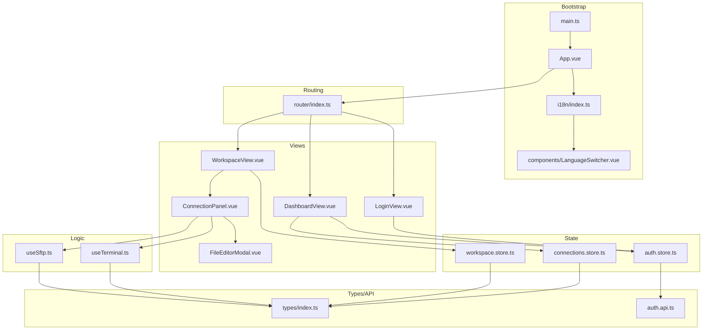

**Diagram sources**
- [main.ts:1-13](file://frontend/src/main.ts#L1-L13)
- [App.vue:1-21](file://frontend/src/App.vue#L1-L21)
- [i18n/index.ts:1-43](file://frontend/src/i18n/index.ts#L1-L43)
- [components/LanguageSwitcher.vue:1-126](file://frontend/src/components/LanguageSwitcher.vue#L1-L126)
- [router/index.ts:1-44](file://frontend/src/router/index.ts#L1-L44)
- [views/LoginView.vue:1-183](file://frontend/src/views/LoginView.vue#L1-L183)
- [views/DashboardView.vue:1-408](file://frontend/src/views/DashboardView.vue#L1-L408)
- [views/WorkspaceView.vue:1-361](file://frontend/src/views/WorkspaceView.vue#L1-L361)
- [views/ConnectionPanel.vue:1-667](file://frontend/src/views/ConnectionPanel.vue#L1-L667)
- [views/FileEditorModal.vue:1-430](file://frontend/src/views/FileEditorModal.vue#L1-L430)
- [stores/auth.store.ts:1-54](file://frontend/src/stores/auth.store.ts#L1-L54)
- [stores/connections.store.ts:1-43](file://frontend/src/stores/connections.store.ts#L1-L43)
- [stores/workspace.store.ts:1-83](file://frontend/src/stores/workspace.store.ts#L1-L83)
- [composables/useTerminal.ts:1-237](file://frontend/src/composables/useTerminal.ts#L1-L237)
- [composables/useSftp.ts:1-154](file://frontend/src/composables/useSftp.ts#L1-L154)
- [types/index.ts:1-56](file://frontend/src/types/index.ts#L1-L56)
- [api/auth.api.ts:1-25](file://frontend/src/api/auth.api.ts#L1-L25)

**Section sources**
- [main.ts:1-13](file://frontend/src/main.ts#L1-L13)
- [router/index.ts:1-44](file://frontend/src/router/index.ts#L1-L44)

## Internationalization System

### vue-i18n Integration
The application uses vue-i18n v9.14.5 for comprehensive internationalization support. The system provides:
- Composition API mode for modern Vue 3 development
- Automatic locale detection from localStorage or browser settings
- Fallback to English as default locale
- Persistent locale selection across browser sessions
- Rich text formatting with named placeholders

### Locale Management
The i18n system manages two locales (English and Chinese) with comprehensive translation coverage:
- Automatic locale detection with localStorage persistence
- Dynamic locale switching with immediate UI updates
- HTML lang attribute updates for accessibility compliance
- Comprehensive translation keys covering all UI elements

### Language Switcher Component
The LanguageSwitcher component provides an intuitive dropdown interface for locale selection:
- Dropdown menu with flag icons and language names
- Active state highlighting for current locale
- Smooth animations and hover effects
- Responsive design with proper spacing
- Integration with the global i18n instance

**Section sources**
- [i18n/index.ts:1-43](file://frontend/src/i18n/index.ts#L1-L43)
- [i18n/locales/en.ts:1-114](file://frontend/src/i18n/locales/en.ts#L1-L114)
- [i18n/locales/zh.ts:1-114](file://frontend/src/i18n/locales/zh.ts#L1-L114)
- [components/LanguageSwitcher.vue:1-126](file://frontend/src/components/LanguageSwitcher.vue#L1-L126)

## Core Components
- Application bootstrap: Initializes the Vue app instance, installs Pinia, Vue Router, and vue-i18n, and mounts the root component.
- Root component: Wraps router-view with keep-alive to preserve the WorkspaceView during navigation.
- Internationalization: Configures vue-i18n with Composition API, locale persistence, and automatic detection.
- Routing: Configures three routes with lazy-loaded components and route guards.
- View components: Provide user-facing pages for authentication, dashboard, and workspace with full i18n support.
- Stores: Manage authentication, connections, and workspace tabs.
- Composables: Encapsulate terminal and SFTP session logic.
- Types: Define shared interfaces for state and API contracts.

**Section sources**
- [main.ts:1-13](file://frontend/src/main.ts#L1-L13)
- [App.vue:1-21](file://frontend/src/App.vue#L1-L21)
- [i18n/index.ts:19-37](file://frontend/src/i18n/index.ts#L19-L37)
- [router/index.ts:1-44](file://frontend/src/router/index.ts#L1-L44)
- [stores/auth.store.ts:1-54](file://frontend/src/stores/auth.store.ts#L1-L54)
- [stores/connections.store.ts:1-43](file://frontend/src/stores/connections.store.ts#L1-L43)
- [stores/workspace.store.ts:1-83](file://frontend/src/stores/workspace.store.ts#L1-L83)
- [composables/useTerminal.ts:1-237](file://frontend/src/composables/useTerminal.ts#L1-L237)
- [composables/useSftp.ts:1-154](file://frontend/src/composables/useSftp.ts#L1-L154)
- [types/index.ts:1-56](file://frontend/src/types/index.ts#L1-L56)

## Architecture Overview
The SPA follows a clear separation of concerns with comprehensive internationalization:
- Bootstrap initializes the app container, plugins, and i18n system.
- i18n system provides global translation capabilities with persistent locale management.
- Router controls navigation and guards.
- Views render page-level templates with localized content and integrate LanguageSwitcher.
- Stores centralize state and expose reactive getters and actions.
- Composables encapsulate domain-specific logic and integrate with APIs.
- Types ensure consistency across stores, views, and composables.

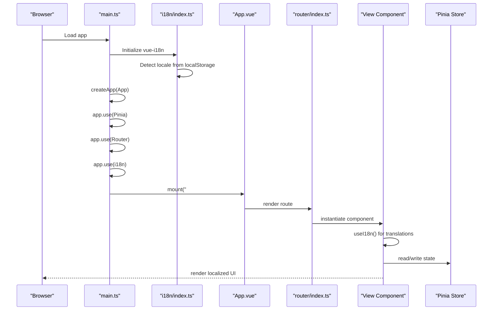

**Diagram sources**
- [main.ts:1-13](file://frontend/src/main.ts#L1-L13)
- [i18n/index.ts:19-37](file://frontend/src/i18n/index.ts#L19-L37)
- [App.vue:1-21](file://frontend/src/App.vue#L1-L21)
- [router/index.ts:1-44](file://frontend/src/router/index.ts#L1-L44)

## Detailed Component Analysis

### Application Bootstrap and Root Component
- Bootstrap: Creates the Vue app, installs Pinia and Router, initializes vue-i18n, imports global styles, and mounts to the DOM.
- Root component: Uses router-view with a v-slot to wrap the active component inside keep-alive, preserving WorkspaceView state across navigations. It also initializes authentication on mount by checking the auth store's authentication state and fetching user details if needed.

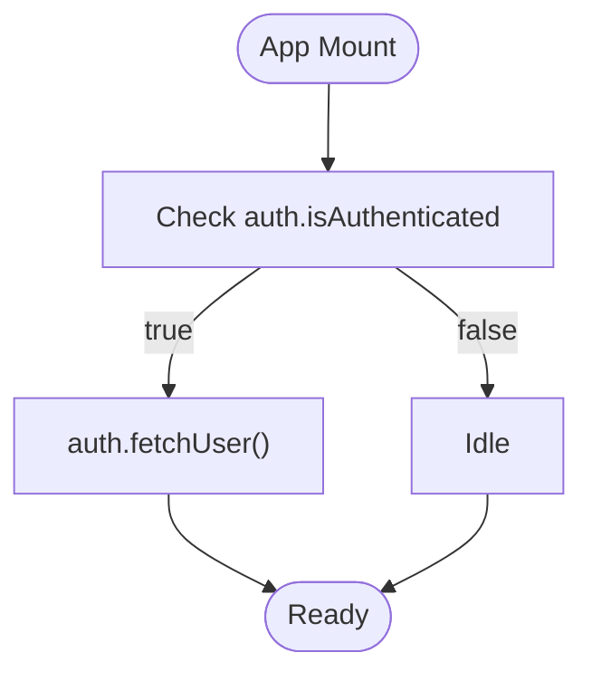

**Diagram sources**
- [App.vue:15-19](file://frontend/src/App.vue#L15-L19)
- [stores/auth.store.ts:35-43](file://frontend/src/stores/auth.store.ts#L35-L43)

**Section sources**
- [main.ts:1-13](file://frontend/src/main.ts#L1-L13)
- [App.vue:1-21](file://frontend/src/App.vue#L1-L21)

### Internationalization Integration in Components

#### Translation Usage Patterns
All view components utilize the Composition API `useI18n()` function to access translations:
- LoginView: Uses t() function for all user-facing text including form labels, buttons, and error messages
- DashboardView: Implements complex translations with named placeholders for connection names and dynamic content
- WorkspaceView: Manages multiple translation contexts including tab labels, button text, and modal content
- ConnectionPanel: Provides comprehensive SFTP and terminal interface translations
- FileEditorModal: Handles specialized editor interface translations with keyboard shortcuts

#### Language Switcher Integration
Each major view includes the LanguageSwitcher component positioned strategically:
- LoginView: Top-right corner for easy access during authentication
- DashboardView: Top-right header area alongside user profile
- WorkspaceView: Top-right header area with responsive positioning
- ConnectionPanel: Integrated within the panel header for context-aware switching

**Section sources**
- [views/LoginView.vue:65](file://frontend/src/views/LoginView.vue#L65)
- [views/DashboardView.vue:116](file://frontend/src/views/DashboardView.vue#L116)
- [views/WorkspaceView.vue:83](file://frontend/src/views/WorkspaceView.vue#L83)
- [views/ConnectionPanel.vue:169](file://frontend/src/views/ConnectionPanel.vue#L169)
- [views/FileEditorModal.vue:79](file://frontend/src/views/FileEditorModal.vue#L79)

### Routing Configuration and Route Guards
- Routes:
  - Login: Lazy loads LoginView, marked as guest-only.
  - Dashboard: Lazy loads DashboardView, requires authentication.
  - Workspace: Lazy loads WorkspaceView, requires authentication.
- Route guards:
  - Redirect unauthenticated users attempting to access protected routes to Login.
  - Redirect authenticated users trying to access Login to Dashboard.
  - Prevent navigation to Workspace if there are no open tabs.

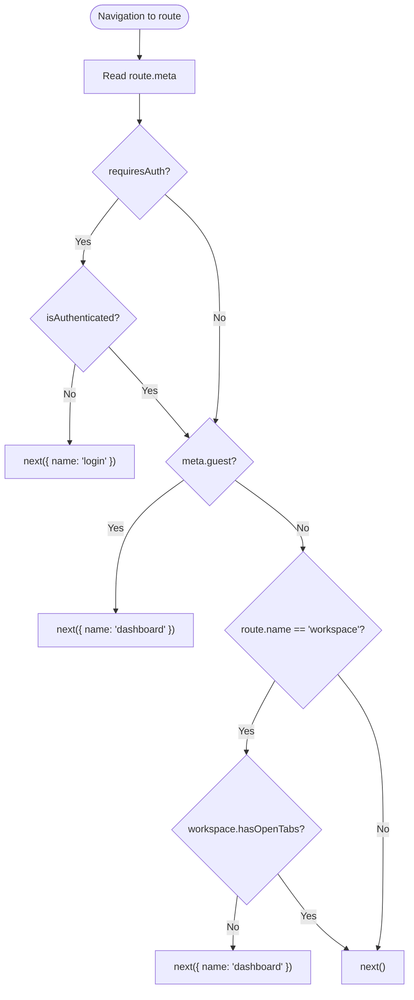

**Diagram sources**
- [router/index.ts:29-41](file://frontend/src/router/index.ts#L29-L41)
- [stores/workspace.store.ts:13](file://frontend/src/stores/workspace.store.ts#L13)

**Section sources**
- [router/index.ts:1-44](file://frontend/src/router/index.ts#L1-L44)
- [stores/workspace.store.ts:1-83](file://frontend/src/stores/workspace.store.ts#L1-L83)

### View Components

#### LoginView
- Purpose: Handles user authentication and registration with full internationalization support.
- Composition API usage: Reactive forms, refs for toggling register mode, and error/success messages using t() function.
- Navigation: On successful login, redirects to the dashboard; on registration, shows a success message and switches back to login form.
- Internationalization: All form labels, placeholders, buttons, and messages are fully localized.
- Template best practices: Two mutually exclusive forms controlled by a single reactive flag; scoped styles for isolation.

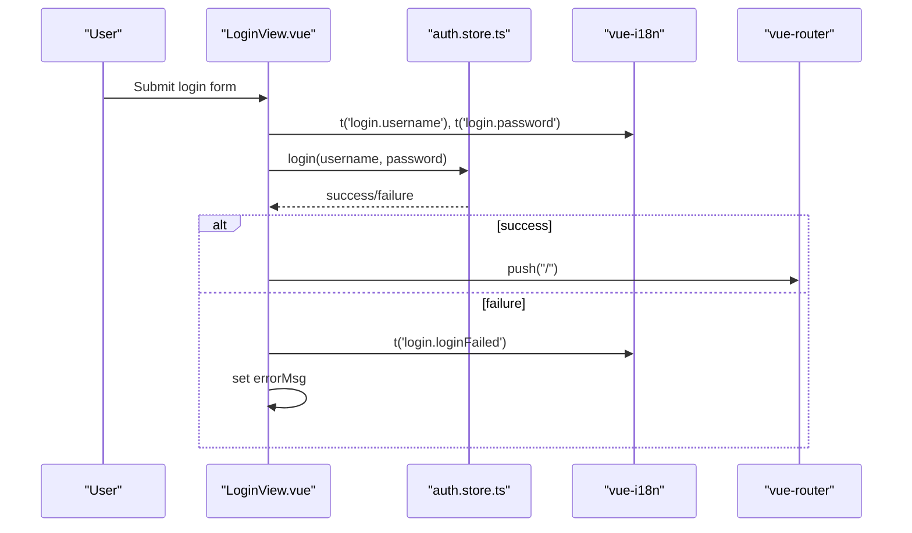

**Diagram sources**
- [views/LoginView.vue:70-90](file://frontend/src/views/LoginView.vue#L70-L90)
- [views/LoginView.vue:82](file://frontend/src/views/LoginView.vue#L82)
- [stores/auth.store.ts:14-24](file://frontend/src/stores/auth.store.ts#L14-L24)
- [router/index.ts:14-26](file://frontend/src/router/index.ts#L14-L26)

**Section sources**
- [views/LoginView.vue:1-183](file://frontend/src/views/LoginView.vue#L1-L183)
- [stores/auth.store.ts:1-54](file://frontend/src/stores/auth.store.ts#L1-L54)

#### DashboardView
- Purpose: Lists user connections, allows creating/editing/deleting connections, testing connectivity, and opening terminal/SFTP sessions.
- Composition API usage: Reactive state for forms, modals, and testing; onMounted to load connections.
- Navigation: Navigates to Workspace after adding a tab; logs out and redirects to Login.
- Internationalization: Comprehensive translations including connection management, form fields, and action buttons.
- Template best practices: Conditional rendering for loading, empty states, and modal overlays; scoped styles for layout and responsiveness.

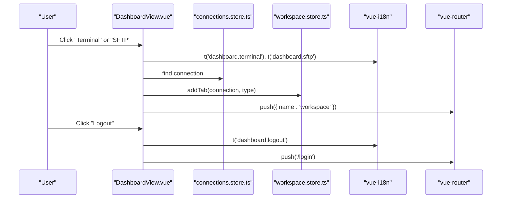

**Diagram sources**
- [views/DashboardView.vue:139-149](file://frontend/src/views/DashboardView.vue#L139-L149)
- [views/DashboardView.vue:214-217](file://frontend/src/views/DashboardView.vue#L214-L217)
- [views/DashboardView.vue:168-173](file://frontend/src/views/DashboardView.vue#L168-173)
- [stores/connections.store.ts:1-43](file://frontend/src/stores/connections.store.ts#L1-L43)
- [stores/workspace.store.ts:15-33](file://frontend/src/stores/workspace.store.ts#L15-L33)
- [router/index.ts:20-26](file://frontend/src/router/index.ts#L20-L26)

**Section sources**
- [views/DashboardView.vue:1-408](file://frontend/src/views/DashboardView.vue#L1-L408)
- [stores/connections.store.ts:1-43](file://frontend/src/stores/connections.store.ts#L1-L43)
- [stores/workspace.store.ts:1-83](file://frontend/src/stores/workspace.store.ts#L1-L83)

#### WorkspaceView
- Purpose: Hosts multiple tabs for terminal/SFTP sessions, manages tab lifecycle, and provides a command history panel.
- Composition API usage: Reactive state for history panel visibility and commands; template refs to access child ConnectionPanel instances.
- Navigation: Returns to Dashboard when closing the last tab; integrates with route guards to prevent navigation to Workspace without tabs.
- Internationalization: Full translations for tab labels, command history, and workspace controls.
- Template best practices: Dynamic rendering of ConnectionPanel per tab; conditional visibility and scoped styles for tab bar and history popup.

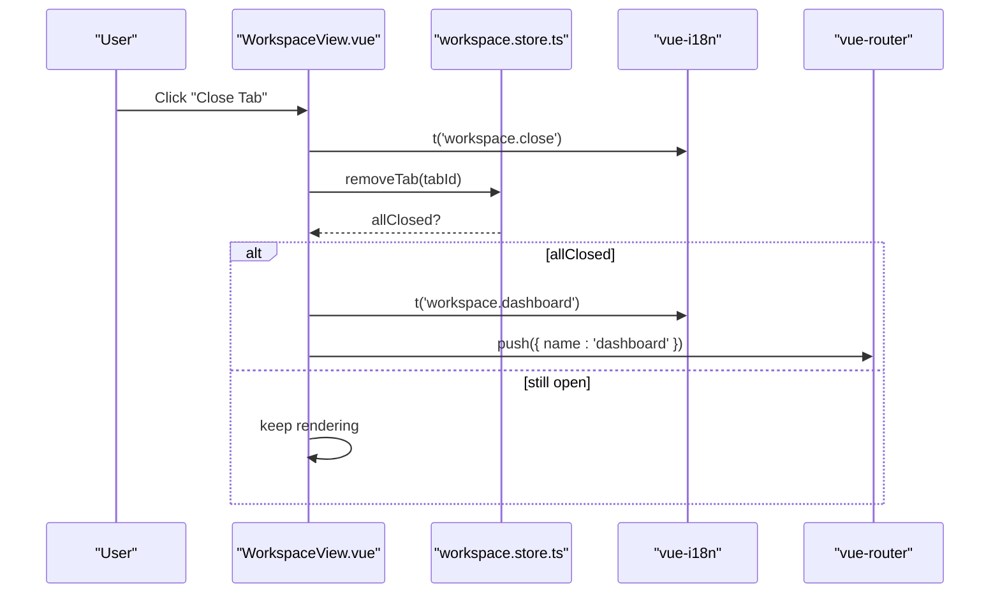

**Diagram sources**
- [views/WorkspaceView.vue:134-140](file://frontend/src/views/WorkspaceView.vue#L134-L140)
- [views/WorkspaceView.vue:16-18](file://frontend/src/views/WorkspaceView.vue#L16-L18)
- [stores/workspace.store.ts:35-51](file://frontend/src/stores/workspace.store.ts#L35-L51)
- [router/index.ts:36-41](file://frontend/src/router/index.ts#L36-L41)

**Section sources**
- [views/WorkspaceView.vue:1-361](file://frontend/src/views/WorkspaceView.vue#L1-L361)
- [stores/workspace.store.ts:1-83](file://frontend/src/stores/workspace.store.ts#L1-L83)

### Component Composition and Child Components

#### ConnectionPanel
- Purpose: Renders either a terminal or SFTP panel for a selected connection.
- Props: Receives connectionId, isActive, and activeSubTab.
- Events: Emits sub-tab changes and close events to parent.
- Exposed API: Provides writeCommand for external writes (e.g., from command history).
- Lifecycle: Initializes terminal on mount, connects to terminal session; sets up SFTP on first SFTP tab activation; cleans up on unmount.
- Internationalization: Comprehensive translations for terminal controls, SFTP operations, and file management.
- Dynamic imports: FileEditorModal is loaded lazily via defineAsyncComponent.

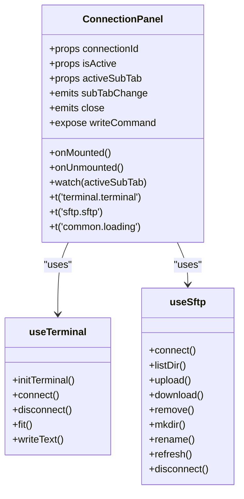

**Diagram sources**
- [views/ConnectionPanel.vue:170-179](file://frontend/src/views/ConnectionPanel.vue#L170-L179)
- [views/ConnectionPanel.vue:195-197](file://frontend/src/views/ConnectionPanel.vue#L195-L197)
- [views/ConnectionPanel.vue:10-18](file://frontend/src/views/ConnectionPanel.vue#L10-L18)
- [views/ConnectionPanel.vue:68-68](file://frontend/src/views/ConnectionPanel.vue#L68)
- [composables/useTerminal.ts:12-237](file://frontend/src/composables/useTerminal.ts#L12-L237)
- [composables/useSftp.ts:5-154](file://frontend/src/composables/useSftp.ts#L5-L154)

**Section sources**
- [views/ConnectionPanel.vue:1-667](file://frontend/src/views/ConnectionPanel.vue#L1-L667)
- [composables/useTerminal.ts:1-237](file://frontend/src/composables/useTerminal.ts#L1-L237)
- [composables/useSftp.ts:1-154](file://frontend/src/composables/useSftp.ts#L1-L154)

#### FileEditorModal
- Purpose: Provides a rich editor experience for remote files using CodeMirror.
- Props: Receives sessionId, target file (or null for new file), and current path.
- Events: Emits close and saved to notify parent.
- Lifecycle: Initializes editor on mount, handles save/format/close, and cleans up on unmount.
- Internationalization: Editor interface translations including status messages, keyboard shortcuts, and validation.
- Dynamic imports: Editor libraries are loaded via CodeMirror packages.

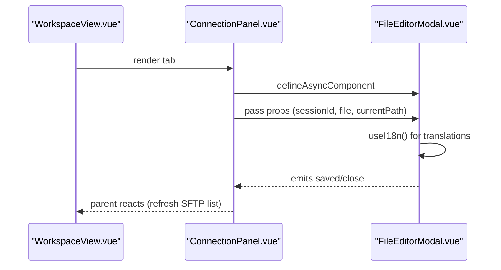

**Diagram sources**
- [views/ConnectionPanel.vue:168](file://frontend/src/views/ConnectionPanel.vue#L168)
- [views/FileEditorModal.vue:78-87](file://frontend/src/views/FileEditorModal.vue#L78-L87)
- [views/FileEditorModal.vue:203-242](file://frontend/src/views/FileEditorModal.vue#L203-L242)
- [views/FileEditorModal.vue:79](file://frontend/src/views/FileEditorModal.vue#L79)

**Section sources**
- [views/FileEditorModal.vue:1-430](file://frontend/src/views/FileEditorModal.vue#L1-L430)

### State Management with Pinia
- Authentication store: Manages user, token, loading state, and authentication status; persists token in localStorage; clears workspace on logout.
- Connections store: Loads, creates, updates, deletes, and tests connections; exposes loading state.
- Workspace store: Manages tabs, active tab, and helpers to add/remove tabs; computed hasOpenTabs.

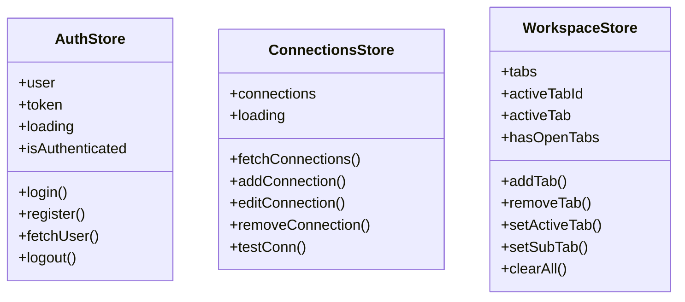

**Diagram sources**
- [stores/auth.store.ts:7-54](file://frontend/src/stores/auth.store.ts#L7-L54)
- [stores/connections.store.ts:6-43](file://frontend/src/stores/connections.store.ts#L6-L43)
- [stores/workspace.store.ts:5-83](file://frontend/src/stores/workspace.store.ts#L5-L83)

**Section sources**
- [stores/auth.store.ts:1-54](file://frontend/src/stores/auth.store.ts#L1-L54)
- [stores/connections.store.ts:1-43](file://frontend/src/stores/connections.store.ts#L1-L43)
- [stores/workspace.store.ts:1-83](file://frontend/src/stores/workspace.store.ts#L1-L83)

### API Layer and Types
- Authentication API: Provides register, login, and getMe endpoints.
- Shared types: Define User, Connection, ConnectionInput, FileEntry, TerminalSessionInfo, and WorkspaceTab.

**Section sources**
- [api/auth.api.ts:1-25](file://frontend/src/api/auth.api.ts#L1-L25)
- [types/index.ts:1-56](file://frontend/src/types/index.ts#L1-L56)

## Dependency Analysis
- Runtime dependencies include Vue 3, Vue Router 4, Pinia, vue-i18n, xterm, CodeMirror, and axios.
- Build-time dependencies include Vite, TypeScript, and vue-tsc.
- The app relies on lazy-loaded components for performance and modular code splitting.
- vue-i18n provides the foundation for comprehensive internationalization support.

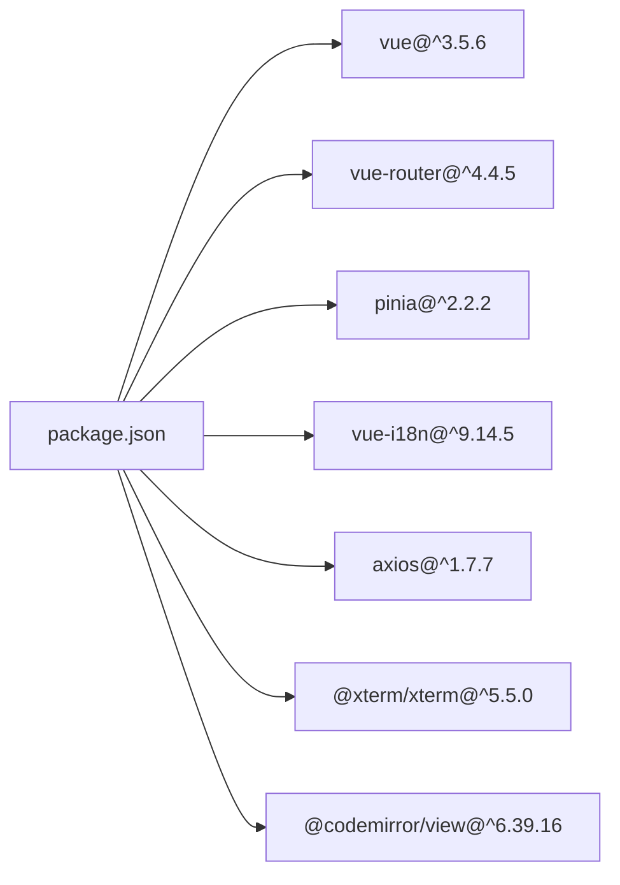

**Diagram sources**
- [package.json:10-36](file://frontend/package.json#L10-L36)

**Section sources**
- [package.json:1-46](file://frontend/package.json#L1-L46)

## Performance Considerations
- Lazy loading: Routes use dynamic imports to defer loading of heavy views until navigation occurs.
- Keep-alive: The root App.vue preserves the WorkspaceView state, reducing reinitialization costs.
- Composables: Encapsulate expensive operations (terminal/SFTP sessions) and clean up on unmount.
- Conditional rendering: Views avoid rendering heavy panels until needed (e.g., SFTP connect on first tab activation).
- i18n optimization: vue-i18n Composition API mode reduces bundle size and improves performance.

**Section sources**
- [router/index.ts:11](file://frontend/src/router/index.ts#L11)
- [router/index.ts:23](file://frontend/src/router/index.ts#L23)
- [App.vue:3](file://frontend/src/App.vue#L3)
- [views/ConnectionPanel.vue:224-231](file://frontend/src/views/ConnectionPanel.vue#L224-L231)
- [i18n/index.ts:20](file://frontend/src/i18n/index.ts#L20)

## Troubleshooting Guide
- Authentication failures: LoginView displays error messages derived from API responses; ensure credentials are correct and network requests succeed.
- Navigation loops: Route guards redirect to Login or Dashboard based on auth state; verify auth.isAuthenticated and workspace.hasOpenTabs.
- Terminal/SFTP errors: ConnectionPanel surfaces errors from terminal and SFTP composables; check session creation and SSE connections.
- State persistence: Auth store persists token in localStorage; clearing storage resets auth state and clears workspace.
- Internationalization issues: LanguageSwitcher component manages locale persistence; check localStorage for 'webterm-language' key.
- Translation problems: Ensure all UI text uses the t() function; verify translation keys exist in locale files.
- Locale switching: Confirm setLocale function updates both i18n.global.locale and HTML lang attribute.

**Section sources**
- [views/LoginView.vue:75-89](file://frontend/src/views/LoginView.vue#L75-L89)
- [router/index.ts:29-41](file://frontend/src/router/index.ts#L29-L41)
- [views/ConnectionPanel.vue:49](file://frontend/src/views/ConnectionPanel.vue#L49)
- [stores/auth.store.ts:45-50](file://frontend/src/stores/auth.store.ts#L45-L50)
- [components/LanguageSwitcher.vue:46-49](file://frontend/src/components/LanguageSwitcher.vue#L46-L49)
- [i18n/index.ts:29-33](file://frontend/src/i18n/index.ts#L29-L33)

## Conclusion
The application follows a clean SPA architecture with Vue 3 Composition API, Vue Router 4, Pinia, and comprehensive vue-i18n internationalization. The root App.vue preserves state for the WorkspaceView, routes are guarded for security and UX, and views compose child components with explicit props/events. Dynamic imports and keep-alive improve performance. The codebase demonstrates strong separation of concerns, reactive state management, robust error handling, and full internationalization support with automatic locale detection and persistence. The LanguageSwitcher component provides seamless language switching capabilities across all user-facing interfaces.