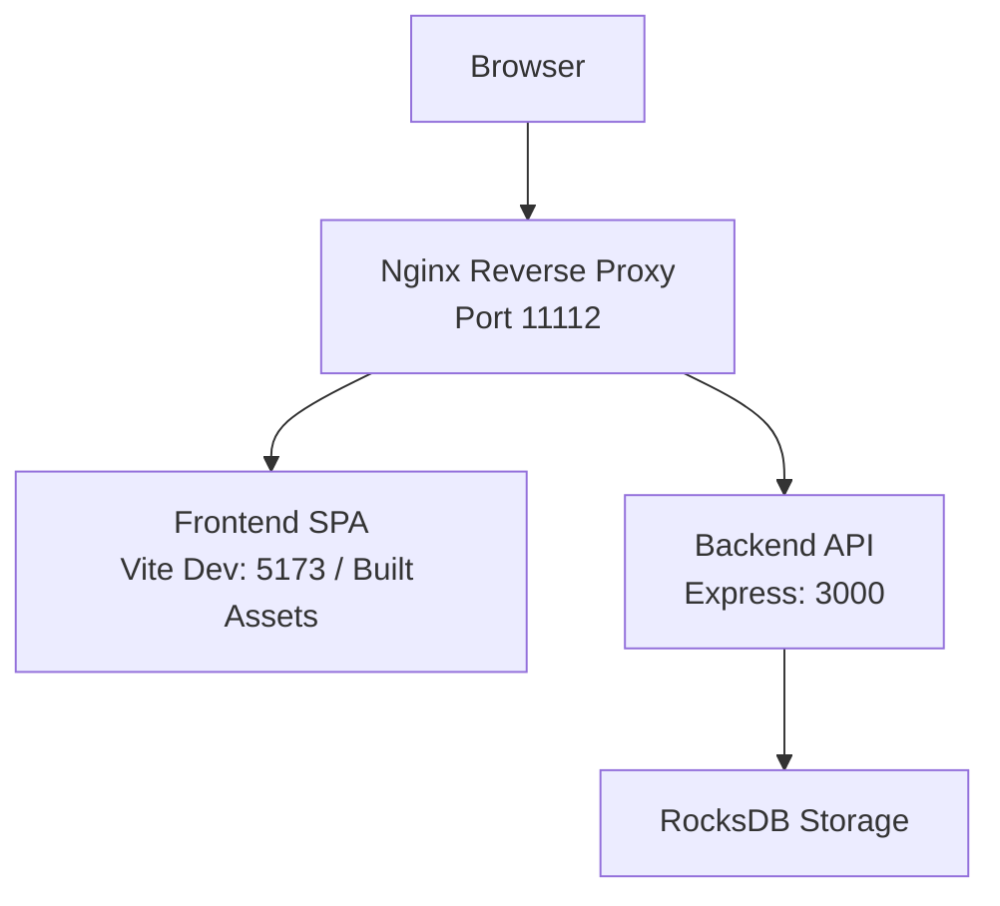

# Getting Started

<cite>
**Referenced Files in This Document**
- [README.md](file://README.md)
- [docker-compose.yml](file://docker-compose.yml)
- [backend/src/config/index.ts](file://backend/src/config/index.ts)
- [backend/src/app.ts](file://backend/src/app.ts)
- [backend/src/index.ts](file://backend/src/index.ts)
- [backend/package.json](file://backend/package.json)
- [frontend/vite.config.ts](file://frontend/vite.config.ts)
- [frontend/src/api/client.ts](file://frontend/src/api/client.ts)
- [frontend/package.json](file://frontend/package.json)
</cite>

## Table of Contents
1. [Introduction](#introduction)
2. [Prerequisites](#prerequisites)
3. [Quick Setup](#quick-setup)
4. [Environment Variables](#environment-variables)
5. [Access and Initial Usage](#access-and-initial-usage)
6. [Verification Steps](#verification-steps)
7. [Common Issues and Troubleshooting](#common-issues-and-troubleshooting)
8. [Architecture Overview](#architecture-overview)
9. [Conclusion](#conclusion)

## Introduction
WebTerm is a browser-based SSH terminal with real-time terminal interaction, SFTP file management, and online code editing. It provides a modern, secure way to manage remote servers directly from your browser. This guide helps you quickly set up WebTerm using the recommended Docker deployment or a local development environment, and then start using it to connect to SSH servers.

## Prerequisites
- Node.js 20+ (required for local development)
- Docker knowledge (required for Docker deployment)
- Access to an SSH server for testing connections

These prerequisites ensure you can either run the application locally during development or deploy it using Docker Compose.

**Section sources**
- [README.md:166-184](file://README.md#L166-L184)

## Quick Setup
There are two primary ways to get started with WebTerm:

### Option A: Docker Deployment (Recommended)
Follow these steps to deploy WebTerm using Docker Compose:

1. Clone the repository and copy the example environment file:
   - Clone the repository
   - Copy the example environment file to a new file named .env

2. Configure security-related environment variables:
   - Set MASTER_SECRET to a secure, random string of at least 32 characters
   - Set JWT_SECRET to a strong secret used for signing JWT tokens

3. Start the services:
   - Bring up the stack with Docker Compose in detached mode

4. Access the application:
   - Open your browser and navigate to http://localhost:11112

These steps are designed for quick deployment and are ideal for most users.

**Section sources**
- [README.md:139-165](file://README.md#L139-L165)
- [docker-compose.yml:1-49](file://docker-compose.yml#L1-L49)

### Option B: Local Development
For local development, you will run both the backend and frontend servers:

- Backend (Node.js 20+):
  - Navigate to the backend directory
  - Install dependencies
  - Start the development server

- Frontend (Node.js 20+):
  - Navigate to the frontend directory
  - Install dependencies
  - Start the development server

The frontend development server runs on http://localhost:5173, and the backend API runs on http://localhost:3000. The frontend proxy automatically forwards API requests to the backend.

**Section sources**
- [README.md:166-184](file://README.md#L166-L184)
- [frontend/vite.config.ts:12-21](file://frontend/vite.config.ts#L12-L21)
- [backend/package.json:6-11](file://backend/package.json#L6-L11)
- [frontend/package.json:5-9](file://frontend/package.json#L5-L9)

## Environment Variables
Configure the following environment variables for your deployment. These variables are loaded by the backend service and influence runtime behavior.

Mandatory variables:
- MASTER_SECRET: The master encryption key used to derive per-user encryption keys for storing SSH credentials. Must be at least 32 characters long.
- JWT_SECRET: The secret used to sign and verify JWT tokens.

Optional variables (with defaults shown):
- JWT_EXPIRES_IN: Default is 24h
- MAX_SESSIONS_PER_USER: Default is 5
- SESSION_TIMEOUT_MINUTES: Default is 30
- CORS_ORIGIN: Default is *
- PORT: Default is 3000
- NODE_ENV: Not set by default; set to production for Docker deployments
- ROCKSDB_PATH: Default is /app/data/rocksdb

Docker Compose sets production defaults and passes these variables to the backend service. The backend reads these values and applies them at startup.

**Section sources**
- [README.md:186-199](file://README.md#L186-L199)
- [backend/src/config/index.ts:3-21](file://backend/src/config/index.ts#L3-L21)
- [docker-compose.yml:24-34](file://docker-compose.yml#L24-L34)

## Access and Initial Usage
After starting the application, follow these steps to begin using WebTerm:

1. Access the application:
   - Docker deployment: Open http://localhost:11112
   - Local development: Open http://localhost:5173

2. Register an account:
   - Use the registration endpoint to create your user account
   - The backend validates input and stores your credentials securely

3. Log in:
   - Authenticate using your credentials to receive a JWT token

4. Add your first SSH connection:
   - From the dashboard, create a new connection profile
   - Enter the SSH server details (host, port, authentication method)
   - Optionally test the connection before saving

5. Start working:
   - Switch between hosts using the tabbed interface
   - Use the terminal and SFTP features to interact with your servers

These steps provide a practical workflow for getting started with WebTerm.

**Section sources**
- [README.md:139-165](file://README.md#L139-L165)
- [backend/src/controllers/auth.controller.ts:18-59](file://backend/src/controllers/auth.controller.ts#L18-L59)

## Verification Steps
Confirm that your installation is working correctly:

- Health check:
  - The backend exposes a health endpoint that returns a success status when the service is running
  - Docker Compose includes a healthcheck that pings this endpoint

- Ports and access:
  - Docker: Nginx listens on port 11112 and proxies to the frontend and backend
  - Local development: Frontend runs on 5173; backend runs on 3000

- Basic functionality:
  - Registration and login succeed
  - You can list and create connections
  - Terminal sessions and SFTP operations work

Use these checks to validate that all components are functioning as expected.

**Section sources**
- [backend/src/app.ts:35-38](file://backend/src/app.ts#L35-L38)
- [docker-compose.yml:36-42](file://docker-compose.yml#L36-L42)
- [frontend/vite.config.ts:12-21](file://frontend/vite.config.ts#L12-L21)

## Common Issues and Troubleshooting
Below are typical problems and their solutions:

- Missing or weak MASTER_SECRET or JWT_SECRET:
  - Symptom: Startup errors or warnings about insecure secrets
  - Fix: Set both variables to strong, random values meeting the minimum length requirements

- Port conflicts:
  - Symptom: Services fail to start due to port binding issues
  - Fix: Change the published port in Docker Compose or stop conflicting services

- CORS errors in local development:
  - Symptom: API requests fail due to cross-origin restrictions
  - Fix: Ensure the frontend proxy targets the backend port and origin matches expectations

- Authentication failures:
  - Symptom: Login returns invalid credentials
  - Fix: Verify username/password and ensure the user exists in the database

- SSH connection failures:
  - Symptom: Cannot establish terminal or SFTP sessions
  - Fix: Test the connection with the provided endpoint and confirm server accessibility

- Health check failures:
  - Symptom: Container restarts due to failing health probes
  - Fix: Confirm the backend is reachable at the health endpoint and logs show normal operation

These steps help diagnose and resolve common setup issues quickly.

**Section sources**
- [backend/src/config/index.ts:7-10](file://backend/src/config/index.ts#L7-L10)
- [docker-compose.yml:24-34](file://docker-compose.yml#L24-L34)
- [frontend/vite.config.ts:14-19](file://frontend/vite.config.ts#L14-L19)
- [backend/src/app.ts:35-38](file://backend/src/app.ts#L35-L38)

## Architecture Overview
The system consists of three main components orchestrated by Docker Compose:

- Nginx reverse proxy:
  - Exposes port 11112 and serves static frontend assets
  - Proxies API requests to the backend service

- Backend service:
  - Express server listening on port 3000
  - Handles authentication, connection management, terminal streaming, and SFTP operations
  - Uses JWT for authentication and stores user data in RocksDB

- Frontend application:
  - Vue 3 single-page application served by Nginx
  - Communicates with the backend via proxied API calls

**Diagram sources**
- [docker-compose.yml:1-49](file://docker-compose.yml#L1-L49)
- [frontend/vite.config.ts:12-21](file://frontend/vite.config.ts#L12-L21)
- [backend/src/app.ts:35-48](file://backend/src/app.ts#L35-L48)

## Conclusion
You now have the essential information to deploy and use WebTerm effectively. Choose the Docker deployment for a quick, production-ready setup, or use the local development environment for building and contributing. Ensure you configure the mandatory environment variables, verify the installation with the provided checks, and follow the troubleshooting steps if you encounter issues. Once running, register an account, add your SSH connections, and start managing your servers from the browser.