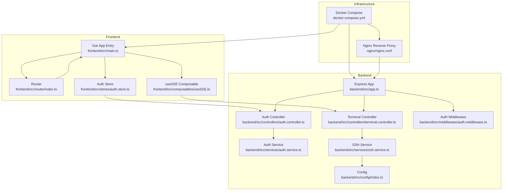
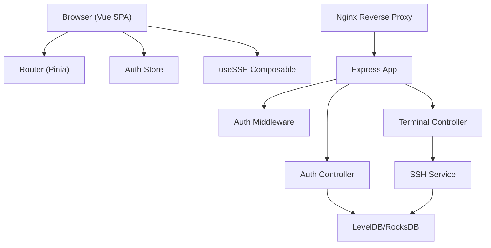
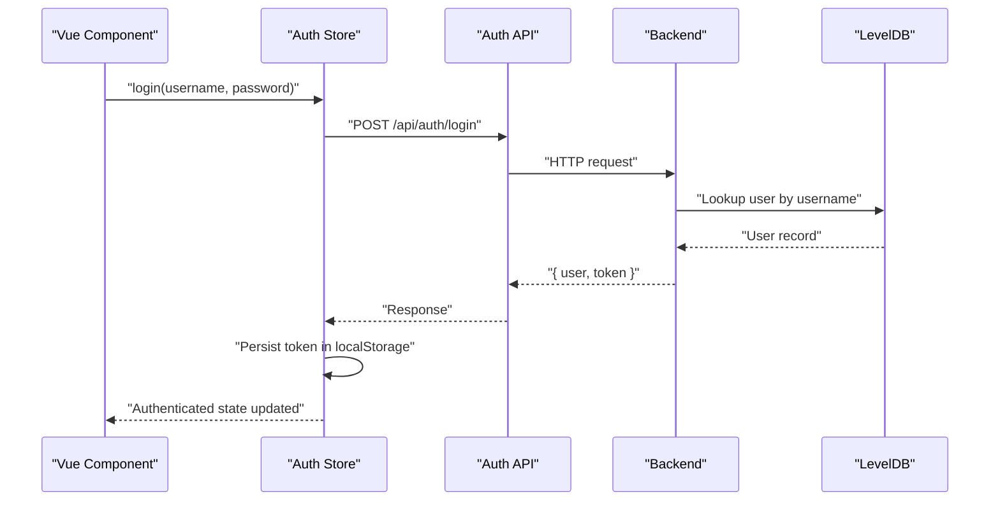
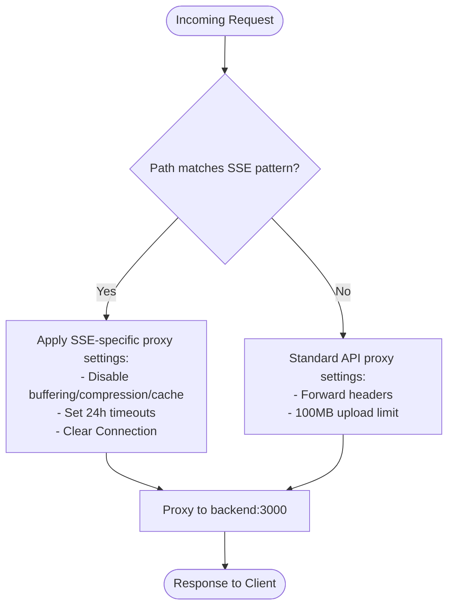
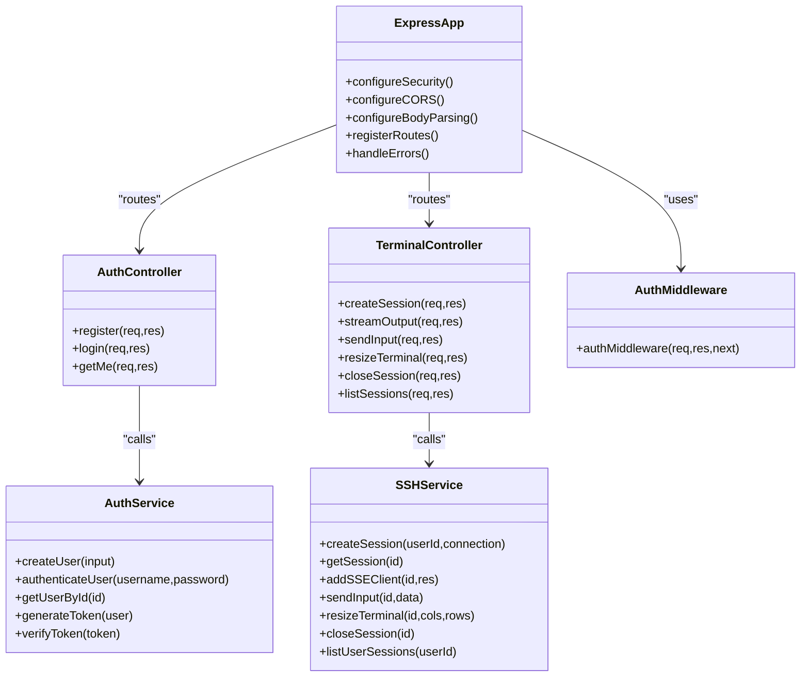
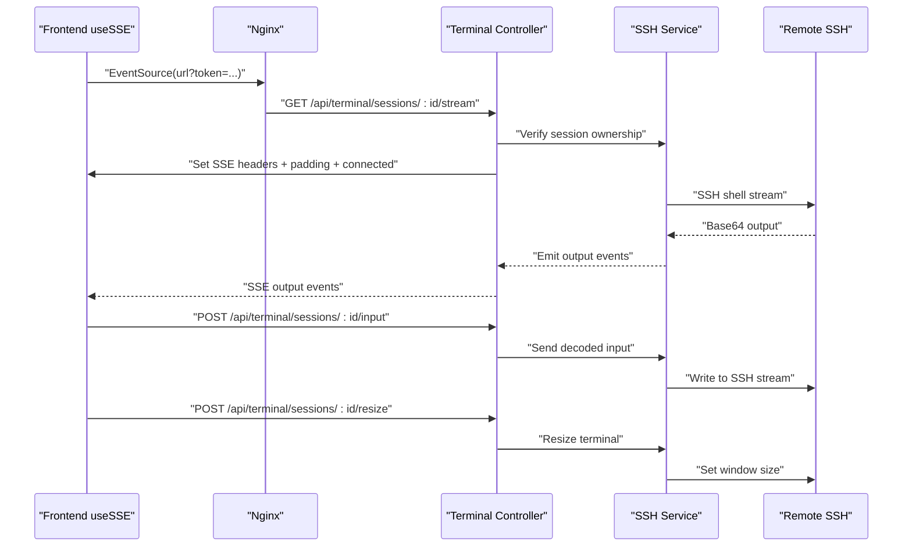
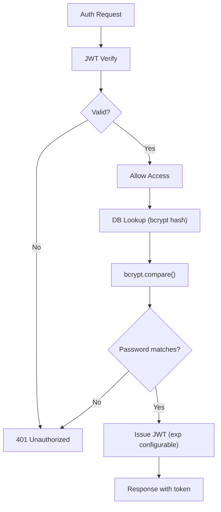
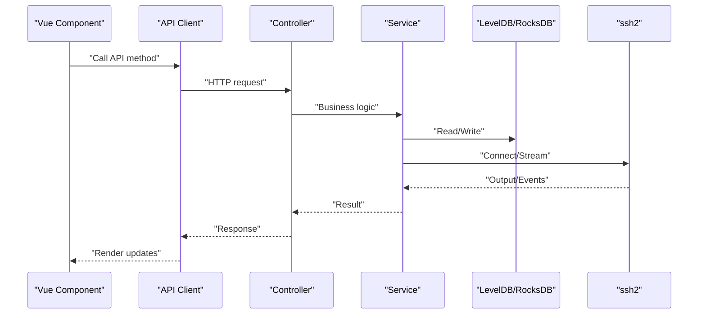
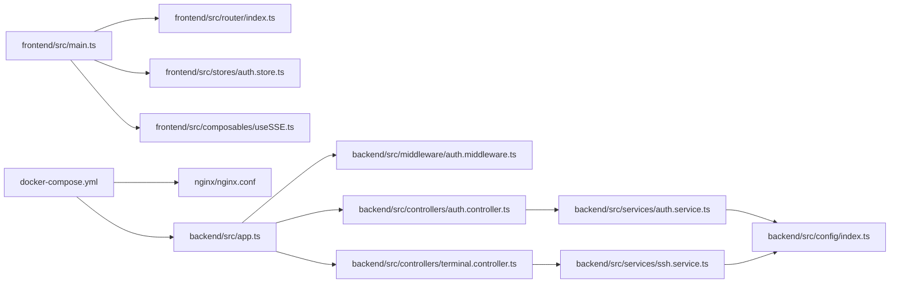
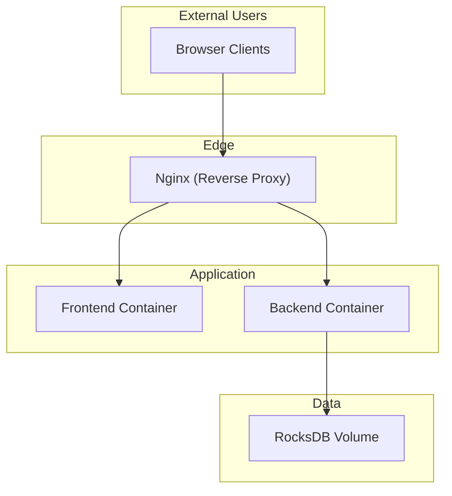

# Architecture Overview

<cite>
**Referenced Files in This Document**
- [README.md](file://README.md)
- [docker-compose.yml](file://docker-compose.yml)
- [nginx.conf](file://nginx/nginx.conf)
- [backend/src/index.ts](file://backend/src/index.ts)
- [backend/src/app.ts](file://backend/src/app.ts)
- [backend/src/config/index.ts](file://backend/src/config/index.ts)
- [backend/src/middleware/auth.middleware.ts](file://backend/src/middleware/auth.middleware.ts)
- [backend/src/controllers/auth.controller.ts](file://backend/src/controllers/auth.controller.ts)
- [backend/src/controllers/terminal.controller.ts](file://backend/src/controllers/terminal.controller.ts)
- [backend/src/services/auth.service.ts](file://backend/src/services/auth.service.ts)
- [backend/src/services/ssh.service.ts](file://backend/src/services/ssh.service.ts)
- [frontend/src/main.ts](file://frontend/src/main.ts)
- [frontend/src/router/index.ts](file://frontend/src/router/index.ts)
- [frontend/src/stores/auth.store.ts](file://frontend/src/stores/auth.store.ts)
- [frontend/src/composables/useSSE.ts](file://frontend/src/composables/useSSE.ts)
</cite>

## Table of Contents
1. [Introduction](#introduction)
2. [Project Structure](#project-structure)
3. [Core Components](#core-components)
4. [Architecture Overview](#architecture-overview)
5. [Detailed Component Analysis](#detailed-component-analysis)
6. [Dependency Analysis](#dependency-analysis)
7. [Performance Considerations](#performance-considerations)
8. [Troubleshooting Guide](#troubleshooting-guide)
9. [Conclusion](#conclusion)
10. [Appendices](#appendices)

## Introduction
This document presents the architecture of WebTerm, a browser-based SSH terminal with real-time terminal streaming, SFTP file management, and an online code editor. The system follows a layered backend design with Express.js and a Vue 3 SPA frontend. It uses Nginx as a reverse proxy to serve static assets, proxy REST API requests, and forward Server-Sent Events (SSE) streams. Security is enforced through Helmet, JWT authentication, bcrypt password hashing, and AES-256-GCM encryption for stored SSH credentials. Sessions are managed in memory with configurable limits and timeouts, and data persistence is handled by LevelDB/RocksDB.

## Project Structure
The repository is organized into three primary areas:
- Frontend: Vue 3 SPA with routing, state management (Pinia), composables, and API clients.
- Backend: Express.js application with controllers, services, middleware, and routes.
- Infrastructure: Nginx reverse proxy configuration and Docker Compose orchestration.

**Diagram sources**
- [docker-compose.yml:1-49](file://docker-compose.yml#L1-L49)
- [nginx/nginx.conf:1-54](file://nginx/nginx.conf#L1-L54)
- [frontend/src/main.ts:1-11](file://frontend/src/main.ts#L1-L11)
- [frontend/src/router/index.ts:1-44](file://frontend/src/router/index.ts#L1-L44)
- [frontend/src/stores/auth.store.ts:1-54](file://frontend/src/stores/auth.store.ts#L1-L54)
- [frontend/src/composables/useSSE.ts:1-84](file://frontend/src/composables/useSSE.ts#L1-L84)
- [backend/src/app.ts:1-51](file://backend/src/app.ts#L1-L51)
- [backend/src/controllers/auth.controller.ts:1-76](file://backend/src/controllers/auth.controller.ts#L1-L76)
- [backend/src/controllers/terminal.controller.ts:1-157](file://backend/src/controllers/terminal.controller.ts#L1-L157)
- [backend/src/middleware/auth.middleware.ts:1-33](file://backend/src/middleware/auth.middleware.ts#L1-L33)
- [backend/src/services/auth.service.ts:1-93](file://backend/src/services/auth.service.ts#L1-L93)
- [backend/src/services/ssh.service.ts:1-248](file://backend/src/services/ssh.service.ts#L1-L248)
- [backend/src/config/index.ts:1-24](file://backend/src/config/index.ts#L1-L24)

**Section sources**
- [README.md:91-137](file://README.md#L91-L137)
- [docker-compose.yml:1-49](file://docker-compose.yml#L1-L49)
- [nginx/nginx.conf:1-54](file://nginx/nginx.conf#L1-L54)

## Core Components
- Browser SPA (Vue 3 + Pinia + Vue Router):
  - Entry initializes the app, registers Pinia and Router.
  - Router guards enforce authentication and workspace availability.
  - Stores manage authentication state and persist tokens locally.
  - Composables encapsulate reusable logic (e.g., SSE connection management).
- Nginx Reverse Proxy:
  - Serves frontend static assets.
  - Proxies API requests to the backend.
  - Special handling for SSE endpoints to disable buffering and compression with long read/send timeouts.
- Express.js Backend:
  - Central app configures Helmet, CORS, body parsing, routes, and error handling.
  - Controllers handle request/response for auth, connections, terminal, SFTP, and history.
  - Services implement business logic: authentication, SSH/SFTP sessions, cryptography, logging, and database access.
  - Middleware enforces JWT-based authentication and supports token via Authorization header or query param for SSE.
- Data Persistence:
  - LevelDB/RocksDB for user accounts, connection profiles, and command history.
- Real-time Streaming:
  - SSE endpoints for terminal output with padding and heartbeat to ensure immediate delivery and liveness.

**Section sources**
- [frontend/src/main.ts:1-11](file://frontend/src/main.ts#L1-L11)
- [frontend/src/router/index.ts:1-44](file://frontend/src/router/index.ts#L1-L44)
- [frontend/src/stores/auth.store.ts:1-54](file://frontend/src/stores/auth.store.ts#L1-L54)
- [frontend/src/composables/useSSE.ts:1-84](file://frontend/src/composables/useSSE.ts#L1-L84)
- [backend/src/app.ts:1-51](file://backend/src/app.ts#L1-L51)
- [backend/src/controllers/auth.controller.ts:1-76](file://backend/src/controllers/auth.controller.ts#L1-L76)
- [backend/src/controllers/terminal.controller.ts:1-157](file://backend/src/controllers/terminal.controller.ts#L1-L157)
- [backend/src/middleware/auth.middleware.ts:1-33](file://backend/src/middleware/auth.middleware.ts#L1-L33)
- [backend/src/services/auth.service.ts:1-93](file://backend/src/services/auth.service.ts#L1-L93)
- [backend/src/services/ssh.service.ts:1-248](file://backend/src/services/ssh.service.ts#L1-L248)
- [backend/src/config/index.ts:1-24](file://backend/src/config/index.ts#L1-L24)
- [nginx/nginx.conf:18-39](file://nginx/nginx.conf#L18-L39)

## Architecture Overview
The system employs a layered backend pattern:
- Presentation Layer: Vue 3 SPA handles UI rendering, routing, state, and SSE subscriptions.
- Application Layer: Express routes and controllers coordinate requests and responses.
- Domain/Business Logic Layer: Services encapsulate authentication, SSH/SFTP operations, cryptography, and session management.
- Data Access Layer: LevelDB/RocksDB-backed persistence with indexed lookups.

**Diagram sources**
- [frontend/src/router/index.ts:1-44](file://frontend/src/router/index.ts#L1-L44)
- [frontend/src/stores/auth.store.ts:1-54](file://frontend/src/stores/auth.store.ts#L1-L54)
- [frontend/src/composables/useSSE.ts:1-84](file://frontend/src/composables/useSSE.ts#L1-L84)
- [nginx/nginx.conf:1-54](file://nginx/nginx.conf#L1-L54)
- [backend/src/app.ts:1-51](file://backend/src/app.ts#L1-L51)
- [backend/src/middleware/auth.middleware.ts:1-33](file://backend/src/middleware/auth.middleware.ts#L1-L33)
- [backend/src/controllers/auth.controller.ts:1-76](file://backend/src/controllers/auth.controller.ts#L1-L76)
- [backend/src/controllers/terminal.controller.ts:1-157](file://backend/src/controllers/terminal.controller.ts#L1-L157)
- [backend/src/services/ssh.service.ts:1-248](file://backend/src/services/ssh.service.ts#L1-L248)

## Detailed Component Analysis

### Browser-Based Frontend (Vue 3 SPA)
- Entry point initializes the app, installs Pinia and Router, and mounts to DOM.
- Router defines guarded routes and redirects based on authentication and workspace state.
- Auth store manages user identity, token lifecycle, and logout actions.
- useSSE composable manages SSE connections, token injection, reconnection logic, and event handlers.

**Diagram sources**
- [frontend/src/stores/auth.store.ts:14-24](file://frontend/src/stores/auth.store.ts#L14-L24)
- [backend/src/controllers/auth.controller.ts:39-59](file://backend/src/controllers/auth.controller.ts#L39-L59)
- [backend/src/services/auth.service.ts:48-71](file://backend/src/services/auth.service.ts#L48-L71)

**Section sources**
- [frontend/src/main.ts:1-11](file://frontend/src/main.ts#L1-L11)
- [frontend/src/router/index.ts:1-44](file://frontend/src/router/index.ts#L1-L44)
- [frontend/src/stores/auth.store.ts:1-54](file://frontend/src/stores/auth.store.ts#L1-L54)
- [frontend/src/composables/useSSE.ts:1-84](file://frontend/src/composables/useSSE.ts#L1-L84)

### Nginx Reverse Proxy Configuration
- Serves frontend static files with appropriate caching and gzip for static assets.
- Proxies API requests to the backend with proper headers.
- Applies special configuration for SSE endpoints:
  - Disables buffering, compression, and caching.
  - Sets long read/send timeouts (24 hours).
  - Ensures Connection header is cleared to maintain streaming.

**Diagram sources**
- [nginx/nginx.conf:18-39](file://nginx/nginx.conf#L18-L39)
- [nginx/nginx.conf:41-52](file://nginx/nginx.conf#L41-L52)

**Section sources**
- [nginx/nginx.conf:1-54](file://nginx/nginx.conf#L1-L54)

### Express.js Backend and Layered Design
- App initialization configures security headers (skipping for SSE), CORS, body parsing, health endpoint, routes, and error middleware.
- Controllers validate inputs, enforce ownership, and delegate to services.
- Services implement domain logic:
  - Authentication: bcrypt hashing, JWT generation/verification, user CRUD.
  - SSH/SFTP: in-memory session store, credential decryption, streaming output, resizing, and cleanup.
  - Crypto: AES-256-GCM encryption/decryption for stored credentials.
  - DB: LevelDB/RocksDB-backed persistence with indexing.
- Middleware enforces JWT authentication and supports token via header or query param for SSE compatibility.

**Diagram sources**
- [backend/src/app.ts:1-51](file://backend/src/app.ts#L1-L51)
- [backend/src/controllers/auth.controller.ts:1-76](file://backend/src/controllers/auth.controller.ts#L1-L76)
- [backend/src/controllers/terminal.controller.ts:1-157](file://backend/src/controllers/terminal.controller.ts#L1-L157)
- [backend/src/services/auth.service.ts:1-93](file://backend/src/services/auth.service.ts#L1-L93)
- [backend/src/services/ssh.service.ts:1-248](file://backend/src/services/ssh.service.ts#L1-L248)
- [backend/src/middleware/auth.middleware.ts:1-33](file://backend/src/middleware/auth.middleware.ts#L1-L33)

**Section sources**
- [backend/src/app.ts:1-51](file://backend/src/app.ts#L1-L51)
- [backend/src/controllers/auth.controller.ts:1-76](file://backend/src/controllers/auth.controller.ts#L1-L76)
- [backend/src/controllers/terminal.controller.ts:1-157](file://backend/src/controllers/terminal.controller.ts#L1-L157)
- [backend/src/middleware/auth.middleware.ts:1-33](file://backend/src/middleware/auth.middleware.ts#L1-L33)
- [backend/src/services/auth.service.ts:1-93](file://backend/src/services/auth.service.ts#L1-L93)
- [backend/src/services/ssh.service.ts:1-248](file://backend/src/services/ssh.service.ts#L1-L248)

### Real-Time Communication Architecture (SSE)
- SSE endpoint establishes a long-lived connection for terminal output.
- Backend writes padding and initial events to force immediate delivery through proxies.
- Heartbeat messages maintain liveness; clients reconnect automatically with exponential backoff.
- Ownership checks ensure users can only access their sessions.

**Diagram sources**
- [frontend/src/composables/useSSE.ts:11-50](file://frontend/src/composables/useSSE.ts#L11-L50)
- [backend/src/controllers/terminal.controller.ts:45-81](file://backend/src/controllers/terminal.controller.ts#L45-L81)
- [backend/src/controllers/terminal.controller.ts:83-108](file://backend/src/controllers/terminal.controller.ts#L83-L108)
- [backend/src/controllers/terminal.controller.ts:110-135](file://backend/src/controllers/terminal.controller.ts#L110-L135)
- [backend/src/services/ssh.service.ts:76-88](file://backend/src/services/ssh.service.ts#L76-L88)
- [backend/src/services/ssh.service.ts:196-202](file://backend/src/services/ssh.service.ts#L196-L202)
- [backend/src/services/ssh.service.ts:204-212](file://backend/src/services/ssh.service.ts#L204-L212)

**Section sources**
- [frontend/src/composables/useSSE.ts:1-84](file://frontend/src/composables/useSSE.ts#L1-L84)
- [backend/src/controllers/terminal.controller.ts:1-157](file://backend/src/controllers/terminal.controller.ts#L1-L157)
- [backend/src/services/ssh.service.ts:1-248](file://backend/src/services/ssh.service.ts#L1-L248)

### Security Architecture
- JWT Authentication:
  - Tokens signed with a configurable secret and expiration.
  - Middleware validates tokens from Authorization header or query param for SSE.
- Password Hashing:
  - bcrypt with 12 rounds for secure user credential storage.
- Credential Encryption:
  - AES-256-GCM for stored SSH credentials; keys derived per user from a master secret.
- Helmet Security Headers:
  - Applied globally except for SSE endpoints to avoid header conflicts.
- Additional Safeguards:
  - Session-level resource isolation.
  - File upload limits and binary file detection for the editor.

**Diagram sources**
- [backend/src/middleware/auth.middleware.ts:10-32](file://backend/src/middleware/auth.middleware.ts#L10-L32)
- [backend/src/services/auth.service.ts:79-92](file://backend/src/services/auth.service.ts#L79-L92)
- [backend/src/services/auth.service.ts:24-25](file://backend/src/services/auth.service.ts#L24-L25)
- [backend/src/app.ts:14-21](file://backend/src/app.ts#L14-L21)

**Section sources**
- [backend/src/middleware/auth.middleware.ts:1-33](file://backend/src/middleware/auth.middleware.ts#L1-L33)
- [backend/src/services/auth.service.ts:1-93](file://backend/src/services/auth.service.ts#L1-L93)
- [backend/src/app.ts:14-21](file://backend/src/app.ts#L14-L21)
- [README.md:284-292](file://README.md#L284-L292)

### Data Flow: From Browser to Backend and External SSH
- Browser components call API clients which send REST requests to backend routes.
- Controllers validate inputs and enforce ownership.
- Services interact with LevelDB/RocksDB for persistence and with SSH/SFTP libraries for remote operations.
- SSE streams push terminal output back to the browser in real time.

**Diagram sources**
- [frontend/src/stores/auth.store.ts:14-24](file://frontend/src/stores/auth.store.ts#L14-L24)
- [backend/src/controllers/auth.controller.ts:39-59](file://backend/src/controllers/auth.controller.ts#L39-L59)
- [backend/src/services/auth.service.ts:48-71](file://backend/src/services/auth.service.ts#L48-L71)
- [backend/src/services/ssh.service.ts:53-166](file://backend/src/services/ssh.service.ts#L53-L166)

**Section sources**
- [frontend/src/stores/auth.store.ts:1-54](file://frontend/src/stores/auth.store.ts#L1-L54)
- [backend/src/controllers/auth.controller.ts:1-76](file://backend/src/controllers/auth.controller.ts#L1-L76)
- [backend/src/services/auth.service.ts:1-93](file://backend/src/services/auth.service.ts#L1-L93)
- [backend/src/services/ssh.service.ts:1-248](file://backend/src/services/ssh.service.ts#L1-L248)

## Dependency Analysis
- Frontend depends on:
  - Router for navigation and guards.
  - Pinia store for authentication state.
  - Composables for SSE lifecycle management.
- Backend depends on:
  - Express app for configuration and routing.
  - Auth middleware for JWT enforcement.
  - Controllers for request handling.
  - Services for business logic and persistence.
- Infrastructure:
  - Docker Compose orchestrates Nginx, frontend, and backend.
  - Nginx forwards traffic to backend and serves static assets.

**Diagram sources**
- [frontend/src/main.ts:1-11](file://frontend/src/main.ts#L1-L11)
- [frontend/src/router/index.ts:1-44](file://frontend/src/router/index.ts#L1-L44)
- [frontend/src/stores/auth.store.ts:1-54](file://frontend/src/stores/auth.store.ts#L1-L54)
- [frontend/src/composables/useSSE.ts:1-84](file://frontend/src/composables/useSSE.ts#L1-L84)
- [docker-compose.yml:1-49](file://docker-compose.yml#L1-L49)
- [nginx/nginx.conf:1-54](file://nginx/nginx.conf#L1-L54)
- [backend/src/app.ts:1-51](file://backend/src/app.ts#L1-L51)
- [backend/src/middleware/auth.middleware.ts:1-33](file://backend/src/middleware/auth.middleware.ts#L1-L33)
- [backend/src/controllers/auth.controller.ts:1-76](file://backend/src/controllers/auth.controller.ts#L1-L76)
- [backend/src/controllers/terminal.controller.ts:1-157](file://backend/src/controllers/terminal.controller.ts#L1-L157)
- [backend/src/services/auth.service.ts:1-93](file://backend/src/services/auth.service.ts#L1-L93)
- [backend/src/services/ssh.service.ts:1-248](file://backend/src/services/ssh.service.ts#L1-L248)
- [backend/src/config/index.ts:1-24](file://backend/src/config/index.ts#L1-L24)

**Section sources**
- [docker-compose.yml:1-49](file://docker-compose.yml#L1-L49)
- [nginx/nginx.conf:1-54](file://nginx/nginx.conf#L1-L54)
- [backend/src/app.ts:1-51](file://backend/src/app.ts#L1-L51)

## Performance Considerations
- SSE Streaming:
  - Padding and heartbeat ensure immediate delivery and liveness.
  - Long timeouts accommodate extended interactive sessions.
  - Buffering disabled to minimize latency.
- Session Management:
  - In-memory sessions with periodic cleanup reduce overhead.
  - Configurable concurrency and idle timeouts prevent resource exhaustion.
- Database:
  - Indexed lookups and compact storage improve retrieval performance.
- Reverse Proxy:
  - Proper header forwarding and upload limits optimize throughput and stability.

[No sources needed since this section provides general guidance]

## Troubleshooting Guide
- Authentication Failures:
  - Verify JWT secret and expiration settings.
  - Confirm bcrypt rounds and stored hashes.
- SSE Issues:
  - Ensure Nginx disables buffering and compression for SSE paths.
  - Check token propagation via query param for EventSource.
- Session Timeouts:
  - Adjust session limits and timeout minutes.
  - Monitor heartbeat and client disconnects.
- Database Connectivity:
  - Validate RocksDB path and permissions.
  - Confirm graceful shutdown sequences.

**Section sources**
- [backend/src/middleware/auth.middleware.ts:10-32](file://backend/src/middleware/auth.middleware.ts#L10-L32)
- [backend/src/services/ssh.service.ts:13-23](file://backend/src/services/ssh.service.ts#L13-L23)
- [backend/src/config/index.ts:15-17](file://backend/src/config/index.ts#L15-L17)
- [nginx/nginx.conf:29-34](file://nginx/nginx.conf#L29-L34)
- [backend/src/index.ts:16-30](file://backend/src/index.ts#L16-L30)

## Conclusion
WebTerm’s architecture cleanly separates concerns across presentation, application, business logic, and data layers while leveraging modern technologies for real-time interactivity and robust security. The Nginx reverse proxy ensures efficient static asset delivery and reliable SSE streaming. The in-memory session model combined with configurable limits enables scalable terminal and SFTP operations, while LevelDB/RocksDB provides durable persistence. Future enhancements could include horizontal scaling of backend instances behind load balancers, persistent session storage, and advanced monitoring and alerting.

[No sources needed since this section summarizes without analyzing specific files]

## Appendices
- System Context Diagram (Multi-Container Deployment)

**Diagram sources**
- [docker-compose.yml:1-49](file://docker-compose.yml#L1-L49)
- [nginx/nginx.conf:1-54](file://nginx/nginx.conf#L1-L54)