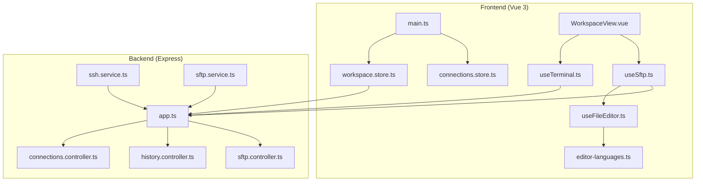
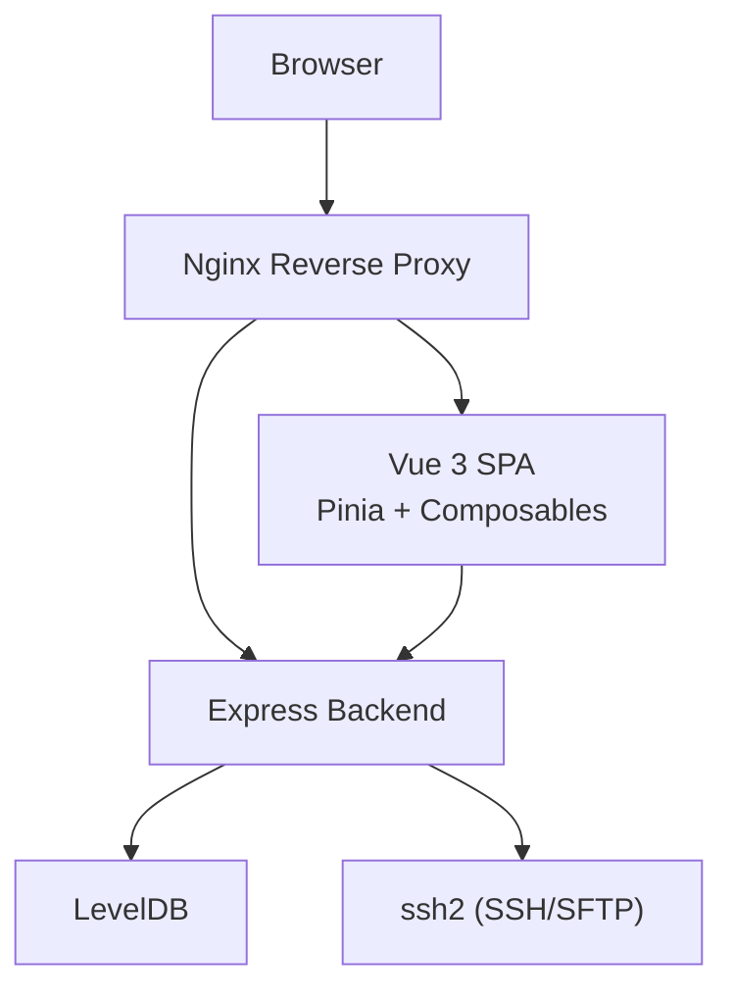
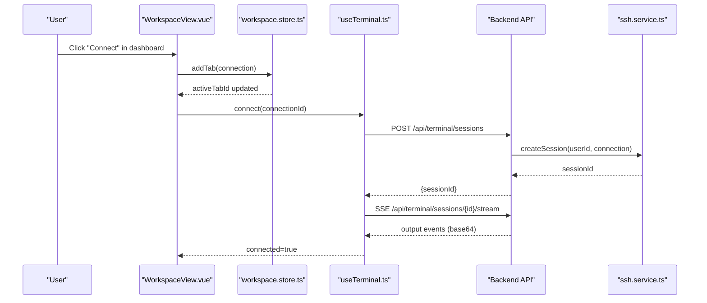
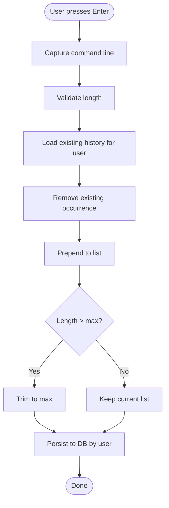
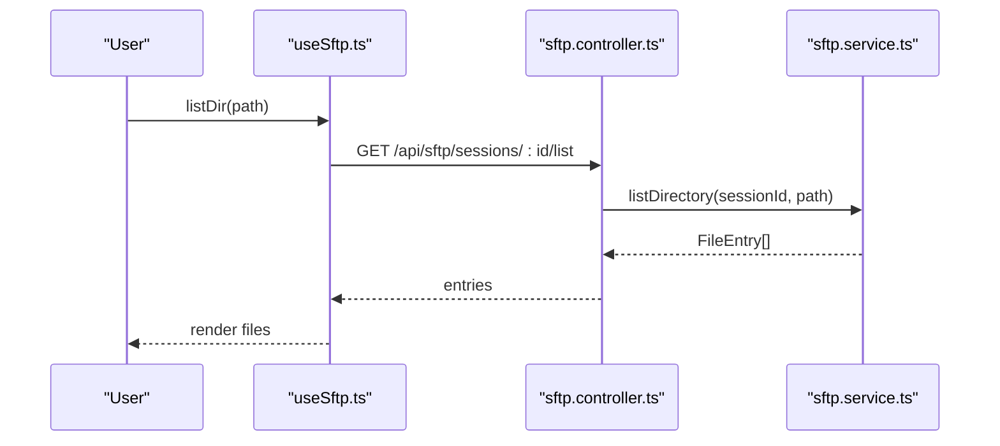
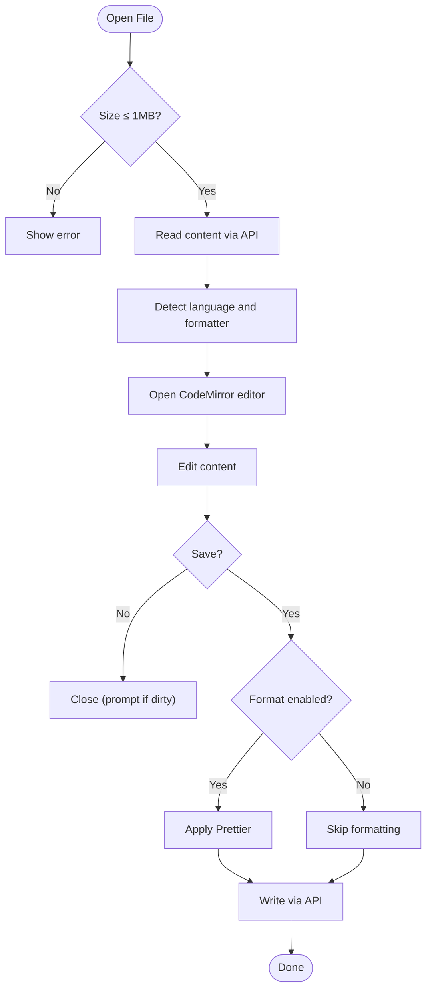
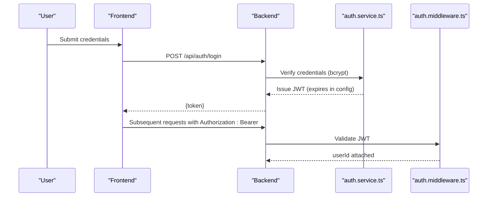
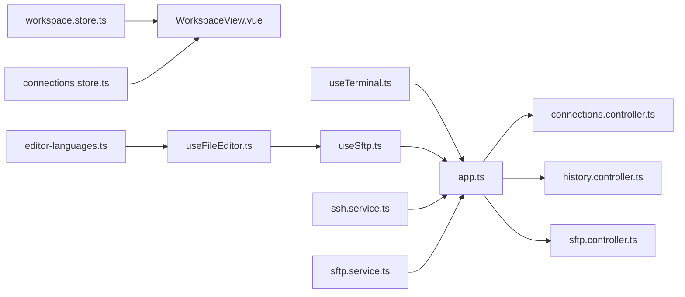

# Key Features

<cite>
**Referenced Files in This Document**
- [README.md](file://README.md)
- [backend/src/app.ts](file://backend/src/app.ts)
- [backend/src/controllers/connections.controller.ts](file://backend/src/controllers/connections.controller.ts)
- [backend/src/controllers/history.controller.ts](file://backend/src/controllers/history.controller.ts)
- [backend/src/controllers/sftp.controller.ts](file://backend/src/controllers/sftp.controller.ts)
- [backend/src/services/ssh.service.ts](file://backend/src/services/ssh.service.ts)
- [backend/src/services/sftp.service.ts](file://backend/src/services/sftp.service.ts)
- [frontend/src/main.ts](file://frontend/src/main.ts)
- [frontend/src/stores/connections.store.ts](file://frontend/src/stores/connections.store.ts)
- [frontend/src/stores/workspace.store.ts](file://frontend/src/stores/workspace.store.ts)
- [frontend/src/views/WorkspaceView.vue](file://frontend/src/views/WorkspaceView.vue)
- [frontend/src/composables/useTerminal.ts](file://frontend/src/composables/useTerminal.ts)
- [frontend/src/composables/useSftp.ts](file://frontend/src/composables/useSftp.ts)
- [frontend/src/composables/useFileEditor.ts](file://frontend/src/composables/useFileEditor.ts)
- [frontend/src/utils/editor-languages.ts](file://frontend/src/utils/editor-languages.ts)
- [frontend/src/types/index.ts](file://frontend/src/types/index.ts)
</cite>

## Table of Contents
1. [Introduction](#introduction)
2. [Project Structure](#project-structure)
3. [Core Components](#core-components)
4. [Architecture Overview](#architecture-overview)
5. [Detailed Feature Showcase](#detailed-feature-showcase)
6. [Dependency Analysis](#dependency-analysis)
7. [Performance Considerations](#performance-considerations)
8. [Troubleshooting Guide](#troubleshooting-guide)
9. [Conclusion](#conclusion)

## Introduction
This document presents a comprehensive feature showcase for WebTerm, a browser-based SSH terminal with integrated SFTP file management and an online code editor. It focuses on:
- Multi-host SSH connections with simultaneous session management and tabbed interface
- Independent workspaces per connection
- Command history with automatic saving, cross-session persistence, smart deduplication, and privacy isolation
- SFTP file management including directory browsing, uploads/downloads, creation/deletion/rename, and metadata display
- Online file editor powered by CodeMirror 6 with syntax highlighting for 20+ file types, Prettier formatting, and keyboard shortcuts
- Unicode and UTF-8 support for CJK, emojis, and international symbols
- User authentication with JWT tokens, bcrypt password hashing, and session management including limits and inactivity timeouts

## Project Structure
WebTerm follows a clear separation of concerns:
- Frontend (Vue 3 + TypeScript) with Pinia stores, composables, and views
- Backend (Express.js) with controllers, services, middleware, and routes
- Shared types between frontend and backend
- Dockerized deployment with Nginx reverse proxy

**Diagram sources**
- [frontend/src/main.ts:1-11](file://frontend/src/main.ts#L1-L11)
- [frontend/src/stores/workspace.store.ts:1-83](file://frontend/src/stores/workspace.store.ts#L1-L83)
- [frontend/src/stores/connections.store.ts:1-43](file://frontend/src/stores/connections.store.ts#L1-L43)
- [frontend/src/views/WorkspaceView.vue:1-348](file://frontend/src/views/WorkspaceView.vue#L1-L348)
- [frontend/src/composables/useTerminal.ts:1-237](file://frontend/src/composables/useTerminal.ts#L1-L237)
- [frontend/src/composables/useSftp.ts:1-154](file://frontend/src/composables/useSftp.ts#L1-L154)
- [frontend/src/composables/useFileEditor.ts:1-187](file://frontend/src/composables/useFileEditor.ts#L1-L187)
- [frontend/src/utils/editor-languages.ts:1-235](file://frontend/src/utils/editor-languages.ts#L1-L235)
- [backend/src/app.ts:1-51](file://backend/src/app.ts#L1-L51)
- [backend/src/controllers/connections.controller.ts:1-215](file://backend/src/controllers/connections.controller.ts#L1-L215)
- [backend/src/controllers/history.controller.ts:1-63](file://backend/src/controllers/history.controller.ts#L1-L63)
- [backend/src/controllers/sftp.controller.ts:1-296](file://backend/src/controllers/sftp.controller.ts#L1-L296)
- [backend/src/services/ssh.service.ts:1-248](file://backend/src/services/ssh.service.ts#L1-L248)
- [backend/src/services/sftp.service.ts:1-277](file://backend/src/services/sftp.service.ts#L1-L277)

**Section sources**
- [README.md:91-137](file://README.md#L91-L137)
- [backend/src/app.ts:1-51](file://backend/src/app.ts#L1-L51)
- [frontend/src/main.ts:1-11](file://frontend/src/main.ts#L1-L11)

## Core Components
- Workspace and Tabs: Manage multiple SSH hosts with independent terminal and SFTP workspaces, switching via tab UI.
- Terminal Sessions: Real-time terminal interaction with XTerm.js, SSE streaming, and Unicode support.
- SFTP Sessions: Directory browsing, file operations, and metadata display.
- Command History: Automatic saving, cross-session persistence, smart deduplication, and privacy isolation.
- Online File Editor: CodeMirror 6 integration with syntax highlighting, Prettier formatting, and keyboard shortcuts.
- Authentication and Session Limits: JWT authentication, bcrypt hashing, and configurable concurrency/inactivity timeouts.

**Section sources**
- [frontend/src/stores/workspace.store.ts:1-83](file://frontend/src/stores/workspace.store.ts#L1-L83)
- [frontend/src/views/WorkspaceView.vue:1-348](file://frontend/src/views/WorkspaceView.vue#L1-L348)
- [frontend/src/composables/useTerminal.ts:1-237](file://frontend/src/composables/useTerminal.ts#L1-L237)
- [frontend/src/composables/useSftp.ts:1-154](file://frontend/src/composables/useSftp.ts#L1-L154)
- [backend/src/controllers/history.controller.ts:1-63](file://backend/src/controllers/history.controller.ts#L1-L63)
- [frontend/src/composables/useFileEditor.ts:1-187](file://frontend/src/composables/useFileEditor.ts#L1-L187)
- [backend/src/services/ssh.service.ts:1-248](file://backend/src/services/ssh.service.ts#L1-L248)

## Architecture Overview
WebTerm uses a browser SPA with Vue 3 and Pinia for state, communicating with an Express backend over REST APIs. The backend manages in-memory SSH/SFTP sessions with periodic cleanup and persists user data and command history in LevelDB. Nginx proxies static assets and forwards API requests.

**Diagram sources**
- [README.md:200-223](file://README.md#L200-L223)
- [backend/src/app.ts:1-51](file://backend/src/app.ts#L1-L51)
- [backend/src/services/ssh.service.ts:1-248](file://backend/src/services/ssh.service.ts#L1-L248)
- [backend/src/services/sftp.service.ts:1-277](file://backend/src/services/sftp.service.ts#L1-L277)

## Detailed Feature Showcase

### Multi-Host SSH Connections with Simultaneous Session Management and Tabbed Interface
- Independent workspaces per connection: Each tab maintains separate terminal and SFTP contexts.
- Tabbed interface: Host tabs display label and host identity; clicking switches active tab; close button removes tab.
- Session lifecycle: Creating a terminal session establishes an SSH shell; SSE streams output; resizing events propagate to the backend.

**Diagram sources**
- [frontend/src/views/WorkspaceView.vue:1-348](file://frontend/src/views/WorkspaceView.vue#L1-L348)
- [frontend/src/stores/workspace.store.ts:1-83](file://frontend/src/stores/workspace.store.ts#L1-L83)
- [frontend/src/composables/useTerminal.ts:1-237](file://frontend/src/composables/useTerminal.ts#L1-L237)
- [backend/src/services/ssh.service.ts:1-248](file://backend/src/services/ssh.service.ts#L1-L248)

**Section sources**
- [frontend/src/views/WorkspaceView.vue:1-348](file://frontend/src/views/WorkspaceView.vue#L1-L348)
- [frontend/src/stores/workspace.store.ts:1-83](file://frontend/src/stores/workspace.store.ts#L1-L83)
- [frontend/src/composables/useTerminal.ts:1-237](file://frontend/src/composables/useTerminal.ts#L1-L237)
- [backend/src/services/ssh.service.ts:1-248](file://backend/src/services/ssh.service.ts#L1-L248)

### Independent Workspace Per Connection
- Each tab holds a dedicated terminal and SFTP session; switching tabs does not interrupt other sessions.
- Sub-tab switching between terminal and SFTP is tracked per tab.

**Section sources**
- [frontend/src/stores/workspace.store.ts:1-83](file://frontend/src/stores/workspace.store.ts#L1-L83)
- [frontend/src/views/WorkspaceView.vue:1-348](file://frontend/src/views/WorkspaceView.vue#L1-L348)

### Command History: Automatic Saving, Cross-Session Persistence, Smart Deduplication, Privacy Isolation
- Automatic saving: On pressing Enter in the terminal, the command line is captured and emitted to the history controller.
- Cross-session persistence: Stored under the user’s key and returned to all sessions.
- Smart deduplication: New occurrences push to front and trim to a maximum length.
- Privacy isolation: History keyed by user ID; access validated per session.

**Diagram sources**
- [frontend/src/composables/useTerminal.ts:22-96](file://frontend/src/composables/useTerminal.ts#L22-L96)
- [backend/src/controllers/history.controller.ts:1-63](file://backend/src/controllers/history.controller.ts#L1-L63)

**Section sources**
- [frontend/src/composables/useTerminal.ts:22-96](file://frontend/src/composables/useTerminal.ts#L22-L96)
- [backend/src/controllers/history.controller.ts:1-63](file://backend/src/controllers/history.controller.ts#L1-L63)

### SFTP File Management: Directory Browsing, File Operations, Metadata
- Directory browsing: List directory entries with sorting (directories first).
- File operations: Upload (with size checks), download, create/delete directory, rename, and stat for permissions/size/time.
- Metadata: Permissions, size, and modification time are displayed.

**Diagram sources**
- [frontend/src/composables/useSftp.ts:1-154](file://frontend/src/composables/useSftp.ts#L1-L154)
- [backend/src/controllers/sftp.controller.ts:1-296](file://backend/src/controllers/sftp.controller.ts#L1-L296)
- [backend/src/services/sftp.service.ts:1-277](file://backend/src/services/sftp.service.ts#L1-L277)

**Section sources**
- [frontend/src/composables/useSftp.ts:1-154](file://frontend/src/composables/useSftp.ts#L1-L154)
- [backend/src/controllers/sftp.controller.ts:1-296](file://backend/src/controllers/sftp.controller.ts#L1-L296)
- [backend/src/services/sftp.service.ts:1-277](file://backend/src/services/sftp.service.ts#L1-L277)

### Online File Editor: CodeMirror 6, Syntax Highlighting, Prettier Formatting, Shortcuts
- CodeMirror 6 integration with language detection for 20+ file types (JSON, YAML, TOML, XML, INI/.env, Shell, Dockerfile, Nginx, JS/TS, Python, Go, SQL, HTML/CSS/Markdown, Vue).
- Prettier formatting support for JSON, YAML, JS/TS, HTML, CSS, Markdown.
- Keyboard shortcuts: Save, format, and close.
- File size limit enforced (1 MB), binary detection, and unsaved changes prompt.

**Diagram sources**
- [frontend/src/composables/useFileEditor.ts:1-187](file://frontend/src/composables/useFileEditor.ts#L1-L187)
- [frontend/src/utils/editor-languages.ts:1-235](file://frontend/src/utils/editor-languages.ts#L1-L235)
- [backend/src/controllers/sftp.controller.ts:231-287](file://backend/src/controllers/sftp.controller.ts#L231-L287)

**Section sources**
- [frontend/src/composables/useFileEditor.ts:1-187](file://frontend/src/composables/useFileEditor.ts#L1-L187)
- [frontend/src/utils/editor-languages.ts:1-235](file://frontend/src/utils/editor-languages.ts#L1-L235)
- [backend/src/controllers/sftp.controller.ts:231-287](file://backend/src/controllers/sftp.controller.ts#L231-L287)

### Unicode and UTF-8 Support for CJK Characters, Emojis, and International Symbols
- Terminal input/output encoding uses TextEncoder/TextDecoder via base64 transport to reliably support Unicode.
- The terminal theme and fonts are configured for readability across scripts.

**Section sources**
- [frontend/src/composables/useTerminal.ts:210-222](file://frontend/src/composables/useTerminal.ts#L210-L222)
- [README.md:55-60](file://README.md#L55-L60)

### User Authentication, JWT Tokens, and Session Management
- Authentication endpoints: register, login, profile retrieval.
- JWT middleware protects routes; sessions are isolated by user ID.
- Session limits and inactivity timeouts are enforced in-memory with periodic cleanup.

**Diagram sources**
- [README.md:225-234](file://README.md#L225-L234)
- [backend/src/app.ts:1-51](file://backend/src/app.ts#L1-L51)

**Section sources**
- [README.md:61-70](file://README.md#L61-L70)
- [backend/src/app.ts:1-51](file://backend/src/app.ts#L1-L51)

### Session Limits, Inactivity Timeouts, and Memory-Based Session Handling
- Concurrency limit: Maximum concurrent sessions per user (configurable).
- Inactivity timeout: Sessions automatically close after a period of inactivity.
- Memory-based: Sessions stored in-memory with periodic cleanup.

**Section sources**
- [backend/src/services/ssh.service.ts:25-31](file://backend/src/services/ssh.service.ts#L25-L31)
- [backend/src/services/ssh.service.ts:13-23](file://backend/src/services/ssh.service.ts#L13-L23)
- [backend/src/services/sftp.service.ts:1-277](file://backend/src/services/sftp.service.ts#L1-L277)
- [README.md:66-70](file://README.md#L66-L70)

## Dependency Analysis
- Frontend depends on composables for terminal/SFTP/editor and Pinia stores for state.
- Controllers orchestrate API requests and delegate to services.
- Services manage in-memory sessions and interact with ssh2 for SSH/SFTP.
- Middleware enforces authentication and security headers.

**Diagram sources**
- [frontend/src/stores/workspace.store.ts:1-83](file://frontend/src/stores/workspace.store.ts#L1-L83)
- [frontend/src/views/WorkspaceView.vue:1-348](file://frontend/src/views/WorkspaceView.vue#L1-L348)
- [frontend/src/stores/connections.store.ts:1-43](file://frontend/src/stores/connections.store.ts#L1-L43)
- [frontend/src/composables/useTerminal.ts:1-237](file://frontend/src/composables/useTerminal.ts#L1-L237)
- [frontend/src/composables/useSftp.ts:1-154](file://frontend/src/composables/useSftp.ts#L1-L154)
- [frontend/src/composables/useFileEditor.ts:1-187](file://frontend/src/composables/useFileEditor.ts#L1-L187)
- [frontend/src/utils/editor-languages.ts:1-235](file://frontend/src/utils/editor-languages.ts#L1-L235)
- [backend/src/app.ts:1-51](file://backend/src/app.ts#L1-L51)
- [backend/src/controllers/connections.controller.ts:1-215](file://backend/src/controllers/connections.controller.ts#L1-L215)
- [backend/src/controllers/history.controller.ts:1-63](file://backend/src/controllers/history.controller.ts#L1-L63)
- [backend/src/controllers/sftp.controller.ts:1-296](file://backend/src/controllers/sftp.controller.ts#L1-L296)
- [backend/src/services/ssh.service.ts:1-248](file://backend/src/services/ssh.service.ts#L1-L248)
- [backend/src/services/sftp.service.ts:1-277](file://backend/src/services/sftp.service.ts#L1-L277)

**Section sources**
- [frontend/src/types/index.ts:1-56](file://frontend/src/types/index.ts#L1-L56)
- [backend/src/controllers/connections.controller.ts:1-215](file://backend/src/controllers/connections.controller.ts#L1-L215)
- [backend/src/controllers/sftp.controller.ts:1-296](file://backend/src/controllers/sftp.controller.ts#L1-L296)
- [backend/src/controllers/history.controller.ts:1-63](file://backend/src/controllers/history.controller.ts#L1-L63)
- [backend/src/services/ssh.service.ts:1-248](file://backend/src/services/ssh.service.ts#L1-L248)
- [backend/src/services/sftp.service.ts:1-277](file://backend/src/services/sftp.service.ts#L1-L277)

## Performance Considerations
- SSE streaming minimizes latency for terminal output; heartbeat pings maintain connection health.
- Terminal input batching reduces network overhead.
- In-memory sessions reduce disk I/O but require careful cleanup and timeout policies.
- Frontend rendering leverages virtualized lists and lazy plugin loading for editor features.

## Troubleshooting Guide
- Terminal connection errors: Check SSH credentials and connectivity; review SSE error events and logs.
- SFTP operations fail: Verify file paths, permissions, and session validity; ensure file size limits and binary detection rules.
- Command history issues: Confirm user authentication and that history is persisted under the correct user key.
- Unicode display problems: Ensure proper encoding/decoding pipeline in terminal composable.

**Section sources**
- [frontend/src/composables/useTerminal.ts:146-174](file://frontend/src/composables/useTerminal.ts#L146-L174)
- [backend/src/services/ssh.service.ts:119-135](file://backend/src/services/ssh.service.ts#L119-L135)
- [backend/src/controllers/sftp.controller.ts:112-148](file://backend/src/controllers/sftp.controller.ts#L112-L148)
- [backend/src/controllers/history.controller.ts:13-22](file://backend/src/controllers/history.controller.ts#L13-L22)

## Conclusion
WebTerm delivers a modern, secure, and efficient browser-based SSH terminal with robust SFTP capabilities and an integrated online editor. Its tabbed multi-host design, Unicode support, and strict privacy boundaries make it suitable for daily operations across diverse environments. The documented features and architecture provide a clear foundation for extending functionality while maintaining reliability and performance.