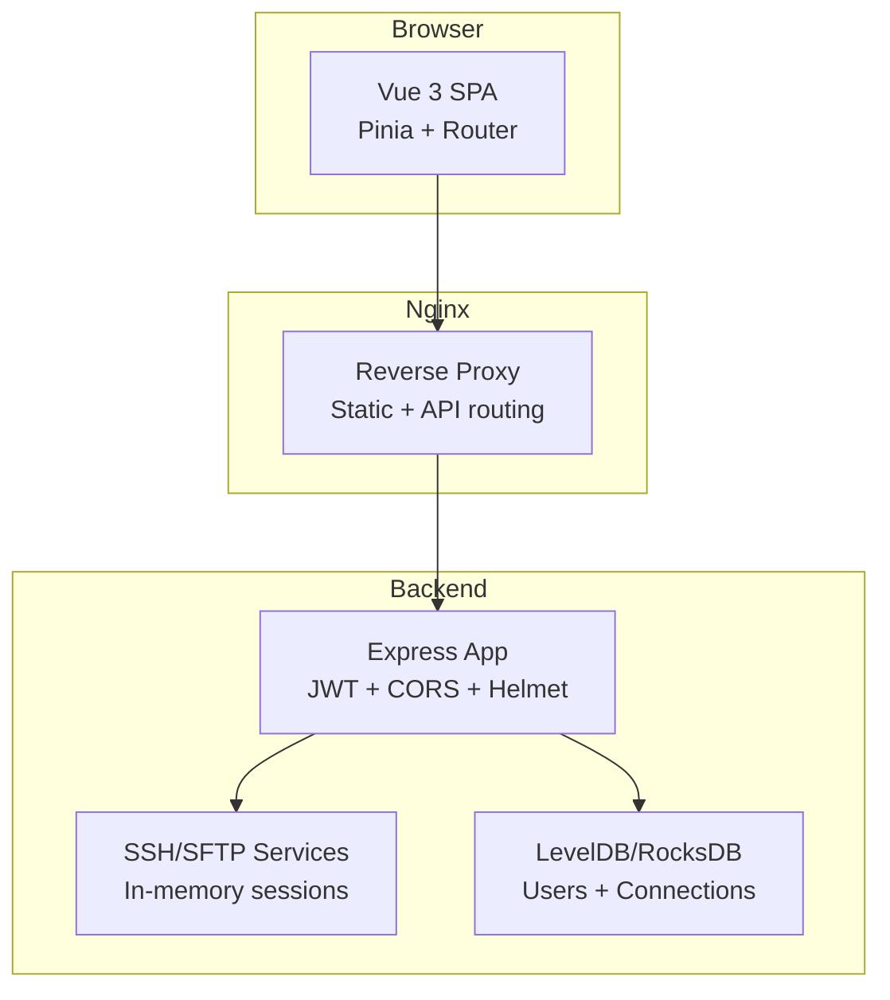
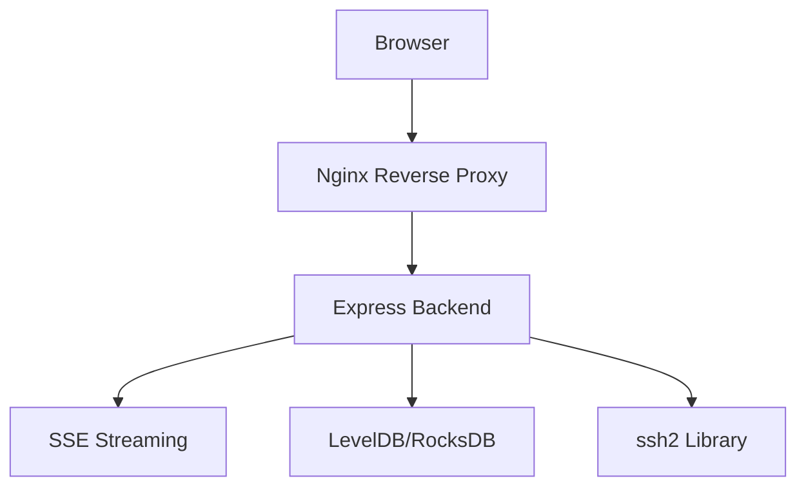
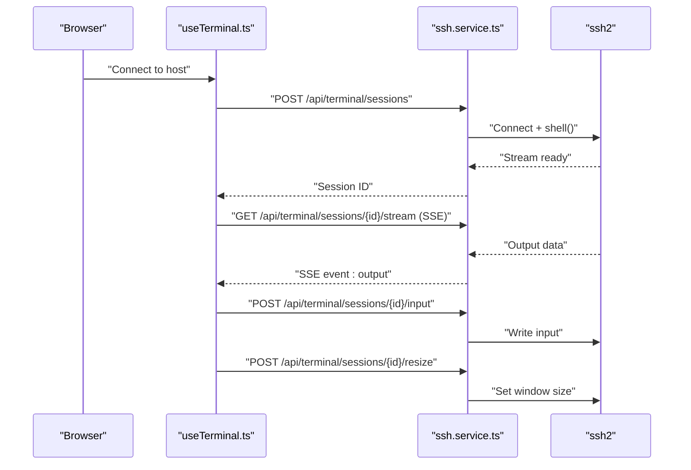
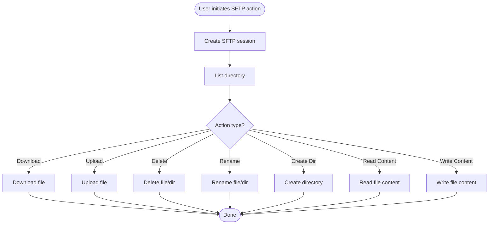
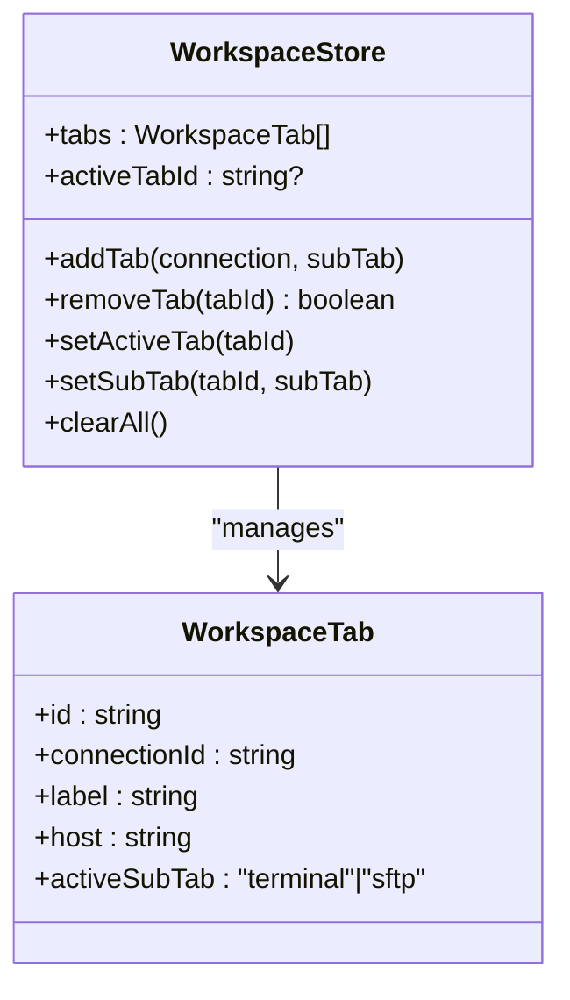
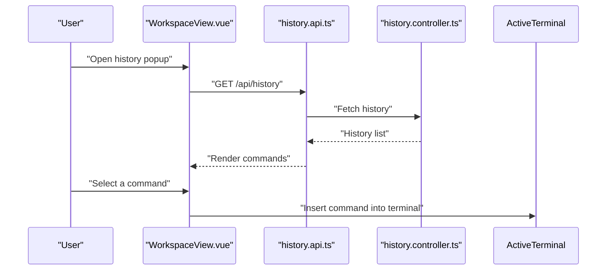
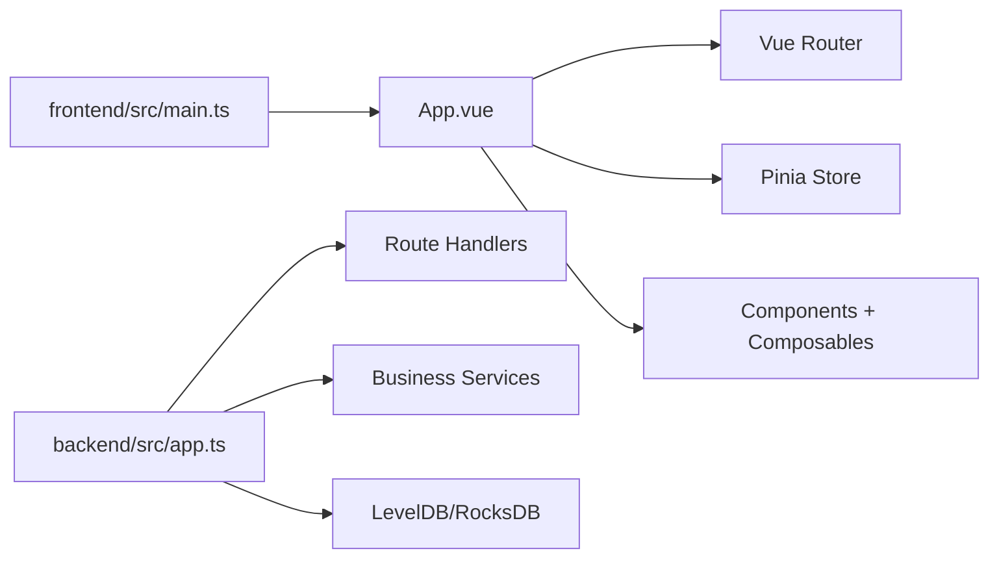

# Project Overview

<cite>
**Referenced Files in This Document**
- [README.md](file://README.md)
- [backend/src/app.ts](file://backend/src/app.ts)
- [backend/src/config/index.ts](file://backend/src/config/index.ts)
- [backend/src/types/index.ts](file://backend/src/types/index.ts)
- [backend/src/services/ssh.service.ts](file://backend/src/services/ssh.service.ts)
- [frontend/src/main.ts](file://frontend/src/main.ts)
- [frontend/src/types/index.ts](file://frontend/src/types/index.ts)
- [frontend/src/composables/useTerminal.ts](file://frontend/src/composables/useTerminal.ts)
- [frontend/src/composables/useSftp.ts](file://frontend/src/composables/useSftp.ts)
- [frontend/src/composables/useFileEditor.ts](file://frontend/src/composables/useFileEditor.ts)
- [frontend/src/views/WorkspaceView.vue](file://frontend/src/views/WorkspaceView.vue)
- [frontend/src/views/FileEditorModal.vue](file://frontend/src/views/FileEditorModal.vue)
- [frontend/src/stores/workspace.store.ts](file://frontend/src/stores/workspace.store.ts)
- [frontend/src/stores/connections.store.ts](file://frontend/src/stores/connections.store.ts)
- [docker-compose.yml](file://docker-compose.yml)
</cite>

## Table of Contents
1. [Introduction](#introduction)
2. [Project Structure](#project-structure)
3. [Core Components](#core-components)
4. [Architecture Overview](#architecture-overview)
5. [Detailed Component Analysis](#detailed-component-analysis)
6. [Dependency Analysis](#dependency-analysis)
7. [Performance Considerations](#performance-considerations)
8. [Troubleshooting Guide](#troubleshooting-guide)
9. [Conclusion](#conclusion)
10. [Appendices](#appendices)

## Introduction
WebTerm is a modern browser-based SSH terminal application designed for efficient remote server management. It unifies three essential workflows—real-time terminal interaction, SFTP file management, and online code editing—into a single, cohesive interface. Users can maintain multiple SSH connections simultaneously, switch between them seamlessly, and work with terminal sessions and SFTP workspaces independently per host. The platform emphasizes security, performance, and developer productivity with features like encrypted credential storage, real-time streaming via Server-Sent Events (SSE), and a powerful in-browser editor powered by CodeMirror 6.

Why WebTerm stands out:
- Unified workflow: manage terminals, files, and edits without leaving the browser.
- Multi-host concurrency: open and switch between multiple SSH hosts without interrupting active sessions.
- Real-time streaming: responsive terminal output and input using SSE for low-latency interaction.
- Secure by design: JWT authentication, bcrypt password hashing, AES-256-GCM encryption for credentials, and strict resource isolation.
- Developer-friendly: extensive editor features, syntax highlighting, formatting, and keyboard shortcuts.

Practical scenarios:
- Manage multiple production servers concurrently from one dashboard, switching between hosts instantly.
- Edit configuration files directly in the browser, save changes, and apply them immediately via the terminal.
- Transfer files quickly using drag-and-drop uploads and downloads, with permission and metadata visibility.

## Project Structure
WebTerm follows a clean separation of concerns:
- Frontend: Vue 3 Single Page Application (SPA) with TypeScript, Pinia for state, and Vue Router for navigation.
- Backend: Express.js REST API with route handlers, middleware, and business services.
- Infrastructure: Docker Compose for containerized deployment with Nginx as reverse proxy.

**Diagram sources**
- [backend/src/app.ts:12-48](file://backend/src/app.ts#L12-L48)
- [docker-compose.yml:1-49](file://docker-compose.yml#L1-L49)

**Section sources**
- [README.md:91-137](file://README.md#L91-L137)
- [backend/src/app.ts:12-48](file://backend/src/app.ts#L12-L48)
- [docker-compose.yml:1-49](file://docker-compose.yml#L1-L49)

## Core Components
WebTerm’s core value is delivered through tightly integrated components that enable multi-host terminal sessions, real-time streaming, SFTP operations, and a rich file editor.

Key capabilities:
- Multi-host SSH connections: create, test, and manage connection profiles; each host maintains independent terminal and SFTP sessions.
- Real-time terminal streaming: SSE endpoints deliver terminal output and lifecycle events to the browser.
- Command history: persistent, user-isolated history across sessions with smart deduplication.
- SFTP operations: browse, upload, download, create, delete, rename, and refresh directories and files.
- Online code editing: CodeMirror 6-based editor with syntax highlighting, formatting, and keyboard shortcuts.

User-facing features:
- Browser tab-style host switching with independent terminal and SFTP workspaces.
- Dashboard for adding and managing connection profiles.
- Workspace with host tabs and sub-tabs for terminal and SFTP.
- File editor modal with language detection, formatting, and unsaved changes protection.

**Section sources**
- [README.md:9-70](file://README.md#L9-L70)
- [frontend/src/views/WorkspaceView.vue:1-348](file://frontend/src/views/WorkspaceView.vue#L1-L348)
- [frontend/src/stores/workspace.store.ts:1-83](file://frontend/src/stores/workspace.store.ts#L1-L83)
- [frontend/src/stores/connections.store.ts:1-43](file://frontend/src/stores/connections.store.ts#L1-L43)

## Architecture Overview
WebTerm uses a browser-based architecture with a reverse proxy (Nginx) routing static assets and API traffic to the backend. The backend exposes REST endpoints for authentication, connection management, terminal sessions, SFTP, and command history. Terminal sessions are backed by in-memory maps and streamed to the browser via SSE. SFTP sessions are similarly managed per user and connection.

**Diagram sources**
- [README.md:200-223](file://README.md#L200-L223)
- [backend/src/app.ts:12-48](file://backend/src/app.ts#L12-L48)
- [backend/src/services/ssh.service.ts:1-248](file://backend/src/services/ssh.service.ts#L1-L248)

**Section sources**
- [README.md:200-223](file://README.md#L200-L223)
- [backend/src/app.ts:12-48](file://backend/src/app.ts#L12-L48)
- [backend/src/services/ssh.service.ts:1-248](file://backend/src/services/ssh.service.ts#L1-L248)

## Detailed Component Analysis

### Terminal Sessions and SSE Streaming
Terminal sessions are created per connection profile and backed by an in-memory map. Each session maintains an SSH client channel and a set of SSE client connections. Output is base64-encoded and sent via SSE events, while input is received from the browser, base64-decoded, and written to the SSH stream. Resizing events adjust the pseudo-terminal window size.

**Diagram sources**
- [frontend/src/composables/useTerminal.ts:132-179](file://frontend/src/composables/useTerminal.ts#L132-L179)
- [backend/src/services/ssh.service.ts:33-166](file://backend/src/services/ssh.service.ts#L33-L166)

**Section sources**
- [frontend/src/composables/useTerminal.ts:1-237](file://frontend/src/composables/useTerminal.ts#L1-L237)
- [backend/src/services/ssh.service.ts:1-248](file://backend/src/services/ssh.service.ts#L1-L248)
- [backend/src/types/index.ts:43-54](file://backend/src/types/index.ts#L43-L54)

### SFTP Sessions and File Operations
SFTP sessions are created per connection and expose directory listing, file upload/download, creation/deletion, renaming, and content read/write. The frontend composable manages session state, path navigation, and file actions, delegating to SFTP API endpoints.

**Diagram sources**
- [frontend/src/composables/useSftp.ts:12-153](file://frontend/src/composables/useSftp.ts#L12-L153)
- [frontend/src/composables/useFileEditor.ts:29-84](file://frontend/src/composables/useFileEditor.ts#L29-L84)

**Section sources**
- [frontend/src/composables/useSftp.ts:1-154](file://frontend/src/composables/useSftp.ts#L1-L154)
- [frontend/src/composables/useFileEditor.ts:1-187](file://frontend/src/composables/useFileEditor.ts#L1-L187)
- [backend/src/types/index.ts:56-75](file://backend/src/types/index.ts#L56-L75)

### Workspace Tabs and Host Management
The workspace view provides a tabbed interface for multiple hosts. Each tab tracks connection identity, label, host address, and active sub-tab (terminal or SFTP). Tabs persist until closed, enabling seamless switching without reconnecting.

**Diagram sources**
- [frontend/src/stores/workspace.store.ts:5-82](file://frontend/src/stores/workspace.store.ts#L5-L82)
- [frontend/src/types/index.ts:49-55](file://frontend/src/types/index.ts#L49-L55)

**Section sources**
- [frontend/src/views/WorkspaceView.vue:1-348](file://frontend/src/views/WorkspaceView.vue#L1-L348)
- [frontend/src/stores/workspace.store.ts:1-83](file://frontend/src/stores/workspace.store.ts#L1-L83)
- [frontend/src/types/index.ts:49-55](file://frontend/src/types/index.ts#L49-L55)

### Command History and Persistence
Command history is user-isolated and persisted across sessions. The workspace view integrates a history popup that lists commands, supports clearing, and allows quick insertion into the active terminal.

**Diagram sources**
- [frontend/src/views/WorkspaceView.vue:97-128](file://frontend/src/views/WorkspaceView.vue#L97-L128)
- [frontend/src/types/index.ts:42-47](file://frontend/src/types/index.ts#L42-L47)

**Section sources**
- [README.md:18-25](file://README.md#L18-L25)
- [frontend/src/views/WorkspaceView.vue:92-128](file://frontend/src/views/WorkspaceView.vue#L92-L128)
- [frontend/src/types/index.ts:42-47](file://frontend/src/types/index.ts#L42-L47)

## Dependency Analysis
WebTerm’s frontend and backend are modular and loosely coupled. The frontend depends on Vue ecosystem packages and browser APIs, while the backend relies on Express, ssh2, and persistence libraries. Docker Compose orchestrates services and volumes for production deployments.

**Diagram sources**
- [frontend/src/main.ts:1-11](file://frontend/src/main.ts#L1-L11)
- [backend/src/app.ts:12-48](file://backend/src/app.ts#L12-L48)

**Section sources**
- [frontend/src/main.ts:1-11](file://frontend/src/main.ts#L1-L11)
- [backend/src/app.ts:12-48](file://backend/src/app.ts#L12-L48)
- [backend/src/config/index.ts:1-24](file://backend/src/config/index.ts#L1-L24)

## Performance Considerations
- SSE streaming: Efficient real-time terminal updates with heartbeat pings and automatic cleanup of idle connections.
- Terminal batching: Input is batched to reduce network overhead during rapid keystrokes.
- Memory management: In-memory session maps with periodic cleanup based on activity timeouts.
- Frontend rendering: Virtualized and incremental updates in the terminal and editor minimize DOM churn.
- File operations: Upload/download limits and binary detection prevent large or unsupported files from impacting performance.

[No sources needed since this section provides general guidance]

## Troubleshooting Guide
Common issues and resolutions:
- Authentication failures: Verify JWT secret and expiration settings; ensure credentials match the target host.
- Connection timeouts: Confirm SSH server reachability and adjust readiness timeout if needed.
- SSE disconnections: Check Nginx configuration for SSE compatibility and CORS settings.
- Session limits: Increase maximum concurrent sessions per user if required.
- File operation errors: Validate file size limits and MIME detection; ensure proper permissions on remote paths.

Security and compliance:
- Rotate MASTER_SECRET and JWT_SECRET in production.
- Enforce HTTPS and secure headers via Nginx and Helmet middleware.
- Audit logs via Pino for operational insights.

**Section sources**
- [README.md:284-292](file://README.md#L284-L292)
- [backend/src/config/index.ts:15-21](file://backend/src/config/index.ts#L15-L21)
- [backend/src/app.ts:14-21](file://backend/src/app.ts#L14-L21)

## Conclusion
WebTerm delivers a modern, secure, and efficient browser-based SSH terminal experience. By combining real-time terminal streaming, robust SFTP operations, and a capable online editor, it enables developers and operators to manage remote systems with greater convenience and productivity. Its architecture supports scalability, maintainability, and safe multi-host workflows, making it suitable for both individual use and team environments.

[No sources needed since this section summarizes without analyzing specific files]

## Appendices

### Technology Stack
- Frontend: Vue 3 + TypeScript, Pinia, Vue Router 4, Vite 5, XTerm.js, CodeMirror 6, Prettier, Axios
- Backend: Express.js, ssh2, LevelDB/RocksDB, Zod, Pino, Helmet, JWT, bcrypt, AES-256-GCM
- Deployment: Docker Compose + Nginx

**Section sources**
- [README.md:71-89](file://README.md#L71-L89)

### System Requirements and Deployment Options
- Requirements: Node.js 20+, Docker and Docker Compose for containerized deployment.
- Quick start: Use Docker Compose to spin up Nginx, frontend, and backend services; configure environment variables for security.
- Ports: Nginx listens on port 80; frontend static files served from a shared volume; backend API runs on port 3000.

**Section sources**
- [README.md:139-184](file://README.md#L139-L184)
- [docker-compose.yml:1-49](file://docker-compose.yml#L1-L49)

### Practical Examples
- Managing multiple SSH connections:
  - From the dashboard, add several connection profiles with distinct names, hosts, and authentication methods.
  - Open each host in a separate tab; switch between them without interrupting active sessions.
- Editing remote files:
  - Navigate to a file in the SFTP panel, open it in the editor modal, modify content, and save directly to the remote server.
  - Use formatting shortcuts to apply Prettier-based formatting for supported languages.

**Section sources**
- [frontend/src/views/WorkspaceView.vue:1-348](file://frontend/src/views/WorkspaceView.vue#L1-L348)
- [frontend/src/views/FileEditorModal.vue:1-427](file://frontend/src/views/FileEditorModal.vue#L1-L427)
- [frontend/src/composables/useSftp.ts:12-153](file://frontend/src/composables/useSftp.ts#L12-L153)