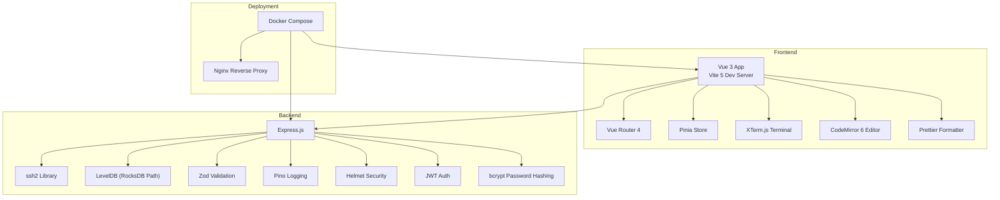
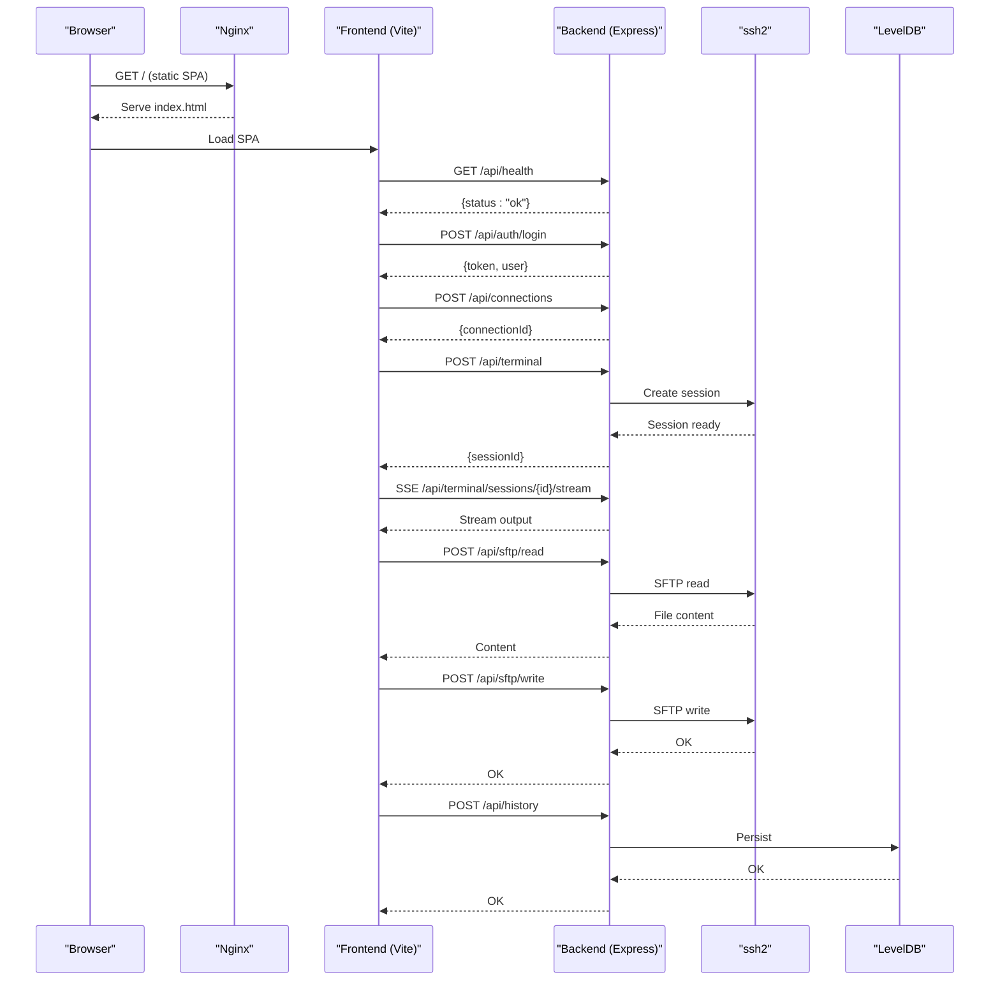
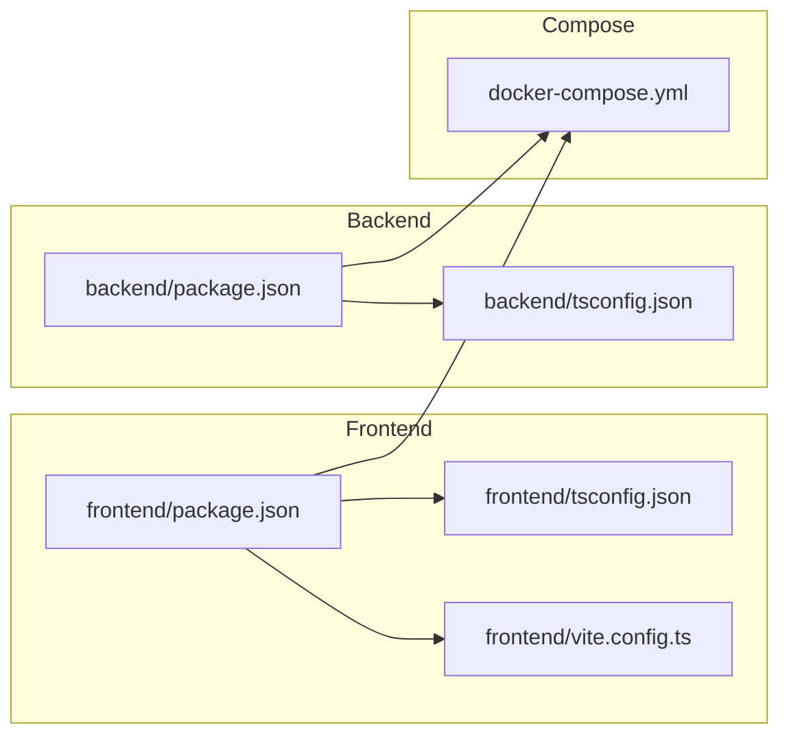

# Technology Stack

<cite>
**Referenced Files in This Document**
- [backend/package.json](file://backend/package.json)
- [frontend/package.json](file://frontend/package.json)
- [backend/tsconfig.json](file://backend/tsconfig.json)
- [frontend/tsconfig.json](file://frontend/tsconfig.json)
- [frontend/tsconfig.node.json](file://frontend/tsconfig.node.json)
- [frontend/vite.config.ts](file://frontend/vite.config.ts)
- [docker-compose.yml](file://docker-compose.yml)
- [backend/src/config/index.ts](file://backend/src/config/index.ts)
- [backend/src/app.ts](file://backend/src/app.ts)
- [frontend/src/main.ts](file://frontend/src/main.ts)
- [frontend/src/router/index.ts](file://frontend/src/router/index.ts)
- [frontend/src/stores/auth.store.ts](file://frontend/src/stores/auth.store.ts)
- [frontend/src/composables/useTerminal.ts](file://frontend/src/composables/useTerminal.ts)
- [frontend/src/composables/useFileEditor.ts](file://frontend/src/composables/useFileEditor.ts)
- [backend/Dockerfile](file://backend/Dockerfile)
- [frontend/Dockerfile](file://frontend/Dockerfile)
- [nginx/nginx.conf](file://nginx/nginx.conf)
</cite>

## Table of Contents
1. [Introduction](#introduction)
2. [Project Structure](#project-structure)
3. [Core Components](#core-components)
4. [Architecture Overview](#architecture-overview)
5. [Detailed Component Analysis](#detailed-component-analysis)
6. [Dependency Analysis](#dependency-analysis)
7. [Performance Considerations](#performance-considerations)
8. [Troubleshooting Guide](#troubleshooting-guide)
9. [Conclusion](#conclusion)
10. [Appendices](#appendices)

## Introduction
This document presents the complete technology stack for WebTerm, covering frontend, backend, and deployment layers. It explains the rationale behind each technology, version requirements, integration patterns, and operational considerations. The stack emphasizes modern web technologies for a secure, performant, and maintainable SSH/SFTP terminal interface with integrated code editing and formatting capabilities.

## Project Structure
The repository is organized into three primary layers:
- Frontend: Vue 3 application with TypeScript, Pinia, Vue Router 4, Vite 5, XTerm.js, CodeMirror 6, and Prettier.
- Backend: Express.js application with TypeScript, ssh2 for SSH, LevelDB (via level), Zod for validation, Pino for logging, and security middleware.
- Deployment: Docker Compose orchestrating Nginx reverse proxy and two application services (frontend and backend).

**Diagram sources**
- [frontend/src/main.ts:1-11](file://frontend/src/main.ts#L1-L11)
- [frontend/src/router/index.ts:1-44](file://frontend/src/router/index.ts#L1-L44)
- [frontend/src/stores/auth.store.ts:1-54](file://frontend/src/stores/auth.store.ts#L1-L54)
- [frontend/src/composables/useTerminal.ts:1-237](file://frontend/src/composables/useTerminal.ts#L1-L237)
- [frontend/src/composables/useFileEditor.ts:1-187](file://frontend/src/composables/useFileEditor.ts#L1-L187)
- [backend/src/app.ts:1-51](file://backend/src/app.ts#L1-L51)
- [backend/src/config/index.ts:1-24](file://backend/src/config/index.ts#L1-L24)
- [docker-compose.yml:1-49](file://docker-compose.yml#L1-L49)

**Section sources**
- [docker-compose.yml:1-49](file://docker-compose.yml#L1-L49)

## Core Components
- Frontend: Vue 3 with TypeScript, Pinia for state, Vue Router 4 for navigation, Vite 5 for dev/build, XTerm.js for terminal emulation, CodeMirror 6 for code editing, and Prettier for formatting.
- Backend: Express.js with TypeScript, ssh2 for SSH sessions, LevelDB (configured for RocksDB path), Zod for runtime validation, Pino for structured logging, Helmet for security headers, JWT for authentication, bcrypt for password hashing, and AES-256-GCM for encryption.
- Deployment: Docker Compose with Nginx reverse proxy serving static assets and routing API requests to the backend.

**Section sources**
- [frontend/package.json:1-45](file://frontend/package.json#L1-L45)
- [backend/package.json:1-39](file://backend/package.json#L1-L39)
- [docker-compose.yml:1-49](file://docker-compose.yml#L1-L49)

## Architecture Overview
The system follows a client-server architecture:
- The Vue 3 frontend runs in the browser, communicating with the backend via REST and Server-Sent Events (SSE).
- The backend exposes REST endpoints and SSE streams for terminal sessions and SFTP operations.
- Docker Compose orchestrates services, mounts volumes for persistent data, and health-checks the backend.
- Nginx serves the frontend distribution and proxies API traffic to the backend.

**Diagram sources**
- [frontend/src/composables/useTerminal.ts:132-179](file://frontend/src/composables/useTerminal.ts#L132-L179)
- [frontend/src/composables/useFileEditor.ts:29-84](file://frontend/src/composables/useFileEditor.ts#L29-L84)
- [backend/src/app.ts:40-48](file://backend/src/app.ts#L40-L48)
- [backend/src/config/index.ts:1-24](file://backend/src/config/index.ts#L1-L24)

## Detailed Component Analysis

### Frontend Stack
- Vue 3 Application Bootstrap
  - Initializes Pinia and Vue Router, mounts the root component.
  - Uses a global CSS file for base styles.
  - Reference: [frontend/src/main.ts:1-11](file://frontend/src/main.ts#L1-L11)

- Routing with Vue Router 4
  - Configured with history mode and route guards for authentication and workspace access.
  - Guards redirect unauthenticated users to login and enforce workspace tab presence.
  - Reference: [frontend/src/router/index.ts:1-44](file://frontend/src/router/index.ts#L1-L44)

- State Management with Pinia
  - Authentication store persists token in localStorage, exposes login/register/fetchUser/logout actions.
  - Integrates with workspace store to clear tabs on logout.
  - Reference: [frontend/src/stores/auth.store.ts:1-54](file://frontend/src/stores/auth.store.ts#L1-L54)

- Terminal Emulation with XTerm.js
  - Creates a terminal instance, loads Fit and WebLinks addons, tracks command lines, batches input, and sends UTF-8 encoded data via Base64.
  - Establishes SSE connection for real-time output and handles resize events.
  - References:
    - [frontend/src/composables/useTerminal.ts:1-237](file://frontend/src/composables/useTerminal.ts#L1-L237)

- Code Editing with CodeMirror 6
  - Provides file open/save operations via SFTP APIs.
  - Supports language detection and formatting via Prettier plugin resolution.
  - References:
    - [frontend/src/composables/useFileEditor.ts:1-187](file://frontend/src/composables/useFileEditor.ts#L1-L187)

- Build Tooling with Vite 5
  - Vue plugin enabled, path alias @ mapped to src, dev server proxy configured for /api to backend.
  - References:
    - [frontend/vite.config.ts:1-22](file://frontend/vite.config.ts#L1-L22)
    - [frontend/tsconfig.json:18-20](file://frontend/tsconfig.json#L18-L20)

- TypeScript Configuration
  - Frontend tsconfig targets ES2020, bundler module resolution, strict checks, and path aliases.
  - Separate tsconfig.node.json for Vite config with composite/declaration outputs.
  - References:
    - [frontend/tsconfig.json:1-25](file://frontend/tsconfig.json#L1-L25)
    - [frontend/tsconfig.node.json:1-24](file://frontend/tsconfig.node.json#L1-L24)

- Rationale and Version Notes
  - Vue 3 with Composition API for reactive state and composable logic.
  - Pinia for lightweight, typed store management.
  - Vue Router 4 for SPA navigation and route guards.
  - Vite 5 for fast dev server and optimized builds.
  - XTerm.js for robust terminal rendering and addons.
  - CodeMirror 6 for extensible, language-aware editing.
  - Prettier for consistent formatting across languages.

**Section sources**
- [frontend/src/main.ts:1-11](file://frontend/src/main.ts#L1-L11)
- [frontend/src/router/index.ts:1-44](file://frontend/src/router/index.ts#L1-L44)
- [frontend/src/stores/auth.store.ts:1-54](file://frontend/src/stores/auth.store.ts#L1-L54)
- [frontend/src/composables/useTerminal.ts:1-237](file://frontend/src/composables/useTerminal.ts#L1-L237)
- [frontend/src/composables/useFileEditor.ts:1-187](file://frontend/src/composables/useFileEditor.ts#L1-L187)
- [frontend/vite.config.ts:1-22](file://frontend/vite.config.ts#L1-L22)
- [frontend/tsconfig.json:1-25](file://frontend/tsconfig.json#L1-L25)
- [frontend/tsconfig.node.json:1-24](file://frontend/tsconfig.node.json#L1-L24)

### Backend Stack
- Express.js Application
  - Security headers via Helmet (skipped for SSE endpoints), CORS configured from environment, JSON body parsing with limits, health endpoint, and centralized error middleware.
  - References:
    - [backend/src/app.ts:1-51](file://backend/src/app.ts#L1-L51)

- SSH Protocol Handling with ssh2
  - Used for establishing and managing SSH sessions and SFTP operations.
  - References:
    - [frontend/src/composables/useTerminal.ts:142-174](file://frontend/src/composables/useTerminal.ts#L142-L174)
    - [frontend/src/composables/useFileEditor.ts:38-73](file://frontend/src/composables/useFileEditor.ts#L38-L73)

- Persistent Storage with LevelDB (RocksDB Path)
  - Configured via environment variable for RocksDB path; used for storing application data.
  - References:
    - [backend/src/config/index.ts:12-13](file://backend/src/config/index.ts#L12-L13)
    - [backend/Dockerfile:16-17](file://backend/Dockerfile#L16-L17)

- Data Validation with Zod
  - Validates request payloads and configuration values to ensure type safety and correctness.
  - References:
    - [backend/src/config/index.ts:1-24](file://backend/src/config/index.ts#L1-L24)

- Logging with Pino
  - Structured logging for backend services; supports pretty printing in development.
  - References:
    - [backend/package.json:20-21](file://backend/package.json#L20-L21)

- Security Middleware and Libraries
  - Helmet for HTTP headers, JWT for authentication, bcrypt for password hashing, and AES-256-GCM for encryption.
  - References:
    - [backend/src/app.ts:14-21](file://backend/src/app.ts#L14-L21)
    - [backend/package.json:13-18](file://backend/package.json#L13-L18)

- TypeScript Configuration
  - Targets ES2022, strict compilation, source maps, declaration outputs.
  - References:
    - [backend/tsconfig.json:1-20](file://backend/tsconfig.json#L1-L20)

- Rationale and Version Notes
  - Express.js for minimal, flexible web server.
  - ssh2 for reliable SSH/SFTP connectivity.
  - LevelDB via level for embedded key-value storage.
  - Zod for compile-time and runtime validation.
  - Pino for efficient, structured logs.
  - Helmet, JWT, bcrypt, and AES-256-GCM for defense-in-depth security.

**Section sources**
- [backend/src/app.ts:1-51](file://backend/src/app.ts#L1-L51)
- [backend/src/config/index.ts:1-24](file://backend/src/config/index.ts#L1-L24)
- [backend/tsconfig.json:1-20](file://backend/tsconfig.json#L1-L20)
- [backend/package.json:1-39](file://backend/package.json#L1-L39)
- [backend/Dockerfile:1-22](file://backend/Dockerfile#L1-L22)

### Deployment Stack
- Docker Compose Orchestration
  - Nginx service serves frontend static assets and proxies API requests to backend.
  - Frontend service builds and copies dist to a shared volume for Nginx.
  - Backend service runs production Node.js app, exposes port 3000, health-checks, and mounts data volume.
  - Environment variables configure secrets, limits, and CORS.
  - References:
    - [docker-compose.yml:1-49](file://docker-compose.yml#L1-L49)

- Nginx Reverse Proxy
  - Serves SPA and static assets; configured via repository-provided nginx.conf.
  - References:
    - [nginx/nginx.conf](file://nginx/nginx.conf)

- Frontend Dockerfile
  - Multi-stage build with Node 20 Alpine, installs deps, builds, and serves via Nginx Alpine.
  - References:
    - [frontend/Dockerfile:1-13](file://frontend/Dockerfile#L1-L13)

- Backend Dockerfile
  - Multi-stage build with Node 20 Alpine, installs prod deps only, exposes port 3000, creates data dir.
  - References:
    - [backend/Dockerfile:1-22](file://backend/Dockerfile#L1-L22)

**Section sources**
- [docker-compose.yml:1-49](file://docker-compose.yml#L1-L49)
- [frontend/Dockerfile:1-13](file://frontend/Dockerfile#L1-L13)
- [backend/Dockerfile:1-22](file://backend/Dockerfile#L1-L22)

## Dependency Analysis
- Frontend Dependencies
  - Vue 3, Vue Router 4, Pinia, XTerm.js, CodeMirror 6, Prettier, Axios, @vueuse/core.
  - Build-time: Vite 5, @vitejs/plugin-vue, TypeScript, vue-tsc.
  - References:
    - [frontend/package.json:10-43](file://frontend/package.json#L10-L43)

- Backend Dependencies
  - Express, ssh2, level, zod, pino, helmet, jsonwebtoken, bcrypt, uuid, multer, cors.
  - Dev-time: @types packages, TypeScript, tsx.
  - References:
    - [backend/package.json:12-37](file://backend/package.json#L12-L37)

- Cross-Cutting Concerns
  - TypeScript configurations differ by layer to optimize DX and build outputs.
  - Vite proxy routes /api to backend during development.
  - Environment-driven configuration for secrets, limits, and paths.

**Diagram sources**
- [frontend/package.json:1-45](file://frontend/package.json#L1-L45)
- [frontend/tsconfig.json:1-25](file://frontend/tsconfig.json#L1-L25)
- [frontend/vite.config.ts:1-22](file://frontend/vite.config.ts#L1-L22)
- [backend/package.json:1-39](file://backend/package.json#L1-L39)
- [backend/tsconfig.json:1-20](file://backend/tsconfig.json#L1-L20)
- [docker-compose.yml:1-49](file://docker-compose.yml#L1-L49)

**Section sources**
- [frontend/package.json:1-45](file://frontend/package.json#L1-L45)
- [backend/package.json:1-39](file://backend/package.json#L1-L39)
- [frontend/tsconfig.json:1-25](file://frontend/tsconfig.json#L1-L25)
- [backend/tsconfig.json:1-20](file://backend/tsconfig.json#L1-L20)
- [frontend/vite.config.ts:1-22](file://frontend/vite.config.ts#L1-L22)
- [docker-compose.yml:1-49](file://docker-compose.yml#L1-L49)

## Performance Considerations
- Frontend
  - XTerm.js batching of input reduces network overhead; UTF-8 to Base64 encoding ensures Unicode correctness.
  - CodeMirror 6 lazy-loading of language and formatting plugins improves initial load performance.
  - Vite’s native ES module support and tree-shaking reduce bundle size.
- Backend
  - ssh2 streaming minimizes latency for terminal sessions; LevelDB provides low-latency persistence.
  - Pino structured logs enable efficient monitoring and debugging.
- Deployment
  - Nginx static caching and gzip compression improve asset delivery.
  - Docker multi-stage builds reduce image sizes and attack surface.

[No sources needed since this section provides general guidance]

## Troubleshooting Guide
- Health Checks
  - Backend health endpoint responds with status and timestamp; Compose healthcheck probes /api/health.
  - References:
    - [backend/src/app.ts:35-38](file://backend/src/app.ts#L35-L38)
    - [docker-compose.yml:36-42](file://docker-compose.yml#L36-L42)

- Authentication Flow
  - Ensure JWT secret and expiration are set; verify localStorage token handling in Pinia store.
  - References:
    - [backend/src/config/index.ts:7-10](file://backend/src/config/index.ts#L7-L10)
    - [frontend/src/stores/auth.store.ts:9-20](file://frontend/src/stores/auth.store.ts#L9-L20)

- Terminal Sessions
  - Confirm SSE endpoint path matches frontend usage; verify UTF-8/Base64 conversions and terminal resizing.
  - References:
    - [frontend/src/composables/useTerminal.ts:146-162](file://frontend/src/composables/useTerminal.ts#L146-L162)

- File Editing and Formatting
  - Validate Prettier plugin availability per language; ensure file size constraints are respected.
  - References:
    - [frontend/src/composables/useFileEditor.ts:30-33](file://frontend/src/composables/useFileEditor.ts#L30-L33)
    - [frontend/src/composables/useFileEditor.ts:86-141](file://frontend/src/composables/useFileEditor.ts#L86-L141)

**Section sources**
- [backend/src/app.ts:35-38](file://backend/src/app.ts#L35-L38)
- [docker-compose.yml:36-42](file://docker-compose.yml#L36-L42)
- [backend/src/config/index.ts:7-10](file://backend/src/config/index.ts#L7-L10)
- [frontend/src/stores/auth.store.ts:9-20](file://frontend/src/stores/auth.store.ts#L9-L20)
- [frontend/src/composables/useTerminal.ts:146-162](file://frontend/src/composables/useTerminal.ts#L146-L162)
- [frontend/src/composables/useFileEditor.ts:30-33](file://frontend/src/composables/useFileEditor.ts#L30-L33)
- [frontend/src/composables/useFileEditor.ts:86-141](file://frontend/src/composables/useFileEditor.ts#L86-L141)

## Conclusion
WebTerm leverages a modern, secure, and scalable stack. The frontend’s Vue 3 ecosystem with XTerm.js and CodeMirror 6 delivers a responsive terminal and editor experience. The backend’s Express.js with ssh2, LevelDB, Zod, and Pino ensures robust SSH/SFTP operations with strong validation and observability. Docker Compose and Nginx provide a production-ready deployment model. Together, these technologies form a cohesive foundation for a feature-rich web-based terminal and file editing platform.

[No sources needed since this section summarizes without analyzing specific files]

## Appendices

### Development Workflow
- Frontend
  - Run dev server with Vite; use proxy for /api to backend.
  - References:
    - [frontend/package.json:5-9](file://frontend/package.json#L5-L9)
    - [frontend/vite.config.ts:12-20](file://frontend/vite.config.ts#L12-L20)

- Backend
  - Use TSX for hot-reload dev; build with tsc; lint with ESLint.
  - References:
    - [backend/package.json:6-10](file://backend/package.json#L6-L10)

**Section sources**
- [frontend/package.json:5-9](file://frontend/package.json#L5-L9)
- [frontend/vite.config.ts:12-20](file://frontend/vite.config.ts#L12-L20)
- [backend/package.json:6-10](file://backend/package.json#L6-L10)

### Production Deployment Considerations
- Secrets and Environment
  - Set MASTER_SECRET, JWT_SECRET, JWT_EXPIRES_IN, ROCKSDB_PATH, session limits, and CORS_ORIGIN.
  - References:
    - [docker-compose.yml:24-33](file://docker-compose.yml#L24-L33)
    - [backend/src/config/index.ts:7-20](file://backend/src/config/index.ts#L7-L20)

- Volume Persistence
  - Mount webterm-data for RocksDB and frontend-dist for static assets.
  - References:
    - [docker-compose.yml:34-42](file://docker-compose.yml#L34-L42)

**Section sources**
- [docker-compose.yml:24-33](file://docker-compose.yml#L24-L33)
- [backend/src/config/index.ts:7-20](file://backend/src/config/index.ts#L7-L20)
- [docker-compose.yml:34-42](file://docker-compose.yml#L34-L42)