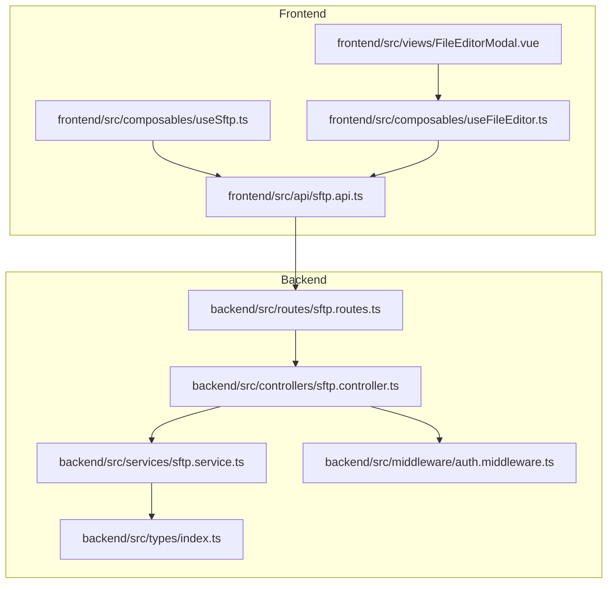
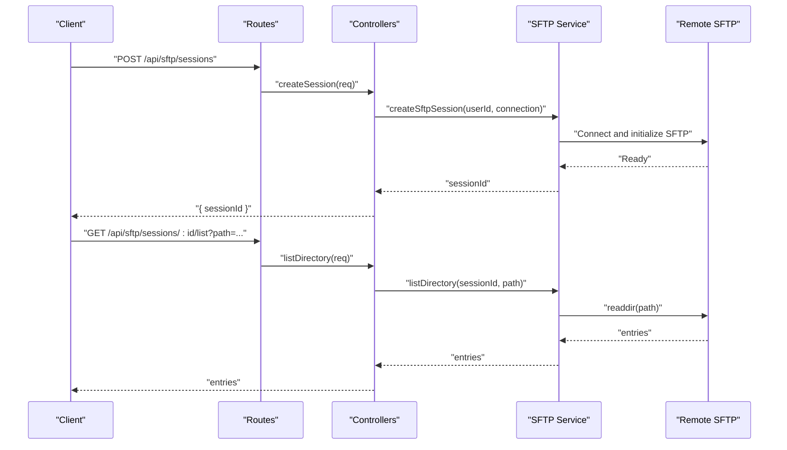
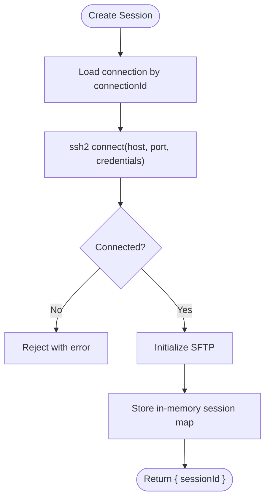
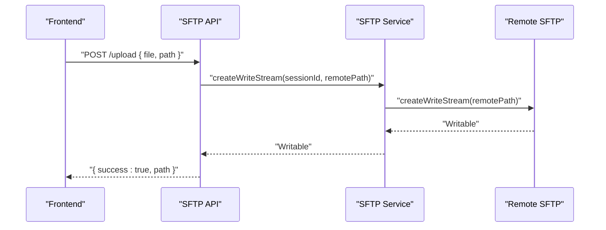
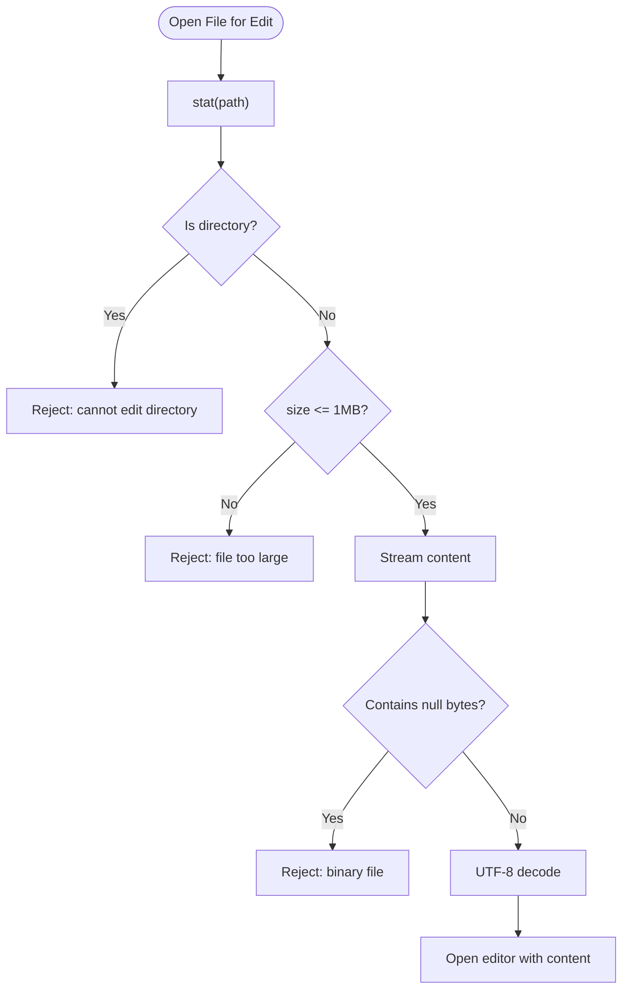
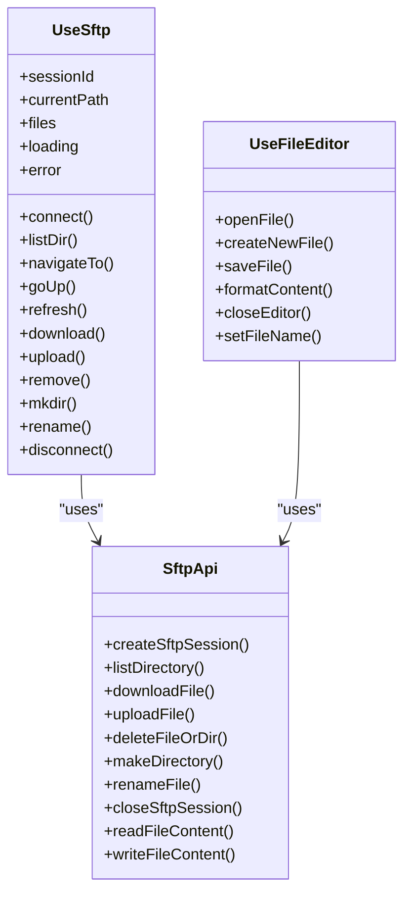
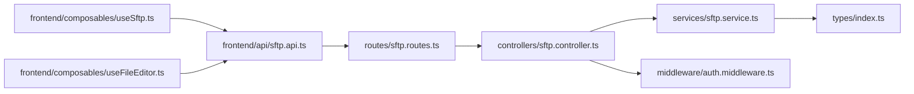
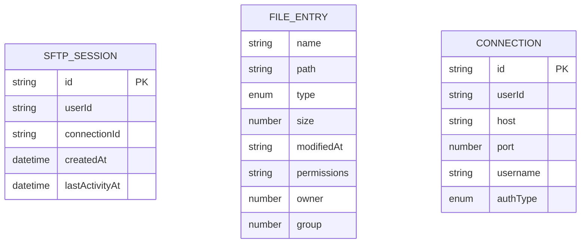

# SFTP API

<cite>
**Referenced Files in This Document**
- [sftp.routes.ts](file://backend/src/routes/sftp.routes.ts)
- [sftp.controller.ts](file://backend/src/controllers/sftp.controller.ts)
- [sftp.service.ts](file://backend/src/services/sftp.service.ts)
- [auth.middleware.ts](file://backend/src/middleware/auth.middleware.ts)
- [types/index.ts](file://backend/src/types/index.ts)
- [sftp.api.ts](file://frontend/src/api/sftp.api.ts)
- [useSftp.ts](file://frontend/src/composables/useSftp.ts)
- [useFileEditor.ts](file://frontend/src/composables/useFileEditor.ts)
- [FileEditorModal.vue](file://frontend/src/views/FileEditorModal.vue)
- [README.md](file://README.md)
</cite>

## Table of Contents
1. [Introduction](#introduction)
2. [Project Structure](#project-structure)
3. [Core Components](#core-components)
4. [Architecture Overview](#architecture-overview)
5. [Detailed Component Analysis](#detailed-component-analysis)
6. [Dependency Analysis](#dependency-analysis)
7. [Performance Considerations](#performance-considerations)
8. [Troubleshooting Guide](#troubleshooting-guide)
9. [Conclusion](#conclusion)
10. [Appendices](#appendices)

## Introduction
This document provides comprehensive API documentation for the SFTP file management system. It covers all SFTP endpoints, session lifecycle, file operations, content editing, security controls, and client-side integration guidelines. It also includes practical examples, troubleshooting steps, and performance optimization tips tailored for frontend developers integrating SFTP capabilities into a browser-based SSH terminal application.

## Project Structure
The SFTP subsystem spans backend routes, controllers, services, and frontend APIs/composables. The backend enforces authentication, validates requests, and orchestrates SSH/SFTP operations. The frontend exposes composable helpers and a modal-based editor to interact with the backend.

**Diagram sources**
- [sftp.routes.ts:1-36](file://backend/src/routes/sftp.routes.ts#L1-L36)
- [sftp.controller.ts:1-296](file://backend/src/controllers/sftp.controller.ts#L1-L296)
- [sftp.service.ts:1-277](file://backend/src/services/sftp.service.ts#L1-L277)
- [auth.middleware.ts:1-33](file://backend/src/middleware/auth.middleware.ts#L1-L33)
- [types/index.ts:1-83](file://backend/src/types/index.ts#L1-L83)
- [sftp.api.ts:1-66](file://frontend/src/api/sftp.api.ts#L1-L66)
- [useSftp.ts:1-154](file://frontend/src/composables/useSftp.ts#L1-L154)
- [useFileEditor.ts:1-187](file://frontend/src/composables/useFileEditor.ts#L1-L187)
- [FileEditorModal.vue:1-427](file://frontend/src/views/FileEditorModal.vue#L1-L427)

**Section sources**
- [sftp.routes.ts:1-36](file://backend/src/routes/sftp.routes.ts#L1-L36)
- [sftp.controller.ts:1-296](file://backend/src/controllers/sftp.controller.ts#L1-L296)
- [sftp.service.ts:1-277](file://backend/src/services/sftp.service.ts#L1-L277)
- [auth.middleware.ts:1-33](file://backend/src/middleware/auth.middleware.ts#L1-L33)
- [types/index.ts:1-83](file://backend/src/types/index.ts#L1-L83)
- [sftp.api.ts:1-66](file://frontend/src/api/sftp.api.ts#L1-L66)
- [useSftp.ts:1-154](file://frontend/src/composables/useSftp.ts#L1-L154)
- [useFileEditor.ts:1-187](file://frontend/src/composables/useFileEditor.ts#L1-L187)
- [FileEditorModal.vue:1-427](file://frontend/src/views/FileEditorModal.vue#L1-L427)

## Core Components
- Backend routes define the SFTP API surface and enforce authentication.
- Controllers validate inputs, enforce session ownership, and delegate to the SFTP service.
- Services manage SSH/SFTP sessions, perform file operations, and detect binary content.
- Frontend APIs encapsulate HTTP calls; composables orchestrate UI workflows and editor integration.

Key capabilities:
- Session lifecycle: create, list directory, download, upload, delete, mkdir, rename, stat, read/write content, close.
- Content editing: read up to 1 MB, write content, format via Prettier when applicable.
- Security: JWT-based auth, per-session ownership checks, upload size limits, binary file detection.

**Section sources**
- [sftp.routes.ts:18-33](file://backend/src/routes/sftp.routes.ts#L18-L33)
- [sftp.controller.ts:31-43](file://backend/src/controllers/sftp.controller.ts#L31-L43)
- [sftp.service.ts:10-72](file://backend/src/services/sftp.service.ts#L10-L72)
- [sftp.api.ts:4-65](file://frontend/src/api/sftp.api.ts#L4-L65)
- [useSftp.ts:12-133](file://frontend/src/composables/useSftp.ts#L12-L133)
- [useFileEditor.ts:10-181](file://frontend/src/composables/useFileEditor.ts#L10-L181)

## Architecture Overview
The SFTP API follows a layered architecture:
- Routes: Define endpoints and attach multer for uploads.
- Controllers: Validate requests, enforce session ownership, and call service functions.
- Services: Manage in-memory SSH/SFTP sessions, perform file operations, and handle binary detection.
- Middleware: Enforce JWT authentication and propagate user identity.
- Types: Define session and file entry structures.

**Diagram sources**
- [sftp.routes.ts:23-33](file://backend/src/routes/sftp.routes.ts#L23-L33)
- [sftp.controller.ts:45-80](file://backend/src/controllers/sftp.controller.ts#L45-L80)
- [sftp.service.ts:10-72](file://backend/src/services/sftp.service.ts#L10-L72)
- [sftp.service.ts:92-123](file://backend/src/services/sftp.service.ts#L92-L123)

**Section sources**
- [sftp.routes.ts:18-33](file://backend/src/routes/sftp.routes.ts#L18-L33)
- [sftp.controller.ts:45-80](file://backend/src/controllers/sftp.controller.ts#L45-L80)
- [sftp.service.ts:10-72](file://backend/src/services/sftp.service.ts#L10-L72)
- [sftp.service.ts:92-123](file://backend/src/services/sftp.service.ts#L92-L123)

## Detailed Component Analysis

### API Endpoints

- POST /api/sftp/sessions
  - Purpose: Create an SFTP session bound to a user connection.
  - Request body: { connectionId: string (UUID) }
  - Response: { sessionId: string }
  - Validation: Zod schema ensures connectionId is present and valid.
  - Behavior: Loads connection from storage, creates SSH client, initializes SFTP, stores session in memory.
  - Security: Requires JWT; session.userId must match requester.

- GET /api/sftp/sessions/:id/list
  - Purpose: List directory entries.
  - Query: path (optional, defaults to "/")
  - Response: Array of FileEntry objects sorted with directories first.
  - Permissions: Uses SSH attributes to compute type, size, permissions, timestamps.

- GET /api/sftp/sessions/:id/download
  - Purpose: Stream a file for download.
  - Query: path (required)
  - Response: application/octet-stream with Content-Disposition attachment header.
  - Error handling: Emits 500 if stream errors occur.

- POST /api/sftp/sessions/:id/upload
  - Purpose: Upload a file to the remote server.
  - Form fields: file (Buffer), path (string)
  - Limits: multer configured to 100MB.
  - Behavior: Writes uploaded buffer to remote path via SFTP write stream.

- DELETE /api/sftp/sessions/:id/file
  - Purpose: Delete a file or directory.
  - Request body: { path: string }
  - Behavior: Stat to detect type; unlink for files, rmdir for directories.

- POST /api/sftp/sessions/:id/mkdir
  - Purpose: Create a directory.
  - Request body: { path: string }

- POST /api/sftp/sessions/:id/rename
  - Purpose: Rename/move a file or directory.
  - Request body: { oldPath: string, newPath: string }

- GET /api/sftp/sessions/:id/stat
  - Purpose: Retrieve file metadata (size, type, permissions, timestamps).

- GET /api/sftp/sessions/:id/file/content
  - Purpose: Read file content for editing.
  - Query: path (required)
  - Limitations: Rejects directories and files larger than 1MB; detects binary content.

- PUT /api/sftp/sessions/:id/file/content
  - Purpose: Write file content from the editor.
  - Request body: { path: string, content: string (<= 1MB) }
  - Behavior: Writes UTF-8 content to remote file.

- DELETE /api/sftp/sessions/:id
  - Purpose: Close an SFTP session.
  - Behavior: Ends SSH client and removes session from memory.

**Section sources**
- [sftp.routes.ts:19-33](file://backend/src/routes/sftp.routes.ts#L19-L33)
- [sftp.controller.ts:45-295](file://backend/src/controllers/sftp.controller.ts#L45-L295)
- [sftp.service.ts:92-276](file://backend/src/services/sftp.service.ts#L92-L276)

### Session Management
- Creation: Generates a UUID, connects via ssh2, initializes SFTP, stores in-memory map keyed by sessionId.
- Ownership: validateSessionAccess checks session existence and userId match.
- Activity tracking: lastActivityAt updated on each operation.
- Cleanup: closeSftpSession ends SSH client and deletes session.

**Diagram sources**
- [sftp.controller.ts:45-66](file://backend/src/controllers/sftp.controller.ts#L45-L66)
- [sftp.service.ts:10-72](file://backend/src/services/sftp.service.ts#L10-L72)

**Section sources**
- [sftp.controller.ts:45-66](file://backend/src/controllers/sftp.controller.ts#L45-L66)
- [sftp.service.ts:10-72](file://backend/src/services/sftp.service.ts#L10-L72)

### File Operations Workflow
- Directory listing: readdir, format entries, sort directories first.
- Upload: multer buffer -> Readable -> SFTP write stream.
- Download: SFTP read stream piped to HTTP response.
- Delete: stat -> unlink/rmdir depending on type.
- Rename: sftp.rename.
- Content read: stream to buffer, binary detection, UTF-8 decode.
- Content write: UTF-8 buffer -> Readable -> SFTP write stream.

**Diagram sources**
- [sftp.controller.ts:112-148](file://backend/src/controllers/sftp.controller.ts#L112-L148)
- [sftp.service.ts:132-137](file://backend/src/services/sftp.service.ts#L132-L137)

**Section sources**
- [sftp.controller.ts:112-148](file://backend/src/controllers/sftp.controller.ts#L112-L148)
- [sftp.service.ts:132-137](file://backend/src/services/sftp.service.ts#L132-L137)

### Content Editing Workflow
- Read: stat -> check type and size -> stream -> buffer -> binary detection -> UTF-8 decode.
- Write: UTF-8 encode -> Readable -> SFTP write stream.
- Frontend: useFileEditor enforces 1MB limit, detects binary, formats content via Prettier when supported.

**Diagram sources**
- [sftp.controller.ts:231-268](file://backend/src/controllers/sftp.controller.ts#L231-L268)
- [sftp.service.ts:218-244](file://backend/src/services/sftp.service.ts#L218-L244)
- [useFileEditor.ts:29-52](file://frontend/src/composables/useFileEditor.ts#L29-L52)

**Section sources**
- [sftp.controller.ts:231-268](file://backend/src/controllers/sftp.controller.ts#L231-L268)
- [sftp.service.ts:218-244](file://backend/src/services/sftp.service.ts#L218-L244)
- [useFileEditor.ts:29-52](file://frontend/src/composables/useFileEditor.ts#L29-L52)

### Frontend Integration
- useSftp: Manages session lifecycle, directory navigation, upload/download/delete/mkdir/rename, and refresh.
- sftp.api: Encapsulates HTTP calls for all SFTP endpoints.
- useFileEditor + FileEditorModal: Provides editor UI, language detection, formatting, and save operations.

**Diagram sources**
- [useSftp.ts:5-153](file://frontend/src/composables/useSftp.ts#L5-L153)
- [sftp.api.ts:4-65](file://frontend/src/api/sftp.api.ts#L4-L65)
- [useFileEditor.ts:12-181](file://frontend/src/composables/useFileEditor.ts#L12-L181)

**Section sources**
- [useSftp.ts:5-153](file://frontend/src/composables/useSftp.ts#L5-L153)
- [sftp.api.ts:4-65](file://frontend/src/api/sftp.api.ts#L4-L65)
- [useFileEditor.ts:12-181](file://frontend/src/composables/useFileEditor.ts#L12-L181)
- [FileEditorModal.vue:64-278](file://frontend/src/views/FileEditorModal.vue#L64-L278)

## Dependency Analysis
- Routes depend on controllers and multer for uploads.
- Controllers depend on services for SFTP operations and on auth middleware for user identity.
- Services depend on ssh2 for SSH/SFTP and on crypto/db services for connection data.
- Frontend depends on axios-like client and Vue composables.

**Diagram sources**
- [sftp.routes.ts:1-36](file://backend/src/routes/sftp.routes.ts#L1-L36)
- [sftp.controller.ts:1-296](file://backend/src/controllers/sftp.controller.ts#L1-L296)
- [sftp.service.ts:1-277](file://backend/src/services/sftp.service.ts#L1-L277)
- [auth.middleware.ts:1-33](file://backend/src/middleware/auth.middleware.ts#L1-L33)
- [types/index.ts:1-83](file://backend/src/types/index.ts#L1-L83)
- [sftp.api.ts:1-66](file://frontend/src/api/sftp.api.ts#L1-L66)
- [useSftp.ts:1-154](file://frontend/src/composables/useSftp.ts#L1-L154)
- [useFileEditor.ts:1-187](file://frontend/src/composables/useFileEditor.ts#L1-L187)

**Section sources**
- [sftp.routes.ts:1-36](file://backend/src/routes/sftp.routes.ts#L1-L36)
- [sftp.controller.ts:1-296](file://backend/src/controllers/sftp.controller.ts#L1-L296)
- [sftp.service.ts:1-277](file://backend/src/services/sftp.service.ts#L1-L277)
- [auth.middleware.ts:1-33](file://backend/src/middleware/auth.middleware.ts#L1-L33)
- [types/index.ts:1-83](file://backend/src/types/index.ts#L1-L83)
- [sftp.api.ts:1-66](file://frontend/src/api/sftp.api.ts#L1-L66)
- [useSftp.ts:1-154](file://frontend/src/composables/useSftp.ts#L1-L154)
- [useFileEditor.ts:1-187](file://frontend/src/composables/useFileEditor.ts#L1-L187)

## Performance Considerations
- Upload size limit: 100MB to prevent excessive memory usage during multipart parsing.
- Editor size limit: 1MB to avoid large in-memory buffers and potential timeouts.
- Streaming: Downloads and uploads use streams to minimize memory footprint.
- Sorting: Directory listings sort directories first, then by name, improving UX without extra CPU overhead.
- Binary detection: Early rejection prevents unnecessary processing of binary files.

[No sources needed since this section provides general guidance]

## Troubleshooting Guide
Common issues and resolutions:
- Authentication failures
  - Symptom: 401 Unauthorized or invalid/expired token.
  - Cause: Missing or invalid Authorization header/token.
  - Resolution: Ensure Bearer token is attached to requests; verify token validity.

- Session not found or access denied
  - Symptom: 404 Session not found or 403 Access denied.
  - Cause: Session does not exist or belongs to another user.
  - Resolution: Recreate session with valid connectionId; confirm session ownership.

- Upload failures
  - Symptom: 500 error during upload.
  - Causes: Remote write failure, invalid path, or exceeded size limit.
  - Resolution: Verify target path exists and is writable; ensure file size ≤ 100MB.

- Download failures
  - Symptom: 500 error streaming file.
  - Causes: Remote read failure or missing path.
  - Resolution: Confirm file exists and is readable; retry after checking permissions.

- Editor errors
  - Symptom: 413 (file too large) or 422 (binary file).
  - Causes: File exceeds 1MB or contains null bytes.
  - Resolution: Reduce file size or open in external editor; avoid editing binary files.

- Rename failures
  - Symptom: 500 error.
  - Causes: Invalid old/new paths or permission issues.
  - Resolution: Ensure both paths are valid and accessible; check remote permissions.

**Section sources**
- [auth.middleware.ts:10-32](file://backend/src/middleware/auth.middleware.ts#L10-L32)
- [sftp.controller.ts:31-43](file://backend/src/controllers/sftp.controller.ts#L31-L43)
- [sftp.controller.ts:112-148](file://backend/src/controllers/sftp.controller.ts#L112-L148)
- [sftp.controller.ts:231-268](file://backend/src/controllers/sftp.controller.ts#L231-L268)
- [sftp.service.ts:218-244](file://backend/src/services/sftp.service.ts#L218-L244)

## Conclusion
The SFTP API provides a robust, secure, and efficient interface for managing files over SSH. It enforces authentication and per-session ownership, offers streaming uploads/downloads, and includes safeguards against oversized or binary content. The frontend composables streamline integration for directory browsing, upload/download, and content editing, while the backend services encapsulate SSH/SFTP operations with clear error handling.

[No sources needed since this section summarizes without analyzing specific files]

## Appendices

### Endpoint Reference

- POST /api/sftp/sessions
  - Body: { connectionId: string }
  - Response: { sessionId: string }

- GET /api/sftp/sessions/:id/list
  - Query: path (optional)
  - Response: FileEntry[]

- GET /api/sftp/sessions/:id/download
  - Query: path (required)
  - Response: application/octet-stream

- POST /api/sftp/sessions/:id/upload
  - Form: file (Buffer), path (string)
  - Response: { success: true, path }

- DELETE /api/sftp/sessions/:id/file
  - Body: { path: string }
  - Response: { success: true }

- POST /api/sftp/sessions/:id/mkdir
  - Body: { path: string }
  - Response: { success: true }

- POST /api/sftp/sessions/:id/rename
  - Body: { oldPath: string, newPath: string }
  - Response: { success: true }

- GET /api/sftp/sessions/:id/stat
  - Query: path (required)
  - Response: FileEntry

- GET /api/sftp/sessions/:id/file/content
  - Query: path (required)
  - Response: { content: string, path: string, size: number }

- PUT /api/sftp/sessions/:id/file/content
  - Body: { path: string, content: string (≤ 1MB) }
  - Response: { success: true, path: string, size: number }

- DELETE /api/sftp/sessions/:id
  - Response: { success: true }

**Section sources**
- [sftp.routes.ts:23-33](file://backend/src/routes/sftp.routes.ts#L23-L33)
- [README.md:255-269](file://README.md#L255-L269)

### Data Models

**Diagram sources**
- [types/index.ts:56-75](file://backend/src/types/index.ts#L56-L75)
- [types/index.ts:19-31](file://backend/src/types/index.ts#L19-L31)

**Section sources**
- [types/index.ts:56-75](file://backend/src/types/index.ts#L56-L75)
- [types/index.ts:19-31](file://backend/src/types/index.ts#L19-L31)

### Client Implementation Guidelines

- Authentication
  - Attach Authorization: Bearer <token> header to all SFTP requests.
  - Support token in query param for SSE-compatible flows.

- Session lifecycle
  - Create session with POST /api/sftp/sessions using a valid connectionId.
  - Use the returned sessionId for subsequent operations.
  - Close session with DELETE /api/sftp/sessions/:id when finished.

- Directory browsing
  - Use GET /api/sftp/sessions/:id/list to load entries.
  - Navigate by calling with updated path query.

- Uploads
  - Use multipart/form-data with fields file and path.
  - Ensure file size ≤ 100MB.

- Downloads
  - Use GET /api/sftp/sessions/:id/download with path query.
  - Handle blob responses and trigger browser downloads.

- File operations
  - mkdir: POST /api/sftp/sessions/:id/mkdir with { path }.
  - rename: POST /api/sftp/sessions/:id/rename with { oldPath, newPath }.
  - delete: DELETE /api/sftp/sessions/:id/file with { path }.

- Content editing
  - Read: GET /api/sftp/sessions/:id/file/content with { path }.
  - Write: PUT /api/sftp/sessions/:id/file/content with { path, content }.
  - Respect 1MB limit and binary detection.

- Drag-and-drop upload handling
  - Capture dropped files and call uploadFile(sessionId, targetPath, file).
  - On success, refresh directory listing.

- File editor integration
  - Use useFileEditor to open files, format content, and save.
  - The editor enforces size limits and language-aware formatting.

**Section sources**
- [auth.middleware.ts:10-32](file://backend/src/middleware/auth.middleware.ts#L10-L32)
- [sftp.api.ts:4-65](file://frontend/src/api/sftp.api.ts#L4-L65)
- [useSftp.ts:12-133](file://frontend/src/composables/useSftp.ts#L12-L133)
- [useFileEditor.ts:12-181](file://frontend/src/composables/useFileEditor.ts#L12-L181)
- [FileEditorModal.vue:64-278](file://frontend/src/views/FileEditorModal.vue#L64-L278)

### Security Considerations
- Authentication: All SFTP endpoints require JWT Bearer token.
- Ownership: validateSessionAccess ensures sessions belong to the requesting user.
- Upload restrictions: multer fileSize limit of 100MB.
- Editor restrictions: 1MB limit and binary detection to prevent corruption and performance issues.
- Path handling: rely on remote SFTP APIs; ensure caller provides valid paths.

**Section sources**
- [auth.middleware.ts:10-32](file://backend/src/middleware/auth.middleware.ts#L10-L32)
- [sftp.routes.ts:19](file://backend/src/routes/sftp.routes.ts#L19)
- [sftp.controller.ts:29](file://backend/src/controllers/sftp.controller.ts#L29)
- [sftp.controller.ts:248-255](file://backend/src/controllers/sftp.controller.ts#L248-L255)
- [README.md:284-292](file://README.md#L284-L292)