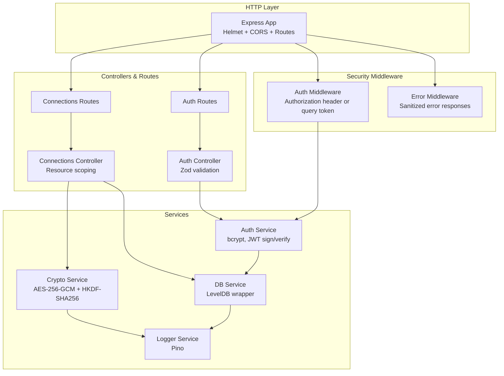
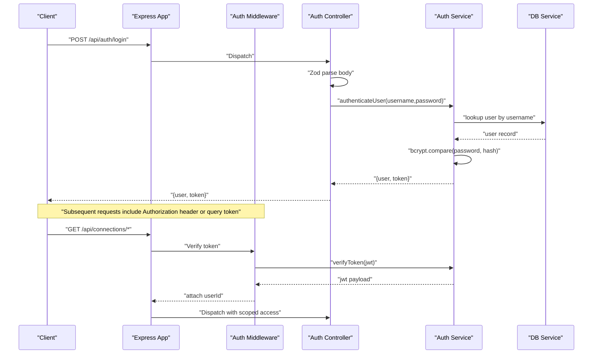
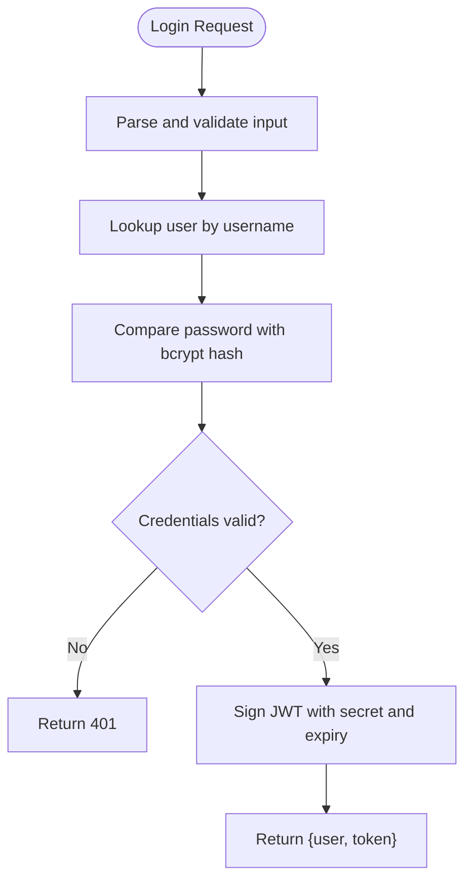
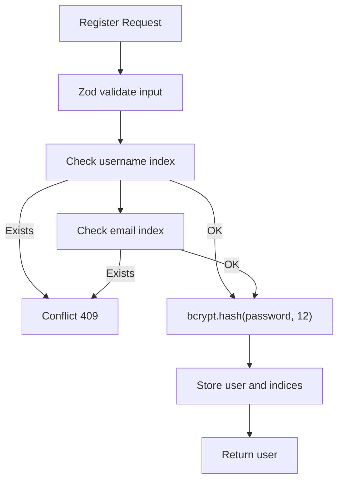
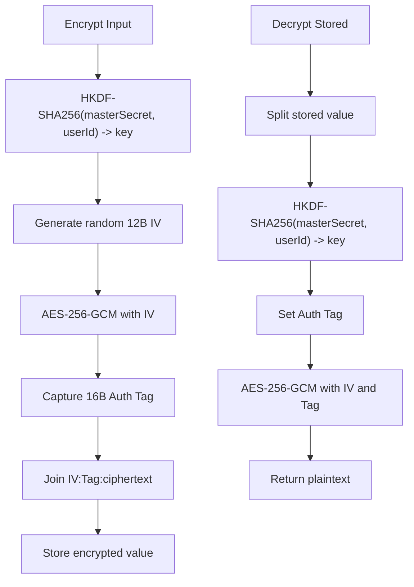
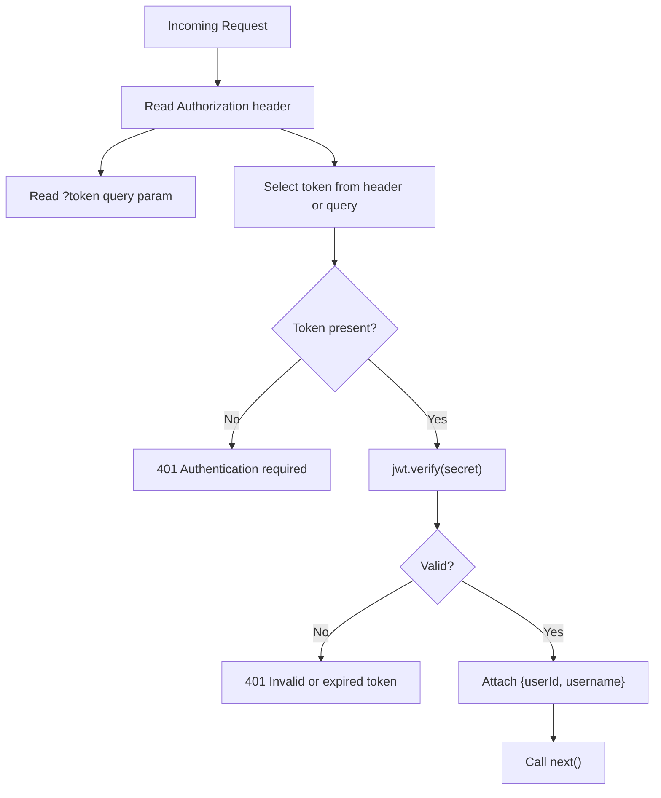
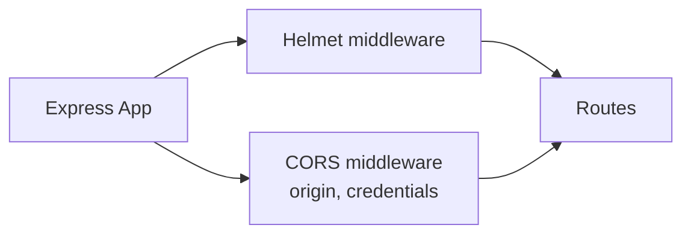
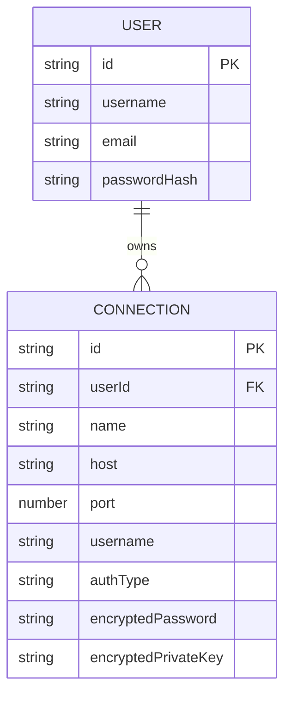
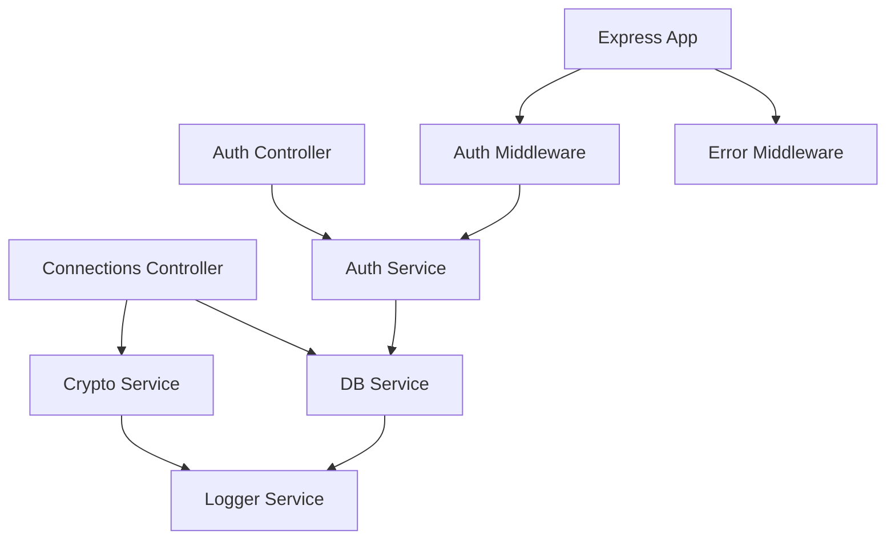

# Security Implementation

<cite>
**Referenced Files in This Document**
- [config/index.ts](file://backend/src/config/index.ts)
- [app.ts](file://backend/src/app.ts)
- [middleware/auth.middleware.ts](file://backend/src/middleware/auth.middleware.ts)
- [middleware/error.middleware.ts](file://backend/src/middleware/error.middleware.ts)
- [services/auth.service.ts](file://backend/src/services/auth.service.ts)
- [services/crypto.service.ts](file://backend/src/services/crypto.service.ts)
- [services/db.service.ts](file://backend/src/services/db.service.ts)
- [services/logger.service.ts](file://backend/src/services/logger.service.ts)
- [controllers/auth.controller.ts](file://backend/src/controllers/auth.controller.ts)
- [controllers/connections.controller.ts](file://backend/src/controllers/connections.controller.ts)
- [routes/auth.routes.ts](file://backend/src/routes/auth.routes.ts)
- [routes/connections.routes.ts](file://backend/src/routes/connections.routes.ts)
- [types/index.ts](file://backend/src/types/index.ts)
</cite>

## Table of Contents
1. [Introduction](#introduction)
2. [Project Structure](#project-structure)
3. [Core Components](#core-components)
4. [Architecture Overview](#architecture-overview)
5. [Detailed Component Analysis](#detailed-component-analysis)
6. [Dependency Analysis](#dependency-analysis)
7. [Performance Considerations](#performance-considerations)
8. [Troubleshooting Guide](#troubleshooting-guide)
9. [Conclusion](#conclusion)
10. [Appendices](#appendices)

## Introduction
This document explains WebTerm’s multi-layered security architecture with a focus on authentication, encryption, access control, and operational hardening. It covers JWT token lifecycle, bcrypt-based password hashing, AES-256-GCM encryption with HKDF-SHA256 key derivation, Helmet.js security headers, CORS policies, session management controls, and secure development practices grounded in the repository’s implementation.

## Project Structure
Security-relevant modules are organized by domain:
- Configuration: centralized security parameters (JWT secret, master secret, expiry, limits, CORS).
- Middleware: authentication guard and global error handler.
- Services: authentication, cryptography, database abstraction, logging.
- Controllers and Routes: request validation with Zod, protected endpoints, and resource scoping via user ID.
- Types: shared models including JWT payload and encrypted connection credentials.

**Diagram sources**
- [app.ts:12-51](file://backend/src/app.ts#L12-L51)
- [middleware/auth.middleware.ts:10-33](file://backend/src/middleware/auth.middleware.ts#L10-L33)
- [middleware/error.middleware.ts:4-8](file://backend/src/middleware/error.middleware.ts#L4-L8)
- [services/auth.service.ts:11-93](file://backend/src/services/auth.service.ts#L11-L93)
- [services/crypto.service.ts:8-42](file://backend/src/services/crypto.service.ts#L8-L42)
- [services/db.service.ts:7-49](file://backend/src/services/db.service.ts#L7-L49)
- [controllers/auth.controller.ts:18-76](file://backend/src/controllers/auth.controller.ts#L18-L76)
- [controllers/connections.controller.ts:21-215](file://backend/src/controllers/connections.controller.ts#L21-L215)
- [routes/auth.routes.ts:7-12](file://backend/src/routes/auth.routes.ts#L7-L12)
- [routes/connections.routes.ts:14-24](file://backend/src/routes/connections.routes.ts#L14-L24)

**Section sources**
- [app.ts:12-51](file://backend/src/app.ts#L12-L51)
- [config/index.ts:3-21](file://backend/src/config/index.ts#L3-L21)

## Core Components
- JWT-based authentication with configurable expiry and verification against a shared secret.
- Password hashing with bcrypt at 12 rounds during user creation.
- AES-256-GCM encryption with per-user derived keys using HKDF-SHA256 from a master secret.
- Authentication middleware supporting Authorization header and query token for SSE compatibility.
- Zod-based input validation for registration, login, and connection operations.
- Resource scoping via user ID prefixes in storage keys to enforce user isolation.
- Helmet.js security headers applied globally except for SSE endpoints.
- CORS configured with origin and credentials support.
- Centralized error handling returning sanitized messages.

**Section sources**
- [services/auth.service.ts:9-93](file://backend/src/services/auth.service.ts#L9-L93)
- [services/crypto.service.ts:8-42](file://backend/src/services/crypto.service.ts#L8-L42)
- [middleware/auth.middleware.ts:10-33](file://backend/src/middleware/auth.middleware.ts#L10-L33)
- [controllers/auth.controller.ts:7-16](file://backend/src/controllers/auth.controller.ts#L7-L16)
- [controllers/connections.controller.ts:11-19](file://backend/src/controllers/connections.controller.ts#L11-L19)
- [app.ts:14-30](file://backend/src/app.ts#L14-L30)
- [config/index.ts:7-21](file://backend/src/config/index.ts#L7-L21)

## Architecture Overview
The security architecture integrates authentication, encryption, and access control across request lifecycles.

**Diagram sources**
- [controllers/auth.controller.ts:39-59](file://backend/src/controllers/auth.controller.ts#L39-L59)
- [services/auth.service.ts:48-92](file://backend/src/services/auth.service.ts#L48-L92)
- [middleware/auth.middleware.ts:10-33](file://backend/src/middleware/auth.middleware.ts#L10-L33)
- [routes/auth.routes.ts:7-12](file://backend/src/routes/auth.routes.ts#L7-L12)

## Detailed Component Analysis

### JWT Token Implementation
- Generation: Payload includes subject (user ID) and username; signed with HS256 using a configurable secret and expiry window.
- Validation: Middleware extracts token from Authorization header or query parameter, verifies signature, and attaches user identity to the request.
- Expiration: Controlled by a configurable expiry period; tokens are rejected if expired.

**Diagram sources**
- [controllers/auth.controller.ts:39-59](file://backend/src/controllers/auth.controller.ts#L39-L59)
- [services/auth.service.ts:48-92](file://backend/src/services/auth.service.ts#L48-L92)

**Section sources**
- [services/auth.service.ts:79-92](file://backend/src/services/auth.service.ts#L79-L92)
- [middleware/auth.middleware.ts:10-33](file://backend/src/middleware/auth.middleware.ts#L10-L33)
- [config/index.ts:8-10](file://backend/src/config/index.ts#L8-L10)

### Password Hashing with bcrypt
- Rounds: 12.
- Creation flow: Validates uniqueness of username/email, hashes password, persists user record with indices.

**Diagram sources**
- [controllers/auth.controller.ts:18-37](file://backend/src/controllers/auth.controller.ts#L18-L37)
- [services/auth.service.ts:11-46](file://backend/src/services/auth.service.ts#L11-L46)

**Section sources**
- [services/auth.service.ts:9](file://backend/src/services/auth.service.ts#L9)
- [services/auth.service.ts:24-46](file://backend/src/services/auth.service.ts#L24-L46)

### Credential Encryption with AES-256-GCM and HKDF-SHA256
- Key derivation: HKDF-SHA256 from master secret and user ID to produce a 32-byte key.
- Encryption: Random 12-byte IV + GCM tag; ciphertext stored as base64-encoded components separated by colon.
- Decryption: Parses stored format, derives key, sets auth tag, and decrypts.

**Diagram sources**
- [services/crypto.service.ts:8-42](file://backend/src/services/crypto.service.ts#L8-L42)

**Section sources**
- [services/crypto.service.ts:4-42](file://backend/src/services/crypto.service.ts#L4-L42)
- [config/index.ts:8](file://backend/src/config/index.ts#L8)

### Authentication Middleware and Token Acceptance
- Supports Authorization: Bearer <token> and ?token=<value> for SSE compatibility.
- On success, attaches user identity to the request; on failure, returns 401 with sanitized message.

**Diagram sources**
- [middleware/auth.middleware.ts:10-33](file://backend/src/middleware/auth.middleware.ts#L10-L33)

**Section sources**
- [middleware/auth.middleware.ts:10-33](file://backend/src/middleware/auth.middleware.ts#L10-L33)

### Helmet.js Security Headers and CORS Policy
- Helmet: Applied globally except SSE endpoints to avoid header conflicts.
- CORS: Origin controlled by configuration with credentials enabled.

**Diagram sources**
- [app.ts:14-30](file://backend/src/app.ts#L14-L30)

**Section sources**
- [app.ts:14-30](file://backend/src/app.ts#L14-L30)
- [config/index.ts:20](file://backend/src/config/index.ts#L20)

### Session Management Controls
- Concurrency limit: Configurable maximum sessions per user.
- Inactivity timeout: Configurable minutes for session timeout.
- Enforcement: Implemented at the session runtime layer (not shown here) with these limits configured centrally.

**Section sources**
- [config/index.ts:16-17](file://backend/src/config/index.ts#L16-L17)

### Access Control Mechanisms
- User isolation: Storage keys prefixed by user ID to prevent cross-user access.
- Resource scoping: Controllers filter lists and fetch by user ID prefix.
- Privilege enforcement: Auth middleware ensures only authenticated users can access protected routes.

**Diagram sources**
- [types/index.ts:4-31](file://backend/src/types/index.ts#L4-L31)

**Section sources**
- [controllers/connections.controller.ts:21-51](file://backend/src/controllers/connections.controller.ts#L21-L51)
- [routes/connections.routes.ts:14](file://backend/src/routes/connections.routes.ts#L14)
- [services/db.service.ts:39-48](file://backend/src/services/db.service.ts#L39-L48)

### Secure Credential Storage Examples
- Registration: Username/email uniqueness validated; password hashed with bcrypt.
- Connection creation/update: Secrets encrypted with AES-256-GCM using HKDF-derived keys before storage.
- Retrieval: Secrets decrypted only when needed (e.g., testing connections).

**Section sources**
- [controllers/auth.controller.ts:18-37](file://backend/src/controllers/auth.controller.ts#L18-L37)
- [controllers/connections.controller.ts:53-90](file://backend/src/controllers/connections.controller.ts#L53-L90)
- [controllers/connections.controller.ts:159-214](file://backend/src/controllers/connections.controller.ts#L159-L214)

### Token-Based Authentication Flows
- Login: Validates input, authenticates via bcrypt, generates JWT with configured expiry.
- Subsequent requests: Auth middleware validates token and scopes access.

**Section sources**
- [controllers/auth.controller.ts:39-59](file://backend/src/controllers/auth.controller.ts#L39-L59)
- [services/auth.service.ts:79-92](file://backend/src/services/auth.service.ts#L79-L92)
- [middleware/auth.middleware.ts:10-33](file://backend/src/middleware/auth.middleware.ts#L10-L33)

### Encryption Key Management
- Master secret: Environment-controlled secret used as input to HKDF.
- Per-user keys: Deterministic but bound to user identity; changing master secret re-derives keys without exposing plaintext.
- Operational note: Rotate master secret carefully; ensure backups of encrypted data are rotated accordingly.

**Section sources**
- [config/index.ts:8](file://backend/src/config/index.ts#L8)
- [services/crypto.service.ts:8-10](file://backend/src/services/crypto.service.ts#L8-L10)

## Dependency Analysis
The security subsystem exhibits low coupling and clear separation of concerns:
- Controllers depend on services for business logic.
- Services depend on configuration, database, and cryptographic primitives.
- Middleware depends on services for token verification.
- Routes apply middleware to protect endpoints.

**Diagram sources**
- [controllers/auth.controller.ts:18-76](file://backend/src/controllers/auth.controller.ts#L18-L76)
- [controllers/connections.controller.ts:21-215](file://backend/src/controllers/connections.controller.ts#L21-L215)
- [services/auth.service.ts:11-93](file://backend/src/services/auth.service.ts#L11-L93)
- [services/crypto.service.ts:12-42](file://backend/src/services/crypto.service.ts#L12-L42)
- [services/db.service.ts:20-37](file://backend/src/services/db.service.ts#L20-L37)
- [middleware/auth.middleware.ts:10-33](file://backend/src/middleware/auth.middleware.ts#L10-L33)
- [middleware/error.middleware.ts:4-8](file://backend/src/middleware/error.middleware.ts#L4-L8)
- [app.ts:12-51](file://backend/src/app.ts#L12-L51)

**Section sources**
- [routes/auth.routes.ts:7-12](file://backend/src/routes/auth.routes.ts#L7-L12)
- [routes/connections.routes.ts:14-24](file://backend/src/routes/connections.routes.ts#L14-L24)

## Performance Considerations
- bcrypt cost: 12 rounds balance security and performance; adjust only after load testing.
- Crypto operations: AES-GCM and HKDF are efficient; avoid unnecessary re-encryption by updating only changed secrets.
- Database scans: Prefix iterators are efficient; ensure proper indexing via username/email lookups.
- Middleware overhead: Keep token verification lightweight; consider caching short-lived metadata if needed.

## Troubleshooting Guide
- Authentication failures:
  - 401 “Authentication required” indicates missing token.
  - 401 “Invalid or expired token” indicates malformed or expired JWT.
- Validation errors:
  - 400 with structured details for Zod validation failures.
- Credential operations:
  - 404 for missing resources; 409 for duplicate username/email during registration.
- Cryptographic errors:
  - Invalid ciphertext format during decryption; ensure consistent storage format.
- Logging:
  - Errors are logged with context; production logs are less verbose to avoid information leakage.

**Section sources**
- [middleware/auth.middleware.ts:18-31](file://backend/src/middleware/auth.middleware.ts#L18-L31)
- [controllers/auth.controller.ts:25-36](file://backend/src/controllers/auth.controller.ts#L25-L36)
- [controllers/auth.controller.ts:47-58](file://backend/src/controllers/auth.controller.ts#L47-L58)
- [controllers/connections.controller.ts:21-51](file://backend/src/controllers/connections.controller.ts#L21-L51)
- [services/crypto.service.ts:27-28](file://backend/src/services/crypto.service.ts#L27-L28)
- [middleware/error.middleware.ts:4-8](file://backend/src/middleware/error.middleware.ts#L4-L8)
- [services/logger.service.ts:4-11](file://backend/src/services/logger.service.ts#L4-L11)

## Conclusion
WebTerm’s security model combines strong authentication (JWT with configurable expiry), robust password hashing (bcrypt), and strict access control (user-scoped storage). Encryption of sensitive credentials uses industry-grade primitives with HKDF-derived keys. Operational safeguards include Helmet headers, CORS configuration, and sanitized error handling. Together, these layers form a practical, production-ready security posture.

## Appendices

### Security Best Practices
- Input validation: Enforce schemas with Zod at controller boundaries.
- Error handling: Never leak stack traces; log internally and return generic messages.
- Transport security: Use HTTPS/TLS termination at the edge (e.g., Nginx) and configure CORS appropriately.
- Secrets management: Store MASTER_SECRET and JWT_SECRET in environment variables; rotate regularly.
- Least privilege: Restrict filesystem and SSH access; avoid storing plaintext secrets.
- Monitoring: Log authentication events and anomalies; alert on repeated failures.

### Security Auditing and Incident Response
- Audit checklist:
  - Review environment variables for secrets exposure.
  - Confirm JWT and master secret rotation procedures.
  - Validate encryption key derivation and storage of encrypted secrets.
  - Inspect access logs for suspicious patterns.
- Incident response:
  - Revoke compromised tokens by rotating secrets.
  - Rotate master secret and re-encrypt stored secrets.
  - Monitor for replay attempts and brute-force indicators.
  - Notify affected users and reset credentials.