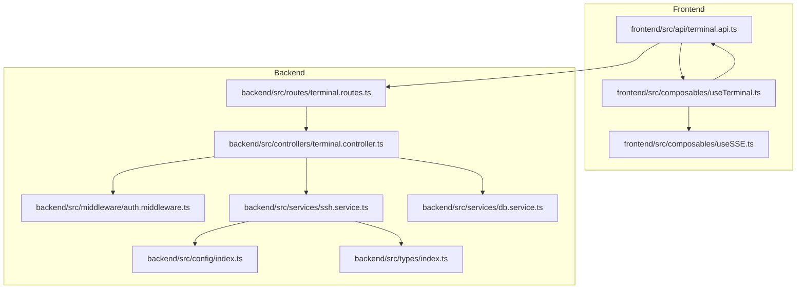
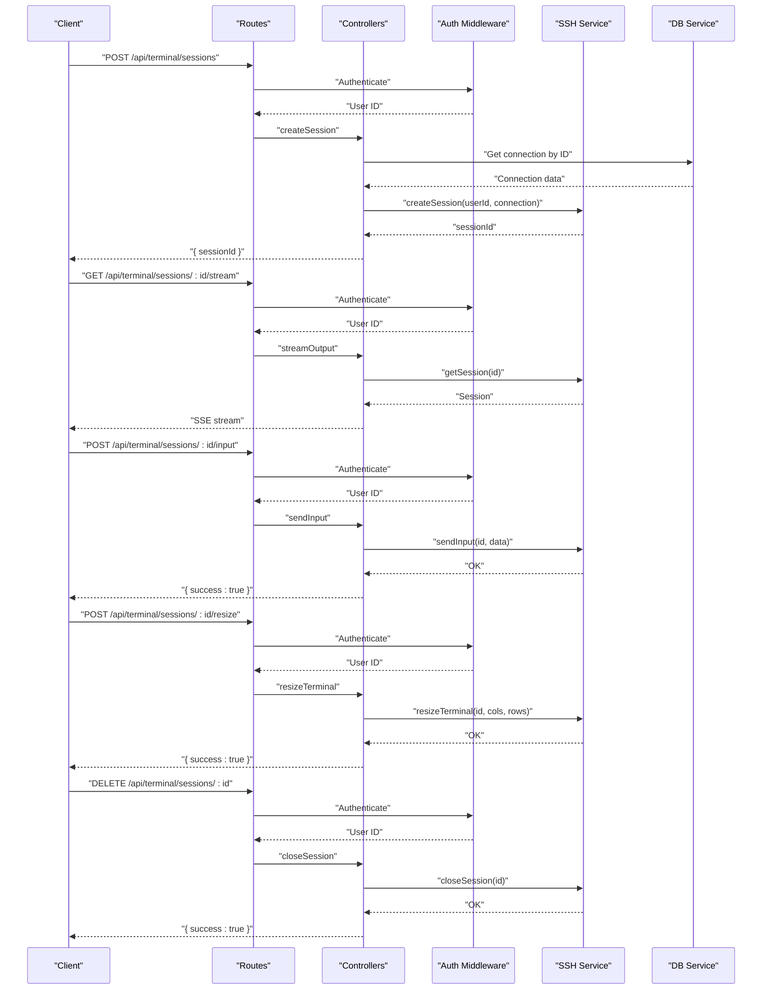
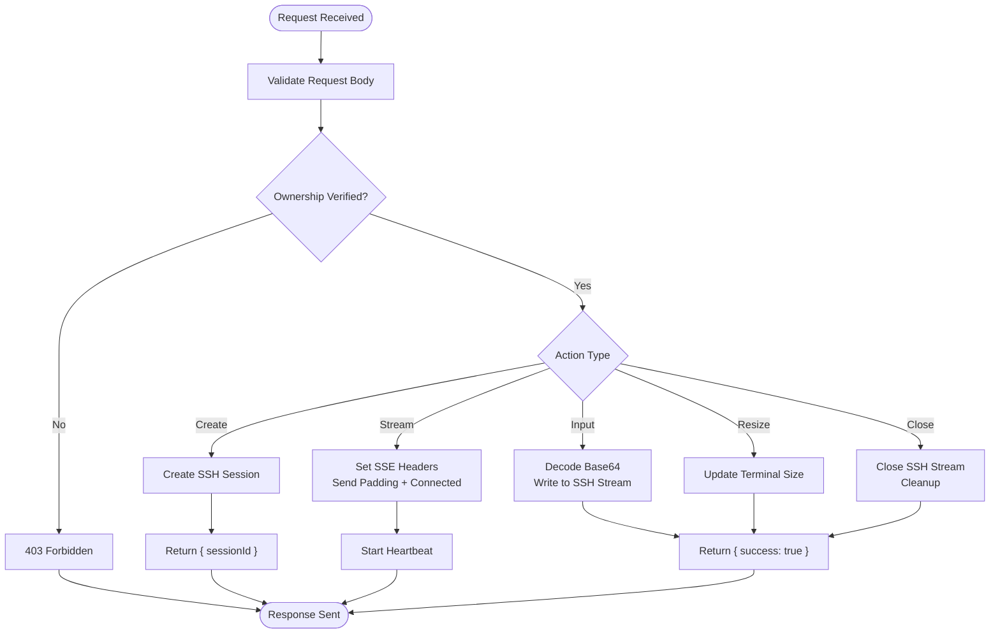
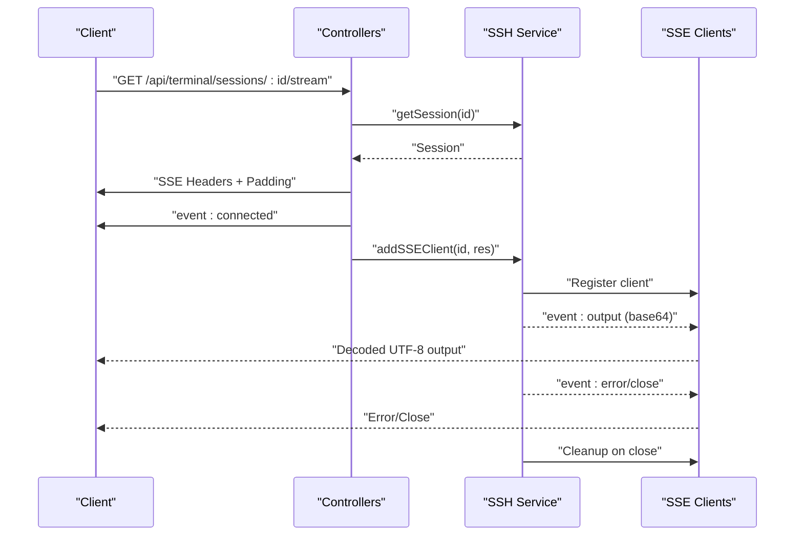
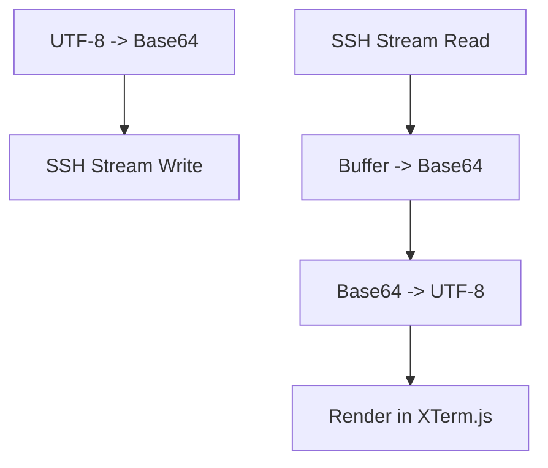
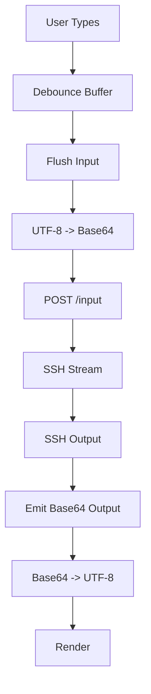
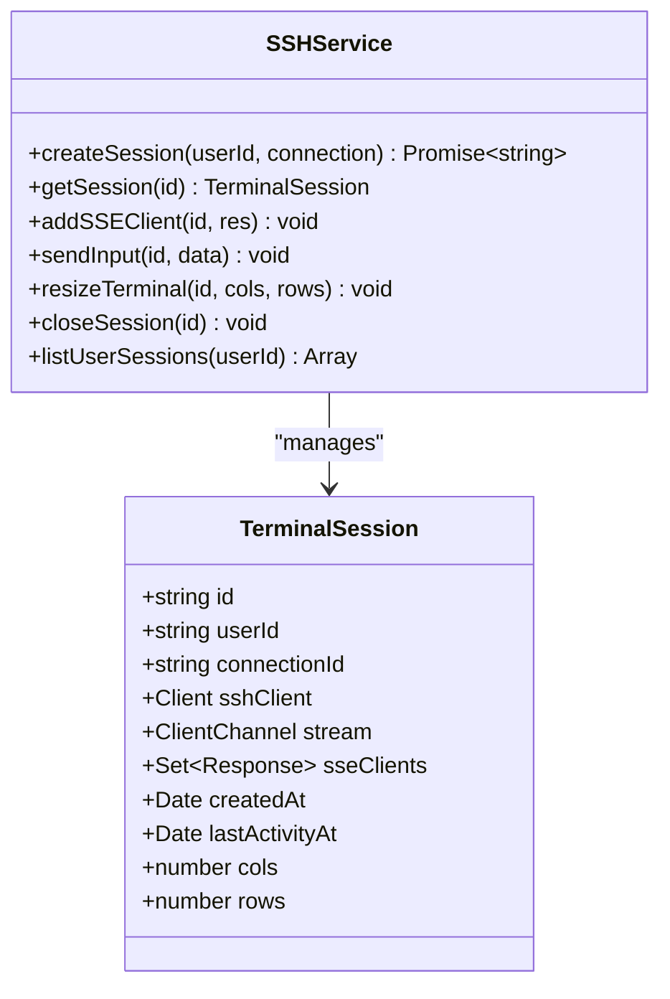
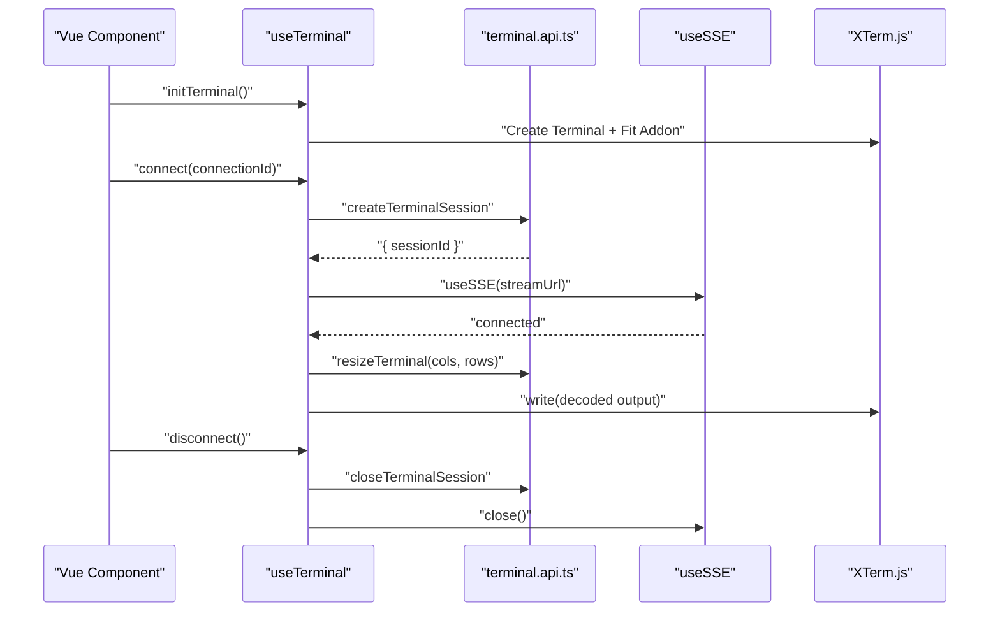
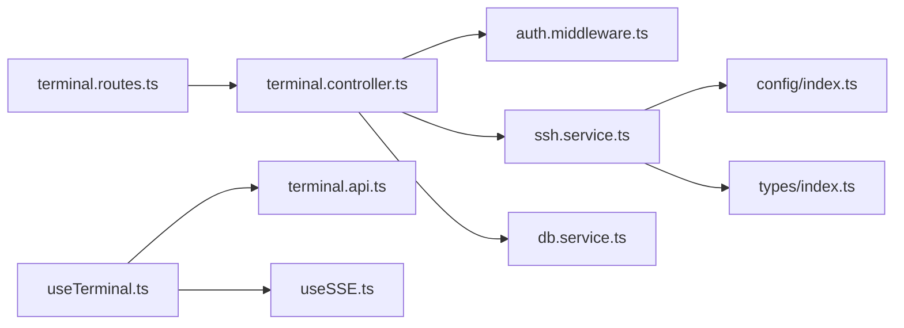

# Terminal API

<cite>
**Referenced Files in This Document**
- [terminal.controller.ts](file://backend/src/controllers/terminal.controller.ts)
- [terminal.routes.ts](file://backend/src/routes/terminal.routes.ts)
- [ssh.service.ts](file://backend/src/services/ssh.service.ts)
- [auth.middleware.ts](file://backend/src/middleware/auth.middleware.ts)
- [db.service.ts](file://backend/src/services/db.service.ts)
- [config/index.ts](file://backend/src/config/index.ts)
- [types/index.ts](file://backend/src/types/index.ts)
- [terminal.api.ts](file://frontend/src/api/terminal.api.ts)
- [useTerminal.ts](file://frontend/src/composables/useTerminal.ts)
- [useSSE.ts](file://frontend/src/composables/useSSE.ts)
- [README.md](file://README.md)
</cite>

## Table of Contents
1. [Introduction](#introduction)
2. [Project Structure](#project-structure)
3. [Core Components](#core-components)
4. [Architecture Overview](#architecture-overview)
5. [Detailed Component Analysis](#detailed-component-analysis)
6. [Dependency Analysis](#dependency-analysis)
7. [Performance Considerations](#performance-considerations)
8. [Troubleshooting Guide](#troubleshooting-guide)
9. [Conclusion](#conclusion)
10. [Appendices](#appendices)

## Introduction
This document provides API documentation for the terminal session management system. It covers the lifecycle of terminal sessions, including creation, streaming output via Server-Sent Events (SSE), sending input, resizing terminals, and cleanup. It explains the SSE implementation for real-time terminal output, base64 encoding/decoding for data transmission, Unicode character support, buffer management, SSH service integration, session pooling, and resource cleanup. It also includes performance considerations, client implementation guidelines for frontend terminal integration, and troubleshooting steps for connection and streaming issues.

## Project Structure
The terminal subsystem spans backend controllers and services, routing, middleware, and frontend composables and API clients. The backend exposes REST endpoints under /api/terminal, while the frontend integrates with XTerm.js and SSE to render and stream terminal output.

**Diagram sources**
- [terminal.routes.ts:1-24](file://backend/src/routes/terminal.routes.ts#L1-L24)
- [terminal.controller.ts:1-157](file://backend/src/controllers/terminal.controller.ts#L1-L157)
- [auth.middleware.ts:1-33](file://backend/src/middleware/auth.middleware.ts#L1-L33)
- [ssh.service.ts:1-248](file://backend/src/services/ssh.service.ts#L1-L248)
- [db.service.ts:1-49](file://backend/src/services/db.service.ts#L1-L49)
- [config/index.ts:1-24](file://backend/src/config/index.ts#L1-L24)
- [types/index.ts:1-83](file://backend/src/types/index.ts#L1-L83)
- [terminal.api.ts:1-26](file://frontend/src/api/terminal.api.ts#L1-L26)
- [useTerminal.ts:1-237](file://frontend/src/composables/useTerminal.ts#L1-L237)
- [useSSE.ts:1-84](file://frontend/src/composables/useSSE.ts#L1-L84)

**Section sources**
- [README.md:200-223](file://README.md#L200-L223)
- [terminal.routes.ts:1-24](file://backend/src/routes/terminal.routes.ts#L1-L24)
- [terminal.controller.ts:1-157](file://backend/src/controllers/terminal.controller.ts#L1-L157)
- [useTerminal.ts:1-237](file://frontend/src/composables/useTerminal.ts#L1-L237)

## Core Components
- Backend routes define the terminal API endpoints and apply authentication middleware.
- Controllers validate requests, enforce ownership, and delegate to the SSH service.
- SSH service manages in-memory sessions, relays output to SSE clients, handles input and resize, and performs cleanup.
- Frontend composables integrate XTerm.js, manage SSE connections, encode/decode data, and handle terminal lifecycle.

Key responsibilities:
- Session creation: validates connection ownership and starts an SSH shell.
- Streaming: sets SSE headers, sends padding, initial events, and heartbeats.
- Input: base64-decodes and forwards to SSH stream.
- Resize: updates terminal dimensions and notifies SSH.
- Cleanup: closes streams and removes sessions.

**Section sources**
- [terminal.routes.ts:14-21](file://backend/src/routes/terminal.routes.ts#L14-L21)
- [terminal.controller.ts:22-43](file://backend/src/controllers/terminal.controller.ts#L22-L43)
- [terminal.controller.ts:45-81](file://backend/src/controllers/terminal.controller.ts#L45-L81)
- [terminal.controller.ts:83-108](file://backend/src/controllers/terminal.controller.ts#L83-L108)
- [terminal.controller.ts:110-135](file://backend/src/controllers/terminal.controller.ts#L110-L135)
- [terminal.controller.ts:137-151](file://backend/src/controllers/terminal.controller.ts#L137-L151)
- [ssh.service.ts:33-166](file://backend/src/services/ssh.service.ts#L33-L166)
- [ssh.service.ts:172-194](file://backend/src/services/ssh.service.ts#L172-L194)
- [ssh.service.ts:196-202](file://backend/src/services/ssh.service.ts#L196-L202)
- [ssh.service.ts:204-212](file://backend/src/services/ssh.service.ts#L204-L212)
- [ssh.service.ts:214-227](file://backend/src/services/ssh.service.ts#L214-L227)

## Architecture Overview
The terminal API follows a layered architecture:
- Routes: define endpoints and attach auth middleware.
- Controllers: validate inputs, enforce ownership, and call service functions.
- Services: manage SSH sessions, SSE clients, and cleanup.
- Middleware: authenticates requests and supports tokens via Authorization header or query param.
- Frontend: creates sessions, subscribes to SSE, encodes/decodes data, and renders terminal output.

**Diagram sources**
- [terminal.routes.ts:14-21](file://backend/src/routes/terminal.routes.ts#L14-L21)
- [terminal.controller.ts:22-43](file://backend/src/controllers/terminal.controller.ts#L22-L43)
- [terminal.controller.ts:45-81](file://backend/src/controllers/terminal.controller.ts#L45-L81)
- [terminal.controller.ts:83-108](file://backend/src/controllers/terminal.controller.ts#L83-L108)
- [terminal.controller.ts:110-135](file://backend/src/controllers/terminal.controller.ts#L110-L135)
- [terminal.controller.ts:137-151](file://backend/src/controllers/terminal.controller.ts#L137-L151)
- [ssh.service.ts:33-166](file://backend/src/services/ssh.service.ts#L33-L166)
- [ssh.service.ts:196-202](file://backend/src/services/ssh.service.ts#L196-L202)
- [ssh.service.ts:204-212](file://backend/src/services/ssh.service.ts#L204-L212)
- [ssh.service.ts:214-227](file://backend/src/services/ssh.service.ts#L214-L227)
- [auth.middleware.ts:10-32](file://backend/src/middleware/auth.middleware.ts#L10-L32)
- [db.service.ts:20-29](file://backend/src/services/db.service.ts#L20-L29)

## Detailed Component Analysis

### Session Lifecycle Endpoints
- POST /api/terminal/sessions
  - Validates body with connectionId.
  - Retrieves user’s connection from storage.
  - Creates an SSH session and returns sessionId.
  - Enforces ownership and validation errors.
- GET /api/terminal/sessions/:id/stream
  - Sets SSE headers and sends padding to force immediate delivery.
  - Sends initial connected event.
  - Registers SSE client and starts heartbeat.
- POST /api/terminal/sessions/:id/input
  - Validates base64-encoded input.
  - Forwards decoded input to SSH stream.
- POST /api/terminal/sessions/:id/resize
  - Validates cols and rows.
  - Updates terminal window size via SSH stream.
- DELETE /api/terminal/sessions/:id
  - Closes SSH stream and cleans up resources.

**Diagram sources**
- [terminal.controller.ts:9-21](file://backend/src/controllers/terminal.controller.ts#L9-L21)
- [terminal.controller.ts:22-43](file://backend/src/controllers/terminal.controller.ts#L22-L43)
- [terminal.controller.ts:45-81](file://backend/src/controllers/terminal.controller.ts#L45-L81)
- [terminal.controller.ts:83-108](file://backend/src/controllers/terminal.controller.ts#L83-L108)
- [terminal.controller.ts:110-135](file://backend/src/controllers/terminal.controller.ts#L110-L135)
- [terminal.controller.ts:137-151](file://backend/src/controllers/terminal.controller.ts#L137-L151)
- [ssh.service.ts:172-194](file://backend/src/services/ssh.service.ts#L172-L194)
- [ssh.service.ts:196-202](file://backend/src/services/ssh.service.ts#L196-L202)
- [ssh.service.ts:204-212](file://backend/src/services/ssh.service.ts#L204-L212)
- [ssh.service.ts:214-227](file://backend/src/services/ssh.service.ts#L214-L227)

**Section sources**
- [terminal.routes.ts:16-21](file://backend/src/routes/terminal.routes.ts#L16-L21)
- [terminal.controller.ts:22-43](file://backend/src/controllers/terminal.controller.ts#L22-L43)
- [terminal.controller.ts:45-81](file://backend/src/controllers/terminal.controller.ts#L45-L81)
- [terminal.controller.ts:83-108](file://backend/src/controllers/terminal.controller.ts#L83-L108)
- [terminal.controller.ts:110-135](file://backend/src/controllers/terminal.controller.ts#L110-L135)
- [terminal.controller.ts:137-151](file://backend/src/controllers/terminal.controller.ts#L137-L151)

### Server-Sent Events Implementation
- Headers: Content-Type text/event-stream, Cache-Control no-cache, Connection keep-alive, X-Accel-Buffering no, Content-Encoding none.
- Padding: Sends a large comment to force proxies to flush initial chunks.
- Initial event: connected with sessionId.
- Heartbeat: periodic ping events to keep connections alive.
- Error/close events: error and close events are sent to clients before cleanup.

**Diagram sources**
- [terminal.controller.ts:45-81](file://backend/src/controllers/terminal.controller.ts#L45-L81)
- [ssh.service.ts:77-88](file://backend/src/services/ssh.service.ts#L77-L88)
- [ssh.service.ts:104-111](file://backend/src/services/ssh.service.ts#L104-L111)
- [ssh.service.ts:172-194](file://backend/src/services/ssh.service.ts#L172-L194)

**Section sources**
- [terminal.controller.ts:59-76](file://backend/src/controllers/terminal.controller.ts#L59-L76)
- [ssh.service.ts:77-88](file://backend/src/services/ssh.service.ts#L77-L88)
- [ssh.service.ts:104-111](file://backend/src/services/ssh.service.ts#L104-L111)
- [ssh.service.ts:172-194](file://backend/src/services/ssh.service.ts#L172-L194)

### Base64 Encoding/Decoding and Unicode Support
- Frontend encodes input using UTF-8 to Base64 to preserve Unicode characters (CJK, emojis).
- Backend decodes Base64 to Buffer and writes to SSH stream.
- Frontend decodes SSE output Base64 to UTF-8 for rendering.
- Backend emits base64-encoded output to SSE clients.

**Diagram sources**
- [useTerminal.ts:210-222](file://frontend/src/composables/useTerminal.ts#L210-L222)
- [ssh.service.ts:79](file://backend/src/services/ssh.service.ts#L79)
- [ssh.service.ts:201](file://backend/src/services/ssh.service.ts#L201)
- [useTerminal.ts:148-154](file://frontend/src/composables/useTerminal.ts#L148-L154)

**Section sources**
- [useTerminal.ts:120-130](file://frontend/src/composables/useTerminal.ts#L120-L130)
- [useTerminal.ts:210-222](file://frontend/src/composables/useTerminal.ts#L210-L222)
- [ssh.service.ts:79](file://backend/src/services/ssh.service.ts#L79)
- [ssh.service.ts:201](file://backend/src/services/ssh.service.ts#L201)

### Buffer Management
- Frontend batches input events and flushes after a short debounce to reduce network overhead.
- Backend maintains lastActivityAt timestamps to detect idle sessions for cleanup.
- SSE clients are tracked per session; heartbeat ensures liveness.

**Diagram sources**
- [useTerminal.ts:64-101](file://frontend/src/composables/useTerminal.ts#L64-L101)
- [useTerminal.ts:120-130](file://frontend/src/composables/useTerminal.ts#L120-L130)
- [ssh.service.ts:77-88](file://backend/src/services/ssh.service.ts#L77-L88)
- [ssh.service.ts:172-194](file://backend/src/services/ssh.service.ts#L172-L194)

**Section sources**
- [useTerminal.ts:64-101](file://frontend/src/composables/useTerminal.ts#L64-L101)
- [ssh.service.ts:172-194](file://backend/src/services/ssh.service.ts#L172-L194)

### SSH Service Integration, Session Pooling, and Cleanup
- Session creation enforces per-user session limits and tracks activity.
- SSH client connects with either password or private key, then requests a shell channel.
- Output is relayed to all SSE clients; stderr is also forwarded.
- Cleanup includes closing SSH streams, ending SSH client, removing session, and notifying clients.

**Diagram sources**
- [types/index.ts:43-54](file://backend/src/types/index.ts#L43-L54)
- [ssh.service.ts:33-166](file://backend/src/services/ssh.service.ts#L33-L166)
- [ssh.service.ts:168-170](file://backend/src/services/ssh.service.ts#L168-L170)
- [ssh.service.ts:172-194](file://backend/src/services/ssh.service.ts#L172-L194)
- [ssh.service.ts:196-202](file://backend/src/services/ssh.service.ts#L196-L202)
- [ssh.service.ts:204-212](file://backend/src/services/ssh.service.ts#L204-L212)
- [ssh.service.ts:214-227](file://backend/src/services/ssh.service.ts#L214-L227)
- [ssh.service.ts:229-247](file://backend/src/services/ssh.service.ts#L229-L247)

**Section sources**
- [ssh.service.ts:13-23](file://backend/src/services/ssh.service.ts#L13-L23)
- [ssh.service.ts:33-166](file://backend/src/services/ssh.service.ts#L33-L166)
- [ssh.service.ts:214-227](file://backend/src/services/ssh.service.ts#L214-L227)

### Frontend Client Implementation Guidelines
- Use the terminal composable to initialize XTerm.js, fit terminal to container, and track command lines.
- Create sessions via the API client and subscribe to SSE events.
- Encode/decode input/output using UTF-8 to Base64 helpers.
- Handle connected, output, error, and close events.
- Manage resize events and send resize updates to backend.
- Dispose of resources on unmount.

**Diagram sources**
- [useTerminal.ts:26-118](file://frontend/src/composables/useTerminal.ts#L26-L118)
- [useTerminal.ts:132-179](file://frontend/src/composables/useTerminal.ts#L132-L179)
- [useTerminal.ts:181-193](file://frontend/src/composables/useTerminal.ts#L181-L193)
- [terminal.api.ts:3-8](file://frontend/src/api/terminal.api.ts#L3-L8)
- [terminal.api.ts:14-16](file://frontend/src/api/terminal.api.ts#L14-L16)
- [terminal.api.ts:18-20](file://frontend/src/api/terminal.api.ts#L18-L20)
- [useSSE.ts:11-50](file://frontend/src/composables/useSSE.ts#L11-L50)

**Section sources**
- [useTerminal.ts:26-118](file://frontend/src/composables/useTerminal.ts#L26-L118)
- [useTerminal.ts:132-179](file://frontend/src/composables/useTerminal.ts#L132-L179)
- [useTerminal.ts:181-193](file://frontend/src/composables/useTerminal.ts#L181-L193)
- [terminal.api.ts:3-8](file://frontend/src/api/terminal.api.ts#L3-L8)
- [terminal.api.ts:14-16](file://frontend/src/api/terminal.api.ts#L14-L16)
- [terminal.api.ts:18-20](file://frontend/src/api/terminal.api.ts#L18-L20)
- [useSSE.ts:11-50](file://frontend/src/composables/useSSE.ts#L11-L50)

## Dependency Analysis
- Routes depend on controllers and auth middleware.
- Controllers depend on auth middleware, SSH service, and DB service.
- SSH service depends on configuration, crypto service, and types.
- Frontend composables depend on API client and XTerm.js.

**Diagram sources**
- [terminal.routes.ts:14-21](file://backend/src/routes/terminal.routes.ts#L14-L21)
- [terminal.controller.ts:1-8](file://backend/src/controllers/terminal.controller.ts#L1-L8)
- [auth.middleware.ts:10-32](file://backend/src/middleware/auth.middleware.ts#L10-L32)
- [ssh.service.ts:1-7](file://backend/src/services/ssh.service.ts#L1-L7)
- [db.service.ts:1-4](file://backend/src/services/db.service.ts#L1-L4)
- [config/index.ts:1-24](file://backend/src/config/index.ts#L1-L24)
- [types/index.ts:1-83](file://backend/src/types/index.ts#L1-L83)
- [useTerminal.ts:1-6](file://frontend/src/composables/useTerminal.ts#L1-L6)
- [terminal.api.ts:1](file://frontend/src/api/terminal.api.ts#L1)
- [useSSE.ts:1](file://frontend/src/composables/useSSE.ts#L1)

**Section sources**
- [terminal.routes.ts:14-21](file://backend/src/routes/terminal.routes.ts#L14-L21)
- [terminal.controller.ts:1-8](file://backend/src/controllers/terminal.controller.ts#L1-L8)
- [ssh.service.ts:1-7](file://backend/src/services/ssh.service.ts#L1-L7)
- [useTerminal.ts:1-6](file://frontend/src/composables/useTerminal.ts#L1-L6)

## Performance Considerations
- Streaming optimization:
  - SSE headers prevent buffering and compression.
  - Padding comment forces early delivery.
  - Heartbeat pings keep connections alive.
- Memory management:
  - Sessions are in-memory with periodic cleanup based on lastActivityAt.
  - Per-user session limits reduce resource consumption.
- Concurrent session limits:
  - Configurable maximum sessions per user.
  - Automatic timeout for inactive sessions.
- Frontend batching:
  - Debounce input to reduce frequent POST requests.
- Unicode handling:
  - Base64 ensures reliable transport of multi-byte characters.

[No sources needed since this section provides general guidance]

## Troubleshooting Guide
Common issues and resolutions:
- Authentication failures:
  - Ensure Authorization header or token query param is present and valid.
- Session not found:
  - Verify sessionId correctness and ownership.
- Access denied:
  - Confirm the session belongs to the authenticated user.
- SSH errors:
  - Check backend logs for SSH client errors; frontend receives error events via SSE.
- Streaming stops:
  - Verify SSE connection is established and heartbeat is active.
  - Confirm token is appended to SSE URL.
- Resize issues:
  - Ensure terminal cols/rows are within validated ranges.
- Cleanup:
  - Sessions are cleaned up on SSH close or timeout; confirm cleanup routines are triggered.

**Section sources**
- [auth.middleware.ts:10-32](file://backend/src/middleware/auth.middleware.ts#L10-L32)
- [terminal.controller.ts:48-57](file://backend/src/controllers/terminal.controller.ts#L48-L57)
- [terminal.controller.ts:89-96](file://backend/src/controllers/terminal.controller.ts#L89-L96)
- [terminal.controller.ts:116-123](file://backend/src/controllers/terminal.controller.ts#L116-L123)
- [ssh.service.ts:119-135](file://backend/src/services/ssh.service.ts#L119-L135)
- [ssh.service.ts:172-194](file://backend/src/services/ssh.service.ts#L172-L194)
- [useSSE.ts:11-50](file://frontend/src/composables/useSSE.ts#L11-L50)

## Conclusion
The terminal API provides a robust, real-time terminal experience over SSE with secure authentication, Unicode-aware data transport, and efficient session management. The frontend integrates seamlessly with XTerm.js and SSE, while the backend efficiently manages SSH sessions, enforces concurrency and timeout policies, and ensures clean resource cleanup.

[No sources needed since this section summarizes without analyzing specific files]

## Appendices

### API Definitions
- POST /api/terminal/sessions
  - Request body: { connectionId: string }
  - Response: { sessionId: string }
- GET /api/terminal/sessions/:id/stream
  - Query: token (optional, if Authorization header is not used)
  - Response: Server-Sent Events stream
- POST /api/terminal/sessions/:id/input
  - Request body: { data: string } (base64-encoded)
  - Response: { success: true }
- POST /api/terminal/sessions/:id/resize
  - Request body: { cols: number, rows: number }
  - Response: { success: true }
- DELETE /api/terminal/sessions/:id
  - Response: { success: true }

**Section sources**
- [terminal.routes.ts:16-21](file://backend/src/routes/terminal.routes.ts#L16-L21)
- [terminal.controller.ts:9-15](file://backend/src/controllers/terminal.controller.ts#L9-L15)
- [terminal.controller.ts:17-20](file://backend/src/controllers/terminal.controller.ts#L17-L20)
- [auth.middleware.ts:13-16](file://backend/src/middleware/auth.middleware.ts#L13-L16)

### SSE Event Format
- connected: { sessionId }
- output: { output: base64String }
- error: { code: string, message: string }
- close: { reason: string }
- ping: {}

**Section sources**
- [terminal.controller.ts:76](file://backend/src/controllers/terminal.controller.ts#L76)
- [ssh.service.ts:82](file://backend/src/services/ssh.service.ts#L82)
- [ssh.service.ts:126](file://backend/src/services/ssh.service.ts#L126)
- [ssh.service.ts:182](file://backend/src/services/ssh.service.ts#L182)

### Configuration Options
- MAX_SESSIONS_PER_USER: Maximum concurrent sessions per user.
- SESSION_TIMEOUT_MINUTES: Inactivity timeout for sessions.
- JWT settings and CORS origin.

**Section sources**
- [config/index.ts:15-17](file://backend/src/config/index.ts#L15-L17)
- [config/index.ts:8-10](file://backend/src/config/index.ts#L8-L10)
- [config/index.ts:20](file://backend/src/config/index.ts#L20)