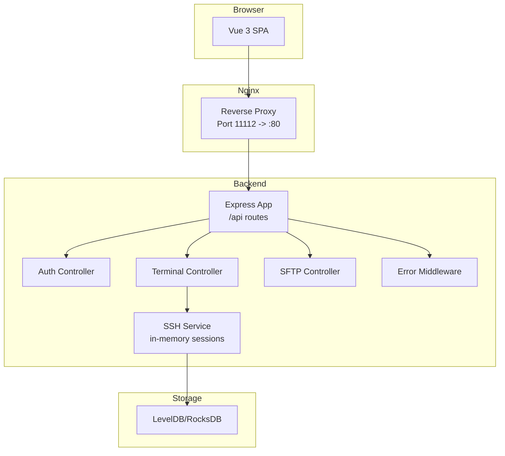
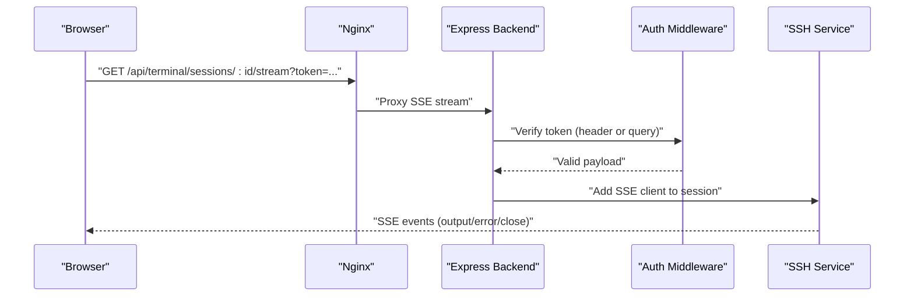
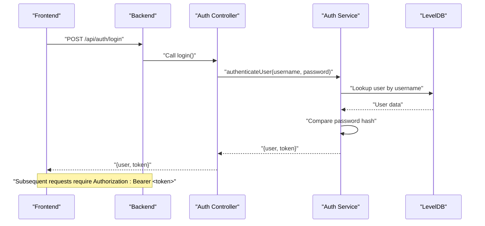
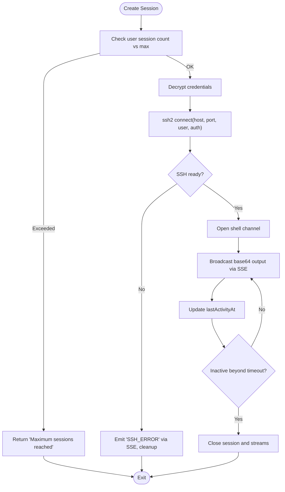
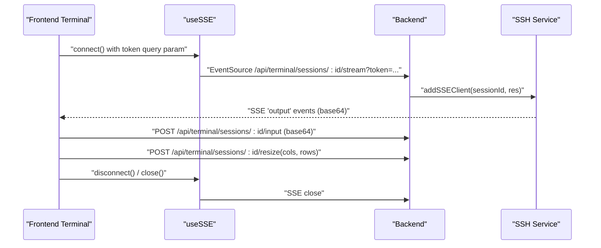
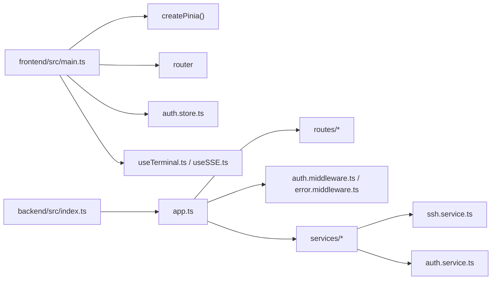

# Troubleshooting and FAQ

<cite>
**Referenced Files in This Document**
- [README.md](file://README.md)
- [docker-compose.yml](file://docker-compose.yml)
- [backend/src/index.ts](file://backend/src/index.ts)
- [backend/src/app.ts](file://backend/src/app.ts)
- [backend/src/config/index.ts](file://backend/src/config/index.ts)
- [backend/src/controllers/auth.controller.ts](file://backend/src/controllers/auth.controller.ts)
- [backend/src/services/auth.service.ts](file://backend/src/services/auth.service.ts)
- [backend/src/middleware/auth.middleware.ts](file://backend/src/middleware/auth.middleware.ts)
- [backend/src/services/ssh.service.ts](file://backend/src/services/ssh.service.ts)
- [backend/src/middleware/error.middleware.ts](file://backend/src/middleware/error.middleware.ts)
- [backend/src/types/index.ts](file://backend/src/types/index.ts)
- [frontend/src/main.ts](file://frontend/src/main.ts)
- [frontend/src/stores/auth.store.ts](file://frontend/src/stores/auth.store.ts)
- [frontend/src/composables/useTerminal.ts](file://frontend/src/composables/useTerminal.ts)
- [frontend/src/composables/useSSE.ts](file://frontend/src/composables/useSSE.ts)
</cite>

## Table of Contents
1. [Introduction](#introduction)
2. [Project Structure](#project-structure)
3. [Core Components](#core-components)
4. [Architecture Overview](#architecture-overview)
5. [Detailed Component Analysis](#detailed-component-analysis)
6. [Dependency Analysis](#dependency-analysis)
7. [Performance Considerations](#performance-considerations)
8. [Troubleshooting Guide](#troubleshooting-guide)
9. [Conclusion](#conclusion)
10. [Appendices](#appendices)

## Introduction
This document provides a comprehensive troubleshooting and FAQ guide for WebTerm, focusing on deployment, connection issues, authentication, performance, and debugging. It includes step-by-step diagnostics, optimization strategies, and escalation procedures grounded in the repository’s code and configuration.

## Project Structure
WebTerm is a Dockerized stack with a Vue 3 frontend, Express.js backend, Nginx reverse proxy, and RocksDB storage. The frontend communicates with the backend via REST and SSE endpoints. Authentication is JWT-based, and SSH sessions are managed in-memory with SSE streaming.

**Diagram sources**
- [docker-compose.yml:1-49](file://docker-compose.yml#L1-L49)
- [backend/src/app.ts:12-48](file://backend/src/app.ts#L12-L48)
- [backend/src/services/ssh.service.ts:9-23](file://backend/src/services/ssh.service.ts#L9-L23)
- [backend/src/controllers/auth.controller.ts:18-75](file://backend/src/controllers/auth.controller.ts#L18-L75)

**Section sources**
- [README.md:91-137](file://README.md#L91-L137)
- [docker-compose.yml:1-49](file://docker-compose.yml#L1-L49)
- [backend/src/app.ts:12-48](file://backend/src/app.ts#L12-L48)

## Core Components
- Backend entry and lifecycle: initializes database, starts server, graceful shutdown.
- App configuration: security headers, CORS, body parsing, health endpoint, routes, error handling.
- Authentication: Zod validation, bcrypt hashing, JWT generation/verification, middleware for token extraction and verification.
- SSH service: in-memory session store, timeouts, SSE broadcasting, input forwarding, resizing, and cleanup.
- Frontend stores and composables: authentication persistence, SSE connection with token injection, terminal initialization and input batching.

**Section sources**
- [backend/src/index.ts:6-38](file://backend/src/index.ts#L6-L38)
- [backend/src/app.ts:14-48](file://backend/src/app.ts#L14-L48)
- [backend/src/controllers/auth.controller.ts:18-75](file://backend/src/controllers/auth.controller.ts#L18-L75)
- [backend/src/services/auth.service.ts:11-92](file://backend/src/services/auth.service.ts#L11-L92)
- [backend/src/middleware/auth.middleware.ts:10-32](file://backend/src/middleware/auth.middleware.ts#L10-L32)
- [backend/src/services/ssh.service.ts:33-247](file://backend/src/services/ssh.service.ts#L33-L247)
- [frontend/src/stores/auth.store.ts:7-53](file://frontend/src/stores/auth.store.ts#L7-L53)
- [frontend/src/composables/useSSE.ts:11-50](file://frontend/src/composables/useSSE.ts#L11-L50)
- [frontend/src/composables/useTerminal.ts:120-179](file://frontend/src/composables/useTerminal.ts#L120-L179)

## Architecture Overview
The system uses Nginx to serve static assets and proxy API requests to the backend. SSE endpoints bypass security headers to prevent conflicts. JWT tokens are required for protected routes, and SSE supports token via query parameter.

**Diagram sources**
- [backend/src/app.ts:14-21](file://backend/src/app.ts#L14-L21)
- [backend/src/middleware/auth.middleware.ts:10-32](file://backend/src/middleware/auth.middleware.ts#L10-L32)
- [backend/src/services/ssh.service.ts:172-194](file://backend/src/services/ssh.service.ts#L172-L194)

## Detailed Component Analysis

### Authentication Flow and Troubleshooting
Common issues: invalid credentials, token expiration, missing/invalid token, validation errors.

**Diagram sources**
- [backend/src/controllers/auth.controller.ts:39-59](file://backend/src/controllers/auth.controller.ts#L39-L59)
- [backend/src/services/auth.service.ts:48-88](file://backend/src/services/auth.service.ts#L48-L88)
- [backend/src/middleware/auth.middleware.ts:10-32](file://backend/src/middleware/auth.middleware.ts#L10-L32)

**Section sources**
- [backend/src/controllers/auth.controller.ts:18-75](file://backend/src/controllers/auth.controller.ts#L18-L75)
- [backend/src/services/auth.service.ts:11-92](file://backend/src/services/auth.service.ts#L11-L92)
- [backend/src/middleware/auth.middleware.ts:10-32](file://backend/src/middleware/auth.middleware.ts#L10-L32)

### SSH Session Lifecycle and SSE Streaming
Issues: connection timeout, authentication failure, session limits, SSE disconnects.

**Diagram sources**
- [backend/src/services/ssh.service.ts:33-166](file://backend/src/services/ssh.service.ts#L33-L166)
- [backend/src/services/ssh.service.ts:172-227](file://backend/src/services/ssh.service.ts#L172-L227)

**Section sources**
- [backend/src/services/ssh.service.ts:9-23](file://backend/src/services/ssh.service.ts#L9-L23)
- [backend/src/services/ssh.service.ts:33-166](file://backend/src/services/ssh.service.ts#L33-L166)
- [backend/src/services/ssh.service.ts:172-227](file://backend/src/services/ssh.service.ts#L172-L227)

### Frontend Terminal and SSE Integration
Issues: SSE reconnects, input encoding, terminal resize, token propagation.

**Diagram sources**
- [frontend/src/composables/useSSE.ts:11-50](file://frontend/src/composables/useSSE.ts#L11-L50)
- [frontend/src/composables/useTerminal.ts:132-179](file://frontend/src/composables/useTerminal.ts#L132-L179)
- [backend/src/services/ssh.service.ts:172-194](file://backend/src/services/ssh.service.ts#L172-L194)

**Section sources**
- [frontend/src/composables/useSSE.ts:11-50](file://frontend/src/composables/useSSE.ts#L11-L50)
- [frontend/src/composables/useTerminal.ts:120-179](file://frontend/src/composables/useTerminal.ts#L120-L179)
- [backend/src/services/ssh.service.ts:172-194](file://backend/src/services/ssh.service.ts#L172-L194)

## Dependency Analysis
- Backend runtime dependencies: Express, CORS, Helmet, Zod, bcrypt, jsonwebtoken, ssh2, uuid, Pino.
- Frontend runtime dependencies: Vue 3, Pinia, XTerm.js, EventSource polyfill via SSE composable.
- Configuration: environment variables drive secrets, limits, CORS, and ports.

**Diagram sources**
- [frontend/src/main.ts:1-11](file://frontend/src/main.ts#L1-L11)
- [backend/src/index.ts:1-41](file://backend/src/index.ts#L1-L41)
- [backend/src/app.ts:12-48](file://backend/src/app.ts#L12-L48)

**Section sources**
- [backend/src/config/index.ts:3-21](file://backend/src/config/index.ts#L3-L21)
- [frontend/src/main.ts:1-11](file://frontend/src/main.ts#L1-L11)
- [backend/src/index.ts:1-41](file://backend/src/index.ts#L1-L41)

## Performance Considerations
- Session limits: configured via environment variable for maximum concurrent sessions per user.
- Inactivity timeout: configured via environment variable; sessions are cleaned up periodically.
- SSE heartbeat: periodic ping events maintain liveness for long-lived connections.
- Input batching: client buffers and flushes input to reduce network overhead.
- Encoding: UTF-8 to base64 ensures Unicode correctness without heavy transformations.

Recommendations:
- Tune MAX_SESSIONS_PER_USER and SESSION_TIMEOUT_MINUTES for your workload.
- Monitor SSE client counts and cleanup intervals to avoid resource leaks.
- Use terminal.fit() and resize notifications to minimize reflows and excessive resizes.

**Section sources**
- [backend/src/config/index.ts:15-17](file://backend/src/config/index.ts#L15-L17)
- [backend/src/services/ssh.service.ts:13-23](file://backend/src/services/ssh.service.ts#L13-L23)
- [backend/src/services/ssh.service.ts:172-194](file://backend/src/services/ssh.service.ts#L172-L194)
- [frontend/src/composables/useTerminal.ts:98-130](file://frontend/src/composables/useTerminal.ts#L98-L130)

## Troubleshooting Guide

### Connection Problems: SSH Connectivity, Authentication Failures, Network Timeouts
Step-by-step diagnostics:
1. Verify backend health:
   - Access the health endpoint to confirm backend availability.
   - Check container logs for startup errors.
2. Confirm environment variables:
   - Ensure MASTER_SECRET and JWT_SECRET are set and sufficiently strong.
   - Adjust MAX_SESSIONS_PER_USER and SESSION_TIMEOUT_MINUTES if needed.
3. Test SSH connection:
   - Use the connection test endpoint to validate host/port/credentials.
   - Review SSH service logs for “SSH client error” and “readyTimeout”.
4. Inspect SSE:
   - Confirm token is present in the SSE URL query parameter.
   - Watch for “error” or “close” SSE events indicating SSH disconnections.
5. Network:
   - Validate Nginx proxy forwards /api and SSE endpoints correctly.
   - Ensure firewall allows outbound SSH to target hosts.

Resolution steps:
- Fix credentials or keys; ensure proper decryption keys per user.
- Increase readyTimeout if connecting to slower hosts.
- Reduce concurrent sessions or increase limits if hitting caps.
- Restart containers to clear stuck SSE connections.

**Section sources**
- [docker-compose.yml:36-42](file://docker-compose.yml#L36-L42)
- [backend/src/app.ts:35-38](file://backend/src/app.ts#L35-L38)
- [backend/src/config/index.ts:7-21](file://backend/src/config/index.ts#L7-L21)
- [backend/src/services/ssh.service.ts:151-166](file://backend/src/services/ssh.service.ts#L151-L166)
- [frontend/src/composables/useSSE.ts:18-20](file://frontend/src/composables/useSSE.ts#L18-L20)
- [backend/src/services/ssh.service.ts:119-135](file://backend/src/services/ssh.service.ts#L119-L135)

### Authentication Troubleshooting: JWT Token Issues, Password Validation, Session Management
Common symptoms:
- 401 Unauthorized on protected endpoints.
- “Invalid or expired token” responses.
- Login/register validation errors.

Diagnostics:
- Confirm Authorization header format and token presence in SSE URLs.
- Check bcrypt rounds and JWT expiry settings.
- Verify user existence and password hash comparison.

Resolution:
- Regenerate tokens after secret changes.
- Re-hash passwords if secrets were rotated.
- Clear browser local storage token if corrupted.

**Section sources**
- [backend/src/middleware/auth.middleware.ts:10-32](file://backend/src/middleware/auth.middleware.ts#L10-L32)
- [backend/src/services/auth.service.ts:48-88](file://backend/src/services/auth.service.ts#L48-L88)
- [backend/src/controllers/auth.controller.ts:18-75](file://backend/src/controllers/auth.controller.ts#L18-L75)
- [frontend/src/stores/auth.store.ts:14-24](file://frontend/src/stores/auth.store.ts#L14-L24)

### Performance Issues: Slow Terminal Response, Memory Leaks, High CPU Usage
Symptoms:
- Delayed terminal output.
- Increasing memory usage over time.
- Elevated CPU during heavy typing or frequent resizes.

Diagnostics:
- Observe SSE heartbeat intervals and client counts.
- Monitor session activity timestamps and idle timeouts.
- Profile frontend input batching and terminal resize triggers.

Optimization strategies:
- Limit concurrent sessions and enforce stricter timeouts.
- Debounce resize events and throttle input flush intervals.
- Dispose terminals and close SSE connections on unmount.

**Section sources**
- [backend/src/services/ssh.service.ts:13-23](file://backend/src/services/ssh.service.ts#L13-L23)
- [backend/src/services/ssh.service.ts:172-194](file://backend/src/services/ssh.service.ts#L172-L194)
- [frontend/src/composables/useTerminal.ts:98-130](file://frontend/src/composables/useTerminal.ts#L98-L130)
- [frontend/src/composables/useTerminal.ts:195-202](file://frontend/src/composables/useTerminal.ts#L195-L202)

### Deployment Problems: Docker Startup Failures, Port Conflicts, Configuration Errors
Common issues:
- Backend fails health checks.
- Port 11112 already in use.
- Missing environment variables causing defaults.

Diagnostics:
- Inspect compose logs for health check failures and fatal startup messages.
- Verify port bindings and firewall rules.
- Confirm environment variables are loaded into backend service.

Resolution:
- Change host port in compose if 11112 is taken.
- Provide required secrets in .env and rebuild images.
- Ensure volumes persist data for RocksDB.

**Section sources**
- [docker-compose.yml:4-5](file://docker-compose.yml#L4-L5)
- [docker-compose.yml:36-42](file://docker-compose.yml#L36-L42)
- [backend/src/index.ts:34-37](file://backend/src/index.ts#L34-L37)
- [backend/src/config/index.ts:7-21](file://backend/src/config/index.ts#L7-L21)

### Debugging Guides: Logging, Structured Logs, Network Troubleshooting
- Backend logging: Pino structured logs; review info/warn/fatal entries for startup, shutdown, and errors.
- Error middleware: central 500 handler logs unhandled errors with path/method.
- Frontend debugging:
  - Enable browser dev tools console/network tabs.
  - Inspect SSE frames and retry behavior.
  - Verify token presence in request headers and query parameters.

**Section sources**
- [backend/src/index.ts:13-14](file://backend/src/index.ts#L13-L14)
- [backend/src/middleware/error.middleware.ts:4-7](file://backend/src/middleware/error.middleware.ts#L4-L7)
- [frontend/src/composables/useSSE.ts:30-44](file://frontend/src/composables/useSSE.ts#L30-L44)

### Frequently Asked Questions
- Why does login fail?
  - Check username/password validity and ensure bcrypt rounds are consistent.
- Why does the terminal show garbled characters?
  - Ensure UTF-8/base64 encoding is used for input/output.
- Why does the session close unexpectedly?
  - Exceeding max sessions or inactivity timeout triggers cleanup.
- Why is SSE not receiving events?
  - Confirm token is passed via query parameter and SSE URL is correct.
- How do I change concurrency limits?
  - Adjust MAX_SESSIONS_PER_USER and SESSION_TIMEOUT_MINUTES via environment variables.

**Section sources**
- [backend/src/services/auth.service.ts:48-88](file://backend/src/services/auth.service.ts#L48-L88)
- [frontend/src/composables/useTerminal.ts:210-222](file://frontend/src/composables/useTerminal.ts#L210-L222)
- [backend/src/config/index.ts:15-17](file://backend/src/config/index.ts#L15-L17)
- [frontend/src/composables/useSSE.ts:18-20](file://frontend/src/composables/useSSE.ts#L18-L20)
- [README.md:186-199](file://README.md#L186-L199)

### Browser Compatibility and Rendering
- Ensure modern browsers support EventSource and UTF-8 decoding.
- If using older environments, polyfills may be required for EventSource.
- Terminal rendering relies on XTerm.js; verify fonts and themes render correctly.

**Section sources**
- [frontend/src/composables/useSSE.ts:11-50](file://frontend/src/composables/useSSE.ts#L11-L50)
- [frontend/src/composables/useTerminal.ts:29-55](file://frontend/src/composables/useTerminal.ts#L29-L55)

### Escalation Procedures and Support Resources
- Collect backend logs around the time of failure.
- Provide request/response traces from browser dev tools.
- Include environment variable values (without secrets) and deployment platform details.
- Open an issue with reproduction steps and logs attached.

[No sources needed since this section provides general guidance]

## Conclusion
By following the diagnostic procedures and applying the recommended optimizations, most WebTerm issues can be resolved quickly. Use the provided references to correlate frontend actions, backend logs, and configuration settings for efficient troubleshooting.

## Appendices

### API Surface for Troubleshooting
- Authentication: register, login, get current user.
- Connections: list, create, update, delete, test.
- Terminal: create session, SSE stream, send input, resize, close.
- SFTP: create session, list, download, upload, mkdir, rename, file content read/write, close.
- Health: backend health check.

**Section sources**
- [README.md:225-283](file://README.md#L225-L283)