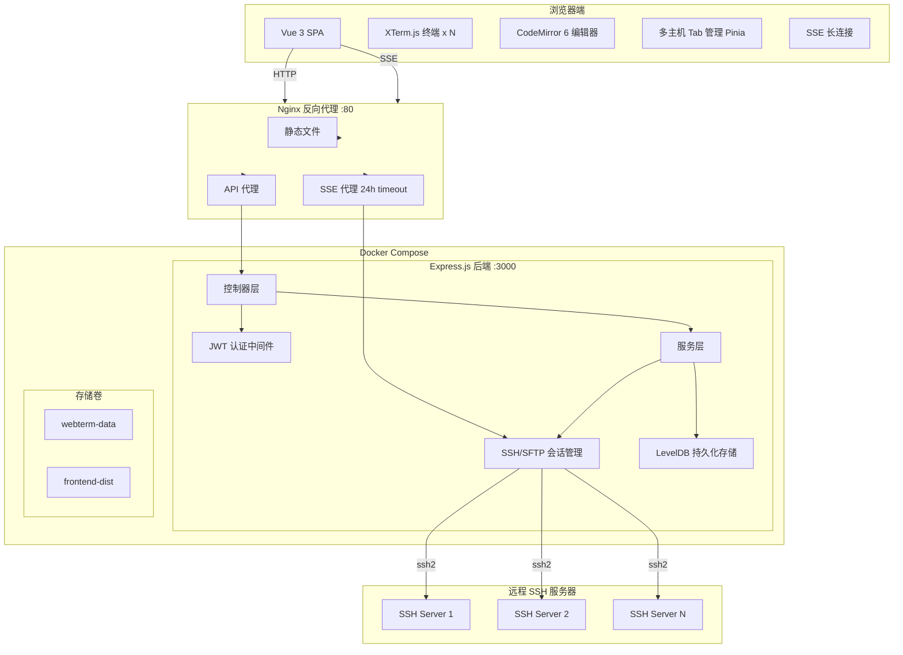
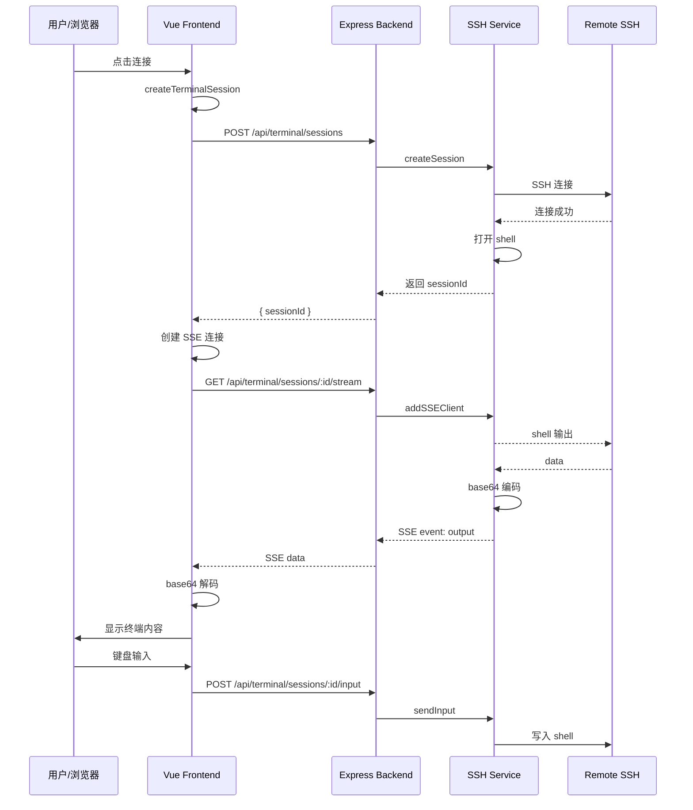
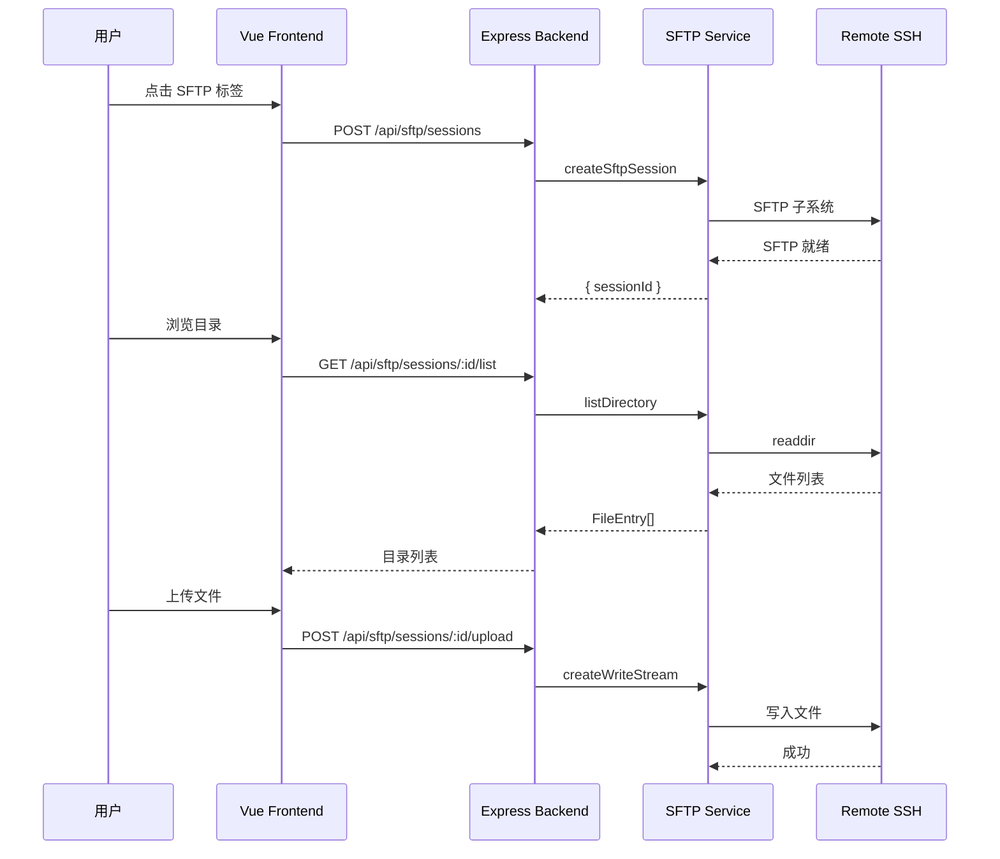
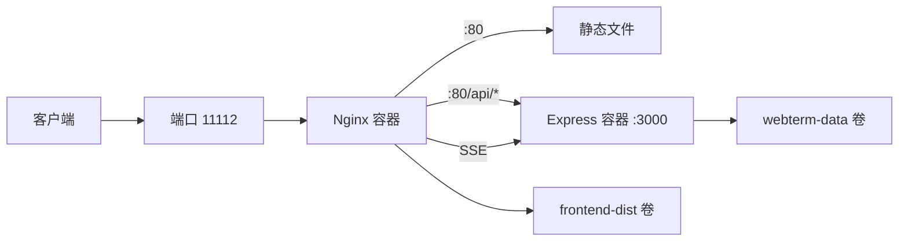

# WebTerm 项目架构分析报告

## 一、项目概览

**WebTerm** 是一个基于浏览器的 Web SSH 终端管理工具，支持实时终端交互、SFTP 文件管理和在线代码编辑。

### 技术栈总览

| 层级 | 技术选型 |
|------|----------|
| 前端框架 | Vue 3 + TypeScript |
| 状态管理 | Pinia |
| 路由 | Vue Router 4 |
| 构建工具 | Vite 5 |
| 终端仿真 | XTerm.js |
| 代码编辑 | CodeMirror 6 |
| 代码格式化 | Prettier |
| HTTP 客户端 | Axios |
| 后端框架 | Express.js |
| SSH 协议 | ssh2 |
| 数据库 | LevelDB (RocksDB) |
| 数据验证 | Zod |
| 日志 | Pino |
| 安全 | Helmet, JWT, bcrypt, AES-256-GCM |
| 部署 | Docker Compose + Nginx |

---

## 二、系统架构图



---

## 三、后端架构分析

### 3.1 目录结构

```
backend/
├── src/
│   ├── app.ts                 # Express 配置与中间件
│   ├── index.ts               # 应用入口
│   ├── config/
│   │   └── index.ts           # 环境变量配置
│   ├── controllers/           # 请求处理层
│   │   ├── auth.controller.ts
│   │   ├── connections.controller.ts
│   │   ├── history.controller.ts
│   │   ├── sftp.controller.ts
│   │   └── terminal.controller.ts
│   ├── services/              # 业务逻辑层
│   │   ├── auth.service.ts    # 认证服务
│   │   ├── crypto.service.ts  # AES-256-GCM 加密
│   │   ├── db.service.ts      # LevelDB 存储
│   │   ├── logger.service.ts  # 日志服务
│   │   ├── sftp.service.ts    # SFTP 文件操作
│   │   └── ssh.service.ts     # SSH/终端会话
│   ├── middleware/            # 中间件
│   │   ├── auth.middleware.ts
│   │   └── error.middleware.ts
│   ├── routes/               # API 路由
│   │   ├── auth.routes.ts
│   │   ├── connections.routes.ts
│   │   ├── history.routes.ts
│   │   ├── sftp.routes.ts
│   │   └── terminal.routes.ts
│   └── types/                # TypeScript 类型定义
│       └── index.ts
├── package.json
└── tsconfig.json
```

### 3.2 核心服务层

| 服务 | 文件 | 功能描述 |
|------|------|----------|
| SSH 服务 | [`ssh.service.ts`](backend/src/services/ssh.service.ts) | 管理 SSH 连接和终端会话，使用内存存储，支持 SSE 推送 |
| SFTP 服务 | [`sftp.service.ts`](backend/src/services/sftp.service.ts) | 远程文件操作：浏览、上传、下载、删除、重命名 |
| 数据库服务 | [`db.service.ts`](backend/src/services/db.service.ts) | LevelDB 封装，用户和连接配置的持久化存储 |
| 加密服务 | [`crypto.service.ts`](backend/src/services/crypto.service.ts) | AES-256-GCM 加密，HKDF-SHA256 密钥派生 |
| 认证服务 | [`auth.service.ts`](backend/src/services/auth.service.ts) | JWT 令牌生成与验证，bcrypt 密码哈希 |
| 日志服务 | [`logger.service.ts`](backend/src/services/logger.service.ts) | Pino 日志记录 |

### 3.3 关键设计决策

1. **内存会话存储**：SSH/SFTP 会话存储在内存中，有自动清理机制
2. **SSE 长连接**：使用 Server-Sent Events 实现终端输出实时推送
3. **凭证加密**：SSH 密码和私钥使用 AES-256-GCM 加密存储
4. **会话超时**：默认 30 分钟不活动自动超时

---

## 四、前端架构分析

### 4.1 目录结构

```
frontend/
├── src/
│   ├── main.ts                    # 应用入口
│   ├── App.vue                    # 根组件
│   ├── env.d.ts                   # 环境类型声明
│   ├── views/                     # 页面组件
│   │   ├── LoginView.vue          # 登录/注册
│   │   ├── DashboardView.vue      # 连接管理仪表板
│   │   ├── WorkspaceView.vue      # 多主机工作区
│   │   ├── ConnectionPanel.vue    # 单主机连接面板
│   │   └── FileEditorModal.vue    # 文件编辑器
│   ├── composables/               # 组合式函数
│   │   ├── useTerminal.ts         # 终端逻辑
│   │   ├── useSftp.ts             # SFTP 操作
│   │   ├── useFileEditor.ts       # 文件编辑器逻辑
│   │   └── useSSE.ts              # SSE 连接管理
│   ├── api/                       # API 调用层
│   │   ├── auth.api.ts
│   │   ├── client.ts
│   │   ├── connections.api.ts
│   │   ├── history.api.ts
│   │   ├── sftp.api.ts
│   │   └── terminal.api.ts
│   ├── stores/                    # Pinia 状态管理
│   │   ├── auth.store.ts
│   │   ├── connections.store.ts
│   │   └── workspace.store.ts
│   ├── router/                    # 路由配置
│   │   └── index.ts
│   ├── i18n/                      # 国际化
│   │   ├── index.ts
│   │   ├── locales/en.ts
│   │   └── locales/zh.ts
│   ├── styles/                    # 样式
│   │   └── main.css
│   ├── utils/                     # 工具函数
│   │   ├── editor-languages.ts
│   │   └── editor-theme.ts
│   └── types/                     # TypeScript 类型定义
│       └── index.ts
├── package.json
├── vite.config.ts
└── tsconfig.json
```

### 4.2 状态管理

| Store | 文件 | 功能 |
|-------|------|------|
| Auth Store | [`auth.store.ts`](frontend/src/stores/auth.store.ts) | 用户认证状态、JWT Token 管理 |
| Connections Store | [`connections.store.ts`](frontend/src/stores/connections.store.ts) | SSH 连接配置管理 |
| Workspace Store | [`workspace.store.ts`](frontend/src/stores/workspace.store.ts) | 多主机工作区 Tab 管理 |

### 4.3 核心 Composables

| Composable | 文件 | 功能 |
|------------|------|------|
| useTerminal | [`useTerminal.ts`](frontend/src/composables/useTerminal.ts) | XTerm.js 终端初始化、连接、输入处理 |
| useSftp | [`useSftp.ts`](frontend/src/composables/useSftp.ts) | SFTP 文件操作封装 |
| useSSE | [`useSSE.ts`](frontend/src/composables/useSSE.ts) | SSE 连接管理、自动重连 |
| useFileEditor | [`useFileEditor.ts`](frontend/src/composables/useFileEditor.ts) | CodeMirror 6 编辑器集成 |

### 4.4 路由设计

| 路径 | 组件 | 元信息 |
|------|------|--------|
| `/login` | LoginView | guest（未登录可访问） |
| `/` | DashboardView | requiresAuth（需要登录） |
| `/workspace` | WorkspaceView | requiresAuth（需要登录） |

---

## 五、数据流图

### 5.1 SSH 终端会话流程



### 5.2 SFTP 文件操作流程



---

## 六、API 接口概览

### 6.1 认证接口

| 方法 | 路径 | 描述 |
|------|------|------|
| POST | `/api/auth/register` | 用户注册 |
| POST | `/api/auth/login` | 用户登录 |
| GET | `/api/auth/me` | 获取当前用户 |

### 6.2 连接管理接口

| 方法 | 路径 | 描述 |
|------|------|------|
| GET | `/api/connections` | 列出所有连接 |
| POST | `/api/connections` | 创建连接 |
| PUT | `/api/connections/:id` | 更新连接 |
| DELETE | `/api/connections/:id` | 删除连接 |
| POST | `/api/connections/:id/test` | 测试连接 |

### 6.3 终端接口

| 方法 | 路径 | 描述 |
|------|------|------|
| POST | `/api/terminal/sessions` | 创建终端会话 |
| GET | `/api/terminal/sessions/:id/stream` | SSE 终端输出流 |
| POST | `/api/terminal/sessions/:id/input` | 发送终端输入 |
| POST | `/api/terminal/sessions/:id/resize` | 调整终端大小 |
| DELETE | `/api/terminal/sessions/:id` | 关闭终端会话 |

### 6.4 SFTP 接口

| 方法 | 路径 | 描述 |
|------|------|------|
| POST | `/api/sftp/sessions` | 创建 SFTP 会话 |
| GET | `/api/sftp/sessions/:id/list` | 列出目录 |
| GET | `/api/sftp/sessions/:id/download` | 下载文件 |
| POST | `/api/sftp/sessions/:id/upload` | 上传文件 |
| DELETE | `/api/sftp/sessions/:id/file` | 删除文件/目录 |
| POST | `/api/sftp/sessions/:id/mkdir` | 创建目录 |
| POST | `/api/sftp/sessions/:id/rename` | 重命名 |
| GET | `/api/sftp/sessions/:id/file/content` | 读取文件内容 |
| PUT | `/api/sftp/sessions/:id/file/content` | 保存文件内容 |
| DELETE | `/api/sftp/sessions/:id` | 关闭 SFTP 会话 |

### 6.5 命令历史接口

| 方法 | 路径 | 描述 |
|------|------|------|
| GET | `/api/history` | 获取命令历史列表 |
| POST | `/api/history` | 添加命令到历史 |
| DELETE | `/api/history` | 清空命令历史 |

---

## 七、安全设计

| 安全措施 | 实现方式 | 位置 |
|----------|----------|------|
| 密码哈希 | bcrypt (12 轮) | [`auth.service.ts`](backend/src/services/auth.service.ts) |
| 凭证加密 | AES-256-GCM + HKDF-SHA256 | [`crypto.service.ts`](backend/src/services/crypto.service.ts) |
| API 认证 | JWT Bearer Token | [`auth.middleware.ts`](backend/src/middleware/auth.middleware.ts) |
| 安全头部 | Helmet.js | [`app.ts`](backend/src/app.ts:15) |
| CORS | 可配置源 | [`app.ts`](backend/src/app.ts:24) |
| 会话隔离 | 内存级用户隔离 | 各 Service 层 |
| 文件限制 | 1MB 编辑器限制，100MB 上传限制 | 各 Controller 层 |

---

## 八、部署架构



### Docker Compose 服务

| 服务 | 构建 | 端口 | 卷 |
|------|------|------|------|
| nginx | `./nginx` | 11112:80 | frontend-dist (ro) |
| frontend | `./frontend` | - | frontend-dist |
| backend | `./backend` | 3000 (内部) | webterm-data |

---

## 九、关键代码模式

### 9.1 后端：内存会话管理

```typescript
// ssh.service.ts
const sessions = new Map<string, TerminalSession>();

// 自动清理超时会话
setInterval(() => {
  const timeout = config.sessionTimeoutMinutes * 60 * 1000;
  for (const [id, session] of sessions) {
    if (Date.now() - session.lastActivityAt.getTime() > timeout) {
      closeSession(id);
    }
  }
}, 60 * 1000);
```

### 9.2 后端：SSE 推送模式

```typescript
// ssh.service.ts
stream.on('data', (data: Buffer) => {
  const base64Data = data.toString('base64');
  for (const res of session.sseClients) {
    res.write(`event: output\ndata: ${JSON.stringify({ output: base64Data })}\n\n`);
  }
});
```

### 9.3 前端：Unicode 安全编解码

```typescript
// useTerminal.ts
function utf8ToBase64(str: string): string {
  const bytes = new TextEncoder().encode(str);
  const bin = Array.from(bytes, (b) => String.fromCharCode(b)).join('');
  return btoa(bin);
}

function base64ToUtf8(base64: string): string {
  const bin = atob(base64);
  const bytes = Uint8Array.from(bin, (c) => c.charCodeAt(0));
  return new TextDecoder().decode(bytes);
}
```

---

## 十、总结

### 架构优势

1. **清晰的分层架构**：Controller -> Service -> Storage 三层分离
2. **实时通信**：SSE 实现终端输出实时推送
3. **多租户支持**：用户级资源隔离
4. **安全性**：多层安全防护（加密、JWT、Helmet）
5. **国际化**：支持中英文切换

### 技术亮点

1. **XTerm.js + SSE**：实现浏览器内真实 SSH 终端
2. **AES-256-GCM 加密**：凭证安全存储
3. **CodeMirror 6 集成**：20+ 文件类型语法高亮
4. **多主机 Tab 管理**：同时连接多个 SSH 服务器

### 潜在改进点

1. **会话持久化**：当前会话存储在内存中，重启丢失
2. **水平扩展**：需要 Redis 等共享存储支持多实例
3. **文件上传**：当前使用 multer 内存存储，大文件可能需要流式处理